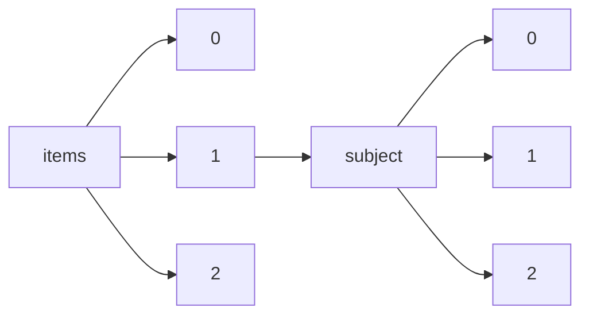

!!! warning "This document is not official Crossref documentation"
# Elements
PATH = items/array/subject/array(1)  
Occurs 194 393 667 times  
Unique values: 339  
{ .annotate }

1. A route to an element, for example:  
   The route "items/array/subject/array" corresponds to navigating through the JSON indices as  
   ["items"][0]["subject"][0]  

| **Row** | **Value** `String`                                        | **Count** `Int64` |
|--------:|-------------------------------------------------------------:|---------------------:|
| **1**   | General Medicine                                             | 15 414 793           |
| **2**   | Biochemistry                                                 | 3 468 360            |
| **3**   | Condensed Matter Physics                                     | 3 255 563            |
| **4**   | General Chemistry                                            | 3 098 267            |
| **5**   | Electrical and Electronic Engineering                        | 2 711 656            |
| **6**   | General Materials Science                                    | 2 609 500            |
| **7**   | Molecular Biology                                            | 2 497 593            |
| **8**   | General Engineering                                          | 2 483 065            |
| **9**   | History                                                      | 2 413 334            |
| **10**  | Mechanical Engineering                                       | 2 133 227            |
| **11**  | Surgery                                                      | 2 112 215            |
| **12**  | Education                                                    | 1 970 816            |
| **13**  | Materials Chemistry                                          | 1 963 912            |
| **14**  | General Physics and Astronomy                                | 1 951 428            |
| **15**  | Multidisciplinary                                            | 1 924 380            |
| **16**  | General Environmental Science                                | 1 835 830            |
| **17**  | Physical and Theoretical Chemistry                           | 1 830 775            |
| **18**  | Organic Chemistry                                            | 1 779 885            |
| **19**  | Cell Biology                                                 | 1 778 048            |
| **20**  | General Earth and Planetary Sciences                         | 1 744 054            |
| **21**  | Cardiology and Cardiovascular Medicine                       | 1 737 042            |
| **22**  | Sociology and Political Science                              | 1 733 262            |
| **23**  | Oncology                                                     | 1 721 325            |
| **24**  | Ecology, Evolution, Behavior and Systematics                 | 1 680 311            |
| **25**  | Mechanics of Materials                                       | 1 652 095            |
| **26**  | Genetics                                                     | 1 641 762            |
| **27**  | Electronic, Optical and Magnetic Materials                   | 1 628 637            |
| **28**  | Computer Science Applications                                | 1 558 062            |
| **29**  | Neurology (clinical)                                         | 1 554 332            |
| **30**  | Public Health, Environmental and Occupational Health         | 1 467 775            |
| **31**  | Psychiatry and Mental health                                 | 1 453 895            |
| **32**  | Applied Mathematics                                          | 1 433 219            |
| **33**  | Pharmacology                                                 | 1 430 219            |
| **34**  | Literature and Literary Theory                               | 1 416 289            |
| **35**  | General Chemical Engineering                                 | 1 320 657            |
| **36**  | Immunology                                                   | 1 311 327            |
| **37**  | Radiology, Nuclear Medicine and imaging                      | 1 287 958            |
| **38**  | Linguistics and Language                                     | 1 283 299            |
| **39**  | Cancer Research                                              | 1 258 917            |
| **40**  | Language and Linguistics                                     | 1 236 234            |
| **41**  | Cultural Studies                                             | 1 186 985            |
| **42**  | Plant Science                                                | 1 181 619            |
| **43**  | Atomic and Molecular Physics, and Optics                     | 1 163 823            |
| **44**  | Analytical Chemistry                                         | 1 144 817            |
| **45**  | Industrial and Manufacturing Engineering                     | 1 128 754            |
| **46**  | Pediatrics, Perinatology and Child Health                    | 1 123 489            |
| **47**  | Geography, Planning and Development                          | 1 085 953            |
| **48**  | Animal Science and Zoology                                   | 1 030 317            |
| **49**  | Economics and Econometrics                                   | 1 026 117            |
| **50**  | Physiology                                                   | 1 022 356            |
| **51**  | Infectious Diseases                                          | 1 018 679            |
| **52**  | General Mathematics                                          | 1 016 914            |
| **53**  | Surfaces, Coatings and Films                                 | 1 003 598            |
| **54**  | General Biochemistry, Genetics and Molecular Biology         | 988 464              |
| **55**  | Biotechnology                                                | 963 155              |
| **56**  | Immunology and Allergy                                       | 956 734              |
| **57**  | Food Science                                                 | 914 832              |
| **58**  | Drug Discovery                                               | 892 963              |
| **59**  | Pharmacology (medical)                                       | 878 446              |
| **60**  | Obstetrics and Gynecology                                    | 871 383              |
| **61**  | Orthopedics and Sports Medicine                              | 863 402              |
| **62**  | Energy Engineering and Power Technology                      | 855 040              |
| **63**  | Polymers and Plastics                                        | 843 451              |
| **64**  | Ecology                                                      | 831 103              |
| **65**  | Arts and Humanities (miscellaneous)                          | 826 656              |
| **66**  | Inorganic Chemistry                                          | 826 183              |
| **67**  | Agronomy and Crop Science                                    | 823 465              |
| **68**  | Gastroenterology                                             | 793 653              |
| **69**  | Software                                                     | 792 961              |
| **70**  | Metals and Alloys                                            | 790 831              |
| **71**  | Catalysis                                                    | 785 251              |
| **72**  | Archeology                                                   | 780 690              |
| **73**  | Biophysics                                                   | 771 916              |
| **74**  | Hematology                                                   | 763 649              |
| **75**  | Law                                                          | 763 209              |
| **76**  | Instrumentation                                              | 755 611              |
| **77**  | Space and Planetary Science                                  | 753 756              |
| **78**  | General Neuroscience                                         | 747 317              |
| **79**  | Endocrinology, Diabetes and Metabolism                       | 745 125              |
| **80**  | Philosophy                                                   | 735 600              |
| **81**  | Aquatic Science                                              | 722 745              |
| **82**  | Molecular Medicine                                           | 717 569              |
| **83**  | Environmental Chemistry                                      | 713 612              |
| **84**  | Pharmaceutical Science                                       | 711 503              |
| **85**  | Religious studies                                            | 694 476              |
| **86**  | Clinical Biochemistry                                        | 688 145              |
| **87**  | Pulmonary and Respiratory Medicine                           | 687 875              |
| **88**  | Renewable Energy, Sustainability and the Environment         | 687 544              |
| **89**  | Library and Information Sciences                             | 678 940              |
| **90**  | Nuclear and High Energy Physics                              | 677 854              |
| **91**  | Microbiology                                                 | 669 162              |
| **92**  | Political Science and International Relations                | 660 933              |
| **93**  | Water Science and Technology                                 | 658 604              |
| **94**  | Neurology                                                    | 655 976              |
| **95**  | Civil and Structural Engineering                             | 648 918              |
| **96**  | Control and Systems Engineering                              | 648 302              |
| **97**  | Endocrinology                                                | 646 824              |
| **98**  | Pollution                                                    | 635 588              |
| **99**  | General Agricultural and Biological Sciences                 | 633 392              |
| **100** | Astronomy and Astrophysics                                   | 627 342              |
| **101** | Strategy and Management                                      | 623 650              |
| **102** | Internal Medicine                                            | 594 593              |
| **103** | Computer Networks and Communications                         | 589 473              |
| **104** | Developmental and Educational Psychology                     | 585 646              |
| **105** | Business and International Management                        | 575 489              |
| **106** | Spectroscopy                                                 | 572 132              |
| **107** | Pathology and Forensic Medicine                              | 570 789              |
| **108** | Medicine (miscellaneous)                                     | 570 342              |
| **109** | Environmental Engineering                                    | 565 416              |
| **110** | Ophthalmology                                                | 562 673              |
| **111** | Bioengineering                                               | 562 137              |
| **112** | Dermatology                                                  | 560 360              |
| **113** | Management, Monitoring, Policy and Law                       | 554 395              |
| **114** | Physiology (medical)                                         | 550 276              |
| **115** | Biomedical Engineering                                       | 550 021              |
| **116** | Health Policy                                                | 547 152              |
| **117** | Health, Toxicology and Mutagenesis                           | 535 383              |
| **118** | Geology                                                      | 534 274              |
| **119** | Modeling and Simulation                                      | 530 674              |
| **120** | Otorhinolaryngology                                          | 525 096              |
| **121** | General Computer Science                                     | 521 364              |
| **122** | Urology                                                      | 517 097              |
| **123** | Statistics and Probability                                   | 514 436              |
| **124** | Geophysics                                                   | 509 490              |
| **125** | Atmospheric Science                                          | 508 802              |
| **126** | Microbiology (medical)                                       | 508 659              |
| **127** | Visual Arts and Performing Arts                              | 507 441              |
| **128** | Geochemistry and Petrology                                   | 504 308              |
| **129** | Fuel Technology                                              | 499 568              |
| **130** | Ceramics and Composites                                      | 495 677              |
| **131** | Anesthesiology and Pain Medicine                             | 494 219              |
| **132** | Physical Therapy, Sports Therapy and Rehabilitation          | 493 896              |
| **133** | Toxicology                                                   | 492 215              |
| **134** | Clinical Psychology                                          | 490 625              |
| **135** | Earth-Surface Processes                                      | 489 475              |
| **136** | Anthropology                                                 | 480 179              |
| **137** | Hepatology                                                   | 474 775              |
| **138** | Nutrition and Dietetics                                      | 454 956              |
| **139** | General Veterinary                                           | 451 578              |
| **140** | Insect Science                                               | 451 570              |
| **141** | Building and Construction                                    | 446 872              |
| **142** | Health (social science)                                      | 444 924              |
| **143** | Cellular and Molecular Neuroscience                          | 442 447              |
| **144** | General Psychology                                           | 416 248              |
| **145** | General Nursing                                              | 414 306              |
| **146** | Physics and Astronomy (miscellaneous)                        | 412 617              |
| **147** | Applied Microbiology and Biotechnology                       | 407 129              |
| **148** | Information Systems                                          | 406 863              |
| **149** | Developmental Biology                                        | 405 645              |
| **150** | Soil Science                                                 | 405 356              |
| **151** | Artificial Intelligence                                      | 398 347              |
| **152** | Surfaces and Interfaces                                      | 396 235              |
| **153** | Critical Care and Intensive Care Medicine                    | 385 245              |
| **154** | Social Sciences (miscellaneous)                              | 380 974              |
| **155** | Genetics (clinical)                                          | 377 929              |
| **156** | Waste Management and Disposal                                | 377 189              |
| **157** | History and Philosophy of Science                            | 375 999              |
| **158** | General Social Sciences                                      | 367 910              |
| **159** | Epidemiology                                                 | 367 234              |
| **160** | Hardware and Architecture                                    | 362 303              |
| **161** | Social Psychology                                            | 361 903              |
| **162** | Oceanography                                                 | 361 395              |
| **163** | Biomaterials                                                 | 360 799              |
| **164** | Electrochemistry                                             | 352 100              |
| **165** | Earth and Planetary Sciences (miscellaneous)                 | 350 804              |
| **166** | Forestry                                                     | 341 650              |
| **167** | Colloid and Surface Chemistry                                | 339 621              |
| **168** | Communication                                                | 330 566              |
| **169** | Geriatrics and Gerontology                                   | 328 090              |
| **170** | Experimental and Cognitive Psychology                        | 327 765              |
| **171** | Aerospace Engineering                                        | 324 598              |
| **172** | Computational Mathematics                                    | 322 692              |
| **173** | General Dentistry                                            | 321 093              |
| **174** | Development                                                  | 320 840              |
| **175** | Reproductive Medicine                                        | 317 362              |
| **176** | Management of Technology and Innovation                      | 317 332              |
| **177** | Applied Psychology                                           | 315 966              |
| **178** | Virology                                                     | 314 147              |
| **179** | Nuclear Energy and Engineering                               | 309 777              |
| **180** | Rehabilitation                                               | 309 477              |
| **181** | Finance                                                      | 306 971              |
| **182** | Management Science and Operations Research                   | 303 798              |
| **183** | Signal Processing                                            | 303 610              |
| **184** | Horticulture                                                 | 303 221              |
| **185** | Acoustics and Ultrasonics                                    | 302 473              |
| **186** | Structural Biology                                           | 300 281              |
| **187** | Parasitology                                                 | 295 032              |
| **188** | Theoretical Computer Science                                 | 294 027              |
| **189** | Computational Theory and Mathematics                         | 291 617              |
| **190** | Safety, Risk, Reliability and Quality                        | 284 232              |
| **191** | Geotechnical Engineering and Engineering Geology             | 282 887              |
| **192** | General Business, Management and Accounting                  | 281 879              |
| **193** | Marketing                                                    | 278 659              |
| **194** | Radiation                                                    | 274 995              |
| **195** | Organizational Behavior and Human Resource Management        | 268 990              |
| **196** | Process Chemistry and Technology                             | 268 713              |
| **197** | Analysis                                                     | 268 676              |
| **198** | General Immunology and Microbiology                          | 265 794              |
| **199** | Statistics, Probability and Uncertainty                      | 260 290              |
| **200** | Transplantation                                              | 257 656              |
| **201** | Sensory Systems                                              | 257 326              |
| **202** | Emergency Medicine                                           | 256 933              |
| **203** | Rheumatology                                                 | 250 392              |
| **204** | Nature and Landscape Conservation                            | 248 928              |
| **205** | General Energy                                               | 246 529              |
| **206** | Complementary and alternative medicine                       | 245 287              |
| **207** | Biochemistry (medical)                                       | 241 512              |
| **208** | Nephrology                                                   | 235 536              |
| **209** | General Economics, Econometrics and Finance                  | 234 325              |
| **210** | Ocean Engineering                                            | 230 318              |
| **211** | Engineering (miscellaneous)                                  | 230 219              |
| **212** | Fluid Flow and Transfer Processes                            | 229 706              |
| **213** | Music                                                        | 227 902              |
| **214** | Behavioral Neuroscience                                      | 227 146              |
| **215** | Statistical and Nonlinear Physics                            | 225 401              |
| **216** | General Arts and Humanities                                  | 223 464              |
| **217** | Cognitive Neuroscience                                       | 220 353              |
| **218** | Biological Psychiatry                                        | 218 941              |
| **219** | Radiological and Ultrasound Technology                       | 217 178              |
| **220** | Paleontology                                                 | 216 052              |
| **221** | Mathematical Physics                                         | 214 389              |
| **222** | Anatomy                                                      | 198 257              |
| **223** | Histology                                                    | 195 349              |
| **224** | Algebra and Number Theory                                    | 190 339              |
| **225** | Materials Science (miscellaneous)                            | 186 148              |
| **226** | Museology                                                    | 184 277              |
| **227** | Classics                                                     | 183 333              |
| **228** | Public Administration                                        | 179 977              |
| **229** | Neuropsychology and Physiological Psychology                 | 179 919              |
| **230** | Oral Surgery                                                 | 178 272              |
| **231** | Global and Planetary Change                                  | 176 522              |
| **232** | Accounting                                                   | 171 728              |
| **233** | Computer Graphics and Computer-Aided Design                  | 169 278              |
| **234** | Automotive Engineering                                       | 167 611              |
| **235** | Advanced and Specialized Nursing                             | 165 070              |
| **236** | General Pharmacology, Toxicology and Pharmaceutics           | 164 850              |
| **237** | Gender Studies                                               | 162 610              |
| **238** | Urban Studies                                                | 161 917              |
| **239** | Control and Optimization                                     | 157 551              |
| **240** | Agricultural and Biological Sciences (miscellaneous)         | 153 178              |
| **241** | Developmental Neuroscience                                   | 152 891              |
| **242** | Computer Vision and Pattern Recognition                      | 152 072              |
| **243** | Human-Computer Interaction                                   | 144 203              |
| **244** | Computational Mechanics                                      | 143 277              |
| **245** | Information Systems and Management                           | 141 462              |
| **246** | Health Informatics                                           | 136 583              |
| **247** | Media Technology                                             | 133 669              |
| **248** | Numerical Analysis                                           | 132 085              |
| **249** | Business, Management and Accounting (miscellaneous)          | 127 115              |
| **250** | Discrete Mathematics and Combinatorics                       | 126 192              |
| **251** | Environmental Science (miscellaneous)                        | 123 350              |
| **252** | Aging                                                        | 122 033              |
| **253** | Demography                                                   | 121 809              |
| **254** | Geometry and Topology                                        | 119 920              |
| **255** | Transportation                                               | 117 269              |
| **256** | Tourism, Leisure and Hospitality Management                  | 114 130              |
| **257** | Economics, Econometrics and Finance (miscellaneous)          | 113 615              |
| **258** | Architecture                                                 | 113 470              |
| **259** | Chemistry (miscellaneous)                                    | 113 184              |
| **260** | Management Information Systems                               | 100 925              |
| **261** | Speech and Hearing                                           | 100 371              |
| **262** | Gerontology                                                  | 98 351               |
| **263** | Food Animals                                                 | 96 590               |
| **264** | Filtration and Separation                                    | 92 276               |
| **265** | Computer Science (miscellaneous)                             | 89 820               |
| **266** | Mathematics (miscellaneous)                                  | 87 789               |
| **267** | Ecological Modeling                                          | 87 593               |
| **268** | Life-span and Life-course Studies                            | 86 894               |
| **269** | Industrial relations                                         | 86 203               |
| **270** | Leadership and Management                                    | 85 977               |
| **271** | Emergency Nursing                                            | 85 066               |
| **272** | Computers in Earth Sciences                                  | 84 790               |
| **273** | Community and Home Care                                      | 83 348               |
| **274** | Safety Research                                              | 81 554               |
| **275** | Issues, ethics and legal aspects                             | 79 595               |
| **276** | Embryology                                                   | 76 389               |
| **277** | Medical Laboratory Technology                                | 74 381               |
| **278** | Family Practice                                              | 72 209               |
| **279** | Chemical Engineering (miscellaneous)                         | 72 077               |
| **280** | Human Factors and Ergonomics                                 | 71 277               |
| **281** | Pshychiatric Mental Health                                   | 70 058               |
| **282** | Endocrine and Autonomic Systems                              | 70 044               |
| **283** | Economic Geology                                             | 69 914               |
| **284** | Energy (miscellaneous)                                       | 65 504               |
| **285** | Maternity and Midwifery                                      | 63 902               |
| **286** | Health Professions (miscellaneous)                           | 63 014               |
| **287** | Critical Care Nursing                                        | 61 042               |
| **288** | Logic                                                        | 60 361               |
| **289** | Psychology (miscellaneous)                                   | 59 944               |
| **290** | Conservation                                                 | 56 755               |
| **291** | Medical–Surgical Nursing                                     | 56 688               |
| **292** | Biochemistry, Genetics and Molecular Biology (miscellaneous) | 55 378               |
| **293** | Stratigraphy                                                 | 53 145               |
| **294** | LPN and LVN                                                  | 51 413               |
| **295** | General Decision Sciences                                    | 49 979               |
| **296** | Health Information Management                                | 47 417               |
| **297** | Optometry                                                    | 47 029               |
| **298** | Pediatrics                                                   | 46 040               |
| **299** | Small Animals                                                | 45 057               |
| **300** | Occupational Therapy                                         | 41 481               |
| **301** | Orthodontics                                                 | 41 390               |
| **302** | Neuroscience (miscellaneous)                                 | 39 767               |
| **303** | Periodontics                                                 | 39 455               |
| **304** | Equine                                                       | 37 883               |
| **305** | Pharmacy                                                     | 35 587               |
| **306** | General Health Professions                                   | 35 365               |
| **307** | Veterinary (miscellaneous)                                   | 33 957               |
| **308** | Pharmacology, Toxicology and Pharmaceutics (miscellaneous)   | 33 438               |
| **309** | Oncology (nursing)                                           | 32 427               |
| **310** | Nursing (miscellaneous)                                      | 31 775               |
| **311** | Assessment and Diagnosis                                     | 30 943               |
| **312** | Fundamentals and skills                                      | 26 627               |
| **313** | Dentistry (miscellaneous)                                    | 26 605               |
| **314** | Immunology and Microbiology (miscellaneous)                  | 23 768               |
| **315** | Medical Assisting and Transcription                          | 23 017               |
| **316** | Medical Terminology                                          | 22 089               |
| **317** | Complementary and Manual Therapy                             | 20 336               |
| **318** | Pharmacology (nursing)                                       | 19 672               |
| **319** | Chemical Health and Safety                                   | 18 840               |
| **320** | Chiropractics                                                | 15 525               |
| **321** | Review and Exam Preparation                                  | 13 472               |
| **322** | Care Planning                                                | 13 024               |
| **323** | Research and Theory                                          | 11 180               |
| **324** | Pediatrics, Perinatology, and Child Health                   | 7 006                |
| **325** | Decision Sciences (miscellaneous)                            | 6 693                |
| **326** | Nurse Assisting                                              | 5 733                |
| **327** | Drug Guides                                                  | 5 490                |
| **328** | Podiatry                                                     | 4 724                |
| **329** | Emergency Medical Services                                   | 4 086                |
| **330** | Reviews and References (medical)                             | 2 094                |
| **331** | Obstetrics and Gynaecology                                   | 368                  |
| **332** | Respiratory Care                                             | 199                  |
| **333** | Dental Hygiene                                               | 138                  |
| **334** | Dental Assisting                                             | 138                  |
| **335** | Genetics(clinical)                                           | 46                   |
| **336** | Critical Care                                                | 45                   |
| **337** | Clinical Neurology                                           | 27                   |
| **338** | Radiology Nuclear Medicine and imaging                       | 5                    |
| **339** | Emergency                                                    | 1                    |

