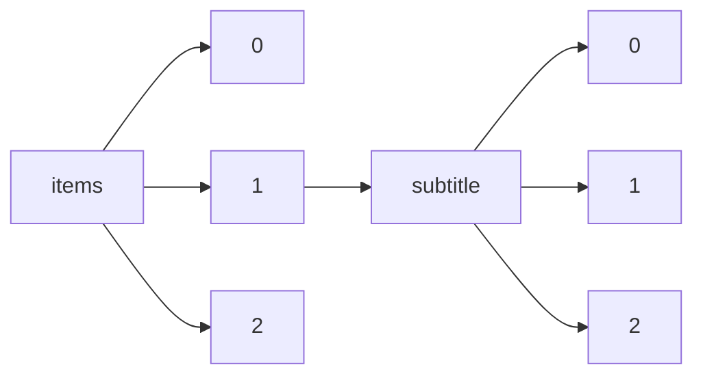

!!! warning "This document is not official Crossref documentation"
# Elements
PATH = items/array/subtitle/array(1)  
Occurs 7 702 719 times  
Unique values: > 999  
{ .annotate }

1. A route to an element, for example:  
   The route "items/array/subtitle/array" corresponds to navigating through the JSON indices as  
   ["items"][0]["subtitle"][0]  

!!! note "Due to current limitations, only the first 1,000 unique values are counted."

| **Row** | **Value** `String`                                                                                 | **Count** `Int64` |
|--------:|------------------------------------------------------------------------------------------------------:|---------------------:|
| **1**   |                                                                                                       | 2 025 684            |
| **2**   | Harmonised System 2012                                                                                | 25 068               |
| **3**   | Système Harmonisé 2012                                                                                | 17 809               |
| **4**   | CTCI révision 3                                                                                       | 12 822               |
| **5**   | SITC revision 3                                                                                       | 12 821               |
| **6**   | Biographical note with links to correspondence                                                        | 10 380               |
| **7**   | Archival Version                                                                                      | 8 578                |
| **8**   | A Case Report                                                                                         | 7 540                |
| **9**   | Book Reviews                                                                                          | 7 003                |
| **10**  | Version 1                                                                                             | 6 715                |
| **11**  | Correspondence                                                                                        | 6 454                |
| **12**  | Editorial                                                                                             | 6 297                |
| **13**  | Seasonally adjusted                                                                                   | 5 911                |
| **14**  | Lack of efficacy: case report                                                                         | 5 805                |
| **15**  | Various toxicities: case report                                                                       | 5 501                |
| **16**  | ISIC Rev. 4                                                                                           | 5 340                |
| **17**  | Chemical Shifts and Coupling Constants for Carbon-13                                                  | 5 134                |
| **18**  | SNA 2008                                                                                              | 4 602                |
| **19**  | CITI Rév. 4                                                                                           | 4 423                |
| **20**  | A case report                                                                                         | 4 370                |
| **21**  | Case report                                                                                           | 3 646                |
| **22**  | Letter to the Editor                                                                                  | 3 560                |
| **23**  | Reviews                                                                                               | 3 495                |
| **24**  | BOOK REVIEWS                                                                                          | 2 891                |
| **25**  | Book Review                                                                                           | 2 665                |
| **26**  | Letters to the Editor                                                                                 | 2 617                |
| **27**  | From:  Acronyms Used in Theoretical Chemistry                                                         | 2 461                |
| **28**  | Clinical article                                                                                      | 2 456                |
| **29**  | SCN 2008                                                                                              | 2 436                |
| **30**  | Corrigés des variations saisonnières                                                                  | 2 291                |
| **31**  | Abstracts                                                                                             | 2 199                |
| **32**  | An Introduction                                                                                       | 2 136                |
| **33**  | Book reviews                                                                                          | 2 121                |
| **34**  | Report of a Case                                                                                      | 1 937                |
| **35**  | Case Report                                                                                           | 1 893                |
| **36**  | Variation par rapport à la période précédente, corrigés des variations saisonnières                   | 1 853                |
| **37**  | LETTERS TO THE EDITOR                                                                                 | 1 839                |
| **38**  | Erratum                                                                                               | 1 784                |
| **39**  | Version 2                                                                                             | 1 731                |
| **40**  | C-13 NMR-data                                                                                         | 1 726                |
| **41**  | Data extract from Landolt-Börnstein III/35D3: NMR Data for Carbon-13                                  | 1 661                |
| **42**  | Introduction                                                                                          | 1 559                |
| **43**  | A Randomized Controlled Trial                                                                         | 1 531                |
| **44**  | Data extract from Landolt-Börnstein III/47: Optical Constants                                         | 1 499                |
| **45**  | Poster abstracts                                                                                      | 1 403                |
| **46**  | A Case Study                                                                                          | 1 359                |
| **47**  | A Review                                                                                              | 1 347                |
| **48**  | -EN- -FR- -ES-                                                                                        | 1 338                |
| **49**  | Commentary                                                                                            | 1 303                |
| **50**  | From:  Glossary of Terms Used in Toxicology, 2nd Edition                                              | 1 292                |
| **51**  | A Systematic Review                                                                                   | 1 263                |
| **52**  | A Randomized Clinical Trial                                                                           | 1 228                |
| **53**  | —Case Report—                                                                                         | 1 188                |
| **54**  | From:  Glossary of Terms Used in\n       Developmental and Reproductive Toxicology (IUPAC Recommendat | 1 129                |
| **55**  | From:  IUPAC Glossary of Terms Used in Immunotoxicology                                               | 1 079                |
| **56**  | now missing                                                                                           | 1 061                |
| **57**  | REPORT OF A CASE                                                                                      | 1 059                |
| **58**  | Liquid Chromatography                                                                                 | 1 057                |
| **59**  | Data extract from Landolt-Börnstein VIII/6D2: Polymers, Polymer Solutions, Physical Properties and t  | 1 031                |
| **60**  | From:  Glossary for Chemists of Terms Used in Toxicology                                              | 1 026                |
| **61**  | An Overview                                                                                           | 990                  |
| **62**  | A protocol for systematic review and meta-analysis                                                    | 939                  |
| **63**  | To the editors of the Philosophical Magazine and Journal                                              | 931                  |
| **64**  | From:  Glossary of Terms Used in Physical Organic Chemistry                                           | 915                  |
| **65**  | BUSINESS                                                                                              | 850                  |
| **66**  | GOVERNMENT                                                                                            | 839                  |
| **67**  | Technical note                                                                                        | 837                  |
| **68**  | A Meta-Analysis                                                                                       | 832                  |
| **69**  | A Pilot Study                                                                                         | 816                  |
| **70**  | REVIEWS AND SHORT NOTICES                                                                             | 804                  |
| **71**  | EDITORIAL                                                                                             | 803                  |
| **72**  | SCIENCE/TECHNOLOGY                                                                                    | 791                  |
| **73**  | Policy and Practice                                                                                   | 788                  |
| **74**  | Report of a case                                                                                      | 751                  |
| **75**  | Extended abstract                                                                                     | 736                  |
| **76**  | Oral communication abstracts                                                                          | 732                  |
| **77**  | Methods and Protocols                                                                                 | 717                  |
| **78**  | Paramagnetic Susceptibility Data                                                                      | 715                  |
| **79**  | Buchbesprechungen                                                                                     | 714                  |
| **80**  | CORRESPONDENCE                                                                                        | 710                  |
| **81**  | A Preliminary Report                                                                                  | 695                  |
| **82**  | REVIEWS                                                                                               | 684                  |
| **83**  | From:  Glossary of Terms Used in Photochemistry, 3rd Edition                                          | 682                  |
| **84**  | translation from French into English                                                                  | 675                  |
| **85**  | From:  IUPAC Glossary of Terms Used in Neurotoxicology (IUPAC Recommendations 2015)                   | 672                  |
| **86**  | From:  Glossary of Class Names of Organic Compounds and Reactivity Intermediates Based on Structure   | 670                  |
| **87**  | A Systematic Review and Meta-analysis                                                                 | 668                  |
| **88**  | From:  Lexicon of Lipid Nutrition                                                                     | 668                  |
| **89**  | Review                                                                                                | 657                  |
| **90**  | From:  Glossary of Terms Used in Ecotoxicology                                                        | 653                  |
| **91**  | General                                                                                               | 640                  |
| **92**  | II. Mitteilung                                                                                        | 633                  |
| **93**  | Anaphylaxis: case report                                                                              | 632                  |
| **94**  | Oral poster abstracts                                                                                 | 622                  |
| **95**  | From:  Glossary of Atmospheric Chemistry Terms                                                        | 612                  |
| **96**  | BOOK REVIEW                                                                                           | 607                  |
| **97**  | Part II                                                                                               | 605                  |
| **98**  | Internal Developments                                                                                 | 603                  |
| **99**  | Letters                                                                                               | 580                  |
| **100** | CASE REPORT                                                                                           | 579                  |
| **101** | HIGHER EDUCATION ABSTRACTS                                                                            | 568                  |
| **102** | Treaties and International Agreements Registered or Filed and Recorded with the Secretariat of the U  | 564                  |
| **103** | A CASE REPORT                                                                                         | 558                  |
| **104** | From:  Glossary of Terms Relating to Pesticides                                                       | 541                  |
| **105** | Report of Two Cases                                                                                   | 539                  |
| **106** | I. Mitteilung                                                                                         | 538                  |
| **107** | translation from Latin into English                                                                   | 531                  |
| **108** | At year end                                                                                           | 529                  |
| **109** | Valeurs ('000 USD), CTCI révision 3                                                                   | 518                  |
| **110** | Values ('000 USD), SITC revision 3                                                                    | 518                  |
| **111** | PRIMER NOTE                                                                                           | 515                  |
| **112** | Short Report                                                                                          | 515                  |
| **113** | Report of two cases                                                                                   | 508                  |
| **114** | Geological Society                                                                                    | 499                  |
| **115** | From:  Definitions of Terms Relating to Mass Spectrometry\n                  Sponsoring body: IUPAC A | 494                  |
| **116** | Electronic Poster (P) Abstracts                                                                       | 494                  |
| **117** | From:  Glossary of Terms Used in Nuclear Analytical Chemistry                                         | 479                  |
| **118** | Kurze Mitteilung                                                                                      | 477                  |
| **119** | CE and CEC                                                                                            | 476                  |
| **120** | XXXX                                                                                                  | 471                  |
| **121** | ARTICLE                                                                                               | 466                  |
| **122** | General requirements                                                                                  | 462                  |
| **123** | Challenges and Opportunities                                                                          | 461                  |
| **124** | A systematic review and meta-analysis                                                                 | 460                  |
| **125** | From:  Guide to Trivial Names, Trade Names and Synonyms for Substances Used in Analytical Nomenclatu  | 460                  |
| **126** | Laboratory investigation                                                                              | 460                  |
| **127** | Today's news of the chemical world likely to influence the happenings of tomorrow                     | 455                  |
| **128** | National Security                                                                                     | 450                  |
| **129** | A Case Report and Review of the Literature                                                            | 447                  |
| **130** | Preface                                                                                               | 445                  |
| **131** | Sample Preparation                                                                                    | 441                  |
| **132** | Summary of typical imaging features, general                                                          | 440                  |
| **133** | From:  Glossary of Terms Used in Theoretical Organic Chemistry                                        | 439                  |
| **134** | Various toxicities: 2 case reports                                                                    | 434                  |
| **135** | A meta-analysis                                                                                       | 433                  |
| **136** | Book review                                                                                           | 431                  |
| **137** | Ternary pnictides and chalcogenides containing s-, p- or f-electron elements                          | 429                  |
| **138** | Per cent per annum                                                                                    | 428                  |
| **139** | Part I                                                                                                | 427                  |
| **140** | From high art to humble memorabilia                                                                   | 418                  |
| **141** | The ‘design team’                                                                                     | 418                  |
| **142** | The role of the interior designer                                                                     | 418                  |
| **143** | From reception to chapels                                                                             | 418                  |
| **144** | From floors to furniture                                                                              | 418                  |
| **145** | Version 3                                                                                             | 417                  |
| **146** | Neutropenia: case report                                                                              | 409                  |
| **147** | PRELIMINARY REPORT                                                                                    | 407                  |
| **148** | three months in advance                                                                               | 405                  |
| **149** | Classification élargie des services de la balance des paiements 2010 (EBOPS 2010)                     | 403                  |
| **150** | 2010 Extended Balance of Payments Services Classification (EBOPS 2010)                                | 402                  |
| **151** | A Practical Guide                                                                                     | 394                  |
| **152** | Variation par rapport à la même période de l'année précédente                                         | 394                  |
| **153** | Various toxicities: 4 case reports                                                                    | 394                  |
| **154** | A STAFF REPORT                                                                                        | 393                  |
| **155** | CORRECTION                                                                                            | 388                  |
| **156** | A Very Short Introduction                                                                             | 382                  |
| **157** | Short Oral Presentation (OP) Abstracts                                                                | 369                  |
| **158** | From:  Terminology of Bioanalytical Methods (IUPAC Recommendations 2018)                              | 366                  |
| **159** |                                                                                                       | 363                  |
| **160** | En fin d'année                                                                                        | 363                  |
| **161** | Vorläufige Mitteilung                                                                                 | 362                  |
| **162** | From:  Glossary of Terms Used in Photochemistry                                                       | 356                  |
| **163** | NEW ALLELE Alerts                                                                                     | 355                  |
| **164** | 2002 Extended Balance of Payments Services Classification (EBOPS 2002)                                | 354                  |
| **165** | Classification élargie des services de la balance des paiements 2002 (EBOPS 2002)                     | 350                  |
| **166** | From:  Glossary of Terms Used in Toxicokinetics                                                       | 338                  |
| **167** | A Literature Review                                                                                   | 324                  |
| **168** | Copyright restrictions prevent ACM from providing the full text for this work.                        | 321                  |
| **169** | Editorial overview                                                                                    | 320                  |
| **170** | Student experiences in the real world of nursing                                                      | 319                  |
| **171** | Various toxicities: 3 case reports                                                                    | 316                  |
| **172** | Preliminary Report                                                                                    | 316                  |
| **173** | Developing topics                                                                                     | 315                  |
| **174** | From:  Glossary of Terms Used in Photocatalysis and Radiation Catalysis\n                  Sponsoring | 312                  |
| **175** | A case report and literature review                                                                   | 311                  |
| **176** | From:  Pesticides Report 36. Glossary of Terms Relating to Pesticides                                 | 311                  |
| **177** | An introduction                                                                                       | 309                  |
| **178** | Results based on students' self-reports                                                               | 308                  |
| **179** | Commodities                                                                                           | 308                  |
| **180** | A Preliminary Study                                                                                   | 304                  |
| **181** | Treatment failure: case report                                                                        | 304                  |
| **182** | LETTER TO THE EDITOR                                                                                  | 304                  |
| **183** | WASHINGTON                                                                                            | 303                  |
| **184** | book reviews                                                                                          | 299                  |
| **185** | case report                                                                                           | 297                  |
| **186** | by level of gross earnings expressed as a % of the average wage                                       | 294                  |
| **187** | en fonction du salaire brut exprimé en % du salaire moyen                                             | 293                  |
| **188** | A Prospective Study                                                                                   | 290                  |
| **189** | Comment                                                                                               | 290                  |
| **190** | Commentaries                                                                                          | 285                  |
| **191** | Abstract                                                                                              | 285                  |
| **192** | Case illustration                                                                                     | 281                  |
| **193** | COMMENTARY                                                                                            | 281                  |
| **194** | <i>Correspondence</i>                                                                                 | 281                  |
| **195** | Reply                                                                                                 | 279                  |
| **196** | REPORT OF TWO CASES                                                                                   | 279                  |
| **197** | LETTERS                                                                                               | 276                  |
| **198** | Electronic Poster Abstracts                                                                           | 274                  |
| **199** | By level of gross earnings expressed as a % of the average wage                                       | 273                  |
| **200** | From:  Glossary of Terms Used in Bioinorganic Chemistry                                               | 272                  |
| **201** | Volume 2                                                                                              | 271                  |
| **202** | Forum                                                                                                 | 271                  |
| **203** | An Update                                                                                             | 270                  |
| **204** | Eine Einführung                                                                                       | 270                  |
| **205** | Case Report and Review of the Literature                                                              | 267                  |
| **206** | From:  Glossary of Terms in Quantities and Units in Clinical Chemistry                                | 266                  |
| **207** | Letters to the editor                                                                                 | 265                  |
| **208** | Lack of efficacy: 2 case reports                                                                      | 264                  |
| **209** | A PRELIMINARY REPORT                                                                                  | 263                  |
| **210** | Editorials                                                                                            | 262                  |
| **211** | Editorial Comment                                                                                     | 260                  |
| **212** | Supplement                                                                                            | 260                  |
| **213** | a case study                                                                                          | 260                  |
| **214** | Point/Counterpoint                                                                                    | 258                  |
| **215** | A Meta-analysis                                                                                       | 253                  |
| **216** | Reviews and Short Notices                                                                             | 248                  |
| **217** | A Randomized Trial                                                                                    | 248                  |
| **218** | DRESS syndrome: case report                                                                           | 245                  |
| **219** | Summary of typical imaging features, MRI                                                              | 243                  |
| **220** | President's Address                                                                                   | 242                  |
| **221** | From:  Glossary for Chemists of Terms Used in Biotechnology                                           | 241                  |
| **222** | An Experimental Study                                                                                 | 239                  |
| **223** | Personal Diary and Observations on Medical Life                                                       | 235                  |
| **224** | Emerging Research and Opportunities                                                                   | 235                  |
| **225** | To the editors of the Philosophical Magazine                                                          | 234                  |
| **226** | A Systematic Review and Meta-Analysis                                                                 | 233                  |
| **227** | TECHNOLOGY                                                                                            | 231                  |
| **228** | Other Techniques                                                                                      | 229                  |
| **229** | En pourcentage du PIB                                                                                 | 227                  |
| **230** | To the editors of the Annals of Natural History                                                       | 226                  |
| **231** | A Practical Approach                                                                                  | 226                  |
| **232** | <i>Editor</i>, The American Journal of Psychiatry:                                                    | 226                  |
| **233** | OECD Indicators                                                                                       | 225                  |
| **234** | Cellular immune response                                                                              | 225                  |
| **235** | From:  Recommendations for Nomenclature in Laboratory Robotics and Automation                         | 225                  |
| **236** | Neue Bücher                                                                                           | 225                  |
| **237** | INDUSTRY                                                                                              | 222                  |
| **238** | Summary of typical imaging features, CT                                                               | 221                  |
| **239** | Case report and review of the literature                                                              | 220                  |
| **240** | A review                                                                                              | 219                  |
| **241** | Acta Ophthalmologica Scandinavica 2005                                                                | 219                  |
| **242** | Mit 2 Textabbildungen                                                                                 | 218                  |
| **243** | Perspectives                                                                                          | 217                  |
| **244** | The Journal of Clinical Pharmacology                                                                  | 214                  |
| **245** | Serving the Chemical, Life Sciences, and Laboratory Worlds                                            | 214                  |
| **246** | Short oral presentation abstracts                                                                     | 212                  |
| **247** | Workshop Summary                                                                                      | 212                  |
| **248** | Letters to the Editors                                                                                | 210                  |
| **249** | CORRESPONDENCE AND NOTES                                                                              | 209                  |
| **250** | TECHNICAL NOTE                                                                                        | 209                  |
| **251** | From:  Glossary of Terms Used in\n       Extraction (IUPAC Recommendations 2016)                      | 209                  |
| **252** | As a percentage of GDP                                                                                | 207                  |
| **253** | Original article                                                                                      | 207                  |
| **254** | RESEARCH                                                                                              | 206                  |
| **255** | Various toxicities and lack of efficacy: case report                                                  | 205                  |
| **256** | Report of the Panel                                                                                   | 203                  |
| **257** | Bulletin of the Santayana Society                                                                     | 203                  |
| **258** | Thrombocytopenia: case report                                                                         | 203                  |
| **259** | REPORT OF CASE                                                                                        | 202                  |
| **260** | Informe del Grupo Especial                                                                            | 200                  |
| **261** | Continental Developments                                                                              | 199                  |
| **262** | Rapport du Groupe spécial                                                                             | 199                  |
| **263** | From:  Quantities, Terminology, and Symbols in Photothermal and Related Spectroscopies                | 198                  |
| **264** | phase equilibria, crystallographic and thermodynamic data of binary alloys                            | 197                  |
| **265** | Books                                                                                                 | 194                  |
| **266** | Percentage                                                                                            | 194                  |
| **267** | En fonction du salaire brut exprimé en % du salaire moyen                                             | 194                  |
| **268** | En pourcentage des actifs financiers et des passifs financiers                                        | 193                  |
| **269** | Religious Studies Review • VOLUME 37 • NUMBER 3 • SEPTEMBER 2011                                      | 191                  |
| **270** | Summaries/Commentaries                                                                                | 190                  |
| **271** | ISIC Rev. 3                                                                                           | 187                  |
| **272** | SNA 1993                                                                                              | 187                  |
| **273** | As percentage of financial assets and of financial liabilities                                        | 185                  |
| **274** | really good stuff                                                                                     | 183                  |
| **275** | Book and film reviews                                                                                 | 182                  |
| **276** | Summary of typical imaging features, X-Ray                                                            | 181                  |
| **277** | CHAIRMAN'S ADDRESS                                                                                    | 180                  |
| **278** | Ein Artikel aus der 6. Auflage des Handbuchs Soziale Arbeit                                           | 180                  |
| **279** | Religious Studies Review • VOLUME 38 • NUMBER 2 • JUNE 2012                                           | 179                  |
| **280** | III. Mitteilung                                                                                       | 179                  |
| **281** | Harmonised System 2112                                                                                | 178                  |
| **282** | poster abstract                                                                                       | 177                  |
| **283** | Kommentar                                                                                             | 176                  |
| **284** | Ein Artikel aus dem Handbuch Soziale Arbeit, 4. Aufl.                                                 | 175                  |
| **285** | Books and Publications                                                                                | 175                  |
| **286** | Preliminary Results                                                                                   | 174                  |
| **287** | CITI Rév. 3                                                                                           | 173                  |
| **288** | iea economic afairs                                                                                   | 172                  |
| **289** | Religious Studies Review • VOLUME 36 • NUMBER 2 • •• 2010                                             | 170                  |
| **290** | Report of three cases                                                                                 | 168                  |
| **291** | AN EXPERIMENTAL STUDY                                                                                 | 168                  |
| **292** | Royal Society                                                                                         | 168                  |
| **293** | A Report of Two Cases                                                                                 | 167                  |
| **294** | To the editors of Annals and Magazine of Natural History                                              | 167                  |
| **295** | Poster discussion hub abstracts                                                                       | 166                  |
| **296** | Journal of Computational Chemistry                                                                    | 165                  |
| **297** | Molecular Constants                                                                                   | 164                  |
| **298** | From:  Definitions of Terms Relating to the Structure and Processing of Sols, Gels, Networks, and In  | 163                  |
| **299** | Various toxicities: 6 case reports                                                                    | 162                  |
| **300** | From:  Terminology for Biorelated Polymers and Applications\n                  Sponsoring body: IUPAC | 162                  |
| **301** | Religious Studies Review • VOLUME 36 • NUMBER 4 • DECEMBER 2010                                       | 160                  |
| **302** | Pourcentage par an                                                                                    | 160                  |
| **303** | From:  Glossary of Terms Related to Pharmaceutics                                                     | 158                  |
| **304** | A Journal of Analytic Scholasticism                                                                   | 158                  |
| **305** | Oral Communication (OC) Abstracts                                                                     | 158                  |
| **306** | From:  Glossary of Terms Used in Medicinal Chemistry. Part II\n                  Sponsoring body: IUP | 158                  |
| **307** | Anaphylactic reaction: case report                                                                    | 157                  |
| **308** | Science                                                                                               | 157                  |
| **309** | Research Article                                                                                      | 157                  |
| **310** | Mit 3 Textabbildungen                                                                                 | 157                  |
| **311** | (Abstract Only)                                                                                       | 157                  |
| **312** | An Empirical Study                                                                                    | 153                  |
| **313** | Various toxicities: 5 case reports                                                                    | 153                  |
| **314** | Short communication                                                                                   | 152                  |
| **315** | Surgical Technique                                                                                    | 151                  |
| **316** | From:  Glossary of Terms Used in Biomolecular Screening\n                  Sponsoring body: IUPAC Che | 151                  |
| **317** | Brief notes                                                                                           | 150                  |
| **318** | Past, Present, and Future                                                                             | 150                  |
| **319** | EDITORIAL COMMENT                                                                                     | 150                  |
| **320** | (Extended Abstract)                                                                                   | 150                  |
| **321** | Opinion                                                                                               | 150                  |
| **322** | Vorl�ufige Mitteilung                                                                                 | 149                  |
| **323** | A weekly round-up of the latest research and scientific reports from the nursing and medical journal  | 149                  |
| **324** | With 3 figures in the text                                                                            | 149                  |
| **325** | Ternary chalcogenides containing d-electron elements                                                  | 148                  |
| **326** | A preliminary report                                                                                  | 148                  |
| **327** | Mit 1 Textabbildung                                                                                   | 148                  |
| **328** | A Commentary                                                                                          | 148                  |
| **329** | Letter                                                                                                | 147                  |
| **330** | From:  Terminology of Polymers and Polymerization Processes in Dispersed Systems                      | 147                  |
| **331** | A protocol for systematic review and meta analysis                                                    | 146                  |
| **332** | 性質                                                                                                  | 146                  |
| **333** | From:  Terminology for Aggregation and Self-Assembly in Polymer Science\n                  Sponsoring | 145                  |
| **334** | Methods of test                                                                                       | 143                  |
| **335** | GUEST EDITORIAL                                                                                       | 143                  |
| **336** | Religious Studies Review • VOLUME 37 • NUMBER 2 • JUNE 2011                                           | 143                  |
| **337** | Corrigées des variations saisonnières                                                                 | 143                  |
| **338** | a systematic review protocol                                                                          | 142                  |
| **339** | Theory and Practice                                                                                   | 142                  |
| **340** | Rapid Communications of the American Ceramic Society                                                  | 142                  |
| **341** | ANNOUNCEMENTS                                                                                         | 142                  |
| **342** | A Survey                                                                                              | 141                  |
| **343** | An Exploratory Study                                                                                  | 141                  |
| **344** | Test methods                                                                                          | 141                  |
| **345** | From:  Terminology of Separation Methods (IUPAC Recommendations 2017)                                 | 141                  |
| **346** | translation from French into modernized French                                                        | 140                  |
| **347** | 承前                                                                                                  | 139                  |
| **348** | Mit 4 Textabbildungen                                                                                 | 138                  |
| **349** | Neurotoxicity: case report                                                                            | 137                  |
| **350** | In Zusammenarbeit mit der Bayerischen Landesärztekammer                                               | 136                  |
| **351** | Report of Three Cases                                                                                 | 136                  |
| **352** | Misfit compounds                                                                                      | 135                  |
| **353** | Adverse effects: incidence study                                                                      | 133                  |
| **354** | Besprechungen und ausführliche Inhaltsangaben                                                         | 133                  |
| **355** | <i>Short Report</i>                                                                                   | 132                  |
| **356** | Daniel F. Austin, Book Review Editor                                                                  | 132                  |
| **357** | Microfluidics and Miniaturization                                                                     | 131                  |
| **358** | A Multicenter Study                                                                                   | 130                  |
| **359** | By firm size                                                                                          | 130                  |
| **360** | From:  Vocabulary of Concepts and\n       Terms in Chemometrics (IUPAC Recommendations 2016)          | 130                  |
| **361** | Thoughts and Progress                                                                                 | 129                  |
| **362** | Epidemiology / Risk and protective factors in MCI and dementia                                        | 129                  |
| **363** | Report of a Case and Review of the Literature                                                         | 129                  |
| **364** | From:  Glossary of Terms Related to Solubility                                                        | 129                  |
| **365** | Percentages                                                                                           | 128                  |
| **366** | A Case Series                                                                                         | 127                  |
| **367** | SCN 1993                                                                                              | 127                  |
| **368** | (Technical Report)                                                                                    | 127                  |
| **369** | Industry/Business                                                                                     | 127                  |
| **370** | British Society for Matrix Biology Meeting                                                            | 126                  |
| **371** | Indonesia                                                                                             | 126                  |
| **372** | Generic specification                                                                                 | 125                  |
| **373** | 4-7 October 2000, Zagreb, CroatiaFree Communications                                                  | 125                  |
| **374** | With 4 figures in the text                                                                            | 124                  |
| **375** | Allergic reaction: case report                                                                        | 123                  |
| **376** | Système Harmonisé 2112                                                                                | 123                  |
| **377** | a review                                                                                              | 121                  |
| **378** | Gas Chromatography                                                                                    | 121                  |
| **379** | Summary of typical imaging features, US                                                               | 120                  |
| **380** | Corrigendum                                                                                           | 120                  |
| **381** | Helping you to help each other                                                                        | 120                  |
| **382** | To the editors of the Philosophical Magazine and Annals                                               | 119                  |
| **383** | From:  Glossary of Terms Used in Combinatorial Chemistry                                              | 119                  |
| **384** | With 3 figures and 1 table in the text                                                                | 119                  |
| **385** | Hypersensitivity: case report                                                                         | 118                  |
| **386** | Full Length Research Paper                                                                            | 118                  |
| **387** | Society for Pediatric and Perinatal Epidemiologic Research                                            | 117                  |
| **388** | Religious Studies Review • VOLUME 37 • NUMBER 1 • MARCH 2011                                          | 117                  |
| **389** | Discussion                                                                                            | 117                  |
| **390** | poster                                                                                                | 117                  |
| **391** | progress report                                                                                       | 117                  |
| **392** | Overview                                                                                              | 116                  |
| **393** | Rapport de l’Organe d’appel                                                                           | 116                  |
| **394** | Report of the Appellate Body                                                                          | 116                  |
| **395** | Religious Studies Review • VOLUME 37 • NUMBER 4 • DECEMBER 2011                                       | 116                  |
| **396** | With 2 figures and 1 table in the text                                                                | 116                  |
| **397** | Informe del Órgano de Apelación                                                                       | 115                  |
| **398** | From:  Glossary of Terms Relating to Thermal and Thermo Mechanical Properties of Polymers\n           | 115                  |
| **399** | From:  Glossary of Terms Related to Kinetics, Thermodynamics, and Mechanisms of Polymerization        | 114                  |
| **400** | A Prospective Cohort Study                                                                            | 113                  |
| **401** | Klinik-Aktien                                                                                         | 113                  |
| **402** | With 2 figures in the text                                                                            | 113                  |
| **403** | WORLD BANKING ABSTRACTS                                                                               | 113                  |
| **404** | From:  Glossary of Terms Used in Computational Drug Design                                            | 113                  |
| **405** | Part 2                                                                                                | 112                  |
| **406** | Water                                                                                                 | 112                  |
| **407** | From:  Definitions of Terms Relating to Phase Transitions of the Solid State                          | 112                  |
| **408** | Neuroimaging / Optimal neuroimaging measures for early detection                                      | 112                  |
| **409** | Molecular immunology                                                                                  | 111                  |
| **410** | BULLETIN AND DIARY                                                                                    | 110                  |
| **411** | Conférences de l’année 2013-2014                                                                      | 109                  |
| **412** | INTERNATIONAL                                                                                         | 109                  |
| **413** | Technical Note                                                                                        | 109                  |
| **414** | Letter Report                                                                                         | 108                  |
| **415** | <i>To the editors of the Philosophical Magazine and Journal</i>                                       | 108                  |
| **416** | Details of tax revenue                                                                                | 108                  |
| **417** | From:  Definitions of Terms for Diffusion in the Solid State                                          | 108                  |
| **418** | From:  Glossary of Class Names of Polymers Based on Chemical Structure and Molecular Architecture     | 107                  |
| **419** | New Data and Updates for several IIa-VI Compounds (Structural Properties, Thermal and Thermodynamic   | 107                  |
| **420** | Conférences de l’année 2012-2013                                                                      | 107                  |
| **421** | Communications and Transport                                                                          | 107                  |
| **422** | Summary                                                                                               | 106                  |
| **423** | Diagnosis and Management                                                                              | 106                  |
| **424** | What Everyone Needs to Know®                                                                          | 106                  |
| **425** | Thermodynamic Properties of Inorganic Materials                                                       | 106                  |
| **426** | From:  Glossary of Basic Terms in Polymer Science                                                     | 106                  |
| **427** | Conférences de l’année 2014-2015                                                                      | 105                  |
| **428** | Methaemoglobinaemia: case report                                                                      | 104                  |
| **429** | News of the nation's activity in marshaling its resources to meet the international emergency         | 104                  |
| **430** | Brief Communications                                                                                  | 103                  |
| **431** | Percentage of GDP                                                                                     | 103                  |
| **432** | R<scp>eviews</scp>                                                                                    | 103                  |
| **433** | A Critical Analysis Review                                                                            | 102                  |
| **434** | A Case Report and Review of Literature                                                                | 102                  |
| **435** | CT Findings                                                                                           | 102                  |
| **436** | From:  Glossary of Terms Used in Medicinal Chemistry                                                  | 102                  |
| **437** | science/technology                                                                                    | 102                  |
| **438** | Report of four cases                                                                                  | 101                  |
| **439** | Drug-induced liver injury: case report                                                                | 101                  |
| **440** | INDUSTRY &amp; BUSINESS                                                                               | 101                  |
| **441** | A MONTHLY MESSAGE                                                                                     | 100                  |
| **442** | Summary of a Workshop                                                                                 | 100                  |
| **443** | General introduction                                                                                  | 100                  |
| **444** | REPORT OF THREE CASES                                                                                 | 99                   |
| **445** | A Qualitative Study                                                                                   | 99                   |
| **446** | With 2 figures and 2 tables in the text                                                               | 99                   |
| **447** | Light Metal Ternary Systems: Phase Diagrams, Crystallographic and Thermodynamic Data                  | 99                   |
| **448** | Continental Alignments                                                                                | 99                   |
| **449** | Short report                                                                                          | 98                   |
| **450** | Questions                                                                                             | 98                   |
| **451** | Theology, Ethics and Philosophy                                                                       | 98                   |
| **452** | Specifications for essential oils                                                                     | 98                   |
| **453** | Images for surgeons                                                                                   | 98                   |
| **454** | Toelichting                                                                                           | 98                   |
| **455** | Technical specification                                                                               | 96                   |
| **456** | Special Report                                                                                        | 96                   |
| **457** | business                                                                                              | 96                   |
| **458** | The Political, Health and Welfare Scene                                                               | 96                   |
| **459** | Average annual change (%)                                                                             | 96                   |
| **460** | Answers, critiques, and references                                                                    | 95                   |
| **461** | (IUPAC Technical Report)                                                                              | 95                   |
| **462** | Commentaire                                                                                           | 95                   |
| **463** | Milton Quarterly                                                                                      | 95                   |
| **464** | Editor's Introduction                                                                                 | 94                   |
| **465** | A Review of the Literature                                                                            | 94                   |
| **466** | Analysis in percentage of aggregates                                                                  | 94                   |
| **467** | JOURNAL OF SMALL BUSINESS MANAGEMENT                                                                  | 94                   |
| **468** | Amounts outstanding at end of period                                                                  | 94                   |
| **469** | Industries                                                                                            | 93                   |
| **470** | SHORT COMMUNICATIONS                                                                                  | 93                   |
| **471** | Encours en fin de période                                                                             | 93                   |
| **472** | Editorial comment                                                                                     | 93                   |
| **473** | Analyse en pourcentage d'agrégats                                                                     | 93                   |
| **474** | Extended Abstract                                                                                     | 93                   |
| **475** | Hepatotoxicity: case report                                                                           | 92                   |
| **476** | Mit 5 Textabbildungen                                                                                 | 92                   |
| **477** | Volume 1                                                                                              | 92                   |
| **478** | <i>To the Editor of the</i>Archives of the Roentgen Ray                                               | 92                   |
| **479** | A case study                                                                                          | 92                   |
| **480** | RESEARCH ARTICLE                                                                                      | 91                   |
| **481** | (Transcript of Discussion)                                                                            | 91                   |
| **482** | a case report                                                                                         | 91                   |
| **483** | Comments on Cases                                                                                     | 91                   |
| **484** | A Controlled Study                                                                                    | 90                   |
| **485** | 1. Produkte aus Industrie und Landwirtschaft                                                          | 90                   |
| **486** | (Commentary)                                                                                          | 90                   |
| **487** | A Randomized, Controlled Trial                                                                        | 90                   |
| **488** | NEWS AND VIEWS: PERSPECTIVE                                                                           | 89                   |
| **489** | Diagnosis and Treatment                                                                               | 89                   |
| **490** | Letter to the editor                                                                                  | 89                   |
| **491** | Inclusive Framework on BEPS: Action 14                                                                | 89                   |
| **492** | A current bibliography                                                                                | 89                   |
| **493** | Pays                                                                                                  | 88                   |
| **494** | History and Sociology of Religion                                                                     | 88                   |
| **495** | Royal Society of Medicine—Section of Otology                                                          | 88                   |
| **496** | Hepatology                                                                                            | 88                   |
| **497** | PERMANENT GENETIC RESOURCES                                                                           | 88                   |
| **498** | Genetics/genetic factors of Alzheimer's disease                                                       | 88                   |
| **499** | With 5 figures in the text                                                                            | 88                   |
| **500** | RESEARCH &amp; TECHNOLOGY                                                                             | 88                   |
| **501** | A<scp>cta</scp>\n O<scp>phthalmologica</scp>\n S<scp>candinavica</scp>\n 2002                         | 88                   |
| **502** | From:  Definitions of Terms Related to Polymer Blends, Composites, and Multiphase Polymeric Material  | 88                   |
| **503** | Absract                                                                                               | 87                   |
| **504** | 4. Biologisches Material                                                                              | 87                   |
| **505** | Progressive multifocal leukoencephalopathy: case report                                               | 86                   |
| **506** | The tree is based on amino acid sequences. Archaea (yellow), Bacteria (blue), Cyanidiales (red), Euk  | 86                   |
| **507** | Letter to the Editors                                                                                 | 86                   |
| **508** | Religious Studies Review • VOLUME 36 • NUMBER 3 • 2010                                                | 86                   |
| **509** | Thrombocytopenia in an elderly patient: case report                                                   | 85                   |
| **510** | 製銑                                                                                                  | 85                   |
| **511** | HotSpots                                                                                              | 85                   |
| **512** | Case Report and Literature Review                                                                     | 84                   |
| **513** | work-in-progress                                                                                      | 84                   |
| **514** | A Population-Based Cohort Study                                                                       | 83                   |
| **515** | General principles                                                                                    | 83                   |
| **516** | New contracts                                                                                         | 83                   |
| **517** | Education and Imaging                                                                                 | 82                   |
| **518** | I. Teil                                                                                               | 82                   |
| **519** | Re                                                                                                    | 82                   |
| **520** | Ein Fallbericht                                                                                       | 82                   |
| **521** | Photochemistry and Photobiology, 2007, 83                                                             | 82                   |
| **522** | Neuroimaging / Optimal neuroimaging measures for tracking disease progression                         | 82                   |
| **523** | Acta Ophthalmologica Scandinavica 2004                                                                | 81                   |
| **524** | Liquid Phase Separations                                                                              | 81                   |
| **525** | Religious Studies Review • VOLUME 38 • NUMBER 1 • MARCH 2012                                          | 81                   |
| **526** | Clinical Pharmacology in Drug Development                                                             | 81                   |
| **527** | Vorläufige Mittheilung                                                                                | 81                   |
| **528** | En pourcentage                                                                                        | 81                   |
| **529** | Preparation of test specimens and determination of properties                                         | 81                   |
| **530** | The Books of the Month                                                                                | 80                   |
| **531** | As a percentage                                                                                       | 80                   |
| **532** | Royal Society of Medicine—Section of Laryngology                                                      | 80                   |
| **533** | Clinical Letter                                                                                       | 80                   |
| **534** | An ultrastructural study                                                                              | 79                   |
| **535** | Percentage change from previous year                                                                  | 79                   |
| **536** | Poems                                                                                                 | 79                   |
| **537** | iron systems: phase diagrams, crystallographic and thermodynamic data                                 | 78                   |
| **538** | Refractory Metal Systems: Phase Diagrams, Crystallographic and Thermodynamic Data                     | 78                   |
| **539** | Philosophical Investigations                                                                          | 78                   |
| **540** | Pourcentages                                                                                          | 78                   |
| **541** | Pourcentage                                                                                           | 78                   |
| **542** | Film                                                                                                  | 77                   |
| **543** | With 3 figures and 2 tables in the text                                                               | 77                   |
| **544** | Conférences de l’année 2011-2012                                                                      | 76                   |
| **545** | Aux prix et PPA courants                                                                              | 76                   |
| **546** | -                                                                                                     | 76                   |
| **547** | government                                                                                            | 76                   |
| **548** | <scp>Paper Abstracts</scp>                                                                            | 76                   |
| **549** | THOUGHTS AND PROGRESS                                                                                 | 76                   |
| **550** | BEYOND THE FLYLEAF                                                                                    | 75                   |
| **551** | Acta Academiae Artium Vilnensis                                                                       | 75                   |
| **552** | In per cent                                                                                           | 75                   |
| **553** | Current Literature                                                                                    | 75                   |
| **554** | A Cohort Study                                                                                        | 74                   |
| **555** | Current Concept Review                                                                                | 74                   |
| **556** | With 4 figures and 1 table in the text                                                                | 74                   |
| **557** | [communicated for the Boston Medical and Surgical Journal]                                            | 74                   |
| **558** | A case report and review of the literature                                                            | 73                   |
| **559** | Hepatitis: case report                                                                                | 73                   |
| **560** | Industry                                                                                              | 72                   |
| **561** | An overview                                                                                           | 72                   |
| **562** | Perspective from E-journals in J-STAGE                                                                | 72                   |
| **563** | Резюме                                                                                                | 72                   |
| **564** | From:  Element by Element Review of Their Atomic Weights                                              | 72                   |
| **565** | News                                                                                                  | 72                   |
| **566** | II. Teil                                                                                              | 71                   |
| **567** | Case Reports                                                                                          | 71                   |
| **568** | From:  Basic Terminology of Stereochemistry                                                           | 71                   |
| **569** | 製鋼                                                                                                  | 71                   |
| **570** | NEW SOFTWARE AND WEBSITES FOR THE CHEMICAL ENTERPRISE                                                 | 71                   |
| **571** | Clinicopathological case                                                                              | 70                   |
| **572** | at year end                                                                                           | 70                   |
| **573** | Geological society                                                                                    | 70                   |
| **574** | Public Administration Review                                                                          | 70                   |
| **575** | 24th Annual Dialysis Conference: Abstracts                                                            | 69                   |
| **576** | With 1 figure and 2 tables in the text                                                                | 69                   |
| **577** | With 1 figure in the text                                                                             | 69                   |
| **578** | demo abstract                                                                                         | 69                   |
| **579** | <scp>Acta Ophthalmologica Scandinavica</scp>\n 2002                                                   | 68                   |
| **580** | (Brainstorms)                                                                                         | 68                   |
| **581** | Financial Planning for the Medical Practitioner                                                       | 68                   |
| **582** | PROCEEDINGS AT THE MEETINGS OF THE SOCIETY                                                            | 67                   |
| **583** | September 14–17, 2011New Orleans, Louisiana                                                           | 67                   |
| **584** | A rated guide to accredited courses and meetings                                                      | 67                   |
| **585** | Lessons Learned                                                                                       | 67                   |
| **586** | Mit 6 Textabbildungen                                                                                 | 67                   |
| **587** | MOLECULAR GENETIC MARKERS                                                                             | 67                   |
| **588** | The Modern Language Journal                                                                           | 66                   |
| **589** | Selected Issues                                                                                       | 66                   |
| **590** | SHORT COMMUNICATION                                                                                   | 66                   |
| **591** | A Case Report and Literature Review                                                                   | 66                   |
| **592** | CONTACT POINT                                                                                         | 66                   |
| **593** | &lt;b&gt;—Case Report—&lt;/b&gt;                                                                      | 66                   |
| **594** | Report of a Workshop                                                                                  | 66                   |
| **595** | Biomarkers (non‐neuroimaging) / plasma/serum/urine biomarkers                                         | 66                   |
| **596** | <i>Editor</i>, American Journal of Psychiatry:                                                        | 65                   |
| **597** | <scp>Acta Ophthalmologica Scandinavica</scp>\n 2003                                                   | 65                   |
| **598** | Neuroleptic malignant syndrome: case report                                                           | 65                   |
| **599** | Phase 2: Implementation of the Standard in Practice                                                   | 65                   |
| **600** | TRAINING                                                                                              | 65                   |
| **601** | LETTERS TO THE EDITORS                                                                                | 65                   |
| **602** | Corrigée des variations saisonnières                                                                  | 64                   |
| **603** | BRIEF REPORT                                                                                          | 64                   |
| **604** | As % of gross wage earnings, by family-type and wage level                                            | 64                   |
| **605** | From:  Recommendations for Nomenclature of Mass Spectrometry                                          | 64                   |
| **606** | Report of a case and review of the literature                                                         | 64                   |
| **607** | A Targeted Problem and Its Solution                                                                   | 64                   |
| **608** | Phase 1: Legal and Regulatory Framework                                                               | 64                   |
| **609** | Electrodriven Separations                                                                             | 63                   |
| **610** | Dear Editors                                                                                          | 63                   |
| **611** | Extracts From Hansard                                                                                 | 63                   |
| **612** | Présentation                                                                                          | 63                   |
| **613** | Acute kidney injury: case report                                                                      | 63                   |
| **614** | Overseas Relations                                                                                    | 63                   |
| **615** | Zoological Society                                                                                    | 62                   |
| **616** | Announcement                                                                                          | 62                   |
| **617** | Top left panel (A): p1/w, p2/w, c/w: percentage of the area to the WT (w) of parent 1 (p1), parent 2  | 62                   |
| **618** | Summary of typical imaging features, other techn.                                                     | 61                   |
| **619** | Acute pancreatitis: case report                                                                       | 61                   |
| **620** | student research abstract                                                                             | 61                   |
| **621** | Rhabdomyolysis: case report                                                                           | 61                   |
| **622** | Viewpoint                                                                                             | 61                   |
| **623** | Date: 1350s, Italy                                                                                    | 61                   |
| **624** | HIGHLIGHTS                                                                                            | 61                   |
| **625** | Part 1                                                                                                | 61                   |
| **626** | πειραματική μελέτη                                                                                    | 61                   |
| **627** | From:  Definitions of Terms Relating to Reactions of Polymers and to Functional Polymeric Materials   | 61                   |
| **628** | Zu diesem Heft                                                                                        | 61                   |
| **629** | Proteomics and 2DE                                                                                    | 61                   |
| **630** | Prigogine/Advances                                                                                    | 61                   |
| **631** | en fin d'année                                                                                        | 61                   |
| **632** | Annual General Meeting Autumn 2011                                                                    | 61                   |
| **633** | Présentation du dossier                                                                               | 60                   |
| **634** | A REVIEW                                                                                              | 60                   |
| **635** | Case Commentary                                                                                       | 60                   |
| **636** | Summary of atypical imaging features, general                                                         | 60                   |
| **637** | <scp>book reviews</scp>                                                                               | 59                   |
| **638** | ERRATUM                                                                                               | 59                   |
| **639** | Notes for Contributors                                                                                | 59                   |
| **640** | Per cent                                                                                              | 59                   |
| **641** | Recettes fiscales détaillées                                                                          | 59                   |
| **642** | A four-article symposium                                                                              | 59                   |
| **643** | REVIEW                                                                                                | 59                   |
| **644** | 14                                                                                                    | 58                   |
| **645** | Hyperammonaemic encephalopathy: case report                                                           | 58                   |
| **646** | To the Editor                                                                                         | 58                   |
| **647** | A Primer                                                                                              | 58                   |
| **648** | 0                                                                                                     | 58                   |
| **649** | FORUM                                                                                                 | 58                   |
| **650** | Panel A                                                                                               | 58                   |
| **651** | Scientific note                                                                                       | 58                   |
| **652** | A Novel                                                                                               | 58                   |
| **653** | COURSES                                                                                               | 58                   |
| **654** | OBITUARY                                                                                              | 58                   |
| **655** | Vocabulary                                                                                            | 58                   |
| **656** | II                                                                                                    | 57                   |
| **657** | Poster Abstract                                                                                       | 57                   |
| **658** | <b>Letter to the Editor</b>                                                                           | 57                   |
| **659** | A Randomized, Double-Blind, Placebo-Controlled Trial                                                  | 57                   |
| **660** | Unfallverhütung                                                                                       | 57                   |
| **661** | Association news                                                                                      | 56                   |
| **662** | The authors reply:                                                                                    | 56                   |
| **663** | 9                                                                                                     | 56                   |
| **664** | Invited Paper                                                                                         | 56                   |
| **665** | A Research Note                                                                                       | 56                   |
| **666** | NEWS-MAKERS                                                                                           | 56                   |
| **667** | A<scp>cta</scp>\n O<scp>phthalmologica</scp>\n S<scp>candinavica</scp>\n 2003                         | 56                   |
| **668** | Colloquium                                                                                            | 56                   |
| **669** | ICCA Communication                                                                                    | 56                   |
| **670** | RECENT PUBLICATIONS                                                                                   | 55                   |
| **671** | “M” Denotes a Mental Hospital                                                                         | 55                   |
| **672** | Reviews of books                                                                                      | 55                   |
| **673** | Media Reviews                                                                                         | 55                   |
| **674** | LETTERS, TECHNIQUES AND IMAGES                                                                        | 55                   |
| **675** | Various toxicities: 7 case reports                                                                    | 55                   |
| **676** | ANZSBT abstracts                                                                                      | 54                   |
| **677** | Chapter taken from <i>Routledge Handbook of Applied Sport Psychology</i> ISBN: 978-0-203-85104-3      | 54                   |
| **678** | Biblical Studies and Scripture                                                                        | 54                   |
| **679** | incorporating Aslib Information                                                                       | 54                   |
| **680** | Version 4                                                                                             | 54                   |
| **681** | A PILOT STUDY                                                                                         | 53                   |
| **682** | With 1 table in the text                                                                              | 53                   |
| **683** | Obituary                                                                                              | 53                   |
| **684** | MUTATIONS IN BRIEF                                                                                    | 53                   |
| **685** | Pourcentage du total des actifs financiers                                                            | 53                   |
| **686** | 1.1 Grundlagen, Methoden, Apparate, Reagentien, Automation, Datenverarbeitung                         | 53                   |
| **687** | Avant-propos                                                                                          | 53                   |
| **688** | Fixed drug eruption: case report                                                                      | 52                   |
| **689** | BUSINESS AND SOCIETY REVIEW                                                                           | 52                   |
| **690** | Percentage points                                                                                     | 52                   |
| **691** | With 4 figures and 2 tables in the text                                                               | 52                   |
| **692** | an excerpt                                                                                            | 52                   |
| **693** | 2. Lebensmittel                                                                                       | 52                   |
| **694** | Interim Report                                                                                        | 52                   |
| **695** | 3rd International Conference on Early Psychosis                                                       | 52                   |
| **696** | Designation system and basis for specifications                                                       | 52                   |
| **697** | Formerly Hydrological Sciences Bulletin                                                               | 52                   |
| **698** | REPORT OF CASES                                                                                       | 52                   |
| **699** | WORLD WIDE CHEMISTRY                                                                                  | 52                   |
| **700** | From:  Recommended Terms, Symbols, and Definitions for Electroanalytical Chemistry                    | 51                   |
| **701** | WALL STREET OF CHEMISTRY                                                                              | 51                   |
| **702** | Against                                                                                               | 51                   |
| **703** | Religious Studies Review • VOLUME 36 • NUMBER 3 • •• 2010                                             | 51                   |
| **704** | A three-article symposium                                                                             | 51                   |
| **705** | Adverse effects: case report                                                                          | 51                   |
| **706** | With 5 figures and 1 table in the text                                                                | 51                   |
| **707** | Percentage of total financial assets                                                                  | 51                   |
| **708** | Author Index                                                                                          | 51                   |
| **709** | PROCESS INDUSTRIES' OUTLOOK                                                                           | 50                   |
| **710** | Retraction                                                                                            | 50                   |
| **711** | Percentage changes                                                                                    | 50                   |
| **712** | 3. Pharmazeutische Produkte                                                                           | 50                   |
| **713** | Säkularausgabe Werke, Briefwechsel, Lebenszeugnisse                                                   | 50                   |
| **714** | From:  Definitions of Basic Terms Relating to Low-Molar-Mass and Polymer Liquid Crystals              | 50                   |
| **715** | Streszczenie                                                                                          | 50                   |
| **716** | What’s on in your area                                                                                | 49                   |
| **717** | 3                                                                                                     | 49                   |
| **718** | An experimental study                                                                                 | 49                   |
| **719** | Report From Veterans Administration Hospital, Hines, Illinois                                         | 49                   |
| **720** | State hospitals                                                                                       | 49                   |
| **721** | Lack of efficacy and off-label use: case report                                                       | 49                   |
| **722** | Military                                                                                              | 49                   |
| **723** | Molecular Constants for Linear Polyatomic Radicals                                                    | 48                   |
| **724** | Politik + Wirtschaft                                                                                  | 48                   |
| **725** | Perspective                                                                                           | 48                   |
| **726** | To the editor of the Philosophical Magazine and Journal                                               | 48                   |
| **727** | A cross-sectional study                                                                               | 48                   |
| **728** | Infobox                                                                                               | 47                   |
| **729** | Religious Studies Review • VOLUME 37 • NUMBER 1 • March 2011                                          | 47                   |
| **730** | COMMENT                                                                                               | 47                   |
| **731** | Notes on Recent Publications                                                                          | 47                   |
| **732** | TOPICS                                                                                                | 47                   |
| **733** | THE SECRETARY'S OFFICE                                                                                | 47                   |
| **734** | Preliminary report                                                                                    | 47                   |
| **735** | 50-Tin                                                                                                | 47                   |
| **736** | Announcements                                                                                         | 47                   |
| **737** | La planète des livres à succès                                                                        | 46                   |
| **738** | (Competition Contribution)                                                                            | 46                   |
| **739** | INTRODUCTION                                                                                          | 46                   |
| **740** | SPR Abstracts                                                                                         | 46                   |
| **741** | &lt;I&gt;—Case Report—&lt;/I&gt;                                                                      | 46                   |
| **742** | EQUINE INFLUENZA                                                                                      | 46                   |
| **743** | NEW CHEMICALS AND SPECIALTIES                                                                         | 46                   |
| **744** | COMMUNICATIONS TO THE EDITOR                                                                          | 46                   |
| **745** | Committee Report                                                                                      | 45                   |
| **746** | AHFS 10:00                                                                                            | 45                   |
| **747** | OECD Social Indicators                                                                                | 45                   |
| **748** | MEETINGS AND PROGRAMS                                                                                 | 45                   |
| **749** | Geld- und Vermögensanlage                                                                             | 45                   |
| **750** | 加工                                                                                                  | 45                   |
| **751** | Chairman's Address                                                                                    | 45                   |
| **752** | A retrospective study                                                                                 | 45                   |
| **753** | A Selection of the More Important Aircraft and Engine Specifications Published Recently               | 45                   |
| **754** | An Interdisciplinary Approach                                                                         | 44                   |
| **755** | Two Case Reports                                                                                      | 44                   |
| **756** | An Editorial                                                                                          | 44                   |
| **757** | BOOKS                                                                                                 | 44                   |
| **758** | A New Translation with Introduction and Commentary                                                    | 44                   |
| **759** | (Letter to the Editor)                                                                                | 44                   |
| **760** | case report and review of the literature                                                              | 44                   |
| **761** | 1                                                                                                     | 43                   |
| **762** | Neuropsychology/Early detection of cognitive decline with neuropsychological tests                    | 43                   |
| **763** | Recht + Steuern                                                                                       | 43                   |
| **764** | From:  Vocabulary on Nominal Property, Examination, and Related Concepts for Clinical Laboratory Sci  | 43                   |
| **765** | A comparative study                                                                                   | 43                   |
| **766** | BEHIND THE MARKETS                                                                                    | 42                   |
| **767** | Eine Einleitung                                                                                       | 42                   |
| **768** | Poster Sessions                                                                                       | 42                   |
| **769** | Editor's Notes                                                                                        | 42                   |
| **770** | 8                                                                                                     | 42                   |
| **771** | Protocol for a systematic review and meta-analysis                                                    | 42                   |
| **772** | Epidemiology / Innovative methods in epidemiology (i.e., assessment methods, design, recruitment str  | 42                   |
| **773** | European Journal of Education, Part I                                                                 | 42                   |
| **774** | Photochemistry and Photobiology                                                                       | 42                   |
| **775** | 17                                                                                                    | 41                   |
| **776** | Toxic epidermal necrolysis: case report                                                               | 41                   |
| **777** | A Workshop Summary                                                                                    | 41                   |
| **778** | Book Received                                                                                         | 41                   |
| **779** | NOTES OF CASES                                                                                        | 41                   |
| **780** | 2.4 Umweltrelevante Matrices                                                                          | 41                   |
| **781** | Presidential Address                                                                                  | 41                   |
| **782** | —Two Case Reports—                                                                                    | 40                   |
| **783** | Non-Ferrous Metal Ternary Systems. Selected Copper Systems: Phase Diagrams, Crystallographic and The  | 40                   |
| **784** | Calendar of Events                                                                                    | 40                   |
| **785** | Index scale of 0-6 from least to most restrictive                                                     | 40                   |
| **786** | A Population-Based Study                                                                              | 40                   |
| **787** | GRAY MATTERS                                                                                          | 40                   |
| **788** | Short Notes                                                                                           | 40                   |
| **789** | Corrigés des amplitudes, moyenne de long terme = 100, corrigés des variations saisonnières            | 39                   |
| **790** | With 2 tables in the text                                                                             | 39                   |
| **791** | 54-Xenon                                                                                              | 39                   |
| **792** | Images of Interest                                                                                    | 39                   |
| **793** | Posters and Demonstrators                                                                             | 39                   |
| **794** | (Strategische Managementkonzepte)                                                                     | 39                   |
| **795** | Total economy, percentage change at annual rate                                                       | 39                   |
| **796** | Neuroimaging / New imaging methods                                                                    | 39                   |
| **797** | For                                                                                                   | 39                   |
| **798** | Diarrhoea: case report                                                                                | 39                   |
| **799** | extended abstract                                                                                     | 38                   |
| **800** | B<scp>ook reviews</scp>                                                                               | 38                   |
| **801** | 1.2 Anorganische Analyse                                                                              | 38                   |
| **802** | From:  Mass and Volume in Analytical Chemistry                                                        | 38                   |
| **803** | Images in Haematology                                                                                 | 38                   |
| **804** | ICIAM07 Contributed Papers                                                                            | 38                   |
| **805** | BACCN News                                                                                            | 38                   |
| **806** | Ein Artikel aus dem Handbuch Allgemeiner Sozialer Dienst (ASD), 2. Auflage                            | 38                   |
| **807** | Clinical/Scientific Notes                                                                             | 38                   |
| **808** | Going for Growth                                                                                      | 38                   |
| **809** | Panel Discussion                                                                                      | 38                   |
| **810** | 21                                                                                                    | 37                   |
| **811** | WITH REPORT OF A CASE                                                                                 | 37                   |
| **812** | POINT OF TECHNIQUE                                                                                    | 37                   |
| **813** | Containing a General and Biographical History of the Royal Navy of the United Kingdom with a Variety  | 37                   |
| **814** | a systematic review                                                                                   | 37                   |
| **815** | Serving interns, residents, hospital staff, and private practitioners                                 | 36                   |
| **816** | Amplitude adjusted, long term average = 100, seasonally adjusted                                      | 36                   |
| **817** | 4                                                                                                     | 36                   |
| **818** | Non-Ferrous Metal Ternary Systems. Selected Soldering and Brazing Systems: Phase Diagrams, Crystallo  | 36                   |
| **819** | Communications of the American Ceramic Society                                                        | 35                   |
| **820** | En pourcentage, 2011 ou dernière année disponible                                                     | 35                   |
| **821** | A randomised controlled trial                                                                         | 35                   |
| **822** | Original Article                                                                                      | 35                   |
| **823** | Oral Sessions                                                                                         | 35                   |
| **824** | A Rejoinder                                                                                           | 35                   |
| **825** | IIAS, its Sections and Members                                                                        | 35                   |
| **826** | 2                                                                                                     | 35                   |
| **827** | From:  Nomenclature and Terminology for Analytical Pyrolysis                                          | 35                   |
| **828** | European Law Journal                                                                                  | 35                   |
| **829** | Per cent of nominal GDP                                                                               | 35                   |
| **830** | A Comparative Study                                                                                   | 35                   |
| **831** | The Obstetrician &amp; Gynaecologist                                                                  | 35                   |
| **832** | Specification for general requirements                                                                | 34                   |
| **833** | Eerste herziening                                                                                     | 34                   |
| **834** | Trend cycle                                                                                           | 34                   |
| **835** | Ein Beitrag der dritten Auflage des Handbuchs Allgemeiner Sozialer (ASD) Dienst, herausgegeben von J  | 34                   |
| **836** | 13                                                                                                    | 34                   |
| **837** | A protocol of systematic review and meta-analysis                                                     | 34                   |
| **838** | editorial message                                                                                     | 33                   |
| **839** | NOTES TO AUTHORS                                                                                      | 33                   |
| **840** | European Journal of Education                                                                         | 33                   |
| **841** | History, Culture, Politics                                                                            | 33                   |
| **842** | 2.6 Lebensmittel                                                                                      | 33                   |
| **843** | Drug resistance: case report                                                                          | 33                   |
| **844** | Zweite Mitteilung                                                                                     | 33                   |
| **845** | INDUSTRIAL LITERATURE                                                                                 | 33                   |
| **846** | 5                                                                                                     | 32                   |
| **847** | Issue Information                                                                                     | 32                   |
| **848** | Average tax wedge decomposition , by level of gross earnings expressed as a % of the average wage     | 32                   |
| **849** | Review article                                                                                        | 32                   |
| **850** | 12                                                                                                    | 32                   |
| **851** | 16                                                                                                    | 32                   |
| **852** | Percentage values                                                                                     | 32                   |
| **853** | A randomized controlled trial                                                                         | 32                   |
| **854** | IV. Mitteilung                                                                                        | 32                   |
| **855** | Guidance for the assessment of conformity                                                             | 32                   |
| **856** | 112                                                                                                   | 31                   |
| **857** | Previous Issues                                                                                       | 31                   |
| **858** | A Retrospective Cohort Study                                                                          | 31                   |
| **859** | Correction                                                                                            | 31                   |
| **860** | A review article                                                                                      | 31                   |
| **861** | In US dollars using PPP, by family-type and wage level                                                | 31                   |
| **862** | ANSWERS                                                                                               | 31                   |
| **863** | Milliers                                                                                              | 31                   |
| **864** | EDITORIALS                                                                                            | 31                   |
| **865** | Clinical observations                                                                                 | 31                   |
| **866** | An Address Introductory to a Discussion on the Subject                                                | 31                   |
| **867** | Specification                                                                                         | 31                   |
| **868** | 11                                                                                                    | 31                   |
| **869** | The Thoracic Society of Australia and New Zealand Annual Scientific Meeting 2014                      | 31                   |
| **870** | Serie                                                                                                 | 31                   |
| **871** | Lateinisch - Deutsch                                                                                  | 31                   |
| **872** | Naturkunde / Naturalis Historia in 37 Bänden                                                          | 30                   |
| **873** | Volume I                                                                                              | 30                   |
| **874** | indonesia                                                                                             | 30                   |
| **875** | In Response                                                                                           | 30                   |
| **876** | THE MEDICAL STUDENT SECTION OF JAMA                                                                   | 30                   |
| **877** | Listed publications should be requested directly from the company concerned. Use business stationery  | 30                   |
| **878** | (Second of Two Parts)                                                                                 | 30                   |
| **879** | Learned Discourses                                                                                    | 30                   |
| **880** | Report of the Treasurer                                                                               | 30                   |
| **881** | Immunomodulation                                                                                      | 30                   |
| **882** | Report of 2 cases                                                                                     | 30                   |
| **883** | Tendance-cycle, variation par rapport à la période précédente                                         | 30                   |
| **884** | Debates and Developments                                                                              | 30                   |
| **885** | From:  Definitions of Basic Terms Relating to Polymer Liquid Crystals                                 | 29                   |
| **886** | 23                                                                                                    | 29                   |
| **887** | Psychosis: case report                                                                                | 29                   |
| **888** | (Chinese version)                                                                                     | 29                   |
| **889** | 48-Cadmium                                                                                            | 29                   |
| **890** | Liver disorders: case report                                                                          | 29                   |
| **891** | Theory and Applications                                                                               | 29                   |
| **892** | In Response:                                                                                          | 29                   |
| **893** | Images of the Month                                                                                   | 29                   |
| **894** | Religious Studies                                                                                     | 29                   |
| **895** | Serotonin syndrome: case report                                                                       | 29                   |
| **896** | 19                                                                                                    | 28                   |
| **897** | 6                                                                                                     | 28                   |
| **898** | Death: case report                                                                                    | 28                   |
| **899** | 2. Mitteilung                                                                                         | 28                   |
| **900** | 7                                                                                                     | 28                   |
| **901** | Nombre d'établissements                                                                               | 28                   |
| **902** | 15                                                                                                    | 28                   |
| **903** | Talking Points from Books                                                                             | 28                   |
| **904** | &lt;分析・表面処理,材料,萌芽・境界技術&gt;                                                            | 28                   |
| **905** | Head and Neck and Plastic Surgery                                                                     | 27                   |
| **906** | CASE REPORTS                                                                                          | 27                   |
| **907** | Erste Mitteilung                                                                                      | 27                   |
| **908** | Review Questions                                                                                      | 27                   |
| **909** | David Newnham has the last word - from the consumer point of view                                     | 27                   |
| **910** | MITTEILUNGEN DES FACHNORMENAUSSCHUSSES MATERIALPRÜFUNG                                                | 27                   |
| **911** | Ein Update                                                                                            | 26                   |
| **912** | Sammelreferat                                                                                         | 26                   |
| **913** | Theme: All Topics                                                                                     | 26                   |
| **914** | 40-Zirconium                                                                                          | 26                   |
| **915** | Date: undated                                                                                         | 26                   |
| **916** | Proceedings of a Workshopâ€"in Brief                                                                  | 26                   |
| **917** | TABULAR APPENDIX                                                                                      | 26                   |
| **918** | Metric units                                                                                          | 26                   |
| **919** | Regular Findings                                                                                      | 26                   |
| **920** | 2009 Presidential Poster                                                                              | 25                   |
| **921** | Non-Ferrous Metal Ternary Systems. Selected Nuclear Materials and Engineering Systems: Phase Diagram  | 25                   |
| **922** | A Southwest Oncology Group study                                                                      | 25                   |
| **923** | NOTES &amp; SUMMARIES                                                                                 | 25                   |
| **924** | REPORT OF FOUR CASES                                                                                  | 25                   |
| **925** | Tweede herziening                                                                                     | 25                   |
| **926** | Notes                                                                                                 | 25                   |
| **927** | calendar of events                                                                                    | 25                   |
| **928** | Exhibitions, Museums and Galleries                                                                    | 25                   |
| **929** | Boosting Productivity to Meet the Middle-Income Challenge                                             | 25                   |
| **930** | Mania: case report                                                                                    | 25                   |
| **931** | REPORT OF THE COUNCIL                                                                                 | 25                   |
| **932** | Going for Growth Interim Report                                                                       | 25                   |
| **933** | Making Reforms Happen                                                                                 | 25                   |
| **934** | MITTEILUNGEN DES FACHNORMENAUSSCHUSSES MATERIALPRÜFUNG (FNM)                                          | 25                   |
| **935** | (Abstract)                                                                                            | 25                   |
| **936** | Measuring Regional and Local Well-being for Policy Making                                             | 25                   |
| **937** | ECONOMIC GEOGRAPHY                                                                                    | 25                   |
| **938** | 2010 = 100                                                                                            | 24                   |
| **939** | Summary of atypical imaging features, CT                                                              | 24                   |
| **940** | Preliminary version                                                                                   | 24                   |
| **941** | translation from Italian into French                                                                  | 24                   |
| **942** | Indice variant sur une échelle de 0 à 6 (du degré de restriction le plus faible au plus élevé)        | 24                   |
| **943** | MONEY, CREDIT AND BANKING                                                                             | 24                   |
| **944** | 1.3 Organische Analyse                                                                                | 24                   |
| **945** | (First of Two Parts)                                                                                  | 24                   |
| **946** | Our weekly round-up of news from the corridors of power                                               | 24                   |
| **947** | Ann. Coll. Surg. (2001) 1 (Suppl.)                                                                    | 24                   |
| **948** | (aus unserem Archiv)                                                                                  | 24                   |
| **949** | &lt;製銑,製銑・製綱共通,製綱,加工・システム・利用技術&gt;                                             | 24                   |
| **950** | technical note                                                                                        | 23                   |
| **951** | 39                                                                                                    | 23                   |
| **952** | Molecular Constants for Larger Non-Linear Free Radicals                                               | 23                   |
| **953** | an empirical study                                                                                    | 23                   |
| **954** | Mit 8 Textabbildungen                                                                                 | 23                   |
| **955** | Author's Reply                                                                                        | 23                   |
| **956** | A Comparative Analysis                                                                                | 23                   |
| **957** | Zweite Abhandlung                                                                                     | 23                   |
| **958** | Surface Recording Technique, Orthodromic Study                                                        | 23                   |
| **959** | The Microbe Blog (at http://www.smallthingsconsidered.us)                                             | 23                   |
| **960** | &lt;加工・材料&gt;                                                                                    | 22                   |
| **961** | Nombre d'employés                                                                                     | 22                   |
| **962** | Wound Repair and Regeneration                                                                         | 22                   |
| **963** | Developments around the Country                                                                       | 22                   |
| **964** | Linear IgA bullous dermatosis: case report                                                            | 21                   |
| **965** | Bibliodiversions                                                                                      | 21                   |
| **966** | Glick/Methods                                                                                         | 21                   |
| **967** | APD bilatérale brute, moyenne 2007-08, sauf indication contraire                                      | 21                   |
| **968** | “P” Denotes a Post Where the Work is Primarily Psychiatric                                            | 21                   |
| **969** | Professional Adaptation                                                                               | 21                   |
| **970** | Addendum                                                                                              | 21                   |
| **971** | 69                                                                                                    | 21                   |
| **972** | 30                                                                                                    | 21                   |
| **973** | Books and Catalogues in Brief                                                                         | 20                   |
| **974** | SITC revision 4                                                                                       | 20                   |
| **975** | Time to Face the Challenge                                                                            | 20                   |
| **976** | Special report                                                                                        | 20                   |
| **977** | Original Research Put Into Perspective for the Practicing Clinician                                   | 20                   |
| **978** | Refractory metal systems: phase diagrams, crystallographic and thermodyamic data                      | 20                   |
| **979** | Non-Ferrous Metal Ternary Systems. Semiconductor Systems: Phase Diagrams, Crystallographic and Therm  | 20                   |
| **980** | En pourcentage, 2010 ou dernière année disponible                                                     | 20                   |
| **981** | En % du salaire brut, par catégorie de famille et niveau de salaire                                   | 20                   |
| **982** | 24                                                                                                    | 19                   |
| **983** | METEOROLOGICAL LITERATURE                                                                             | 19                   |
| **984** | report of two cases                                                                                   | 19                   |
| **985** | Tax burden as a % of gross wage earnings, single persons without children                             | 19                   |
| **986** | Mandarin Translations                                                                                 | 19                   |
| **987** | Nursing Standard's listings section is free to charitable and professional organisations wishing to   | 19                   |
| **988** | The Great Texts of St. John's Gospel                                                                  | 19                   |
| **989** | 2.1 Anorganische industrielle Produkte                                                                | 19                   |
| **990** | I                                                                                                     | 19                   |
| **991** | Molecular Constants for Non-Linear Triatomic Radicals                                                 | 18                   |
| **992** | Acute liver failure: case report                                                                      | 18                   |
| **993** | Teknologi                                                                                             | 18                   |
| **994** | 25                                                                                                    | 18                   |
| **995** | <b>42nd Annual Meeting, Belfast 2003</b>                                                              | 17                   |
| **996** | Current Status                                                                                        | 17                   |
| **997** | 27                                                                                                    | 17                   |
| **998** | Biomarkers (non‐neuroimaging) / Novel biomarkers                                                      | 17                   |
| **999** | Einleitung                                                                                            | 17                   |
| ... | ... | ... |

