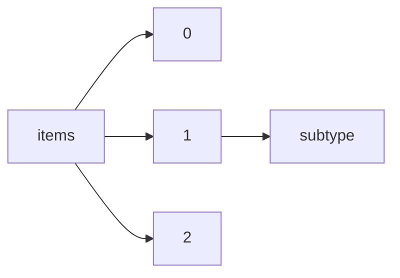

!!! warning "This document is not official Crossref documentation"
# Subtype
PATH = items/array/subtype(1)  
Occurs 1 185 986 times  
Unique values: 5  
{ .annotate }

1. A route to an element, for example:  
   The route "items/array/subtype" corresponds to navigating through the JSON indices as  
   ["items"][0]["subtype"]  

| **Row** | **Value** `String` | **Count** `Int64` |
|--------:|----------------------:|---------------------:|
| **1**   | preprint              | 876 278              |
| **2**   | other                 | 296 846              |
| **3**   | dissertation          | 12 671               |
| **4**   | letter                | 152                  |
| **5**   | working\_paper        | 39                   |

