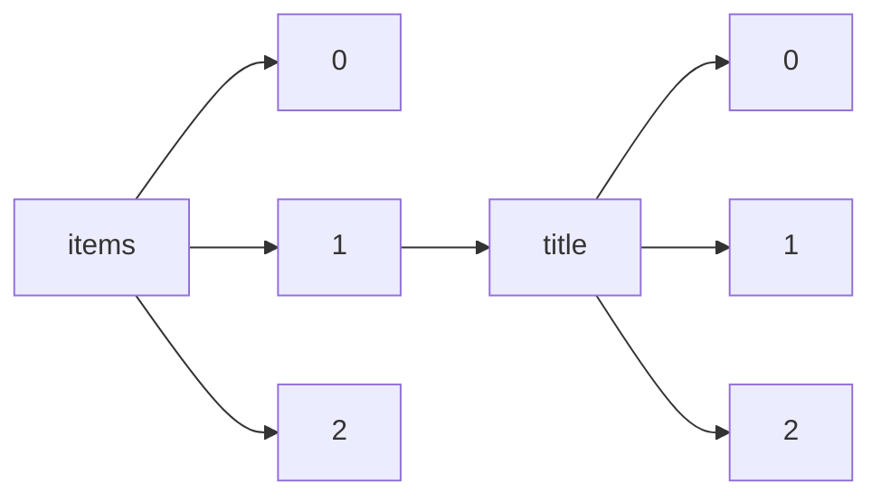

!!! warning "This document is not official Crossref documentation"
# Elements
PATH = items/array/title/array(1)  
Occurs 138 063 654 times  
Unique values: > 999  
{ .annotate }

1. A route to an element, for example:  
   The route "items/array/title/array" corresponds to navigating through the JSON indices as  
   ["items"][0]["title"][0]  

!!! note "Due to current limitations, only the first 1,000 unique values are counted."

| **Row** | **Value** `String`                                                                                | **Count** `Int64` |
|--------:|-----------------------------------------------------------------------------------------------------:|---------------------:|
| **1**   |                                                                                                      | 592 449              |
| **2**   | Introduction                                                                                         | 281 926              |
| **3**   | Editorial Board                                                                                      | 251 488              |
| **4**   | Index                                                                                                | 154 562              |
| **5**   | Frontmatter                                                                                          | 146 435              |
| **6**   | Front Matter                                                                                         | 130 486              |
| **7**   | Editorial                                                                                            | 114 307              |
| **8**   | Preface                                                                                              | 104 153              |
| **9**   | Table of Contents                                                                                    | 96 069               |
| **10**  | Contents                                                                                             | 85 661               |
| **11**  | Masthead                                                                                             | 78 058               |
| **12**  | Book Reviews                                                                                         | 74 977               |
| **13**  | Bibliography                                                                                         | 51 645               |
| **14**  | Notes                                                                                                | 51 341               |
| **15**  | Conclusion                                                                                           | 50 375               |
| **16**  | Issue Information                                                                                    | 47 176               |
| **17**  | Back Matter                                                                                          | 46 197               |
| **18**  | Erratum                                                                                              | 43 696               |
| **19**  | Acknowledgments                                                                                      | 40 669               |
| **20**  | REVIEWS                                                                                              | 36 968               |
| **21**  | Einleitung                                                                                           | 34 251               |
| **22**  | Inhalt                                                                                               | 32 180               |
| **23**  | Editorial board                                                                                      | 32 098               |
| **24**  | Contributors                                                                                         | 29 876               |
| **25**  | Reviews                                                                                              | 29 249               |
| **26**  | Books Received                                                                                       | 29 137               |
| **27**  | Foreword                                                                                             | 28 456               |
| **28**  | Copyright                                                                                            | 28 035               |
| **29**  | Book reviews                                                                                         | 27 524               |
| **30**  | Author index                                                                                         | 27 055               |
| **31**  | References                                                                                           | 25 310               |
| **32**  | Announcements                                                                                        | 24 571               |
| **33**  | Vorwort                                                                                              | 22 458               |
| **34**  | BOOK REVIEWS                                                                                         | 22 145               |
| **35**  | Author Index                                                                                         | 22 009               |
| **36**  | Announcement                                                                                         | 19 400               |
| **37**  | Titelei                                                                                              | 18 719               |
| **38**  | Book Review                                                                                          | 17 768               |
| **39**  | Backmatter                                                                                           | 17 519               |
| **40**  | Reply                                                                                                | 17 478               |
| **41**  | Taxonomic Abstract for the species.                                                                  | 17 463               |
| **42**  | INDEX                                                                                                | 17 284               |
| **43**  | Book review                                                                                          | 16 732               |
| **44**  | Short Notices                                                                                        | 16 375               |
| **45**  | Calendar                                                                                             | 15 381               |
| **46**  | Subject Index                                                                                        | 15 356               |
| **47**  | Table of contents                                                                                    | 15 017               |
| **48**  | Acknowledgements                                                                                     | 14 726               |
| **49**  | Preliminary Material                                                                                 | 14 272               |
| **50**  | INTRODUCTION                                                                                         | 13 881               |
| **51**  | Titelei/Inhaltsverzeichnis                                                                           | 13 693               |
| **52**  | Correspondence                                                                                       | 13 523               |
| **53**  | Inhaltsverzeichnis                                                                                   | 13 466               |
| **54**  | Discussion                                                                                           | 12 939               |
| **55**  | CONTENTS                                                                                             | 12 774               |
| **56**  | PREFACE                                                                                              | 12 447               |
| **57**  | Subject index                                                                                        | 12 114               |
| **58**  | Abstracts                                                                                            | 11 404               |
| **59**  | Reviews of Books                                                                                     | 11 313               |
| **60**  | Data\_Sheet\_1.docx                                                                                  | 11 240               |
| **61**  | Buchbesprechungen                                                                                    | 10 600               |
| **62**  | Bibliographie                                                                                        | 10 359               |
| **63**  | Correction                                                                                           | 9 862                |
| **64**  | Errata                                                                                               | 9 757                |
| **65**  | Literaturverzeichnis                                                                                 | 9 459                |
| **66**  | Front cover                                                                                          | 9 249                |
| **67**  | Dedication                                                                                           | 9 140                |
| **68**  | News                                                                                                 | 8 578                |
| **69**  | Letters to the Editor                                                                                | 8 354                |
| **70**  | ACKNOWLEDGMENTS                                                                                      | 8 254                |
| **71**  | NOTES                                                                                                | 8 053                |
| **72**  | Epilogue                                                                                             | 7 714                |
| **73**  | Miscellany                                                                                           | 7 656                |
| **74**  | Abbreviations                                                                                        | 7 586                |
| **75**  | Obituary                                                                                             | 7 379                |
| **76**  | Back cover                                                                                           | 7 256                |
| **77**  | REVIEWS OF BOOKS                                                                                     | 7 122                |
| **78**  | Abstract                                                                                             | 7 105                |
| **79**  | Corrigendum                                                                                          | 7 100                |
| **80**  | Literatur                                                                                            | 7 032                |
| **81**  | Notes and News                                                                                       | 7 005                |
| **82**  | Notices                                                                                              | 6 859                |
| **83**  | Letters                                                                                              | 6 823                |
| **84**  | Table\_1.docx                                                                                        | 6 797                |
| **85**  | Table\_1.DOCX                                                                                        | 6 640                |
| **86**  | Copyright Page                                                                                       | 6 548                |
| **87**  | Conclusions                                                                                          | 6 373                |
| **88**  | Books received                                                                                       | 6 206                |
| **89**  | FRONT MATTER                                                                                         | 6 152                |
| **90**  | Data\_Sheet\_1.PDF                                                                                   | 5 994                |
| **91**  | Notes on Contributors                                                                                | 5 975                |
| **92**  | Glossary                                                                                             | 5 950                |
| **93**  | BIBLIOGRAPHY                                                                                         | 5 945                |
| **94**  | EDITORIAL                                                                                            | 5 635                |
| **95**  | CONCENTRATES                                                                                         | 5 565                |
| **96**  | Advertisement                                                                                        | 5 506                |
| **97**  | Copyright page                                                                                       | 5 334                |
| **98**  | Cover                                                                                                | 5 067                |
| **99**  | Reports of Societies                                                                                 | 4 969                |
| **100** | BACK MATTER                                                                                          | 4 952                |
| **101** | Front matter                                                                                         | 4 930                |
| **102** | Volume Information                                                                                   | 4 913                |
| **103** | Multiple drugs                                                                                       | 4 907                |
| **104** | [Front cover]                                                                                        | 4 840                |
| **105** | List of Contributors                                                                                 | 4 808                |
| **106** | Commentary                                                                                           | 4 689                |
| **107** | Shorter Notices                                                                                      | 4 605                |
| **108** | BOOKS RECEIVED                                                                                       | 4 515                |
| **109** | SHORT NOTICES                                                                                        | 4 510                |
| **110** | Letter to the Editor                                                                                 | 4 274                |
| **111** | Books                                                                                                | 4 211                |
| **112** | Medical News                                                                                         | 4 132                |
| **113** | Editorial Comment                                                                                    | 4 049                |
| **114** | Medical News.                                                                                        | 3 995                |
| **115** | Review                                                                                               | 3 995                |
| **116** | Deaths                                                                                               | 3 983                |
| **117** | Sonstiges                                                                                            | 3 895                |
| **118** | Data\_Sheet\_1.pdf                                                                                   | 3 776                |
| **119** | News and Notes                                                                                       | 3 735                |
| **120** | SHORTER NOTICES                                                                                      | 3 716                |
| **121** | Reply on RC1                                                                                         | 3 712                |
| **122** | Einführung                                                                                           | 3 699                |
| **123** | List of Illustrations                                                                                | 3 683                |
| **124** | From the Editor                                                                                      | 3 636                |
| **125** | Contents list                                                                                        | 3 593                |
| **126** | INHALT                                                                                               | 3 568                |
| **127** | British Medical Journal                                                                              | 3 417                |
| **128** | Reply on RC2                                                                                         | 3 414                |
| **129** | Contents pages                                                                                       | 3 392                |
| **130** | Présentation                                                                                         | 3 342                |
| **131** | DataSheet\_1.docx                                                                                    | 3 340                |
| **132** | Societies and Academies                                                                              | 3 338                |
| **133** | Avant-propos                                                                                         | 3 326                |
| **134** | Anhang                                                                                               | 3 325                |
| **135** | THE LANCET.                                                                                          | 3 322                |
| **136** | Besprechungen                                                                                        | 3 288                |
| **137** | Book Notes                                                                                           | 3 272                |
| **138** | ERRATUM                                                                                              | 3 200                |
| **139** | Edited by                                                                                            | 3 124                |
| **140** | Births, Marriages, and Deaths.                                                                       | 3 117                |
| **141** | Reviews and Notices of Books.                                                                        | 3 100                |
| **142** | Title Page                                                                                           | 3 081                |
| **143** | Illustrations                                                                                        | 3 044                |
| **144** | Éditorial                                                                                            | 2 974                |
| **145** | Editorials                                                                                           | 2 952                |
| **146** | Referate                                                                                             | 2 940                |
| **147** | Taxonomic Abstract for the genera.                                                                   | 2 926                |
| **148** | Index to advertisers                                                                                 | 2 915                |
| **149** | Sachregister                                                                                         | 2 863                |
| **150** | New Books                                                                                            | 2 825                |
| **151** | Scientific Notes and News                                                                            | 2 823                |
| **152** | New Products                                                                                         | 2 806                |
| **153** | Appendix                                                                                             | 2 761                |
| **154** | News in brief ???                                                                                    | 2 752                |
| **155** | Notes and Queries                                                                                    | 2 705                |
| **156** | OBITUARY                                                                                             | 2 681                |
| **157** | BOOK REVIEW                                                                                          | 2 663                |
| **158** | Appointments                                                                                         | 2 661                |
| **159** | Register                                                                                             | 2 653                |
| **160** | Abkürzungsverzeichnis                                                                                | 2 647                |
| **161** | Zusammenfassung                                                                                      | 2 628                |
| **162** | News in brief                                                                                        | 2 622                |
| **163** | About the Author                                                                                     | 2 615                |
| **164** | Impressum                                                                                            | 2 589                |
| **165** | Comment                                                                                              | 2 569                |
| **166** | [Back cover]                                                                                         | 2 561                |
| **167** | Berichtigung                                                                                         | 2 540                |
| **168** | Inside front cover                                                                                   | 2 536                |
| **169** | Our Astronomical Column                                                                              | 2 528                |
| **170** | Patents                                                                                              | 2 518                |
| **171** | Forthcoming Events                                                                                   | 2 482                |
| **172** | Table\_1.XLSX                                                                                        | 2 481                |
| **173** | Issue Editorial Masthead                                                                             | 2 477                |
| **174** | DataSheet1.docx                                                                                      | 2 474                |
| **175** | Publications received                                                                                | 2 466                |
| **176** | Image\_1.TIF                                                                                         | 2 451                |
| **177** | University and Educational Intelligence                                                              | 2 447                |
| **178** | Matière préliminaire                                                                                 | 2 440                |
| **179** | FOREWORD                                                                                             | 2 432                |
| **180** | Authors of quotations wanted                                                                         | 2 413                |
| **181** | Issue Publication Information                                                                        | 2 391                |
| **182** | Recent Deaths                                                                                        | 2 377                |
| **183** | Personenregister                                                                                     | 2 371                |
| **184** | Massachusetts Medical Society                                                                        | 2 334                |
| **185** | Notes on contributors                                                                                | 2 329                |
| **186** | Diary                                                                                                | 2 314                |
| **187** | Editorial Board Page                                                                                 | 2 291                |
| **188** | Editorials and Medical Intelligence                                                                  | 2 285                |
| **189** | Publications Received                                                                                | 2 281                |
| **190** | LETTERS                                                                                              | 2 245                |
| **191** | Current Literature                                                                                   | 2 234                |
| **192** | News and Comment                                                                                     | 2 229                |
| **193** | Diary for the Month                                                                                  | 2 226                |
| **194** | Table\_1.xlsx                                                                                        | 2 199                |
| **195** | Obituary.                                                                                            | 2 182                |
| **196** | Editorial Notices                                                                                    | 2 176                |
| **197** | Introduction:                                                                                        | 2 175                |
| **198** | [Copyright notice]                                                                                   | 2 173                |
| **199** | Meetings                                                                                             | 2 168                |
| **200** | Medical Notes in Parliament                                                                          | 2 163                |
| **201** | [Advertisement]                                                                                      | 2 154                |
| **202** | REVIEWS OF MUSIC                                                                                     | 2 141                |
| **203** | Blank page                                                                                           | 2 118                |
| **204** | Queries and Minor Notes                                                                              | 2 108                |
| **205** | Current Medical Literature                                                                           | 2 105                |
| **206** | Medical Appointments: Important Notice                                                               | 2 102                |
| **207** | Marriages                                                                                            | 2 084                |
| **208** | Summary                                                                                              | 2 079                |
| **209** | News and notes                                                                                       | 2 052                |
| **210** | ERRATA                                                                                               | 2 043                |
| **211** | Afterword                                                                                            | 2 020                |
| **212** | Breaker page                                                                                         | 2 019                |
| **213** | DataSheet\_1.pdf                                                                                     | 2 003                |
| **214** | Letters to the editor                                                                                | 2 001                |
| **215** | [Book Reviews]                                                                                       | 1 983                |
| **216** | Préface                                                                                              | 1 979                |
| **217** | In Brief                                                                                             | 1 975                |
| **218** | Obituaries                                                                                           | 1 973                |
| **219** | Medical Diary for the ensuing Week.                                                                  | 1 961                |
| **220** | Notices to correspondents                                                                            | 1 958                |
| **221** | Current Comment                                                                                      | 1 933                |
| **222** | This Week in Science                                                                                 | 1 894                |
| **223** | NEW BOOKS                                                                                            | 1 881                |
| **224** | Index of Inventions                                                                                  | 1 878                |
| **225** | Notizen                                                                                              | 1 873                |
| **226** | Danksagung                                                                                           | 1 864                |
| **227** | REFERENCES                                                                                           | 1 860                |
| **228** | Association News                                                                                     | 1 859                |
| **229** | Buchbesprechung                                                                                      | 1 854                |
| **230** | Items                                                                                                | 1 853                |
| **231** | In This Issue                                                                                        | 1 821                |
| **232** | News and Notices                                                                                     | 1 786                |
| **233** | About the Authors                                                                                    | 1 777                |
| **234** | Letter to the editor                                                                                 | 1 773                |
| **235** | In England Now                                                                                       | 1 766                |
| **236** | Abstracts from Current Literature                                                                    | 1 765                |
| **237** | Notes, Short Comments, and Answers to Correspondents.                                                | 1 762                |
| **238** | THE SERVICES.                                                                                        | 1 750                |
| **239** | Remerciements                                                                                        | 1 749                |
| **240** | Appointments.                                                                                        | 1 749                |
| **241** | News in brief ...                                                                                    | 1 734                |
| **242** | Image\_1.tif                                                                                         | 1 731                |
| **243** | NEWS AND NOTES                                                                                       | 1 730                |
| **244** | Vacancies.                                                                                           | 1 718                |
| **245** | Notes on Books                                                                                       | 1 712                |
| **246** | Business and Personal                                                                                | 1 711                |
| **247** | CORRESPONDENCE                                                                                       | 1 695                |
| **248** | Forthcoming papers                                                                                   | 1 692                |
| **249** | PARIS.                                                                                               | 1 683                |
| **250** | LETTERS TO THE EDITOR                                                                                | 1 657                |
| **251** | Tagesgeschichte                                                                                      | 1 654                |
| **252** | Calendar of Events                                                                                   | 1 651                |
| **253** | Apresentação                                                                                         | 1 644                |
| **254** | ads                                                                                                  | 1 633                |
| **255** | Inhaltsübersicht                                                                                     | 1 628                |
| **256** | Advertisement/Classifieds                                                                            | 1 628                |
| **257** | Calendar of events                                                                                   | 1 624                |
| **258** | ABSTRACTS                                                                                            | 1 618                |
| **259** | Society Proceedings                                                                                  | 1 618                |
| **260** | VITAL STATISTICS.                                                                                    | 1 611                |
| **261** | [NO TITLE AVAILABLE]                                                                                 | 1 610                |
| **262** | List of Abbreviations                                                                                | 1 606                |
| **263** | Book Notices                                                                                         | 1 595                |
| **264** | In Science Fields                                                                                    | 1 571                |
| **265** | Invited commentary                                                                                   | 1 571                |
| **266** | CONCLUSION                                                                                           | 1 568                |
| **267** | News Notes                                                                                           | 1 568                |
| **268** | Contributors to this issue                                                                           | 1 562                |
| **269** | Scotland                                                                                             | 1 558                |
| **270** | Autorinnen und Autoren                                                                               | 1 555                |
| **271** | List of Figures                                                                                      | 1 543                |
| **272** | Questions and Answers                                                                                | 1 527                |
| **273** | IRELAND.                                                                                             | 1 519                |
| **274** | Appointments Vacant                                                                                  | 1 516                |
| **275** | CONTRIBUTORS                                                                                         | 1 515                |
| **276** | Letters, Notes, and Answers                                                                          | 1 505                |
| **277** | Personal- und Hochschulnachrichten                                                                   | 1 491                |
| **278** | Medicolegal                                                                                          | 1 473                |
| **279** | Recently Patented Inventions                                                                         | 1 467                |
| **280** | Diary of the Week                                                                                    | 1 456                |
| **281** | Special Correspondence                                                                               | 1 429                |
| **282** | AUTHOR INDEX                                                                                         | 1 420                |
| **283** | University and Educational News                                                                      | 1 419                |
| **284** | Partial Page Advertisements                                                                          | 1 418                |
| **285** | Abstracts of Current Literature                                                                      | 1 410                |
| **286** | INHALTSVERZEICHNIS                                                                                   | 1 409                |
| **287** | NOTICES OF RECENT PUBLICATIONS                                                                       | 1 408                |
| **288** | Abkürzungen                                                                                          | 1 401                |
| **289** | Front Cover                                                                                          | 1 399                |
| **290** | Presentación                                                                                         | 1 395                |
| **291** | Rundschau                                                                                            | 1 395                |
| **292** | Works Cited                                                                                          | 1 391                |
| **293** | INDEX TO ADVERTISERS                                                                                 | 1 387                |
| **294** | News Items                                                                                           | 1 386                |
| **295** | Medical Appointments                                                                                 | 1 375                |
| **296** | Mitteilungen                                                                                         | 1 366                |
| **297** | Diary of Societies                                                                                   | 1 360                |
| **298** | Books and Pamphlets Received                                                                         | 1 355                |
| **299** | Rechtsprechung                                                                                       | 1 353                |
| **300** | Editor's Introduction                                                                                | 1 348                |
| **301** | SCIENTIFIC                                                                                           | 1 348                |
| **302** | [Front cover and table of contents]                                                                  | 1 345                |
| **303** | Inside Front Cover                                                                                   | 1 339                |
| **304** | DISCUSSION                                                                                           | 1 327                |
| **305** | Stichwortverzeichnis                                                                                 | 1 321                |
| **306** | Letters, Notes, and Answers to Correspondents                                                        | 1 315                |
| **307** | TABLE OF CONTENTS                                                                                    | 1 313                |
| **308** | List of contributors                                                                                 | 1 303                |
| **309** | Ireland                                                                                              | 1 300                |
| **310** | VII.—NEW BOOKS                                                                                       | 1 293                |
| **311** | England and Wales                                                                                    | 1 290                |
| **312** | Antineoplastics                                                                                      | 1 283                |
| **313** | Berichtigungen                                                                                       | 1 278                |
| **314** | NOTES ON BOOKS                                                                                       | 1 277                |
| **315** | ProteomeXchange dataset                                                                              | 1 267                |
| **316** | LONDON                                                                                               | 1 259                |
| **317** | Information for authors                                                                              | 1 254                |
| **318** | NOTICES                                                                                              | 1 250                |
| **319** | Note by the Secretariat                                                                              | 1 249                |
| **320** | Editor's Note                                                                                        | 1 244                |
| **321** | webmedcentral                                                                                        | 1 242                |
| **322** | SUBJECT INDEX                                                                                        | 1 242                |
| **323** | Correspondenz                                                                                        | 1 239                |
| **324** | New books                                                                                            | 1 239                |
| **325** | Call for Papers                                                                                      | 1 234                |
| **326** | 1. Einleitung                                                                                        | 1 226                |
| **327** | ANNOUNCEMENTS                                                                                        | 1 218                |
| **328** | Public Health and Poor-Law Medical Services                                                          | 1 216                |
| **329** | 1. Introduction                                                                                      | 1 215                |
| **330** | Editorial: Software survey section                                                                   | 1 212                |
| **331** | Corrigenda                                                                                           | 1 208                |
| **332** | BOOKS                                                                                                | 1 192                |
| **333** | Breaker pages                                                                                        | 1 189                |
| **334** | To the Editor                                                                                        | 1 186                |
| **335** | ANNOTATIONS                                                                                          | 1 165                |
| **336** | Parliamentary Intelligence.                                                                          | 1 163                |
| **337** | Selected Bibliography                                                                                | 1 163                |
| **338** | [Breaker page]                                                                                       | 1 155                |
| **339** | Memorabilia                                                                                          | 1 155                |
| **340** | Image\_2.TIF                                                                                         | 1 148                |
| **341** | SCOTLAND.                                                                                            | 1 141                |
| **342** | CORRECTION                                                                                           | 1 140                |
| **343** | EMPLOYMENT INFORMATION                                                                               | 1 139                |
| **344** | Personal View                                                                                        | 1 131                |
| **345** | Back matter                                                                                          | 1 130                |
| **346** | List of Tables                                                                                       | 1 122                |
| **347** | Index to Advertisers                                                                                 | 1 120                |
| **348** | DEATHS                                                                                               | 1 120                |
| **349** | blank page                                                                                           | 1 118                |
| **350** | Rezensionen                                                                                          | 1 105                |
| **351** | Bücherschau                                                                                          | 1 092                |
| **352** | Classified Advertising                                                                               | 1 084                |
| **353** | Graphical abstract TOC                                                                               | 1 084                |
| **354** | People                                                                                               | 1 076                |
| **355** | Reviews and Notices                                                                                  | 1 075                |
| **356** | Medico-Legal                                                                                         | 1 070                |
| **357** | Record of Mortality                                                                                  | 1 068                |
| **358** | Reports and other Publications                                                                       | 1 061                |
| **359** | Table des matières                                                                                   | 1 060                |
| **360** | Spectrum                                                                                             | 1 056                |
| **361** | حقیقت انقلاب ثور                                                                                     | 1 053                |
| **362** | Nominations and Elections                                                                            | 1 053                |
| **363** | MEDICAL NEWS                                                                                         | 1 050                |
| **364** | EMPLOYMENT                                                                                           | 1 049                |
| **365** | Invited Commentary                                                                                   | 1 046                |
| **366** | Parliament                                                                                           | 1 045                |
| **367** | Overview                                                                                             | 1 042                |
| **368** | ACKNOWLEDGEMENTS                                                                                     | 1 033                |
| **369** | Research Items                                                                                       | 1 023                |
| **370** | The Week                                                                                             | 1 021                |
| **371** | Conference diary                                                                                     | 1 014                |
| **372** | Guest editorial                                                                                      | 1 012                |
| **373** | Response                                                                                             | 1 008                |
| **374** | Sachverzeichnis                                                                                      | 1 007                |
| **375** | Neue Bücher                                                                                          | 1 005                |
| **376** | MEDICAL SOCIETY OF LONDON.                                                                           | 1 003                |
| **377** | Recent Publications                                                                                  | 999                  |
| **378** | Title page                                                                                           | 996                  |
| **379** | Births, Marriages, and Deaths                                                                        | 987                  |
| **380** | Letter                                                                                               | 986                  |
| **381** | Plate section                                                                                        | 983                  |
| **382** | Notes and news                                                                                       | 981                  |
| **383** | VORWORT                                                                                              | 981                  |
| **384** | Table\_2.XLSX                                                                                        | 980                  |
| **385** | Reviews of books                                                                                     | 979                  |
| **386** | About This Journal                                                                                   | 978                  |
| **387** | Verein deutscher Chemiker                                                                            | 976                  |
| **388** | Annexes                                                                                              | 975                  |
| **389** | Scientific Serials                                                                                   | 973                  |
| **390** | Editorial Advisory Board                                                                             | 972                  |
| **391** | Varia                                                                                                | 972                  |
| **392** | Corrections                                                                                          | 962                  |
| **393** | Society Notices                                                                                      | 952                  |
| **394** | Prologue                                                                                             | 950                  |
| **395** | Transparent reporting form                                                                           | 947                  |
| **396** | Abbildungsverzeichnis                                                                                | 935                  |
| **397** | Introducción                                                                                         | 933                  |
| **398** | In Memoriam                                                                                          | 931                  |
| **399** | Information for Authors                                                                              | 927                  |
| **400** | Classified                                                                                           | 926                  |
| **401** | PARIS                                                                                                | 925                  |
| **402** | The Services                                                                                         | 925                  |
| **403** | Anmerkungen                                                                                          | 917                  |
| **404** | Forthcoming events                                                                                   | 917                  |
| **405** | 目次                                                                                                 | 915                  |
| **406** | Personalia                                                                                           | 914                  |
| **407** | Image\_1.JPEG                                                                                        | 905                  |
| **408** | Guest Editorial                                                                                      | 903                  |
| **409** | In Reply                                                                                             | 895                  |
| **410** | Instructions for Authors                                                                             | 894                  |
| **411** | PEOPLE                                                                                               | 888                  |
| **412** | Graphical abstracts                                                                                  | 880                  |
| **413** | Authors                                                                                              | 878                  |
| **414** | eLife digest                                                                                         | 876                  |
| **415** | [Obituaries]                                                                                         | 876                  |
| **416** | Author's reply                                                                                       | 873                  |
| **417** | New Books and Publications                                                                           | 871                  |
| **418** | Verhandlungen Ärztlicher Gesellschaften                                                              | 867                  |
| **419** | Zeitschriftenschau                                                                                   | 865                  |
| **420** | United States                                                                                        | 861                  |
| **421** | Notices to Correspondents                                                                            | 860                  |
| **422** | Tagungskalender                                                                                      | 860                  |
| **423** | ANNOUNCEMENT                                                                                         | 860                  |
| **424** | Diskussion                                                                                           | 857                  |
| **425** | Nachrichten                                                                                          | 847                  |
| **426** | NOMINATIONS AND ELECTIONS                                                                            | 846                  |
| **427** | ORGANIZATION SECTION                                                                                 | 844                  |
| **428** | New products                                                                                         | 840                  |
| **429** | Annotations.                                                                                         | 839                  |
| **430** | Papers to appear in forthcoming issues                                                               | 838                  |
| **431** | EDITORIAL COMMENT                                                                                    | 838                  |
| **432** | APPOINTMENTS                                                                                         | 838                  |
| **433** | Instructions to Authors                                                                              | 836                  |
| **434** | Current Publications Received                                                                        | 835                  |
| **435** | Preparations and Appliances                                                                          | 834                  |
| **436** | Editorial Comments                                                                                   | 823                  |
| **437** | Editorial Notes                                                                                      | 822                  |
| **438** | Issue Information - TOC                                                                              | 821                  |
| **439** | Table\_2.docx                                                                                        | 815                  |
| **440** | Blank Page                                                                                           | 814                  |
| **441** | Nova et Vetera                                                                                       | 814                  |
| **442** | INTRODUCCIÓN                                                                                         | 813                  |
| **443** | Advertisements                                                                                       | 795                  |
| **444** | Educational News and Editorial Comment                                                               | 794                  |
| **445** | ABBREVIATIONS                                                                                        | 791                  |
| **446** | Miscellaneous                                                                                        | 786                  |
| **447** | 抄録                                                                                                 | 784                  |
| **448** | BOOK NOTICES                                                                                         | 782                  |
| **449** | REPORTS OF SOCIETIES                                                                                 | 780                  |
| **450** | Comptes rendus                                                                                       | 776                  |
| **451** | INDUSTRIAL LITERATURE                                                                                | 775                  |
| **452** | News in brief …                                                                                      | 773                  |
| **453** | Preliminary material                                                                                 | 769                  |
| **454** | Official Publications Received                                                                       | 765                  |
| **455** | Literature                                                                                           | 763                  |
| **456** | The Authors                                                                                          | 762                  |
| **457** | Table\_2.xlsx                                                                                        | 761                  |
| **458** | Medico-Legal and Medico-Ethical                                                                      | 760                  |
| **459** | Umschau                                                                                              | 754                  |
| **460** | Conclusion:                                                                                          | 753                  |
| **461** | Reports and Analyses and Descriptions of New Inventions in Medicine, Surgery, Dietetics, and the All | 744                  |
| **462** | Call for papers                                                                                      | 739                  |
| **463** | Massachusetts Department of Public Health                                                            | 737                  |
| **464** | Title Page iii                                                                                       | 736                  |
| **465** | Information for Readers                                                                              | 736                  |
| **466** | UQ eSpace                                                                                            | 734                  |
| **467** | Dank                                                                                                 | 732                  |
| **468** | Government Services                                                                                  | 730                  |
| **469** | VI.—NEW BOOKS                                                                                        | 727                  |
| **470** | A reply                                                                                              | 727                  |
| **471** | Notes of Recent Exposition                                                                           | 724                  |
| **472** | Authors' reply                                                                                       | 723                  |
| **473** | Medical Appointments Vacant, etc.                                                                    | 722                  |
| **474** | Medicine and Books                                                                                   | 721                  |
| **475** | Guidelines for Authors                                                                               | 720                  |
| **476** | Title Page i                                                                                         | 719                  |
| **477** | BERLIN                                                                                               | 715                  |
| **478** | Public Health                                                                                        | 715                  |
| **479** | Image\_2.tif                                                                                         | 713                  |
| **480** | DataSheet1.PDF                                                                                       | 712                  |
| **481** | EDITORIAL NOTICES.                                                                                   | 712                  |
| **482** | VIII.—NEW BOOKS                                                                                      | 711                  |
| **483** | Publication/Subscription/Member Data                                                                 | 708                  |
| **484** | Meteorological Record                                                                                | 704                  |
| **485** | Editorial comment                                                                                    | 703                  |
| **486** | NEWS FOCUS                                                                                           | 699                  |
| **487** | APPENDIX                                                                                             | 698                  |
| **488** | Personalien                                                                                          | 697                  |
| **489** | [no title]                                                                                           | 697                  |
| **490** |                                                                                                      | 696                  |
| **491** | Autorenverzeichnis                                                                                   | 696                  |
| **492** | New Publications                                                                                     | 695                  |
| **493** | IN BRIEF                                                                                             | 684                  |
| **494** | Medico-Parliamentary                                                                                 | 682                  |
| **495** | Events                                                                                               | 682                  |
| **496** | Biographical Essay                                                                                   | 682                  |
| **497** | Council on Pharmacy and Chemistry                                                                    | 679                  |
| **498** | Abstract Department                                                                                  | 678                  |
| **499** | ACKU                                                                                                 | 678                  |
| **500** | ASSOCIATIONS                                                                                         | 664                  |
| **501** | Tables of Contents                                                                                   | 664                  |
| **502** | Communications                                                                                       | 662                  |
| **503** | ACS NEWS                                                                                             | 661                  |
| **504** | International Relations and Politics                                                                 | 659                  |
| **505** | BUCHBESPRECHUNGEN                                                                                    | 654                  |
| **506** | The Propaganda for Reform                                                                            | 652                  |
| **507** | Publisher's note                                                                                     | 649                  |
| **508** | [Illustrations]                                                                                      | 639                  |
| **509** | Appendices                                                                                           | 639                  |
| **510** | Forthcoming meetings                                                                                 | 639                  |
| **511** | Bücherbesprechungen                                                                                  | 638                  |
| **512** | Medical Notes                                                                                        | 636                  |
| **513** | Book notices                                                                                         | 635                  |
| **514** | ad                                                                                                   | 635                  |
| **515** | Medical Annotations.                                                                                 | 633                  |
| **516** | Front-matter                                                                                         | 633                  |
| **517** | Any Questions?                                                                                       | 633                  |
| **518** | About the Book                                                                                       | 632                  |
| **519** | News Briefs                                                                                          | 631                  |
| **520** | Inside back cover                                                                                    | 630                  |
| **521** | i-iv                                                                                                 | 630                  |
| **522** | Necrology                                                                                            | 626                  |
| **523** | Medical Examinations and Licensure                                                                   | 625                  |
| **524** | Pages de début                                                                                       | 624                  |
| **525** | LIVERPOOL.                                                                                           | 614                  |
| **526** | Bureau of Legal Medicine and Legislation                                                             | 614                  |
| **527** | Naval and Military Medical Services                                                                  | 613                  |
| **528** | Sociology                                                                                            | 613                  |
| **529** | GDCh-Stellenliste                                                                                    | 612                  |
| **530** | Vital Statistics                                                                                     | 611                  |
| **531** | MANAGER'S NOTICES.                                                                                   | 608                  |
| **532** | General discussion                                                                                   | 608                  |
| **533** | ROYAL SOCIETY OF MEDICINE.                                                                           | 607                  |
| **534** | Clinical Memoranda                                                                                   | 606                  |
| **535** | Front cover and table of contents                                                                    | 606                  |
| **536** | Tagungen                                                                                             | 603                  |
| **537** | Livres reçus                                                                                         | 594                  |
| **538** | Pages de fin                                                                                         | 591                  |
| **539** | Reviewers                                                                                            | 589                  |
| **540** | Editor's note                                                                                        | 589                  |
| **541** | LIBRARY TABLE.                                                                                       | 588                  |
| **542** | I                                                                                                    | 587                  |
| **543** | GDCh-Bewerberliste                                                                                   | 586                  |
| **544** | TO CORRESPONDENTS.                                                                                   | 586                  |
| **545** | Index of Authors                                                                                     | 583                  |
| **546** | The British Medical Journal                                                                          | 583                  |
| **547** | Contributions and Comments                                                                           | 582                  |
| **548** | Reports and Proceedings                                                                              | 581                  |
| **549** | Notes de lecture                                                                                     | 576                  |
| **550** | MANCHESTER.                                                                                          | 576                  |
| **551** | BIBLIOGRAFÍA                                                                                         | 574                  |
| **552** | Image\_1.pdf                                                                                         | 573                  |
| **553** | Authors wanted                                                                                       | 572                  |
| **554** | V                                                                                                    | 571                  |
| **555** | Zeitschriften                                                                                        | 570                  |
| **556** | Select Bibliography                                                                                  | 569                  |
| **557** | Contents Page                                                                                        | 569                  |
| **558** | Innentitel                                                                                           | 568                  |
| **559** | Reported Mortality                                                                                   | 567                  |
| **560** | AN EPITOME OF CURRENT MEDICAL LITERATURE                                                             | 567                  |
| **561** | Shakspeariana                                                                                        | 566                  |
| **562** | [Untitled]                                                                                           | 564                  |
| **563** | Editors                                                                                              | 560                  |
| **564** | رسمی جریده افغانستان / افغانستان. وزارت عدليه                                                        | 555                  |
| **565** | Entre Nous                                                                                           | 555                  |
| **566** | Membership                                                                                           | 554                  |
| **567** | Breaker Page                                                                                         | 554                  |
| **568** | BERLIN.                                                                                              | 550                  |
| **569** | INTRODUCTION:                                                                                        | 550                  |
| **570** | MEDICINE AND THE LAW.                                                                                | 549                  |
| **571** | Therapeutics                                                                                         | 547                  |
| **572** | GUY'S HOSPITAL.                                                                                      | 545                  |
| **573** | In the Study                                                                                         | 543                  |
| **574** | Historical News                                                                                      | 542                  |
| **575** | Posters                                                                                              | 542                  |
| **576** | Software survey section                                                                              | 540                  |
| **577** | Statement of Treaties and International Agreements                                                   | 538                  |
| **578** | Newscripts                                                                                           | 538                  |
| **579** | Editorial Board EOV                                                                                  | 538                  |
| **580** | Scientific Journals and Articles                                                                     | 536                  |
| **581** | Taxonomic Abstract for the subspecies.                                                               | 534                  |
| **582** | This Week's Issue                                                                                    | 531                  |
| **583** | N/A                                                                                                  | 529                  |
| **584** | REVIEW                                                                                               | 528                  |
| **585** | Wirtschaftlicher Teil u. Vereinsnachrichten                                                          | 527                  |
| **586** | Questions and Comments                                                                               | 525                  |
| **587** | Epitome of Current Medical Literature                                                                | 522                  |
| **588** | REPLY                                                                                                | 522                  |
| **589** | Reports                                                                                              | 521                  |
| **590** | About the authors                                                                                    | 520                  |
| **591** | PATHOLOGICAL SOCIETY OF LONDON.                                                                      | 519                  |
| **592** | Classifieds                                                                                          | 518                  |
| **593** | Notes and Comments                                                                                   | 518                  |
| **594** | Classified Advertisements                                                                            | 516                  |
| **595** | Book                                                                                                 | 515                  |
| **596** | To Inventors                                                                                         | 513                  |
| **597** | Editors' Choice                                                                                      | 512                  |
| **598** | Organic chemistry                                                                                    | 511                  |
| **599** | Papers to Appear in Forthcoming Issues                                                               | 510                  |
| **600** | Patent report                                                                                        | 510                  |
| **601** | General and physical chemistry                                                                       | 509                  |
| **602** | Association Intelligence                                                                             | 509                  |
| **603** | Table\_2.DOCX                                                                                        | 509                  |
| **604** | Table\_1.pdf                                                                                         | 508                  |
| **605** | Image\_3.TIF                                                                                         | 504                  |
| **606** | International Comments                                                                               | 504                  |
| **607** | Titles of related papers in other sections                                                           | 501                  |
| **608** | Inorganic chemistry                                                                                  | 501                  |
| **609** | CALENDAR OF EVENTS                                                                                   | 499                  |
| **610** | ST. THOMAS'S HOSPITAL.                                                                               | 499                  |
| **611** | The Week in Review                                                                                   | 499                  |
| **612** | Africa, Asia, and Latin America                                                                      | 498                  |
| **613** | Epidemiology Section                                                                                 | 498                  |
| **614** | [Blank page]                                                                                         | 497                  |
| **615** | TC TO JOHN A. CARLYLE                                                                                | 497                  |
| **616** | Book Reviews and Notices                                                                             | 496                  |
| **617** | Forthcoming issues                                                                                   | 492                  |
| **618** | An Epitome of Current Medical Literature                                                             | 491                  |
| **619** | Neuerscheinungen                                                                                     | 489                  |
| **620** | JAMA 75 YEARS AGO                                                                                    | 488                  |
| **621** | British Medical Association                                                                          | 488                  |
| **622** | Analytical chemistry                                                                                 | 486                  |
| **623** | Chemistry of vegetable physiology and agriculture                                                    | 485                  |
| **624** | Physiological chemistry                                                                              | 482                  |
| **625** | Problems and Solutions                                                                               | 479                  |
| **626** | NOTES ON CONTRIBUTORS                                                                                | 479                  |
| **627** | REZENSIONEN                                                                                          | 478                  |
| **628** | Zeitschriftenreferate                                                                                | 478                  |
| **629** | Executive summary                                                                                    | 477                  |
| **630** | Editorial advisory board                                                                             | 476                  |
| **631** | Medical Education, Registration and Hospital Service                                                 | 475                  |
| **632** | Minerva                                                                                              | 472                  |
| **633** | Reply by Authors                                                                                     | 470                  |
| **634** | SUPPLEMENT                                                                                           | 470                  |
| **635** | Our Book Shelf                                                                                       | 468                  |
| **636** | Publications                                                                                         | 468                  |
| **637** | Taxonomic Abstract for the families.                                                                 | 467                  |
| **638** | Reports of Medical Societies                                                                         | 466                  |
| **639** | Mineralogical chemistry                                                                              | 466                  |
| **640** | Chronology                                                                                           | 463                  |
| **641** | Gesellschaft Deutscher Chemiker                                                                      | 462                  |
| **642** | [No Title]                                                                                           | 461                  |
| **643** | Canada                                                                                               | 459                  |
| **644** | Índice                                                                                               | 459                  |
| **645** | Contributors to this Issue                                                                           | 458                  |
| **646** | College News and Departmental Notes                                                                  | 453                  |
| **647** | PROBLEM DEPARTMENT                                                                                   | 450                  |
| **648** | Vorbemerkung                                                                                         | 449                  |
| **649** | Biomedicine                                                                                          | 449                  |
| **650** | Hospital and Dispensary Management                                                                   | 448                  |
| **651** | Other Books Received                                                                                 | 447                  |
| **652** | In brief                                                                                             | 445                  |
| **653** | Medical Education and State Boards of Registration                                                   | 445                  |
| **654** | Forthcoming Issues                                                                                   | 443                  |
| **655** | THE POST‐GRADUATE COMMITTEE IN MEDICINE IN THE UNIVERSITY OF SYDNEY                                  | 442                  |
| **656** | Mixtura Mirabilis                                                                                    | 441                  |
| **657** | New Members                                                                                          | 438                  |
| **658** | Covers                                                                                               | 437                  |
| **659** | Synthesis                                                                                            | 437                  |
| **660** | Table\_3.XLSX                                                                                        | 436                  |
| **661** | SCIENCE NEWS                                                                                         | 435                  |
| **662** | Contributor contact details                                                                          | 435                  |
| **663** | Section Meetings                                                                                     | 435                  |
| **664** | REVIEWS AND NOTICES OF BOOKS                                                                         | 434                  |
| **665** | Recent American and Foreign Patents                                                                  | 431                  |
| **666** | BIRMINGHAM.                                                                                          | 431                  |
| **667** | The Cover                                                                                            | 430                  |
| **668** | Web alert                                                                                            | 429                  |
| **669** | ANNA                                                                                                 | 428                  |
| **670** | Patents!                                                                                             | 427                  |
| **671** | NEW SOUTH WALES                                                                                      | 425                  |
| **672** | Coming Events                                                                                        | 424                  |
| **673** | From the editor                                                                                      | 422                  |
| **674** | آينه افغان ايد : نشريه داخلي سه ماهه مؤسسه افغان ايد = Afghanaid mirror                              | 420                  |
| **675** | Problems                                                                                             | 419                  |
| **676** | Notices of Books                                                                                     | 418                  |
| **677** | Heraldic                                                                                             | 418                  |
| **678** | New publications                                                                                     | 416                  |
| **679** | Volume contents                                                                                      | 416                  |
| **680** | حقیقت انقلاب ثور : ارگان کمیته مرکزی حزب دموکراتیک خلق افغانستان.                                    | 413                  |
| **681** | Vacancies                                                                                            | 413                  |
| **682** | The first scientific American: Benjamin Franklin and the pursuit of genius                           | 412                  |
| **683** | Geographical Notes                                                                                   | 412                  |
| **684** | News-scripts                                                                                         | 411                  |
| **685** | Exemplar Abstract for Escherichia coli (Migula 1895) Castellani and Chalmers 1919 (Approved Lists 19 | 408                  |
| **686** | NEWSCRIPTS                                                                                           | 408                  |
| **687** | Contents and Preliminary Pages                                                                       | 408                  |
| **688** | LETTERS AND ANSWERS                                                                                  | 407                  |
| **689** | NOTES FROM INDIA.                                                                                    | 407                  |
| **690** | Index of Subjects                                                                                    | 407                  |
| **691** | Comments                                                                                             | 407                  |
| **692** | BIBLIOGRAPHIE                                                                                        | 402                  |
| **693** | To Correspondents                                                                                    | 401                  |
| **694** | TC TO MARGARET A. CARLYLE                                                                            | 400                  |
| **695** | Tables                                                                                               | 398                  |
| **696** | Societies' Proceedings                                                                               | 396                  |
| **697** | News from the Field                                                                                  | 394                  |
| **698** | GOVERNMENT SERVICES                                                                                  | 393                  |
| **699** | The Services.                                                                                        | 393                  |
| **700** | In this issue                                                                                        | 393                  |
| **701** | C&amp;EN CHARTS                                                                                      | 389                  |
| **702** | Forthcoming numbers                                                                                  | 389                  |
| **703** | Educational Intelligence                                                                             | 389                  |
| **704** | MISCELLANY.                                                                                          | 388                  |
| **705** | Round the World                                                                                      | 387                  |
| **706** | QUEENSLAND                                                                                           | 386                  |
| **707** | The Library                                                                                          | 385                  |
| **708** | Título en español.                                                                                   | 385                  |
| **709** | Versammlungsberichte                                                                                 | 383                  |
| **710** | Instructions to authors                                                                              | 382                  |
| **711** | Sezione Politico-Storica                                                                             | 382                  |
| **712** | Personalnachrichten                                                                                  | 382                  |
| **713** | NEWS                                                                                                 | 382                  |
| **714** | Directory                                                                                            | 381                  |
| **715** | 50 and 100 Years Ago                                                                                 | 381                  |
| **716** | Medical Diary of the Week.                                                                           | 379                  |
| **717** | BESPRECHUNGEN                                                                                        | 378                  |
| **718** | Medical Diary                                                                                        | 378                  |
| **719** | Inorganic analysis                                                                                   | 377                  |
| **720** | Forum                                                                                                | 377                  |
| **721** | Preliminary Materials                                                                                | 377                  |
| **722** | QUERIES                                                                                              | 375                  |
| **723** | ROYAL ACADEMY OF MEDICINE IN IRELAND.                                                                | 375                  |
| **724** | Aus Industrie und Technik                                                                            | 374                  |
| **725** | Recent Foreign Theology                                                                              | 374                  |
| **726** | University and Educational Notes                                                                     | 374                  |
| **727** | Organic analysis                                                                                     | 373                  |
| **728** | Personalnotizen                                                                                      | 373                  |
| **729** | Colour and other factors                                                                             | 370                  |
| **730** | From Field and Study                                                                                 | 370                  |
| **731** | Miscellaneous Inventions                                                                             | 370                  |
| **732** | ANSWERS                                                                                              | 369                  |
| **733** | Communications Received                                                                              | 367                  |
| **734** | Principles of interior renovation                                                                    | 367                  |
| **735** | Arts and decoration                                                                                  | 366                  |
| **736** | The legacy and appearance of hospital buildings                                                      | 366                  |
| **737** | Professional appointments                                                                            | 365                  |
| **738** | Technology                                                                                           | 364                  |
| **739** | 表紙                                                                                                 | 364                  |
| **740** | In brief ???                                                                                         | 363                  |
| **741** | New Books, Etc.                                                                                      | 363                  |
| **742** | OBITUARY NOTICES                                                                                     | 362                  |
| **743** | The human factor                                                                                     | 361                  |
| **744** | MEDICINE AND THE LAW                                                                                 | 361                  |
| **745** | Personal                                                                                             | 360                  |
| **746** | News in brief???                                                                                     | 360                  |
| **747** | To Correspondents.                                                                                   | 359                  |
| **748** | SECRETARY'S OFFICE                                                                                   | 358                  |
| **749** | Author wanted                                                                                        | 358                  |
| **750** | Landscape, gardens and the space between the buildings                                               | 358                  |
| **751** | Verwaltungsentscheidungen                                                                            | 357                  |
| **752** | Interior features                                                                                    | 357                  |
| **753** | Fundraising                                                                                          | 356                  |
| **754** | Library notes                                                                                        | 356                  |
| **755** | Advertising Index                                                                                    | 355                  |
| **756** | TC TO JANE WELSH CARLYLE                                                                             | 354                  |
| **757** | ST. BARTHOLOMEW'S HOSPITAL.                                                                          | 353                  |
| **758** | Libri                                                                                                | 353                  |
| **759** | Departmental components of the average hospital                                                      | 349                  |
| **760** | New and Nonofficial Remedies                                                                         | 348                  |
| **761** | ROYAL MEDICAL AND CHIRURGICAL SOCIETY.                                                               | 348                  |
| **762** | ITALY                                                                                                | 347                  |
| **763** | Boekbespreking                                                                                       | 345                  |
| **764** | MEETINGS                                                                                             | 345                  |
| **765** | ,                                                                                                    | 345                  |
| **766** | Notices of Memoirs                                                                                   | 344                  |
| **767** | CURRENT LITERATURE                                                                                   | 341                  |
| **768** | REVIEWS OF RECORDS                                                                                   | 341                  |
| **769** | CLINICAL SOCIETY OF LONDON.                                                                          | 337                  |
| **770** | Bibliografía                                                                                         | 337                  |
| **771** | Medical Diary.                                                                                       | 337                  |
| **772** | Books in Review                                                                                      | 336                  |
| **773** | Selected Abstracts                                                                                   | 334                  |
| **774** | Current World Literature                                                                             | 333                  |
| **775** | ROYAL COLLEGE OF SURGEONS OF ENGLAND.                                                                | 331                  |
| **776** | CrossRef Listing of Deleted DOIs                                                                     | 329                  |
| **777** | Proceedings of Learned Societies                                                                     | 328                  |
| **778** | Wirtschaftlich-gewerblicher Teil                                                                     | 328                  |
| **779** | Figures                                                                                              | 328                  |
| **780** | VIENNA.                                                                                              | 327                  |
| **781** | Science Notes                                                                                        | 326                  |
| **782** | Science and the Citizen                                                                              | 326                  |
| **783** | List of forthcoming papers                                                                           | 326                  |
| **784** | Review: Book review                                                                                  | 325                  |
| **785** | Personal and other items                                                                             | 325                  |
| **786** | Article                                                                                              | 323                  |
| **787** | Medicine and the Law                                                                                 | 322                  |
| **788** | Einzelreferate und Buchbesprechungen                                                                 | 322                  |
| **789** | NOTES AND NEWS                                                                                       | 318                  |
| **790** | Books Recently Received                                                                              | 317                  |
| **791** | Calendar of Coming Events                                                                            | 317                  |
| **792** | LITERARY NOTES                                                                                       | 317                  |
| **793** | Additions to the Library                                                                             | 316                  |
| **794** | The Amateur Scientist                                                                                | 313                  |
| **795** | Zusammenfassung und Ausblick                                                                         | 311                  |
| **796** | France                                                                                               | 307                  |
| **797** | Economics                                                                                            | 307                  |
| **798** | Advertisers Index                                                                                    | 306                  |
| **799** | Cover Image                                                                                          | 305                  |
| **800** | MISCELLANEA                                                                                          | 298                  |
| **801** | OUP accepted manuscript                                                                              | 297                  |
| **802** | Part Introduction                                                                                    | 296                  |
| **803** | Sezione Culturale                                                                                    | 295                  |
| **804** | Organization Section                                                                                 | 291                  |
| **805** | Geophysicists                                                                                        | 290                  |
| **806** | Organizing Committee                                                                                 | 290                  |
| **807** | [Cover art]                                                                                          | 290                  |
| **808** | International Diary                                                                                  | 289                  |
| **809** | Editorial Board and the Table of Contents                                                            | 288                  |
| **810** | PROCEEDINGS OF THE PHYSIOLOGICAL SOCIETY                                                             | 287                  |
| **811** | Analyse                                                                                              | 286                  |
| **812** | Judicial Decisions                                                                                   | 286                  |
| **813** | NORTHERN COUNTIES NOTES.                                                                             | 285                  |
| **814** | Journals and New Books                                                                               | 285                  |
| **815** | ST. GEORGE'S HOSPITAL.                                                                               | 284                  |
| **816** | NOTES FOR CONTRIBUTORS                                                                               | 284                  |
| **817** | Medical Economics                                                                                    | 284                  |
| **818** | News in brief...                                                                                     | 283                  |
| **819** | EPITOME OF CURRENT MEDICAL LITERATURE                                                                | 282                  |
| **820** | Cover, Original Table of Contents, and Editorial Board                                               | 281                  |
| **821** | Ligue                                                                                                | 280                  |
| **822** | Basic Research                                                                                       | 280                  |
| **823** | Program Committee                                                                                    | 280                  |
| **824** | National Health Service                                                                              | 278                  |
| **825** | Research Reports and Memoranda                                                                       | 275                  |
| **826** | Highlights of This Issue                                                                             | 275                  |
| **827** | Scanning the issue                                                                                   | 274                  |
| **828** | Zu diesem Heft                                                                                       | 274                  |
| **829** | Books, Pamphlets, and Serials Received                                                               | 272                  |
| **830** | News items                                                                                           | 272                  |
| **831** | Society Meetings, Congresses and Conferences                                                         | 271                  |
| **832** | Products &amp; Materials                                                                             | 270                  |
| **833** | Engineering Notes                                                                                    | 265                  |
| **834** | CALENDAR                                                                                             | 265                  |
| **835** | concentrates                                                                                         | 264                  |
| **836** | Earth Sciences                                                                                       | 263                  |
| **837** | ecancermedicalscience                                                                                | 263                  |
| **838** | VI.—CRITICAL NOTICES                                                                                 | 263                  |
| **839** | Literary Notes                                                                                       | 262                  |
| **840** | Patentschau                                                                                          | 260                  |
| **841** | Kurznachrichten                                                                                      | 258                  |
| **842** | Die periodische Presse des Auslandes                                                                 | 255                  |
| **843** | Perkin-Elmer Corporation                                                                             | 254                  |
| **844** | A travers les revues                                                                                 | 253                  |
| **845** | MIDDLESEX HOSPITAL.                                                                                  | 252                  |
| **846** | On the move                                                                                          | 251                  |
| **847** | MEDICAL AND SURGICAL APPLIANCES                                                                      | 250                  |
| **848** | Technologie                                                                                          | 250                  |
| **849** | PRESENTACIÓN                                                                                         | 249                  |
| **850** | BOOK NOTES                                                                                           | 249                  |
| **851** | Prelims                                                                                              | 248                  |
| **852** | Royal Society                                                                                        | 247                  |
| **853** | Nunc Dimittis                                                                                        | 245                  |
| **854** | Obituary Listing                                                                                     | 245                  |
| **855** | 裏表紙                                                                                               | 245                  |
| **856** | Periscope                                                                                            | 243                  |
| **857** | LONDON HOSPITAL.                                                                                     | 243                  |
| **858** | Case for Diagnosis                                                                                   | 239                  |
| **859** | LOCAL GOVERNMENT DEPARTMENT.                                                                         | 239                  |
| **860** | Data\_Sheet\_2.PDF                                                                                   | 237                  |
| **861** | Food and drugs analysis                                                                              | 237                  |
| **862** | Recensioni                                                                                           | 231                  |
| **863** | Botanischer Tauschverein in Wien                                                                     | 230                  |
| **864** | Vereinsnachrichten                                                                                   | 230                  |
| **865** | Employment Service                                                                                   | 229                  |
| **866** | General Index                                                                                        | 229                  |
| **867** | Education in Action                                                                                  | 228                  |
| **868** | Industry                                                                                             | 227                  |
| **869** | WESTMINSTER HOSPITAL.                                                                                | 226                  |
| **870** | Resources                                                                                            | 223                  |
| **871** | THE SERVICES                                                                                         | 221                  |
| **872** | Calendar of Future Meetings                                                                          | 221                  |
| **873** | Geological Society                                                                                   | 220                  |
| **874** | Select bibliography                                                                                  | 219                  |
| **875** | News and comment                                                                                     | 218                  |
| **876** | Professional Services                                                                                | 218                  |
| **877** | Talking Points from Books                                                                            | 214                  |
| **878** | Committees                                                                                           | 212                  |
| **879** | Educational News                                                                                     | 212                  |
| **880** | New Books Received                                                                                   | 209                  |
| **881** | Manuscripts Received                                                                                 | 209                  |
| **882** | Equipment                                                                                            | 208                  |
| **883** | Memoirs                                                                                              | 208                  |
| **884** | Forthcoming articles                                                                                 | 207                  |
| **885** | Geographical notes                                                                                   | 207                  |
| **886** | Bibliography Current World Literature                                                                | 205                  |
| **887** | Exemplar Abstract for Streptococcus pneumoniae (Klein 1884) Chester 1901 (Approved Lists 1980).      | 205                  |
| **888** | Vorschau                                                                                             | 203                  |
| **889** | Professional                                                                                         | 202                  |
| **890** | Institutional listings                                                                               | 201                  |
| **891** | Table\_3.docx                                                                                        | 200                  |
| **892** | A Companion to the Philosophers                                                                      | 199                  |
| **893** | index to advertisers                                                                                 | 197                  |
| **894** | CHAPTER I                                                                                            | 197                  |
| **895** | Committee on science and the arts                                                                    | 197                  |
| **896** | Part II. Reviews and bibliographical notices                                                         | 196                  |
| **897** | Other New Books and Journals                                                                         | 196                  |
| **898** | Literature reports                                                                                   | 195                  |
| **899** | News in Brief                                                                                        | 195                  |
| **900** | Harvard East Asian Monographs                                                                        | 193                  |
| **901** | UNIVERSITY COLLEGE HOSPITAL.                                                                         | 191                  |
| **902** | Meeting Calendar                                                                                     | 191                  |
| **903** | P.S.                                                                                                 | 190                  |
| **904** | Book Department                                                                                      | 189                  |
| **905** | Records of Proceedings at Meetings                                                                   | 189                  |
| **906** | Les auteurs                                                                                          | 185                  |
| **907** | Miscellaneous Information                                                                            | 184                  |
| **908** | NOTES OF CASES                                                                                       | 183                  |
| **909** | The forum                                                                                            | 183                  |
| **910** | Reports on Medical &amp; Surgical Practice in the Hospitals and Asylums of Great Britain, Ireland, a | 181                  |
| **911** | BRAZIL                                                                                               | 181                  |
| **912** | Coming Meetings                                                                                      | 180                  |
| **913** | KING'S COLLEGE HOSPITAL.                                                                             | 180                  |
| **914** | Proceedings of the Society of Public Analysts and other Analytical Chemists                          | 177                  |
| **915** | Technical Calendar                                                                                   | 176                  |
| **916** | Methods of test for petroleum and its products                                                       | 176                  |
| **917** | CORRESPONDENTS.                                                                                      | 176                  |
| **918** | Patentanmeldungen                                                                                    | 175                  |
| **919** | Meet Our Editorial Board Member                                                                      | 174                  |
| **920** | To Ambrose St John                                                                                   | 174                  |
| **921** | Education                                                                                            | 171                  |
| **922** | SURVEY OF PERIODICALS                                                                                | 171                  |
| **923** | Abstracts of Water Works Literature                                                                  | 170                  |
| **924** | Recettes pratiques de l’atelier                                                                      | 170                  |
| **925** | CONTRIBUTORS TO THIS ISSUE                                                                           | 168                  |
| **926** | Ordinary meeting                                                                                     | 168                  |
| **927** | Bulletin Board                                                                                       | 168                  |
| **928** | GUIDELINES FOR AUTHORS                                                                               | 167                  |
| **929** | The Great Text Commentary                                                                            | 167                  |
| **930** | ROYAL SOCIETY OF MEDICINE                                                                            | 164                  |
| **931** | Chronik                                                                                              | 164                  |
| **932** | To Henry Wilberforce                                                                                 | 163                  |
| **933** | Vorrede                                                                                              | 162                  |
| **934** | Conferences and meetings                                                                             | 162                  |
| **935** | NEW MEMBERS                                                                                          | 161                  |
| **936** | اولین کنفرانس بین المللی پیشرفت های نوین در مهندسی عمران                                             | 161                  |
| **937** | CHAPTER II                                                                                           | 161                  |
| **938** | Correspondence and notes                                                                             | 160                  |
| **939** | Nachrichten - Hinweise                                                                               | 159                  |
| **940** | The Cover Design                                                                                     | 159                  |
| **941** | Statistiska meddelanden                                                                              | 157                  |
| **942** | Mathematical Games                                                                                   | 157                  |
| **943** | QUERIES AND MINOR NOTES                                                                              | 155                  |
| **944** | Materials                                                                                            | 154                  |
| **945** | Biochemical                                                                                          | 153                  |
| **946** | Sanitary and meteorological notes                                                                    | 151                  |
| **947** | Neues aus Forschung und Industrie                                                                    | 151                  |
| **948** | A Companion to Philosophy in the Middle Ages                                                         | 150                  |
| **949** | COMMENTS                                                                                             | 150                  |
| **950** | Personal-Nachrichten                                                                                 | 149                  |
| **951** | IEEE copyright form                                                                                  | 148                  |
| **952** | Sommaire                                                                                             | 147                  |
| **953** | ORDINARY MEETING                                                                                     | 146                  |
| **954** | Frontmatter and Index                                                                                | 143                  |
| **955** | Webwise                                                                                              | 141                  |
| **956** | Bacteriological, physiological, etc.                                                                 | 141                  |
| **957** | Physical methods, apparatus, etc.                                                                    | 141                  |
| **958** | Notice board                                                                                         | 140                  |
| **959** | Development News                                                                                     | 137                  |
| **960** | General Policy and Analysis                                                                          | 137                  |
| **961** | Careers:                                                                                             | 137                  |
| **962** | News and Announcements                                                                               | 136                  |
| **963** | Notes from the Reports of Public Analysts                                                            | 135                  |
| **964** | Chemistry                                                                                            | 135                  |
| **965** | Council List                                                                                         | 134                  |
| **966** | Science                                                                                              | 133                  |
| **967** | Aktuelles                                                                                            | 133                  |
| **968** | REPLY BY AUTHORS                                                                                     | 133                  |
| **969** | Clinical Capsules                                                                                    | 127                  |
| **970** | Biology                                                                                              | 126                  |
| **971** | Business and Personal Wants                                                                          | 126                  |
| **972** | Sources                                                                                              | 125                  |
| **973** | MISCELLANEOUS PHENOMENA                                                                              | 122                  |
| **974** | Nivolumab                                                                                            | 121                  |
| **975** | Leonardo Reviews                                                                                     | 121                  |
| **976** | In the periodicals                                                                                   | 117                  |
| **977** | Proceedings of the Society of Public Analysts                                                        | 116                  |
| **978** | Foods and drugs analysis                                                                             | 115                  |
| **979** | Institution Activities                                                                               | 115                  |
| **980** | Implant Therapy Outcomes, Surgical Aspects                                                           | 115                  |
| **981** | Apparatus, etc.                                                                                      | 113                  |
| **982** | CERAMIC ABSTRACTS                                                                                    | 112                  |
| **983** | Recent publications                                                                                  | 112                  |
| **984** | The best of the week’s health-related TV and radio                                                   | 111                  |
| **985** | ATMOSPHERIC ELECTRICITY                                                                              | 111                  |
| **986** | Litteratur                                                                                           | 110                  |
| **987** | Equipment news                                                                                       | 108                  |
| **988** | Members/New Active Members                                                                           | 108                  |
| **989** | Humanities                                                                                           | 107                  |
| **990** | Legal notes                                                                                          | 107                  |
| **991** | <i>Books Received</i>                                                                                | 104                  |
| **992** | President's Message                                                                                  | 103                  |
| **993** | EDITORIAL NOTES                                                                                      | 102                  |
| **994** | VERIFICATIONS                                                                                        | 102                  |
| **995** | WINDS                                                                                                | 102                  |
| **996** | Courses                                                                                              | 97                   |
| **997** | About Authors                                                                                        | 97                   |
| **998** | Literatur-Verzeichnis                                                                                | 96                   |
| **999** | Other/miscellaneous                                                                                  | 96                   |
| ... | ... | ... |

