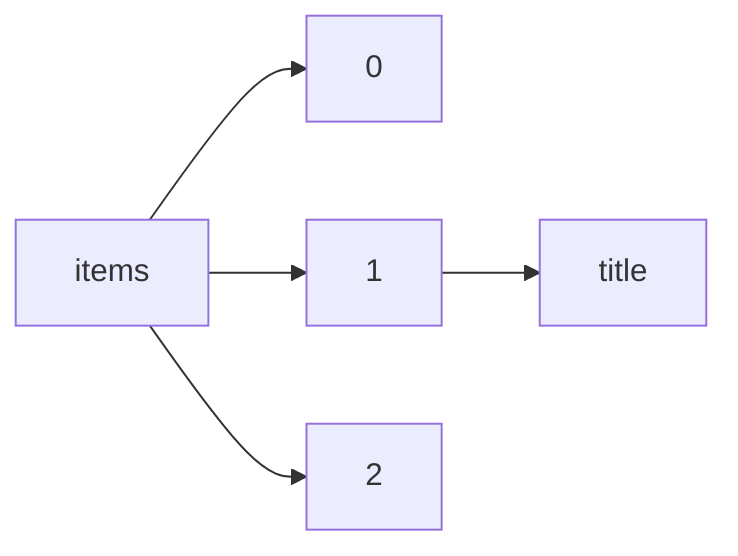

!!! warning "This document is not official Crossref documentation"
# Title
PATH = items/array/title(1)  
Occurs 138 059 552 times  
{ .annotate }

1. A route to an element, for example:  
   The route "items/array/title" corresponds to navigating through the JSON indices as  
   ["items"][0]["title"]  

## Properties of Array
See information about elements: [items/array/title/array](array/index.md)  
Distribution of lengths:  

| **Row** | **Length** `Any` | **Count** `Int64` |
|--------:|--------------------:|---------------------:|
| **1**   | 1                   | 138 055 732          |
| **2**   | 2                   | 3 564                |
| **3**   | 3                   | 233                  |
| **4**   | 4                   | 20                   |
| **5**   | 5                   | 3                    |

