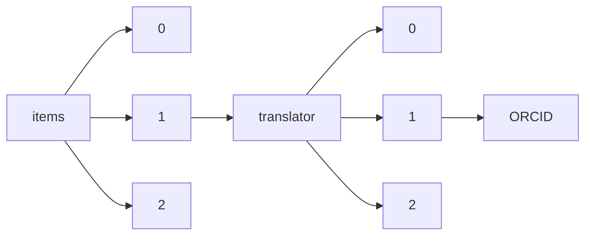

!!! warning "This document is not official Crossref documentation"
# ORCID
PATH = items/array/translator/array/ORCID(1)  
Occurs 517 times  
Unique values: 237  
{ .annotate }

1. A route to an element, for example:  
   The route "items/array/translator/array/ORCID" corresponds to navigating through the JSON indices as  
   ["items"][0]["translator"][0]["ORCID"]  

| **Row** | **Value** `String`                | **Count** `Int64` |
|--------:|-------------------------------------:|---------------------:|
| **1**   | http://orcid.org/0000-0003-1713-012X | 97                   |
| **2**   | http://orcid.org/0000-0003-2108-4445 | 33                   |
| **3**   | http://orcid.org/0000-0002-2059-1595 | 31                   |
| **4**   | http://orcid.org/0000-0001-6056-5538 | 19                   |
| **5**   | http://orcid.org/0000-0003-0124-4966 | 17                   |
| **6**   | http://orcid.org/0000-0002-2350-9753 | 14                   |
| **7**   | http://orcid.org/0000-0001-9186-6763 | 8                    |
| **8**   | http://orcid.org/0000-0003-3058-2219 | 8                    |
| **9**   | http://orcid.org/0000-0003-0064-1695 | 7                    |
| **10**  | http://orcid.org/0000-0002-7694-5292 | 5                    |
| **11**  | http://orcid.org/0000-0002-4888-391X | 4                    |
| **12**  | http://orcid.org/0000-0003-1628-3861 | 4                    |
| **13**  | http://orcid.org/0000-0003-4522-9936 | 4                    |
| **14**  | http://orcid.org/0000-0002-0694-0816 | 4                    |
| **15**  | http://orcid.org/0000-0002-9497-525X | 4                    |
| **16**  | http://orcid.org/0000-0001-7543-6085 | 3                    |
| **17**  | http://orcid.org/0000-0003-0579-5829 | 3                    |
| **18**  | http://orcid.org/0000-0002-9252-5407 | 3                    |
| **19**  | http://orcid.org/0000-0001-8818-012X | 3                    |
| **20**  | http://orcid.org/0000-0001-7872-5763 | 3                    |
| **21**  | http://orcid.org/0000-0001-9385-8660 | 3                    |
| **22**  | http://orcid.org/0000-0003-2683-6642 | 2                    |
| **23**  | http://orcid.org/0000-0002-1283-2766 | 2                    |
| **24**  | http://orcid.org/0000-0002-4916-6242 | 2                    |
| **25**  | http://orcid.org/0000-0001-5136-9607 | 2                    |
| **26**  | http://orcid.org/0000-0003-1614-8758 | 2                    |
| **27**  | http://orcid.org/0000-0002-4271-9780 | 2                    |
| **28**  | http://orcid.org/0000-0002-0578-6052 | 2                    |
| **29**  | http://orcid.org/0000-0002-9474-1867 | 2                    |
| **30**  | http://orcid.org/0000-0003-4603-804X | 2                    |
| **31**  | http://orcid.org/0000-0002-8562-6891 | 2                    |
| **32**  | http://orcid.org/0000-0002-2812-0819 | 2                    |
| **33**  | http://orcid.org/0000-0002-5789-6034 | 2                    |
| **34**  | http://orcid.org/0000-0001-5549-283X | 2                    |
| **35**  | http://orcid.org/0000-0001-5923-8054 | 2                    |
| **36**  | http://orcid.org/0000-0002-8144-4978 | 2                    |
| **37**  | http://orcid.org/0000-0002-9972-8987 | 2                    |
| **38**  | http://orcid.org/0000-0002-9000-8940 | 2                    |
| **39**  | http://orcid.org/0000-0003-3105-1313 | 2                    |
| **40**  | http://orcid.org/0000-0001-9193-3890 | 2                    |
| **41**  | http://orcid.org/0000-0002-7388-4906 | 2                    |
| **42**  | http://orcid.org/0000-0002-0162-9973 | 2                    |
| **43**  | http://orcid.org/0000-0002-2918-7871 | 2                    |
| **44**  | http://orcid.org/0000-0001-6463-9493 | 2                    |
| **45**  | http://orcid.org/0000-0002-0702-8685 | 2                    |
| **46**  | http://orcid.org/0000-0002-7836-6059 | 1                    |
| **47**  | http://orcid.org/0000-0003-3453-031X | 1                    |
| **48**  | http://orcid.org/0000-0001-6237-4372 | 1                    |
| **49**  | http://orcid.org/0000-0001-8751-4992 | 1                    |
| **50**  | http://orcid.org/0000-0002-1793-6505 | 1                    |
| **51**  | http://orcid.org/0000-0001-8531-9130 | 1                    |
| **52**  | http://orcid.org/0000-0001-5861-0790 | 1                    |
| **53**  | http://orcid.org/0000-0001-6523-6266 | 1                    |
| **54**  | http://orcid.org/0000-0002-8385-1390 | 1                    |
| **55**  | http://orcid.org/0000-0002-1881-8965 | 1                    |
| **56**  | http://orcid.org/0000-0002-1064-4518 | 1                    |
| **57**  | http://orcid.org/0000-0003-0548-4537 | 1                    |
| **58**  | http://orcid.org/0000-0002-8727-6936 | 1                    |
| **59**  | http://orcid.org/0000-0002-0544-8731 | 1                    |
| **60**  | http://orcid.org/0000-0001-8387-4122 | 1                    |
| **61**  | http://orcid.org/0000-0001-8082-6248 | 1                    |
| **62**  | http://orcid.org/0000-0002-5112-5431 | 1                    |
| **63**  | http://orcid.org/0000-0003-0764-9825 | 1                    |
| **64**  | http://orcid.org/0000-0002-6541-4269 | 1                    |
| **65**  | http://orcid.org/0000-0002-4324-5716 | 1                    |
| **66**  | http://orcid.org/0000-0001-5500-7267 | 1                    |
| **67**  | http://orcid.org/0000-0002-0019-9182 | 1                    |
| **68**  | http://orcid.org/0000-0001-5205-181X | 1                    |
| **69**  | http://orcid.org/0000-0003-0690-8549 | 1                    |
| **70**  | http://orcid.org/0000-0001-8518-8388 | 1                    |
| **71**  | http://orcid.org/0000-0003-0527-0192 | 1                    |
| **72**  | http://orcid.org/0000-0002-6102-0078 | 1                    |
| **73**  | http://orcid.org/0000-0002-4179-2708 | 1                    |
| **74**  | http://orcid.org/0000-0001-7342-4638 | 1                    |
| **75**  | http://orcid.org/0000-0001-6667-1745 | 1                    |
| **76**  | http://orcid.org/0000-0002-5037-6474 | 1                    |
| **77**  | http://orcid.org/0000-0002-5784-3549 | 1                    |
| **78**  | http://orcid.org/0000-0002-4050-3425 | 1                    |
| **79**  | http://orcid.org/0000-0002-4362-2729 | 1                    |
| **80**  | http://orcid.org/0000-0002-1842-8713 | 1                    |
| **81**  | http://orcid.org/0000-0002-3129-2435 | 1                    |
| **82**  | http://orcid.org/0000-0003-4117-6013 | 1                    |
| **83**  | http://orcid.org/0000-0003-0433-8087 | 1                    |
| **84**  | http://orcid.org/0000-0002-3595-2349 | 1                    |
| **85**  | http://orcid.org/0000-0001-8256-3525 | 1                    |
| **86**  | http://orcid.org/0000-0002-3825-2030 | 1                    |
| **87**  | http://orcid.org/0000-0002-0788-8036 | 1                    |
| **88**  | http://orcid.org/0000-0002-1106-5091 | 1                    |
| **89**  | http://orcid.org/0000-0002-6442-4924 | 1                    |
| **90**  | http://orcid.org/0000-0002-3566-1533 | 1                    |
| **91**  | http://orcid.org/0000-0003-4711-338X | 1                    |
| **92**  | http://orcid.org/0000-0001-7421-5993 | 1                    |
| **93**  | http://orcid.org/0000-0002-9445-9060 | 1                    |
| **94**  | http://orcid.org/0000-0002-0887-5106 | 1                    |
| **95**  | http://orcid.org/0000-0002-6177-2106 | 1                    |
| **96**  | http://orcid.org/0000-0001-9204-9589 | 1                    |
| **97**  | http://orcid.org/0000-0002-1845-2588 | 1                    |
| **98**  | http://orcid.org/0000-0001-9425-6848 | 1                    |
| **99**  | http://orcid.org/0000-0002-9553-5731 | 1                    |
| **100** | http://orcid.org/0000-0001-9471-7018 | 1                    |
| **101** | http://orcid.org/0000-0002-1214-7064 | 1                    |
| **102** | http://orcid.org/0000-0003-1009-9182 | 1                    |
| **103** | http://orcid.org/0000-0001-7642-0894 | 1                    |
| **104** | http://orcid.org/0000-0001-6612-6253 | 1                    |
| **105** | http://orcid.org/0000-0003-0738-3262 | 1                    |
| **106** | http://orcid.org/0000-0002-3084-6950 | 1                    |
| **107** | http://orcid.org/0000-0003-3987-3549 | 1                    |
| **108** | http://orcid.org/0000-0001-9502-4475 | 1                    |
| **109** | http://orcid.org/0000-0001-8851-9138 | 1                    |
| **110** | http://orcid.org/0000-0002-0755-7798 | 1                    |
| **111** | http://orcid.org/0000-0001-9598-7984 | 1                    |
| **112** | http://orcid.org/0000-0001-8949-7276 | 1                    |
| **113** | http://orcid.org/0000-0001-6356-8451 | 1                    |
| **114** | http://orcid.org/0000-0001-7955-2323 | 1                    |
| **115** | http://orcid.org/0000-0002-2886-2310 | 1                    |
| **116** | http://orcid.org/0000-0001-7222-4263 | 1                    |
| **117** | http://orcid.org/0000-0002-6926-1650 | 1                    |
| **118** | http://orcid.org/0000-0003-2858-9518 | 1                    |
| **119** | http://orcid.org/0000-0002-2870-3512 | 1                    |
| **120** | http://orcid.org/0000-0002-8319-6971 | 1                    |
| **121** | http://orcid.org/0000-0002-1644-252X | 1                    |
| **122** | http://orcid.org/0000-0002-3904-0291 | 1                    |
| **123** | http://orcid.org/0000-0002-8885-2915 | 1                    |
| **124** | http://orcid.org/0000-0001-8903-4415 | 1                    |
| **125** | http://orcid.org/0000-0001-9192-4767 | 1                    |
| **126** | http://orcid.org/0000-0001-9925-3304 | 1                    |
| **127** | http://orcid.org/0000-0001-7763-6806 | 1                    |
| **128** | http://orcid.org/0000-0002-9573-7018 | 1                    |
| **129** | http://orcid.org/0000-0003-0028-1503 | 1                    |
| **130** | http://orcid.org/0000-0003-0047-2975 | 1                    |
| **131** | http://orcid.org/0000-0002-9984-323X | 1                    |
| **132** | http://orcid.org/0000-0002-4828-9267 | 1                    |
| **133** | http://orcid.org/0000-0002-7836-4993 | 1                    |
| **134** | http://orcid.org/0000-0003-1476-416X | 1                    |
| **135** | http://orcid.org/0000-0001-5269-8891 | 1                    |
| **136** | http://orcid.org/0000-0003-1328-5060 | 1                    |
| **137** | http://orcid.org/0000-0003-4360-3410 | 1                    |
| **138** | http://orcid.org/0000-0002-0506-2927 | 1                    |
| **139** | http://orcid.org/0000-0002-7121-3607 | 1                    |
| **140** | http://orcid.org/0000-0003-2764-8440 | 1                    |
| **141** | http://orcid.org/0000-0003-2220-3485 | 1                    |
| **142** | http://orcid.org/0000-0002-7018-6301 | 1                    |
| **143** | http://orcid.org/0000-0002-5341-6654 | 1                    |
| **144** | http://orcid.org/0000-0002-8298-698X | 1                    |
| **145** | http://orcid.org/0000-0003-2479-0599 | 1                    |
| **146** | http://orcid.org/0000-0003-3833-6506 | 1                    |
| **147** | http://orcid.org/0000-0002-2729-6871 | 1                    |
| **148** | http://orcid.org/0000-0002-9844-8342 | 1                    |
| **149** | http://orcid.org/0000-0003-0441-1045 | 1                    |
| **150** | http://orcid.org/0000-0001-9062-448X | 1                    |
| **151** | http://orcid.org/0000-0001-7457-2798 | 1                    |
| **152** | http://orcid.org/0000-0001-7277-3369 | 1                    |
| **153** | http://orcid.org/0000-0002-8194-4681 | 1                    |
| **154** | http://orcid.org/0000-0001-7865-6497 | 1                    |
| **155** | http://orcid.org/0000-0003-0383-8098 | 1                    |
| **156** | http://orcid.org/0000-0002-2884-944X | 1                    |
| **157** | http://orcid.org/0000-0001-7252-141X | 1                    |
| **158** | http://orcid.org/0000-0001-7110-1587 | 1                    |
| **159** | http://orcid.org/0000-0001-8439-0373 | 1                    |
| **160** | http://orcid.org/0000-0002-4452-5891 | 1                    |
| **161** | http://orcid.org/0000-0002-9787-1114 | 1                    |
| **162** | http://orcid.org/0000-0002-4642-7451 | 1                    |
| **163** | http://orcid.org/0000-0003-3051-892X | 1                    |
| **164** | http://orcid.org/0000-0003-1206-8726 | 1                    |
| **165** | http://orcid.org/0000-0003-1059-3746 | 1                    |
| **166** | http://orcid.org/0000-0001-6259-8878 | 1                    |
| **167** | http://orcid.org/0000-0002-5275-3309 | 1                    |
| **168** | http://orcid.org/0000-0001-5092-1199 | 1                    |
| **169** | http://orcid.org/0000-0003-4580-286X | 1                    |
| **170** | http://orcid.org/0000-0002-7624-3629 | 1                    |
| **171** | http://orcid.org/0000-0002-6622-378X | 1                    |
| **172** | http://orcid.org/0000-0002-7201-5776 | 1                    |
| **173** | http://orcid.org/0000-0001-8016-9313 | 1                    |
| **174** | http://orcid.org/0000-0003-0558-1214 | 1                    |
| **175** | http://orcid.org/0000-0002-5380-8017 | 1                    |
| **176** | http://orcid.org/0000-0001-6284-1831 | 1                    |
| **177** | http://orcid.org/0000-0002-3571-6047 | 1                    |
| **178** | http://orcid.org/0000-0003-1783-256X | 1                    |
| **179** | http://orcid.org/0000-0002-3506-5424 | 1                    |
| **180** | http://orcid.org/0000-0001-6807-3300 | 1                    |
| **181** | http://orcid.org/0000-0001-6704-9456 | 1                    |
| **182** | http://orcid.org/0000-0001-7094-5737 | 1                    |
| **183** | http://orcid.org/0000-0003-2254-3383 | 1                    |
| **184** | http://orcid.org/0000-0002-8566-3318 | 1                    |
| **185** | http://orcid.org/0000-0001-8746-2213 | 1                    |
| **186** | http://orcid.org/0000-0003-1112-2858 | 1                    |
| **187** | http://orcid.org/0000-0002-8172-9279 | 1                    |
| **188** | http://orcid.org/0000-0001-6185-0453 | 1                    |
| **189** | http://orcid.org/0000-0002-8176-6563 | 1                    |
| **190** | http://orcid.org/0000-0001-6945-7082 | 1                    |
| **191** | http://orcid.org/0000-0002-9463-7613 | 1                    |
| **192** | http://orcid.org/0000-0002-0847-2024 | 1                    |
| **193** | http://orcid.org/0000-0002-3429-222X | 1                    |
| **194** | http://orcid.org/0000-0001-5810-1128 | 1                    |
| **195** | http://orcid.org/0000-0003-4335-6528 | 1                    |
| **196** | http://orcid.org/0000-0003-4079-2287 | 1                    |
| **197** | http://orcid.org/0000-0002-1593-2797 | 1                    |
| **198** | http://orcid.org/0000-0002-9869-8229 | 1                    |
| **199** | http://orcid.org/0000-0003-0381-458X | 1                    |
| **200** | http://orcid.org/0000-0001-8369-6215 | 1                    |
| **201** | http://orcid.org/0000-0002-4197-1896 | 1                    |
| **202** | http://orcid.org/0000-0002-0036-2306 | 1                    |
| **203** | http://orcid.org/0000-0002-3157-503X | 1                    |
| **204** | http://orcid.org/0000-0001-7154-7714 | 1                    |
| **205** | http://orcid.org/0000-0002-4761-4160 | 1                    |
| **206** | http://orcid.org/0000-0002-5194-4218 | 1                    |
| **207** | http://orcid.org/0000-0002-2676-1022 | 1                    |
| **208** | http://orcid.org/0000-0003-1321-3657 | 1                    |
| **209** | http://orcid.org/0000-0003-1152-577X | 1                    |
| **210** | http://orcid.org/0000-0002-9467-2005 | 1                    |
| **211** | http://orcid.org/0000-0003-4486-5367 | 1                    |
| **212** | http://orcid.org/0000-0002-6690-119X | 1                    |
| **213** | http://orcid.org/0000-0002-7568-465X | 1                    |
| **214** | http://orcid.org/0000-0002-2261-7680 | 1                    |
| **215** | http://orcid.org/0000-0002-4099-7621 | 1                    |
| **216** | http://orcid.org/0000-0002-0974-0019 | 1                    |
| **217** | http://orcid.org/0000-0002-0209-3410 | 1                    |
| **218** | http://orcid.org/0000-0003-1735-5767 | 1                    |
| **219** | http://orcid.org/0000-0002-3129-6356 | 1                    |
| **220** | http://orcid.org/0000-0003-2458-0356 | 1                    |
| **221** | http://orcid.org/0000-0003-4260-9087 | 1                    |
| **222** | http://orcid.org/0000-0002-3808-7573 | 1                    |
| **223** | http://orcid.org/0000-0002-8800-3550 | 1                    |
| **224** | http://orcid.org/0000-0002-7050-3266 | 1                    |
| **225** | http://orcid.org/0000-0001-5644-7993 | 1                    |
| **226** | http://orcid.org/0000-0002-5952-4664 | 1                    |
| **227** | http://orcid.org/0000-0002-6837-1081 | 1                    |
| **228** | http://orcid.org/0000-0003-4607-2221 | 1                    |
| **229** | http://orcid.org/0000-0003-3470-0139 | 1                    |
| **230** | http://orcid.org/0000-0002-5718-0503 | 1                    |
| **231** | http://orcid.org/0000-0001-8289-9336 | 1                    |
| **232** | http://orcid.org/0000-0002-3772-7778 | 1                    |
| **233** | http://orcid.org/0000-0001-6584-5563 | 1                    |
| **234** | http://orcid.org/0000-0003-4475-4819 | 1                    |
| **235** | http://orcid.org/0000-0002-5798-9468 | 1                    |
| **236** | http://orcid.org/0000-0001-9287-989X | 1                    |
| **237** | http://orcid.org/0000-0002-4316-9207 | 1                    |

