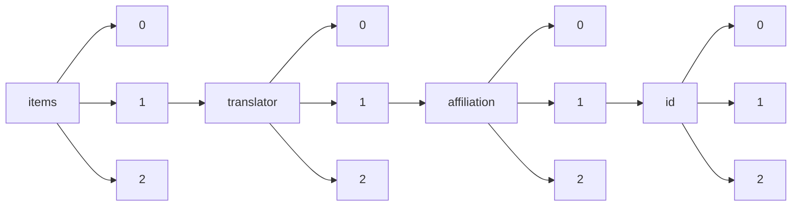

!!! warning "This document is not official Crossref documentation"
# Elements
PATH = items/array/translator/array/affiliation/array/id/array(1)  
Occurs 9 times  
{ .annotate }

1. A route to an element, for example:  
   The route "items/array/translator/array/affiliation/array/id/array" corresponds to navigating through the JSON indices as  
   ["items"][0]["translator"][0]["affiliation"][0]["id"][0]  

## Asserted-by
See more information: [items/array/translator/array/affiliation/array/id/array/asserted-by](asserted-by/index.md)  
Occurs 9 timess  
Unique values: 1  

| **Row** | **Value** `String` | **Count** `Int64` |
|--------:|----------------------:|---------------------:|
| **1**   | publisher             | 9                    |

## Id
See more information: [items/array/translator/array/affiliation/array/id/array/id](id/index.md)  
Occurs 9 timess  
Unique values: 2  

| **Row** | **Value** `String`     | **Count** `Int64` |
|--------:|--------------------------:|---------------------:|
| **1**   | https://ror.org/01pnej532 | 7                    |
| **2**   | https://ror.org/03dbr7087 | 2                    |

## Id-type
See more information: [items/array/translator/array/affiliation/array/id/array/id-type](id-type/index.md)  
Occurs 9 timess  
Unique values: 1  

| **Row** | **Value** `String` | **Count** `Int64` |
|--------:|----------------------:|---------------------:|
| **1**   | ROR                   | 9                    |

