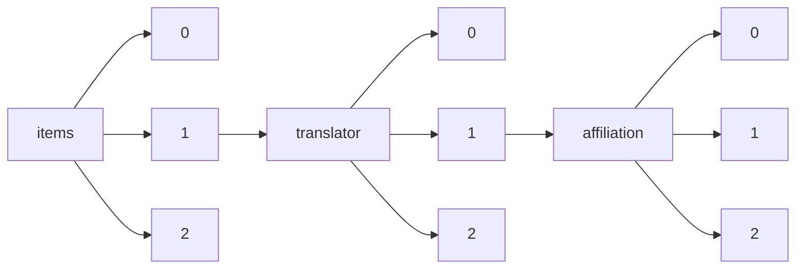

!!! warning "This document is not official Crossref documentation"
# Elements
PATH = items/array/translator/array/affiliation/array(1)  
Occurs 674 times  
{ .annotate }

1. A route to an element, for example:  
   The route "items/array/translator/array/affiliation/array" corresponds to navigating through the JSON indices as  
   ["items"][0]["translator"][0]["affiliation"][0]  

## Id
See more information: [items/array/translator/array/affiliation/array/id](id/index.md)  
Occurs 9 timess  

| **Row** | **Length** `Any` | **Count** `Int64` |
|--------:|--------------------:|---------------------:|
| **1**   | 1                   | 9                    |

## Name
See more information: [items/array/translator/array/affiliation/array/name](name/index.md)  
Occurs 674 timess  
Unique values: 253  

| **Row** | **Value** `String`                                          | **Count** `Int64` |
|--------:|---------------------------------------------------------------:|---------------------:|
| **1**   | 美国新泽西州普林斯顿合原研究有限责任公司 (Synatom Research)    | 75                   |
| **2**   | University of South Florida                                    | 52                   |
| **3**   | Synatom Research, Princeton, New Jersey, United States         | 35                   |
| **4**   | НИУ «Высшая школа экономики»                                   | 14                   |
| **5**   | SWPS University of Social Science and Humanities               | 14                   |
| **6**   | Université de Californie à Los Angeles, États-Unis             | 14                   |
| **7**   | Saint Petersburg State University                              | 13                   |
| **8**   | University of Iceland                                          | 12                   |
| **9**   | Institute of Slavic Studies of the Russian Academy of Sciences | 11                   |
| **10**  | Shanghai Jiao Tong University                                  | 10                   |
| ... | ... | ... |

