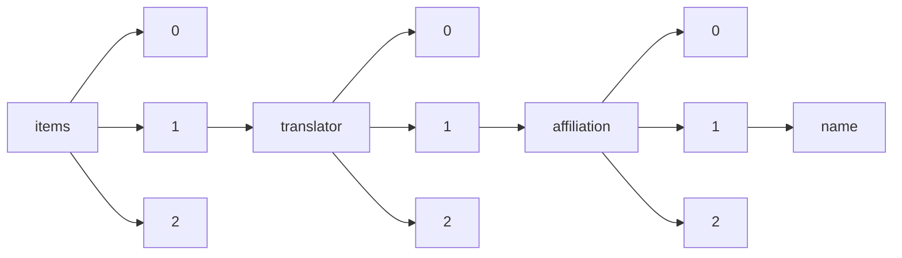

!!! warning "This document is not official Crossref documentation"
# Name
PATH = items/array/translator/array/affiliation/array/name(1)  
Occurs 674 times  
Unique values: 253  
{ .annotate }

1. A route to an element, for example:  
   The route "items/array/translator/array/affiliation/array/name" corresponds to navigating through the JSON indices as  
   ["items"][0]["translator"][0]["affiliation"][0]["name"]  

| **Row** | **Value** `String`                                                                                | **Count** `Int64` |
|--------:|-----------------------------------------------------------------------------------------------------:|---------------------:|
| **1**   | 美国新泽西州普林斯顿合原研究有限责任公司 (Synatom Research)                                          | 75                   |
| **2**   | University of South Florida                                                                          | 52                   |
| **3**   | Synatom Research, Princeton, New Jersey, United States                                               | 35                   |
| **4**   | НИУ «Высшая школа экономики»                                                                         | 14                   |
| **5**   | SWPS University of Social Science and Humanities                                                     | 14                   |
| **6**   | Université de Californie à Los Angeles, États-Unis                                                   | 14                   |
| **7**   | Saint Petersburg State University                                                                    | 13                   |
| **8**   | University of Iceland                                                                                | 12                   |
| **9**   | Institute of Slavic Studies of the Russian Academy of Sciences                                       | 11                   |
| **10**  | Shanghai Jiao Tong University                                                                        | 10                   |
| **11**  | Independent                                                                                          | 10                   |
| **12**  | Instytut Kultury Polskiej, Uniwersytet Warszawski                                                    | 10                   |
| **13**  | Staurolit Publishing House                                                                           | 8                    |
| **14**  | St. Louis                                                                                            | 8                    |
| **15**  | Российский университет дружбы народов                                                                | 8                    |
| **16**  | Moscow Lomonosov University                                                                          | 7                    |
| **17**  | Universidade de Brasília, Brasil                                                                     | 7                    |
| **18**  | None                                                                                                 | 7                    |
| **19**  | University of Szeged                                                                                 | 7                    |
| **20**  | Ivanovo State University                                                                             | 7                    |
| **21**  | Институт этнологии и антропологии РАН                                                                | 7                    |
| **22**  | Universidade de Vigo / Centro Ramón Piñeiro para a Investigación en Humanidades                      | 6                    |
| **23**  | Каролинский институт, Швеция                                                                         | 6                    |
| **24**  | Universidad EAFIT                                                                                    | 5                    |
| **25**  | Institute of General History, Russian Academy of Sciences                                            | 5                    |
| **26**  | Stavrolit Publishing House                                                                           | 5                    |
| **27**  | Institute of Philosophy and Law SB RAS                                                               | 5                    |
| **28**  | Novosibirsk State University                                                                         | 5                    |
| **29**  | Moscow Lomonosov State University                                                                    | 4                    |
| **30**  | Oceanographic Institute, University of São Paulo, São Paulo, Brazil                                  | 4                    |
| **31**  | Universidad de Buenos Aires                                                                          | 4                    |
| **32**  | University of Belgrade Faculty of Law                                                                | 4                    |
| **33**  | Flanders Marine Institute, Ostend, Belgium                                                           | 4                    |
| **34**  | Kris Salata teaches stage directing and performance at Stanford University. He has translated a numb | 4                    |
| **35**  | Publishing house "Stavrolit"                                                                         | 3                    |
| **36**  | Penn State University                                                                                | 3                    |
| **37**  | Faculty of Occupational Safety, University of Nis                                                    | 3                    |
| **38**  | Państwowa Wyższa Szkoła Filmowa, Telewizyjna i Teatralna im. Leona Schillera w Łodzi                 | 3                    |
| **39**  | University of Tyumen                                                                                 | 3                    |
| **40**  | Publisher house "Stavrolit"                                                                          | 3                    |
| **41**  | Manchester Metropolitan University Business School; Aytoun Building, Aytoun Street; Manchester; M1 3 | 3                    |
| **42**  | Universidade de Vigo                                                                                 | 3                    |
| **43**  | Instytut Badań Literackich, Polska Akademia Nauk                                                     | 3                    |
| **44**  | Bashkir State Pedagogical University named after M. Akmullah                                         | 3                    |
| **45**  | Ural State Pedagogical University                                                                    | 3                    |
| **46**  | Institute of Slavic Studies, Russian Academy of Sciences                                             | 3                    |
| **47**  | Universidad de Antioquia                                                                             | 3                    |
| **48**  | Smithsonian Institution, Washington, DC, USA                                                         | 2                    |
| **49**  | LLC "Publisher House Stavrolit"                                                                      | 2                    |
| **50**  | Universidad de Valladolid. Universidad de Salamanca                                                  | 2                    |
| **51**  | Translator — University of London                                                                    | 2                    |
| **52**  | Publisher House Stavrolit                                                                            | 2                    |
| **53**  | Independent Researcher; Gwynedd; North Wales; UK                                                     | 2                    |
| **54**  | Instytut Sztuki, Polska Akademia Nauk                                                                | 2                    |
| **55**  | University of California at Santa Barbara                                                            | 2                    |
| **56**  | Institute of Sociology, FCTAS RAS, Moscow, Russian Federation                                        | 2                    |
| **57**  | Monterey Institute of International Studies                                                          | 2                    |
| **58**  | Institute of General History                                                                         | 2                    |
| **59**  | Санкт-Петербургский институт истории РАН                                                             | 2                    |
| **60**  | The University of Edinburgh                                                                          | 2                    |
| **61**  | “New School”, LLC                                                                                    | 2                    |
| **62**  | Russian Christian Academy for the Humanities                                                         | 2                    |
| **63**  | Lindenwood University                                                                                | 2                    |
| **64**  | New York City                                                                                        | 2                    |
| **65**  | Institute of Philosophy and Law SB RAS, Novosibirsk                                                  | 2                    |
| **66**  | Departamento de Arquitetura e Urbanismo da PUC-Rio - DAU \| PUC-Rio                                  | 2                    |
| **67**  | Dnipro State Medical University, Dnipro, Ukraine                                                     | 2                    |
| **68**  | Departamento de Arquitetura e Urbanismo - DAU \| PUC-Rio                                             | 2                    |
| **69**  | University of Toronto                                                                                | 2                    |
| **70**  | People’s Public Security University, China                                                           | 2                    |
| **71**  | Society of Russian compatriots "Colonel Raevsky"                                                     | 2                    |
| **72**  | New Orleans                                                                                          | 2                    |
| **73**  | DAU \| PUC-Rio                                                                                       | 2                    |
| **74**  | Zürich                                                                                               | 2                    |
| **75**  | Klinik für Plastische, Hand- und Wiederherstellungschirurgie, Medizinische Hochschule, Hannover, Ger | 2                    |
| **76**  | Pravni fakultet Univerziteta u Beogradu                                                              | 2                    |
| **77**  | جامعة مصراتة /كلية الآداب                                                                            | 2                    |
| **78**  | National and University Library of Iceland                                                           | 2                    |
| **79**  | Национальный исследовательский университет «Высшая школа экономики»                                  | 2                    |
| **80**  | Nietzsche-Forum-Munchen, info@nietzsche-forum-muenchen.de                                            | 1                    |
| **81**  | Lisa Wolford Wylam is Associate Professor of Theatre at York University. She is coeditor, with Richa | 1                    |
| **82**  | Philosophy Department, Elon University, Elon NC 27244, USA                                           | 1                    |
| **83**  | St. Louis, Mo.                                                                                       | 1                    |
| **84**  | Faculty of Forensic Medicine, Zhongshan School of Medicine, Sun Yat-Sen University, Guangzhou, China | 1                    |
| **85**  | Alma Mater Studiorum University of Bologna;                                                          | 1                    |
| **86**  | Saint Petersburg State University, Saint Petersburg, Russia                                          | 1                    |
| **87**  | Delft University of Technology, Netherlands                                                          | 1                    |
| **88**  | University of Vienna                                                                                 | 1                    |
| **89**  | Moscow State University of International Relations                                                   | 1                    |
| **90**  | Departamento de Arquitetura e Urbanismo da PUC-Rio  - DAU \| PUC-Rio                                 | 1                    |
| **91**  | ICE Shanghai                                                                                         | 1                    |
| **92**  | كلية الآداب/جامعة مصراتة                                                                             | 1                    |
| **93**  | San Diego State University                                                                           | 1                    |
| **94**  | Insitute of Philosophy and Sociology of the Polish Academy of Science                                | 1                    |
| **95**  | Elizabeth Claire is Associate Professor of Research at the Centre de recherches historiques (CNRS-EH | 1                    |
| **96**  | Wheaton College                                                                                      | 1                    |
| **97**  | Institute of State and Law, Russian Academy of Sciences                                              | 1                    |
| **98**  | Veterinary World, Star, Gulshan Park, NH-8A, Chandrapur Road, Wankaner - 363621, Dist. Morbi, Gujara | 1                    |
| **99**  | Zhejiang University                                                                                  | 1                    |
| **100** | Vilnius University                                                                                   | 1                    |
| **101** | Tomsk State University, Institute of Philosophy and Law SB RAS                                       | 1                    |
| **102** | Yale University                                                                                      | 1                    |
| **103** | Resilience Research, Training and Consulting                                                         | 1                    |
| **104** | Universidad de Valladolid                                                                            | 1                    |
| **105** | باحث في المركز العربي للأبحاث ودراسة السياسات                                                        | 1                    |
| **106** | Walailak University                                                                                  | 1                    |
| **107** | РАНХИГС                                                                                              | 1                    |
| **108** | V. M. Koretsky Institute of State and Law of National Academy of Sciences of Ukraine                 | 1                    |
| **109** | Университет КАЗГЮУ имени М.С. Нарикбаева                                                             | 1                    |
| **110** | Law Firm «INTELLECT»                                                                                 | 1                    |
| **111** | Universidade Tuiuti do Paraná                                                                        | 1                    |
| **112** | Institut für Pflanzenschutz, CNR; Via Madonna del Piano, 10 50019 Sesto Fiorentino (Florenz) Italien | 1                    |
| **113** | Санкт-Петербургский государственный университет «ЛЭТИ» им. В. И. Ульянова (Ленина)                   | 1                    |
| **114** | Algerian Translator                                                                                  | 1                    |
| **115** | Institute of philosophy, Moscow                                                                      | 1                    |
| **116** | باحث ومترجم جزائري .                                                                                 | 1                    |
| **117** | College of Education of the University of Washington, 122 Miller Hall, DQ-12, Seattle, WA 98195. His | 1                    |
| **118** | Concordia University                                                                                 | 1                    |
| **119** | Санкт-Петербургский институт истории Российская академия наук                                        | 1                    |
| **120** | The French Library, Boston                                                                           | 1                    |
| **121** | Municipal University of São Caetano do Sul (USCS), São Caetano, SP, Brazil                           | 1                    |
| **122** | Dnipro University of Technology, Ukraine                                                             | 1                    |
| **123** | Institute of Philosophy of the Russian Academy of Sciences                                           | 1                    |
| **124** | Chelyabinsk State University                                                                         | 1                    |
| **125** | University of Oregon                                                                                 | 1                    |
| **126** | جامعة مصراتة                                                                                         | 1                    |
| **127** | Венский университет                                                                                  | 1                    |
| **128** | Acquisitions Department, University of Illinois at Urbana-Champaign Library, Urbana, IL, USA         | 1                    |
| **129** | Skylark Flat, Penmoor, St Clement, Truro TR1 1SZ, England                                            | 1                    |
| **130** | Uniwersytet Warszawski                                                                               | 1                    |
| **131** | Olga Kaczmarek is a translator and educator for Forum of Dialogue Among Nations, and a PhD student i | 1                    |
| **132** | Jagiellonian University in Kraków, Poland                                                            | 1                    |
| **133** | Russian Presidential Academy of National Economy and Public Administration                           | 1                    |
| **134** | Wydział Polonistyki, Uniwersytet Jagielloński                                                        | 1                    |
| **135** | Saint-Petersburg State University                                                                    | 1                    |
| **136** | ctpvazquez@cop.es                                                                                    | 1                    |
| **137** | Universität Xinjiang/Universität Bern                                                                | 1                    |
| **138** | The Graduate Center, The City University of New York, 365 Fifth Avenue, New York, NY 10016-4309, USA | 1                    |
| **139** | Boston University                                                                                    | 1                    |
| **140** | Sretensky Theological Academy                                                                        | 1                    |
| **141** | Herzen State Pedagogical University                                                                  | 1                    |
| **142** | Department of Philosophy, State University of New York at Stony Brook, NY 11794, USA                 | 1                    |
| **143** | Leipzig University                                                                                   | 1                    |
| **144** | New York University                                                                                  | 1                    |
| **145** | Elisa Poggelli has been in residence at the Workcenter since 2002, performing in One Breath Left, Th | 1                    |
| **146** | Polish Centre of Mediterranean Archaeology University of Warsaw                                      | 1                    |
| **147** | CNBOP-PIB                                                                                            | 1                    |
| **148** | Division Earth and Planetary Sciences Research Department U. S. Naval Ordnance Test Station China La | 1                    |
| **149** | Memorial University of Newfoundland                                                                  | 1                    |
| **150** | Göttingen (Deutschland)                                                                              | 1                    |
| **151** | CERMES 3, Villejuif, France                                                                          | 1                    |
| **152** | Православни богословски факултет, Универзитет у Београду                                             | 1                    |
| **153** | Zavod Senzorium                                                                                      | 1                    |
| **154** | Université de Parix X-Nanterre                                                                       | 1                    |
| **155** | Translated works from French by André Breton, George Sand, and Marcel Pagnol.                        | 1                    |
| **156** | Universidad Central                                                                                  | 1                    |
| **157** | Post-Graduate Program in Administration, Universidade do Vale do Itajaí, UNIVALI, Itajaí / SC, Brazi | 1                    |
| **158** | Independent researcher                                                                               | 1                    |
| **159** | University of Hamburg                                                                                | 1                    |
| **160** | Faculdade de Arquitetura e Urbanismo - FAU-UFRJ                                                      | 1                    |
| **161** | National University of Singapore                                                                     | 1                    |
| **162** | Academy Ignatianum, Kraków, Poland                                                                   | 1                    |
| **163** | كلية الآداب / جامعة مصراتة                                                                           | 1                    |
| **164** | Silesia University, Katowice, Poland                                                                 | 1                    |
| **165** | Institut Catholique de Paris                                                                         | 1                    |
| **166** | Universidade da Coruña / Grupo Hispania                                                              | 1                    |
| **167** | University of Southern California                                                                    | 1                    |
| **168** | Санкт-Петербургский институт истории Российской академии наук                                        | 1                    |
| **169** | باحث، المركز العربي للأبحاث ودراسة السياسات، وأستاذ مساعد، برنامج العلوم السياسية والعلاقات الدولي،  | 1                    |
| **170** | University of Hawaii at Manoa                                                                        | 1                    |
| **171** | Institute for the History of Material Culture of the RAS                                             | 1                    |
| **172** | University of Southern Denmark.                                                                      | 1                    |
| **173** | U. S. Naval Ordnance Test Station, China Lake, Calif.                                                | 1                    |
| **174** | Universidad de Costa Rica                                                                            | 1                    |
| **175** | Instituto Santista de Formação Especializada                                                         | 1                    |
| **176** | Department of Film and Media Studies at the University of California, Santa Barbara, USA             | 1                    |
| **177** | University of Warsaw, Poland                                                                         | 1                    |
| **178** | МГУ имени М.В. Ломоносова                                                                            | 1                    |
| **179** | Universidad San Buenaventura de Cartagena de Indias                                                  | 1                    |
| **180** | Université Paris Ouest Nanterre                                                                      | 1                    |
| **181** | Visiting scholar, Maison des Sciences de l’Homme, Pessac                                             | 1                    |
| **182** | Yoko Katsuyama                                                                                       | 1                    |
| **183** | Gwynedd; North Wales; UK                                                                             | 1                    |
| **184** | Universidade Estadual de Campinas                                                                    | 1                    |
| **185** | University of Liège, Belgium                                                                         | 1                    |
| **186** | Komarov Botanical Institute of the Russian Academy of Sciences                                       | 1                    |
| **187** | Teaches French and linguistics at City College of San Francisco.                                     | 1                    |
| **188** | Graduate Program in Business Administration, Regional University of Blumenau - FURB, Blumenau, SC, B | 1                    |
| **189** | Institute of Sociology of the FCTAS RAS, Moscow, Russian Federation                                  | 1                    |
| **190** | Herzen State Pedagogical University of Russia                                                        | 1                    |
| **191** | Moravian Archives, Bethlehem                                                                         | 1                    |
| **192** | HSE University, Moscow, Russia                                                                       | 1                    |
| **193** | Tomsk State University; Institute of Philosophy and Law SB RAS                                       | 1                    |
| **194** | Саратовская государственная юридическая академия                                                     | 1                    |
| **195** | أستاذ مساعد فلسفة، قسم علم الاجتماع، كلية الآداب، جامعة ذي قار، العراق.                              | 1                    |
| **196** | Corporación Alma, Arte y Acción, Corporación Akará                                                   | 1                    |
| **197** | Egham/Surrey (Great Britain)                                                                         | 1                    |
| **198** | New York                                                                                             | 1                    |
| **199** | Universidad de California                                                                            | 1                    |
| **200** | Food and Drug Administration San Francisco, CA                                                       | 1                    |
| **201** | St. Petersburg State University                                                                      | 1                    |
| **202** | Saint Petersburg State University, Russian Federatio                                                 | 1                    |
| **203** | Centre National de la Recherche Scientifique (CNRS), Bureau d'Economie Théorique et Appliquée (BETA) | 1                    |
| **204** | University College London                                                                            | 1                    |
| **205** | Curso de Arquitetura e Urbanismo da Universidade Santa Úrsula - USU                                  | 1                    |
| **206** | HANNOVER MEDICAL SCHOOL AND UNIVERSITY OF GöTTINGEN, AND MOUNT ALLISON UNIVERSITY                    | 1                    |
| **207** | Noémie Solomon is a dancer, choreographer, and writer working in and around contemporary performance | 1                    |
| **208** | Amsterdam (The Netherlands)                                                                          | 1                    |
| **209** | St Louis, Mo.                                                                                        | 1                    |
| **210** | University of Gdańsk, Poland; Polish Literary Translators Association                                | 1                    |
| **211** | Universidad Distrital Francisco José de Caldas                                                       | 1                    |
| **212** | St. Philaret's Institute in Moscow                                                                   | 1                    |
| **213** | Philadelphia                                                                                         | 1                    |
| **214** | Idaho University/ Lima/ Lima                                                                         | 1                    |
| **215** | AGS Translator                                                                                       | 1                    |
| **216** | Department of Neurosurgery, Medical Center, University of Freiburg, Germany.                         | 1                    |
| **217** | Department of Earth and Environmental Science, City University of New York Graduate Center           | 1                    |
| **218** | University of Cambridge                                                                              | 1                    |
| **219** | Institute of philosophy and law SB RAS                                                               | 1                    |
| **220** | RACHEL HADAS, a Fellow of the American Academy since 1995, is Board of Governors Professor of Englis | 1                    |
| **221** | Friedrich-Schiller-Universität Jena                                                                  | 1                    |
| **222** | Susanne Winnacker teaches at the University for Performing Arts and Music in Francfort/M. She has al | 1                    |
| **223** | The Russian State University for the Humanities, Moscow                                              | 1                    |
| **224** | Denise Ganderton                                                                                     | 1                    |
| **225** | Национальный исследовательский университет «Высшая школа экономики - Санкт-Петербург»                | 1                    |
| **226** | Ulyanovsk State University                                                                           | 1                    |
| **227** | University of Louisville                                                                             | 1                    |
| **228** | Universidade Federal de Mato Grosso do Sul                                                           | 1                    |
| **229** | KIMEP University School of Law                                                                       | 1                    |
| **230** | Universidade Estadual do Centro-Oeste                                                                | 1                    |
| **231** | University of Illinois at Urbana-Champaign                                                           | 1                    |
| **232** | The Russian Presidential Academy of National Economy and Public Administration                       | 1                    |
| **233** | Observatoire Sociologique du Changement, 27 rue Saint-Guillaume, 75337 Paris cedex 07, France        | 1                    |
| **234** | US Naval Ordnance Test Station China Lake, Calif.                                                    | 1                    |
| **235** | Universidade Católica de São Paulo (PUC-SP)                                                          | 1                    |
| **236** | Institute of World History of RAS                                                                    | 1                    |
| **237** | Institute for Linguistic Studies, Russian Academy of Sciences                                        | 1                    |
| **238** | Universidade de Santiago de Compostela                                                               | 1                    |
| **239** | Russian Metrological Institute of Technical Physics and Radio Engineering (VNIIFTRI)                 | 1                    |
| **240** | Montpellier (France)                                                                                 | 1                    |
| **241** | ST PHILARETS CHRISTIAN ORTHODOX INSTITUTE IN MOSCOW                                                  | 1                    |
| **242** | Arizona State University                                                                             | 1                    |
| **243** | РГГУ                                                                                                 | 1                    |
| **244** | Universidade de São Paulo                                                                            | 1                    |
| **245** | Marie Pecorari is Associate Professor of English at the University of Paris IV-Sorbonne. She has pub | 1                    |
| **246** | Institute of Sociology FCTAS RAS, Russian Federation                                                 | 1                    |
| **247** | Uzhhorod National University, Ukraine                                                                | 1                    |
| **248** | St. Petersburg Institute of history of the Russian Academy of Sciences                               | 1                    |
| **249** | Aston University                                                                                     | 1                    |
| **250** | باحث دكتوراه في جامعة كولومبيا                                                                       | 1                    |
| **251** | МГИМО МИД России                                                                                     | 1                    |
| **252** | Systems Trans; Tacna; Peru, South America                                                            | 1                    |
| **253** | Bilingualwords.com, London, United Kingdom                                                           | 1                    |

