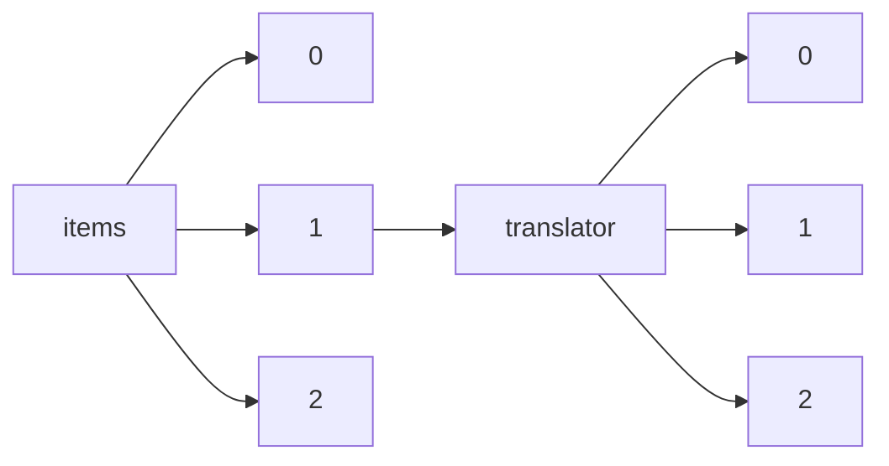

!!! warning "This document is not official Crossref documentation"
# Elements
PATH = items/array/translator/array(1)  
Occurs 29 714 times  
{ .annotate }

1. A route to an element, for example:  
   The route "items/array/translator/array" corresponds to navigating through the JSON indices as  
   ["items"][0]["translator"][0]  

## ORCID
See more information: [items/array/translator/array/ORCID](ORCID/index.md)  
Occurs 517 timess  
Unique values: 237  

| **Row** | **Value** `String`                | **Count** `Int64` |
|--------:|-------------------------------------:|---------------------:|
| **1**   | http://orcid.org/0000-0003-1713-012X | 97                   |
| **2**   | http://orcid.org/0000-0003-2108-4445 | 33                   |
| **3**   | http://orcid.org/0000-0002-2059-1595 | 31                   |
| **4**   | http://orcid.org/0000-0001-6056-5538 | 19                   |
| **5**   | http://orcid.org/0000-0003-0124-4966 | 17                   |
| **6**   | http://orcid.org/0000-0002-2350-9753 | 14                   |
| **7**   | http://orcid.org/0000-0001-9186-6763 | 8                    |
| **8**   | http://orcid.org/0000-0003-3058-2219 | 8                    |
| **9**   | http://orcid.org/0000-0003-0064-1695 | 7                    |
| **10**  | http://orcid.org/0000-0002-7694-5292 | 5                    |
| ... | ... | ... |

## Affiliation
See more information: [items/array/translator/array/affiliation](affiliation/index.md)  
Occurs 29 714 timess  

| **Row** | **Length** `Any` | **Count** `Int64` |
|--------:|--------------------:|---------------------:|
| **1**   | 0                   | 29 049               |
| **2**   | 1                   | 657                  |
| **3**   | 2                   | 7                    |
| **4**   | 3                   | 1                    |

## Authenticated-orcid
See more information: [items/array/translator/array/authenticated-orcid](authenticated-orcid/index.md)  
Occurs 517 timess  
Unique values: 2  

| **Row** | **Value** `Bool` | **Count** `Int64` |
|--------:|--------------------:|---------------------:|
| **1**   | false               | 509                  |
| **2**   | true                | 8                    |

## Family
See more information: [items/array/translator/array/family](family/index.md)  
Occurs 29 095 timess  
Unique values: > 999  

!!! note "Due to current limitations, only the first 1,000 unique values are counted."

| **Row** | **Value** `String` | **Count** `Int64` |
|--------:|----------------------:|---------------------:|
| **1**   | Mortensen Steagall    | 230                  |
| **2**   | Jones                 | 200                  |
| **3**   | Hamilton              | 136                  |
| **4**   | Smith                 | 119                  |
| **5**   | Stanhope              | 117                  |
| **6**   | Most                  | 109                  |
| **7**   | Thomson               | 109                  |
| **8**   | Campbell              | 106                  |
| **9**   | Virues-Ortega         | 101                  |
| **10**  | Carter                | 100                  |
| ... | ... | ... |

## Given
See more information: [items/array/translator/array/given](given/index.md)  
Occurs 28 818 timess  
Unique values: > 999  

!!! note "Due to current limitations, only the first 1,000 unique values are counted."

| **Row** | **Value** `String` | **Count** `Int64` |
|--------:|----------------------:|---------------------:|
| **1**   | John                  | 314                  |
| **2**   | Elizabeth             | 257                  |
| **3**   | Marcos                | 246                  |
| **4**   | David                 | 222                  |
| **5**   | George                | 222                  |
| **6**   | Arthur                | 185                  |
| **7**   | William               | 178                  |
| **8**   | Anna                  | 172                  |
| **9**   | Robert                | 160                  |
| **10**  | Michael               | 151                  |
| ... | ... | ... |

## Name
See more information: [items/array/translator/array/name](name/index.md)  
Occurs 619 timess  
Unique values: 208  

| **Row** | **Value** `String`                                                 | **Count** `Int64` |
|--------:|----------------------------------------------------------------------:|---------------------:|
| **1**   | Universidad Autónoma de Madrid, Madrid, Spain                         | 54                   |
| **2**   | Universidad Autónoma de Madrid, C/Ivan Pavlov, 6, 28049 Madrid, Spain | 38                   |
| **3**   | iTranslate                                                            | 36                   |
| **4**   | The University of Auckland, Auckland, New Zealand                     | 31                   |
| **5**   | ISM-TI                                                                | 22                   |
| **6**   | Comunità San Giovanni                                                 | 20                   |
| **7**   | Institute of Slavic Studies, Russian Academy of Sciences              | 20                   |
| **8**   | Communauté Saint-Jean                                                 | 18                   |
| **9**   | Comunidad San Juan                                                    | 16                   |
| **10**  | Community of Saint John                                               | 15                   |
| ... | ... | ... |

## Sequence
See more information: [items/array/translator/array/sequence](sequence/index.md)  
Occurs 29 714 timess  
Unique values: 2  

| **Row** | **Value** `String` | **Count** `Int64` |
|--------:|----------------------:|---------------------:|
| **1**   | additional            | 27 499               |
| **2**   | first                 | 2 215                |

## Suffix
See more information: [items/array/translator/array/suffix](suffix/index.md)  
Occurs 14 timess  
Unique values: 12  

| **Row** | **Value** `String` | **Count** `Int64` |
|--------:|----------------------:|---------------------:|
| **1**   | Jr.                   | 2                    |
| **2**   | MRes (c)              | 2                    |
| **3**   | M.Sc.                 | 1                    |
| **4**   | Israel Pro            | 1                    |
| **5**   | , translat            | 1                    |
| **6**   | de                    | 1                    |
| **7**   | S.J.                  | 1                    |
| **8**   | SJ                    | 1                    |
| **9**   | PhD                   | 1                    |
| **10**  | BA                    | 1                    |
| ... | ... | ... |

