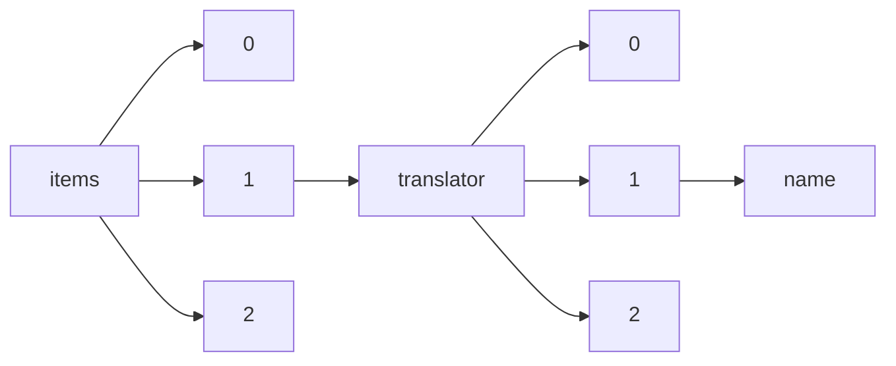

!!! warning "This document is not official Crossref documentation"
# Name
PATH = items/array/translator/array/name(1)  
Occurs 619 times  
Unique values: 208  
{ .annotate }

1. A route to an element, for example:  
   The route "items/array/translator/array/name" corresponds to navigating through the JSON indices as  
   ["items"][0]["translator"][0]["name"]  

| **Row** | **Value** `String`                                                                                 | **Count** `Int64` |
|--------:|------------------------------------------------------------------------------------------------------:|---------------------:|
| **1**   | Universidad Autónoma de Madrid, Madrid, Spain                                                         | 54                   |
| **2**   | Universidad Autónoma de Madrid, C/Ivan Pavlov, 6, 28049 Madrid, Spain                                 | 38                   |
| **3**   | iTranslate                                                                                            | 36                   |
| **4**   | The University of Auckland, Auckland, New Zealand                                                     | 31                   |
| **5**   | ISM-TI                                                                                                | 22                   |
| **6**   | Comunità San Giovanni                                                                                 | 20                   |
| **7**   | Institute of Slavic Studies, Russian Academy of Sciences                                              | 20                   |
| **8**   | Communauté Saint-Jean                                                                                 | 18                   |
| **9**   | Comunidad San Juan                                                                                    | 16                   |
| **10**  | Community of Saint John                                                                               | 15                   |
| **11**  | IVAPeko Itzultzaile Zerbitzu Ofiziala                                                                 | 12                   |
| **12**  | Publics et musées                                                                                     | 12                   |
| **13**  | Universidad de Málaga, Málaga, Spain                                                                  | 12                   |
| **14**  | Russian Presidential Academy of National Economy and Public Administration                            | 11                   |
| **15**  | Institute of Philosophy, Russian Academy of Sciences                                                  | 11                   |
| **16**  | St. Petersburg State University                                                                       | 9                    |
| **17**  | RUDN University                                                                                       | 8                    |
| **18**  | Russian State University for the Humanities                                                           | 7                    |
| **19**  | Institute of Slavic Studies of the RAS                                                                | 6                    |
| **20**  | Universidade Federal Rural do Rio de Janeiro                                                          | 6                    |
| **21**  | Adam Mickiewicz University, Poznań                                                                    | 6                    |
| **22**  | OP                                                                                                    | 5                    |
| **23**  | Universidad de Malaga, Malga, Spain                                                                   | 5                    |
| **24**  | Konstantin Preslavsky University of Shumen                                                            | 4                    |
| **25**  | Traducteurs sans frontières (T.S.F.)                                                                  | 4                    |
| **26**  | Joel David                                                                                            | 4                    |
| **27**  | Institute for Strategy of Education Development of the Russian Academy of Education                   | 4                    |
| **28**  | Rubber Research Institute of Vietnam, Ho Chi Minh City, Vietnam                                       | 4                    |
| **29**  | ArkivData i Norrköping                                                                                | 4                    |
| **30**  | Evocati                                                                                               | 3                    |
| **31**  | Higher School of Economics                                                                            | 3                    |
| **32**  | Christina Bielinski Ramalho                                                                           | 3                    |
| **33**  | Lithuanian Culture Research Institute                                                                 | 3                    |
| **34**  | Lomonosov Moscow State University                                                                     | 3                    |
| **35**  | Christina Ramalho                                                                                     | 2                    |
| **36**  | RAS Institute of Philosophy                                                                           | 2                    |
| **37**  | Jennifer da Silva Moreira                                                                             | 2                    |
| **38**  | Peoples' Friendship University of Russia                                                              | 2                    |
| **39**  | Hitzurun                                                                                              | 2                    |
| **40**  | San Diego CA 92116, United States                                                                     | 2                    |
| **41**  | Saratov State University                                                                              | 2                    |
| **42**  | National Research University Higher School of Economics                                               | 2                    |
| **43**  | MultiMedia SRL                                                                                        | 2                    |
| **44**  | Antonio Marcos Trindade                                                                               | 2                    |
| **45**  | Chayanov Research Center of Moscow School of Social and Economic Sciences                             | 2                    |
| **46**  | ABA Life, Madrid, Spain                                                                               | 2                    |
| **47**  | National Documentation Centre                                                                         | 2                    |
| **48**  | China University of Political Science and Law                                                         | 2                    |
| **49**  | Company SocTrade                                                                                      | 2                    |
| **50**  | ثائر ديب                                                                                              | 2                    |
| **51**  | Accent Mondial                                                                                        | 2                    |
| **52**  | Granada, Spain                                                                                        | 2                    |
| **53**  | Augusto Jobim do Amaral                                                                               | 2                    |
| **54**  | Revue Hommes et Migrations                                                                            | 2                    |
| **55**  | Southern Federal University                                                                           | 2                    |
| **56**  | Universidade de São Paulo. Faculdade de Filosofia, Letras e Ciências Humanas                          | 2                    |
| **57**  | Uniersidad Javeriana, Bogota, Colombia                                                                | 2                    |
| **58**  | PTE BTK TTI Újkortörténeti Tanszék                                                                    | 2                    |
| **59**  | Psychojamon                                                                                           | 2                    |
| **60**  | Universidade de São Paulo. Faculdade de Arquitetura e Urbanismo                                       | 2                    |
| **61**  | МГУ имени М. В. Ломоносова                                                                            | 1                    |
| **62**  | Cahiers du féminisme                                                                                  | 1                    |
| **63**  | Fiontar, Ollscoil Chathair Bhaile Átha Cliath                                                         | 1                    |
| **64**  | IIIT Department of Translation                                                                        | 1                    |
| **65**  | Vitória Liz P. Louveira                                                                               | 1                    |
| **66**  | the Editors of the Library of Arabic Literature                                                       | 1                    |
| **67**  | University of Oviedo, Spain                                                                           | 1                    |
| **68**  | Paris-Sorbonne University                                                                             | 1                    |
| **69**  | Universidade do Estado de Santa Catarina                                                              | 1                    |
| **70**  | Maria Claudia Bontempi Pizzi                                                                          | 1                    |
| **71**  | IUCN Regional Office for West Asia                                                                    | 1                    |
| **72**  | Institute of World History of the Russian Academy of Sciences                                         | 1                    |
| **73**  | Lugansk National University named after V. Dahl                                                       | 1                    |
| **74**  | The Russian Presidental Academy of National Economy and Public Administration                         | 1                    |
| **75**  | William B. Gomes                                                                                      | 1                    |
| **76**  | Universidade do Estado da Bahia - UNEB                                                                | 1                    |
| **77**  | William Teixeira                                                                                      | 1                    |
| **78**  | Warsaw University of Life Sciences SGGW, Faculty of Social Sciences, Department of Philosophy         | 1                    |
| **79**  | Весна О. Марковић                                                                                     | 1                    |
| **80**  | Joanneliese de Lucas Freitas                                                                          | 1                    |
| **81**  | Tatiana Badaró                                                                                        | 1                    |
| **82**  | Salvador Iranzo Abellán\u200e                                                                         | 1                    |
| **83**  | King’s College, London                                                                                | 1                    |
| **84**  | University of Toulouse 2                                                                              | 1                    |
| **85**  | Peoples’ Friendship University of Russia                                                              | 1                    |
| **86**  | Rudolfa Bićanića, 10 000 Zagreb, Croatia                                                              | 1                    |
| **87**  | Equipo Interdisciplinario Asociación Latinoamericana de Odontopediatría                               | 1                    |
| **88**  | Piero Gayozzo                                                                                         | 1                    |
| **89**  | Zaporizhzhia State Medical University                                                                 | 1                    |
| **90**  | Rostov State University of Civil Engineering                                                          | 1                    |
| **91**  | A.M. Gorky Institute of World Literature of the Russian Academy of Sciences                           | 1                    |
| **92**  | Uniwersytet w Białymstoku                                                                             | 1                    |
| **93**  | PTE BTK Történettudományi Intézet                                                                     | 1                    |
| **94**  | Moscow School of Social and Economic Sciences                                                         | 1                    |
| **95**  | Arno Dal Ri Jr.                                                                                       | 1                    |
| **96**  | Uniwersytet Mikołaja Kopernika, Toruń, Polska                                                         | 1                    |
| **97**  | UNAM                                                                                                  | 1                    |
| **98**  | Advanced Linguistic Services                                                                          | 1                    |
| **99**  | Media Sphera Publishers                                                                               | 1                    |
| **100** | حسني زينة                                                                                             | 1                    |
| **101** | Marie Madeleine Dupon                                                                                 | 1                    |
| **102** | Institute of Oriental Studies                                                                         | 1                    |
| **103** | Architexte                                                                                            | 1                    |
| **104** | Kuban State University                                                                                | 1                    |
| **105** | Ulyanovsk State Pedagogical University named after I.N. Ulyanov                                       | 1                    |
| **106** | Institute of Slavic Studies of RAS                                                                    | 1                    |
| **107** | Msc. Alan Müller                                                                                      | 1                    |
| **108** | Ivan Franko National University of Lviv                                                               | 1                    |
| **109** | Margarida Maria Araujo Bispo                                                                          | 1                    |
| **110** | University of Nebraska                                                                                | 1                    |
| **111** | Durham University                                                                                     | 1                    |
| **112** | PTE BTK TTI Középkori és Koraújkori Történeti Tanszék                                                 | 1                    |
| **113** | University of Copenhagen                                                                              | 1                    |
| **114** | Ronaldo  Vielmi  Fortes                                                                               | 1                    |
| **115** | Students of 135–535a: Exegetical Midrash                                                              | 1                    |
| **116** | East-European Institute of Psychoanalysis                                                             | 1                    |
| **117** | Sveučilište u Zagrebu, Fakultet kemijskog inženjerstva i tehnologije                                  | 1                    |
| **118** | D.E. Sergeev, P.N. Kondrashov, E.A. Vakhrusheva                                                       | 1                    |
| **119** | CRITIQUE TEXTUELLE DE L’ANCIEN TESTAMENT                                                              | 1                    |
| **120** | جامعة عمر المختار                                                                                     | 1                    |
| **121** | Agence Tram-Train SNCF                                                                                | 1                    |
| **122** | Comité de traducción al español                                                                       | 1                    |
| **123** | School for Advanced Studies in the Humanities, RANEPA Institute of Social Sciences                    | 1                    |
| **124** | Балтийский федеральный университета им. И. Канта                                                      | 1                    |
| **125** | Laboratorio di Documentazione – Dipartimento di Culture, Educazione e Società dell’Università della   | 1                    |
| **126** | St. Petersburg Technical University                                                                   | 1                    |
| **127** | Comité de solidarité avec les peuples du Chiapas en lutte                                             | 1                    |
| **128** | Pedro Corgozinho                                                                                      | 1                    |
| **129** | Translatel                                                                                            | 1                    |
| **130** | Carolina Peters                                                                                       | 1                    |
| **131** | Teresa Fazan                                                                                          | 1                    |
| **132** | Guangdong Zhuojian Law Firm                                                                           | 1                    |
| **133** | the Author                                                                                            | 1                    |
| **134** | https://inslav.ru/sites/default/files/09\_kitanova\_0.pdf                                             | 1                    |
| **135** | Институт востоковедения РАН                                                                           | 1                    |
| **136** | University of Gdańsk                                                                                  | 1                    |
| **137** | Educación Eficaz, Córdoba, España                                                                     | 1                    |
| **138** | Silvère Menegaldo                                                                                     | 1                    |
| **139** | independent researcher                                                                                | 1                    |
| **140** | the Chickasaw Language Committee                                                                      | 1                    |
| **141** | Bakun                                                                                                 | 1                    |
| **142** | Kamyshin Industrial and Pedagogical College                                                           | 1                    |
| **143** | National Research University “Higher School of Economics”                                             | 1                    |
| **144** | cref                                                                                                  | 1                    |
| **145** | Abascool, Madrid, España                                                                              | 1                    |
| **146** | Universidade de São Paulo. Escola de Comunicações e Artes                                             | 1                    |
| **147** | Troy University, Troy Al, United States                                                               | 1                    |
| **148** | Nayara Rodrigues Medrado                                                                              | 1                    |
| **149** | Universidad Nacional Autónoma de México, FES Iztacala                                                 | 1                    |
| **150** | Adam Mickiewicz University, Poznań, Poland                                                            | 1                    |
| **151** | Los traductores                                                                                       | 1                    |
| **152** | Hernán D. Espinosa-Medina                                                                             | 1                    |
| **153** | Goethe German Cultural Center                                                                         | 1                    |
| **154** | Museum of the Outstanding Figures of Ukrainian Culture                                                | 1                    |
| **155** | David Paniagua Aguilar                                                                                | 1                    |
| **156** | Universidade Federal do Tocantins - UFT                                                               | 1                    |
| **157** | Aline Vasconcelos                                                                                     | 1                    |
| **158** | Universidade Andina Simón Bolívar - UASB                                                              | 1                    |
| **159** | the Center for Intercultural Communication                                                            | 1                    |
| **160** | e Department of Modern Languages, University of Białystok,  Białystok, Polska                         | 1                    |
| **161** | Troy University, Troy, Alabama, United States                                                         | 1                    |
| **162** | ENDER ALKAN                                                                                           | 1                    |
| **163** | Renata de Castro                                                                                      | 1                    |
| **164** | Charles University                                                                                    | 1                    |
| **165** | Leandro Candido de Souza                                                                              | 1                    |
| **166** | Abaloo, Madrid, España                                                                                | 1                    |
| **167** | Universidad Nacional de Educación a Distancia, Madrid, Spain                                          | 1                    |
| **168** | Marcos Aurélio Fernandes                                                                              | 1                    |
| **169** | Rosetta Testu Zerbitzuak                                                                              | 1                    |
| **170** | Natália Labella                                                                                       | 1                    |
| **171** | State Academic University of the Humanities                                                           | 1                    |
| **172** | Auburn University, Auburn, AL 36849, United States                                                    | 1                    |
| **173** | University of Toronto                                                                                 | 1                    |
| **174** | Tokyo University of Foreign Studies                                                                   | 1                    |
| **175** | Antônio Batalha                                                                                       | 1                    |
| **176** | Oxford University                                                                                     | 1                    |
| **177** | Eronildo Carmo                                                                                        | 1                    |
| **178** | Ricardo Sontag                                                                                        | 1                    |
| **179** | Margaretha Schäfer                                                                                    | 1                    |
| **180** | Institute of World History, Russian Academy of Sciences                                               | 1                    |
| **181** | José Carlos Martín Iglesias                                                                           | 1                    |
| **182** | Emília Merlini Giuliani                                                                               | 1                    |
| **183** | the author                                                                                            | 1                    |
| **184** | dbmedia                                                                                               | 1                    |
| **185** | Gaiapiraten-Übersetzerteam                                                                            | 1                    |
| **186** | St. Petersburg University of the Humanities and Social Sciences                                       | 1                    |
| **187** | Florida State University                                                                              | 1                    |
| **188** | Organisation révolutionnaire anarchiste. Groupe XX.                                                   | 1                    |
| **189** | Universidad de Cádiz, Cádiz, España                                                                   | 1                    |
| **190** | Gabriel Leopoldino dos Santos                                                                         | 1                    |
| **191** | Auctores Publishing LLC                                                                               | 1                    |
| **192** | The Translators                                                                                       | 1                    |
| **193** | E.A.Vakhrusheva                                                                                       | 1                    |
| **194** | Institut de recherches politiques d'Ottawa                                                            | 1                    |
| **195** | University of Maryland, College Park                                                                  | 1                    |
| **196** | Kazan’ Federal University                                                                             | 1                    |
| **197** | Higher School of Economics - National Research University                                             | 1                    |
| **198** | Sochi Institute of the Peoples’ Friendship University of Russia (RUDN University)\t Kuibyshev Str., 3 | 1                    |
| **199** | Daniel Fairfax                                                                                        | 1                    |
| **200** | Universidad Rey Juan Carlos, Madrid, Spain                                                            | 1                    |
| **201** | Nassim Bravo Jordán                                                                                   | 1                    |
| **202** | Fundación Universituario Konrad Lorentz, Bogota, Colombia                                             | 1                    |
| **203** | Alexandre Nobre                                                                                       | 1                    |
| **204** | Penza State Agrarian University                                                                       | 1                    |
| **205** | Princeton University                                                                                  | 1                    |
| **206** | la autora                                                                                             | 1                    |
| **207** | Waterford Institute of Technology, Ireland                                                            | 1                    |
| **208** | Piotr Napiwodzki                                                                                      | 1                    |

