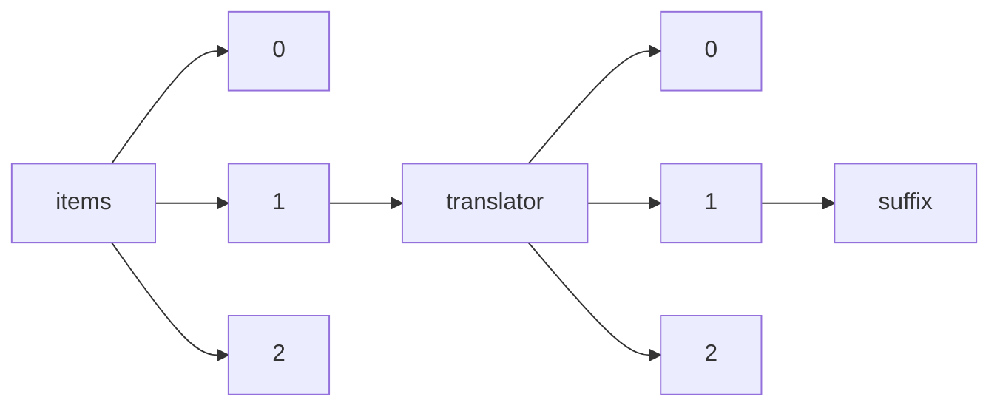

!!! warning "This document is not official Crossref documentation"
# Suffix
PATH = items/array/translator/array/suffix(1)  
Occurs 14 times  
Unique values: 12  
{ .annotate }

1. A route to an element, for example:  
   The route "items/array/translator/array/suffix" corresponds to navigating through the JSON indices as  
   ["items"][0]["translator"][0]["suffix"]  

| **Row** | **Value** `String` | **Count** `Int64` |
|--------:|----------------------:|---------------------:|
| **1**   | Jr.                   | 2                    |
| **2**   | MRes (c)              | 2                    |
| **3**   | M.Sc.                 | 1                    |
| **4**   | Israel Pro            | 1                    |
| **5**   | , translat            | 1                    |
| **6**   | de                    | 1                    |
| **7**   | S.J.                  | 1                    |
| **8**   | SJ                    | 1                    |
| **9**   | PhD                   | 1                    |
| **10**  | BA                    | 1                    |
| **11**  | II                    | 1                    |
| **12**  | fils                  | 1                    |

