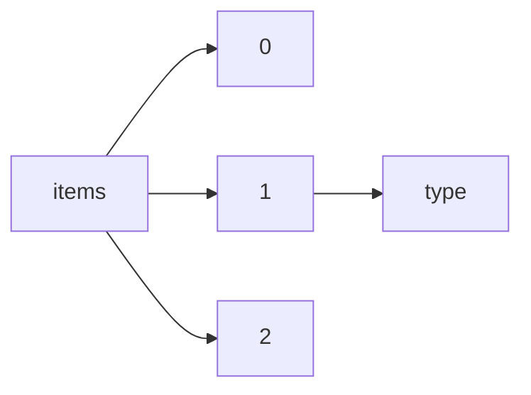

!!! warning "This document is not official Crossref documentation"
# Type
PATH = items/array/type(1)  
Occurs 143 467 119 times  
Unique values: 30  
{ .annotate }

1. A route to an element, for example:  
   The route "items/array/type" corresponds to navigating through the JSON indices as  
   ["items"][0]["type"]  

| **Row** | **Value** `String` | **Count** `Int64` |
|--------:|----------------------:|---------------------:|
| **1**   | journal-article       | 99 408 771           |
| **2**   | book-chapter          | 19 488 325           |
| **3**   | proceedings-article   | 7 647 156            |
| **4**   | component             | 6 104 394            |
| **5**   | dataset               | 2 624 489            |
| **6**   | posted-content        | 1 185 986            |
| **7**   | reference-entry       | 1 079 536            |
| **8**   | journal-issue         | 1 020 694            |
| **9**   | book                  | 996 671              |
| **10**  | other                 | 774 818              |
| **11**  | report                | 724 258              |
| **12**  | monograph             | 585 355              |
| **13**  | dissertation          | 575 616              |
| **14**  | standard              | 367 124              |
| **15**  | peer-review           | 348 490              |
| **16**  | reference-book        | 220 045              |
| **17**  | grant                 | 76 606               |
| **18**  | proceedings           | 61 818               |
| **19**  | journal               | 52 118               |
| **20**  | edited-book           | 50 494               |
| **21**  | book-section          | 20 380               |
| **22**  | report-series         | 17 946               |
| **23**  | book-part             | 17 801               |
| **24**  | journal-volume        | 8 422                |
| **25**  | report-component      | 3 997                |
| **26**  | book-series           | 3 128                |
| **27**  | database              | 1 887                |
| **28**  | book-set              | 427                  |
| **29**  | proceedings-series    | 315                  |
| **30**  | book-track            | 52                   |

