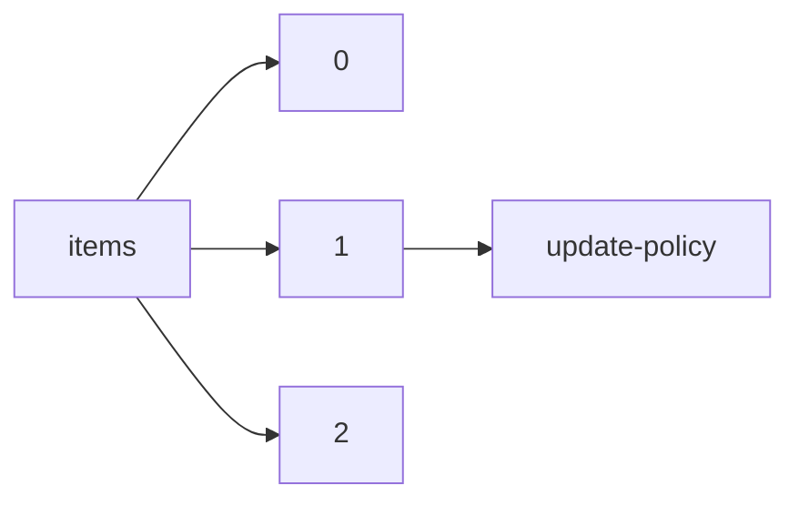

!!! warning "This document is not official Crossref documentation"
# Update-policy
PATH = items/array/update-policy(1)  
Occurs 21 253 527 times  
Unique values: > 999  
{ .annotate }

1. A route to an element, for example:  
   The route "items/array/update-policy" corresponds to navigating through the JSON indices as  
   ["items"][0]["update-policy"]  

!!! note "Due to current limitations, only the first 1,000 unique values are counted."

| **Row** | **Value** `String`                                                      | **Count** `Int64` |
|--------:|---------------------------------------------------------------------------:|---------------------:|
| **1**   | http://dx.doi.org/10.1016/elsevier\_cm\_policy                             | 6 002 854            |
| **2**   | http://dx.doi.org/10.1007/springer\_crossmark\_policy                      | 5 583 176            |
| **3**   | http://dx.doi.org/10.1080/tandf\_crossmark\_01                             | 1 388 539            |
| **4**   | http://dx.doi.org/10.1177/sage-journals-update-policy                      | 924 065              |
| **5**   | http://dx.doi.org/10.1002/crossmark\_policy                                | 881 165              |
| **6**   | http://dx.doi.org/10.1088/crossmark-policy                                 | 605 323              |
| **7**   | http://dx.doi.org/10.1145/crossmark-policy                                 | 492 658              |
| **8**   | http://dx.doi.org/10.3389/crossmark-policy                                 | 392 573              |
| **9**   | http://dx.doi.org/10.1039/rsc\_crossmark\_policy                           | 341 840              |
| **10**  | http://dx.doi.org/10.1136/crossmarkpolicy                                  | 324 175              |
| **11**  | http://dx.doi.org/10.1128/asmj-crossmark-policy-page                       | 307 697              |
| **12**  | http://dx.doi.org/10.1115/crossmarkpolicy-asme                             | 304 519              |
| **13**  | http://dx.doi.org/10.1371/journal.pone.corrections\_policy                 | 280 951              |
| **14**  | http://dx.doi.org/10.21608/crossmark\_policy                               | 266 658              |
| **15**  | http://dx.doi.org/10.2514/aiaa\_crossmarkpolicy                            | 247 986              |
| **16**  | http://dx.doi.org/10.1063/aip-crossmark-policy-page                        | 210 425              |
| **17**  | http://dx.doi.org/10.1017/policypage                                       | 199 084              |
| **18**  | http://dx.doi.org/10.1158/crossmark\_policy                                | 176 641              |
| **19**  | http://dx.doi.org/10.1182/blood.2019cm0000                                 | 172 358              |
| **20**  | http://dx.doi.org/10.1073/pnas.cm10313                                     | 156 797              |
| **21**  | http://dx.doi.org/10.1042/crossmark\_policy                                | 113 128              |
| **22**  | http://dx.doi.org/10.1107/cm\_01                                           | 111 527              |
| **23**  | http://dx.doi.org/10.1103/crossmark-policy                                 | 110 818              |
| **24**  | http://dx.doi.org/10.1161/crossmarkpolicy                                  | 86 285               |
| **25**  | http://dx.doi.org/10.1061/do.news.20190416.0001                            | 63 147               |
| **26**  | http://dx.doi.org/10.1360/scp-crossmark-policy-page                        | 58 227               |
| **27**  | http://dx.doi.org/10.2337/ada-journal-policies                             | 53 214               |
| **28**  | http://dx.doi.org/10.3923/crossmark-policy                                 | 47 258               |
| **29**  | http://dx.doi.org/10.1212/crossmarkpolicy                                  | 45 110               |
| **30**  | http://dx.doi.org/10.7566/jps\_crossmarkpolicy                             | 44 101               |
| **31**  | http://dx.doi.org/10.2166/iwapcrossmarkpolicypage                          | 41 952               |
| **32**  | http://dx.doi.org/10.1183/ers-crossmark-policy                             | 39 958               |
| **33**  | http://dx.doi.org/10.1200/crossmark                                        | 39 746               |
| **34**  | http://dx.doi.org/10.1098/crossmark-policy                                 | 38 999               |
| **35**  | http://dx.doi.org/10.21037/ame\_crossmark\_policy                          | 37 954               |
| **36**  | http://dx.doi.org/10.2174/bsp\_crossmark\_policy                           | 35 779               |
| **37**  | http://dx.doi.org/10.1364/crossmark\_policy                                | 31 697               |
| **38**  | http://dx.doi.org/10.1083/jcb.crossmarkpolicy                              | 27 696               |
| **39**  | http://dx.doi.org/10.17816/crossmarkpolicy2018                             | 27 608               |
| **40**  | http://dx.doi.org/10.1364/osa\_crossmark\_policy                           | 27 491               |
| **41**  | http://dx.doi.org/10.1530/crossmarkpolicy-1                                | 27 263               |
| **42**  | http://dx.doi.org/10.5840/pdc20121120                                      | 26 110               |
| **43**  | http://dx.doi.org/10.1084/jem.crossmarkpolicy                              | 25 334               |
| **44**  | http://dx.doi.org/10.5897/crossmark\_policy                                | 21 681               |
| **45**  | http://dx.doi.org/10.35940/beiesp.crossmarkpolicy                          | 21 486               |
| **46**  | http://dx.doi.org/10.1186/isrctn\_crossmark\_policy                        | 20 202               |
| **47**  | http://dx.doi.org/10.4236/scirp.2020.crossmarkpolicy                       | 18 592               |
| **48**  | http://dx.doi.org/10.33899/crossmark\_policy                               | 14 756               |
| **49**  | http://dx.doi.org/10.1530/crossmarkpolicy-5                                | 12 909               |
| **50**  | http://dx.doi.org/10.1149/ecs-crossmark-policy                             | 12 700               |
| **51**  | http://dx.doi.org/10.15405/europeanpublisher\_crossmark\_policy            | 12 297               |
| **52**  | http://dx.doi.org/10.18231/ip-innovative-publication-crossmark-policy      | 11 761               |
| **53**  | http://dx.doi.org/10.12688/f1000research.crossmark-policy                  | 10 775               |
| **54**  | http://dx.doi.org/10.2174/crossmark\_policy                                | 10 581               |
| **55**  | http://dx.doi.org/10.1371/journal.pntd.corrections\_policy                 | 10 569               |
| **56**  | http://dx.doi.org/10.1371/journal.ppat.corrections\_policy                 | 10 171               |
| **57**  | http://dx.doi.org/10.1371/journal.pgen.corrections\_policy                 | 10 122               |
| **58**  | http://dx.doi.org/10.1371/journal.pcbi.corrections\_policy                 | 9 778                |
| **59**  | http://dx.doi.org/10.1085/jgp.crossmarkpolicy                              | 9 156                |
| **60**  | http://dx.doi.org/10.1162/mitpressjournals.corrections.policy              | 9 067                |
| **61**  | http://dx.doi.org/10.4097/crossmark\_policy                                | 8 885                |
| **62**  | http://dx.doi.org/10.3348/crossmark\_policy                                | 8 836                |
| **63**  | http://dx.doi.org/10.1530/rep/crossmarkpolicy                              | 8 658                |
| **64**  | http://dx.doi.org/10.5812/crossmark\_update\_policy                        | 8 609                |
| **65**  | http://dx.doi.org/10.32604/tsp-crossmarkpolicy                             | 8 510                |
| **66**  | http://dx.doi.org/10.1556/policypage.crossmark.crossref.1                  | 8 094                |
| **67**  | http://dx.doi.org/10.25259/crossmark\_policy                               | 8 026                |
| **68**  | http://dx.doi.org/10.1190/crossmark-policy                                 | 7 758                |
| **69**  | http://dx.doi.org/10.3346/crossmark\_policy                                | 7 338                |
| **70**  | http://dx.doi.org/10.2807/1560-7917.es.crp2020                             | 7 039                |
| **71**  | http://dx.doi.org/10.11604/pamj.2016.07.30.0001                            | 6 825                |
| **72**  | http://dx.doi.org/10.1371/journal.pbio.corrections\_policy                 | 6 769                |
| **73**  | http://dx.doi.org/10.34172/crossmark\_policy                               | 6 412                |
| **74**  | http://dx.doi.org/10.5555/crossmark\_policy                                | 6 216                |
| **75**  | http://dx.doi.org/10.29252/crossmark-policy                                | 6 050                |
| **76**  | http://dx.doi.org/10.13003/0pyd3js                                         | 5 687                |
| **77**  | http://dx.doi.org/10.18280/crossmarkpolicy                                 | 5 589                |
| **78**  | http://dx.doi.org/10.17227/upn.politicacrossmark                           | 5 409                |
| **79**  | http://dx.doi.org/10.3349/crossmark\_policy                                | 5 194                |
| **80**  | http://dx.doi.org/10.4070/crossmark\_policy                                | 5 143                |
| **81**  | http://dx.doi.org/10.1371/journal.pmed.corrections\_policy                 | 5 032                |
| **82**  | http://dx.doi.org/10.1152/aps-crossmark-policy                             | 5 018                |
| **83**  | http://dx.doi.org/10.1164/crossmarkpolicies                                | 4 890                |
| **84**  | http://dx.doi.org/10.15171/crossmark\_policy                               | 4 879                |
| **85**  | http://dx.doi.org/10.14341/crossmarkpolicy2018                             | 4 726                |
| **86**  | http://dx.doi.org/10.32598/nsp.crossmark-policy                            | 4 649                |
| **87**  | http://dx.doi.org/10.1302/crossmark-policy                                 | 4 483                |
| **88**  | http://dx.doi.org/10.4046/crossmark\_policy                                | 4 462                |
| **89**  | http://dx.doi.org/10.23937/clinmed-crossmark-policy                        | 4 461                |
| **90**  | http://dx.doi.org/10.17352/crossmark-policy                                | 4 312                |
| **91**  | http://dx.doi.org/10.29121/granthaalayah-crossmark-policy                  | 3 798                |
| **92**  | http://dx.doi.org/10.15406/crossmark-policy                                | 3 666                |
| **93**  | http://dx.doi.org/10.1144/crossmark-policy                                 | 3 620                |
| **94**  | http://dx.doi.org/10.24200/crossmark\_policy                               | 3 535                |
| **95**  | http://dx.doi.org/10.1105/tpc.16.cmpolicy                                  | 3 283                |
| **96**  | http://dx.doi.org/10.5021/crossmark\_policy                                | 3 110                |
| **97**  | http://dx.doi.org/10.4040/crossmark\_policy                                | 3 100                |
| **98**  | http://dx.doi.org/10.22436/isrp\_crossmark\_policy                         | 2 853                |
| **99**  | http://dx.doi.org/10.1074/jbc.f110.005975                                  | 2 705                |
| **100** | http://dx.doi.org/10.20517/oae.crossmark.policy                            | 2 629                |
| **101** | http://dx.doi.org/10.3740/mrsk/mrsk.policy                                 | 2 547                |
| **102** | http://dx.doi.org/10.31483/crossmarkpolicysreda                            | 2 532                |
| **103** | http://dx.doi.org/10.30574/wjarr.ourcrossmarkpolicy                        | 2 493                |
| **104** | http://dx.doi.org/10.12688/wellcomeopenres.crossmark-policy                | 2 490                |
| **105** | http://dx.doi.org/10.12671/crossmark\_policy                               | 2 313                |
| **106** | http://dx.doi.org/10.18488/crossmarkpolicypage.1001                        | 2 289                |
| **107** | http://dx.doi.org/10.33762/crossmark\_policy                               | 2 273                |
| **108** | http://dx.doi.org/10.5713/crossmark\_policy                                | 2 245                |
| **109** | http://dx.doi.org/10.3310/crossmarkpolicy                                  | 2 209                |
| **110** | http://dx.doi.org/10.15562/ejournals.v1i1.01                               | 2 199                |
| **111** | http://dx.doi.org/10.18488/crossmarkpolicypage.1002                        | 2 049                |
| **112** | http://dx.doi.org/10.3904/crossmark\_policy                                | 2 011                |
| **113** | http://dx.doi.org/10.3938/crossmark\_policy                                | 1 995                |
| **114** | http://dx.doi.org/10.5185/crossmark\_policy                                | 1 974                |
| **115** | http://dx.doi.org/10.24833/2071-8160-2020-crossmark                        | 1 902                |
| **116** | http://dx.doi.org/10.21834/crossmark\_policy                               | 1 900                |
| **117** | http://dx.doi.org/10.3390/mdpi\_crossmark\_policy                          | 1 887                |
| **118** | http://dx.doi.org/10.21468/scipost.crossmarkpolicy                         | 1 879                |
| **119** | http://dx.doi.org/10.3343/crossmark\_policy                                | 1 839                |
| **120** | http://dx.doi.org/10.1530/crossmarkpolicy-6                                | 1 827                |
| **121** | http://dx.doi.org/10.3802/crossmark\_policy                                | 1 826                |
| **122** | http://dx.doi.org/10.18502/knecrossmarkpolicy                              | 1 824                |
| **123** | http://dx.doi.org/10.3348/crossmark\_policy\_jksr                          | 1 786                |
| **124** | http://dx.doi.org/10.3846/jcem\_policy                                     | 1 730                |
| **125** | http://dx.doi.org/10.7324/japs.crossmark                                   | 1 704                |
| **126** | http://dx.doi.org/10.12701/crossmark\_policy                               | 1 673                |
| **127** | http://dx.doi.org/10.21595/jve.crossmarkpolicy                             | 1 665                |
| **128** | http://dx.doi.org/10.3916/crossmark-policy                                 | 1 658                |
| **129** | http://dx.doi.org/10.35420/crossmark\_policy                               | 1 654                |
| **130** | http://dx.doi.org/10.30684/crossmark\_policy                               | 1 625                |
| **131** | http://dx.doi.org/10.4142/crossmark\_policy                                | 1 614                |
| **132** | http://dx.doi.org/10.3354/policy                                           | 1 576                |
| **133** | http://dx.doi.org/10.1093/policy                                           | 1 571                |
| **134** | http://dx.doi.org/10.2340/adv\_crossmark\_policy                           | 1 563                |
| **135** | http://dx.doi.org/10.4111/crossmark\_policy                                | 1 524                |
| **136** | http://dx.doi.org/10.17533/udea.crossmark                                  | 1 514                |
| **137** | http://dx.doi.org/10.5051/crossmark\_policy                                | 1 480                |
| **138** | http://dx.doi.org/10.30574/gscbps.ourcrossmarkpolicy                       | 1 430                |
| **139** | http://dx.doi.org/10.21833/ijaas-crossmark                                 | 1 415                |
| **140** | http://dx.doi.org/10.5468/crossmark\_policy                                | 1 372                |
| **141** | http://dx.doi.org/10.4143/crossmark\_policy                                | 1 357                |
| **142** | http://dx.doi.org/10.24875/gmm.policy                                      | 1 339                |
| **143** | http://dx.doi.org/10.5090/crossmark\_policy                                | 1 306                |
| **144** | http://dx.doi.org/10.4048/crossmark\_policy                                | 1 296                |
| **145** | http://dx.doi.org/10.12688/mep.crossmark-policy                            | 1 280                |
| **146** | http://dx.doi.org/10.29328/crossmark-policy                                | 1 261                |
| **147** | http://dx.doi.org/10.4168/crossmark\_policy                                | 1 232                |
| **148** | http://dx.doi.org/10.21595/vp.crossmarkpolicy                              | 1 192                |
| **149** | http://dx.doi.org/10.37653/crossmark\_policy                               | 1 177                |
| **150** | http://dx.doi.org/10.9728/crossmark\_policy                                | 1 168                |
| **151** | http://dx.doi.org/10.9798/crossmark\_policy                                | 1 161                |
| **152** | http://dx.doi.org/10.4491/crossmark\_policy                                | 1 152                |
| **153** | http://dx.doi.org/10.12816/crossmark\_policy                               | 1 145                |
| **154** | http://dx.doi.org/10.4162/crossmark\_policy                                | 1 145                |
| **155** | http://dx.doi.org/10.4250/crossmark\_policy                                | 1 130                |
| **156** | http://dx.doi.org/10.5056/crossmark\_policy                                | 1 129                |
| **157** | http://dx.doi.org/10.1530/crossmarkpolicy-10                               | 1 127                |
| **158** | http://dx.doi.org/10.34133/aaas\_crossmark                                 | 1 121                |
| **159** | http://dx.doi.org/10.23949/crossmark\_policy                               | 1 111                |
| **160** | http://dx.doi.org/10.36959/scholars-crossmark-policy                       | 1 082                |
| **161** | http://dx.doi.org/10.5395/crossmark\_policy                                | 1 082                |
| **162** | http://dx.doi.org/10.3846/transport\_policy                                | 1 076                |
| **163** | http://dx.doi.org/10.9770/jesi/crossmark                                   | 1 070                |
| **164** | http://dx.doi.org/10.1371/journal.pgph.corrections\_policy                 | 1 068                |
| **165** | http://dx.doi.org/10.11110/crossmark\_policy                               | 1 062                |
| **166** | http://dx.doi.org/10.14801/crossmark\_policy                               | 1 061                |
| **167** | http://dx.doi.org/10.5223/crossmark\_policy                                | 1 053                |
| **168** | http://dx.doi.org/10.3347/crossmark\_policy                                | 1 038                |
| **169** | http://dx.doi.org/10.5213/crossmark\_policy                                | 1 037                |
| **170** | http://dx.doi.org/10.3846/tede\_policy                                     | 1 037                |
| **171** | http://dx.doi.org/10.3846/mla\_policy                                      | 1 021                |
| **172** | http://dx.doi.org/10.22226/2410-3535-crossmark-policy                      | 1 019                |
| **173** | http://dx.doi.org/10.3846/jbem\_policy                                     | 1 011                |
| **174** | http://dx.doi.org/10.4055/crossmark\_policy                                | 1 001                |
| **175** | http://dx.doi.org/10.14397/crossmark\_policy                               | 994                  |
| **176** | http://dx.doi.org/10.20448/crossmarkpolicypage.100                         | 987                  |
| **177** | http://dx.doi.org/10.26508/lsa.crossmarkpolicy                             | 975                  |
| **178** | http://dx.doi.org/10.37652/crossmark\_policy                               | 975                  |
| **179** | http://dx.doi.org/10.13000/crossmark\_policy                               | 971                  |
| **180** | http://dx.doi.org/10.21603/crossmark\_policy                               | 960                  |
| **181** | http://dx.doi.org/10.4093/crossmark\_policy                                | 957                  |
| **182** | http://dx.doi.org/10.5946/crossmark\_policy                                | 947                  |
| **183** | http://dx.doi.org/10.14775/crossmark\_policy                               | 938                  |
| **184** | http://dx.doi.org/10.7837/crossmark\_policy                                | 934                  |
| **185** | http://dx.doi.org/10.12815/crossmark\_policy                               | 927                  |
| **186** | http://dx.doi.org/10.12965/crossmark\_policy                               | 925                  |
| **187** | http://dx.doi.org/10.36959/scholars.direct/crossmark-policy.php            | 924                  |
| **188** | http://dx.doi.org/10.36691/crossmarkpolicy2021                             | 917                  |
| **189** | http://dx.doi.org/10.32894/crossmark\_policy                               | 909                  |
| **190** | http://dx.doi.org/10.3846/mma\_policy                                      | 904                  |
| **191** | http://dx.doi.org/10.5230/crossmark\_policy                                | 900                  |
| **192** | http://dx.doi.org/10.18093/0869-0189-crossmark                             | 894                  |
| **193** | http://dx.doi.org/10.3988/crossmark\_policy                                | 891                  |
| **194** | http://dx.doi.org/10.3345/crossmark\_policy                                | 877                  |
| **195** | http://dx.doi.org/10.34256/iorpresscrossmarkpolicy                         | 872                  |
| **196** | http://dx.doi.org/10.4110/crossmark\_policy                                | 866                  |
| **197** | http://dx.doi.org/10.5322/crossmark\_policy                                | 862                  |
| **198** | http://dx.doi.org/10.7243/crossmark-policy                                 | 858                  |
| **199** | http://dx.doi.org/10.11637/crossmark\_policy                               | 847                  |
| **200** | http://dx.doi.org/10.7324/jabb.crossmark                                   | 841                  |
| **201** | http://dx.doi.org/10.3341/crossmark\_policy                                | 840                  |
| **202** | http://dx.doi.org/10.31703/gssr-correction-policy                          | 838                  |
| **203** | http://dx.doi.org/10.17159/sajs.2016/crossmark                             | 832                  |
| **204** | http://dx.doi.org/10.18006/jebas.crossmarkpolicy                           | 825                  |
| **205** | http://dx.doi.org/10.5009/crossmark\_policy                                | 824                  |
| **206** | http://dx.doi.org/10.32649/crossmark\_policy                               | 822                  |
| **207** | http://dx.doi.org/10.31616/crossmark\_policy                               | 822                  |
| **208** | http://dx.doi.org/10.1530/crossmarkpolicy-2                                | 811                  |
| **209** | http://dx.doi.org/10.31910/rudca.ruadc-crossmark-policy                    | 810                  |
| **210** | http://dx.doi.org/10.7736/crossmark\_policy                                | 805                  |
| **211** | http://dx.doi.org/10.13106/crossmark\_policy                               | 803                  |
| **212** | http://dx.doi.org/10.5217/crossmark\_policy                                | 800                  |
| **213** | http://dx.doi.org/10.1098/crossmarkpolicy                                  | 800                  |
| **214** | http://dx.doi.org/10.24271/crossmark\_policy                               | 798                  |
| **215** | http://dx.doi.org/10.17555/crossmark\_policy                               | 793                  |
| **216** | http://dx.doi.org/10.21823/crossmarkpolicy                                 | 791                  |
| **217** | http://dx.doi.org/10.14710/empati.crossmark                                | 786                  |
| **218** | http://dx.doi.org/10.24269/crossmark\_policy                               | 784                  |
| **219** | http://dx.doi.org/10.24875/ciru.policy                                     | 783                  |
| **220** | http://dx.doi.org/10.4163/crossmark\_policy                                | 781                  |
| **221** | http://dx.doi.org/10.30773/crossmark\_policy                               | 777                  |
| **222** | http://dx.doi.org/10.14740/elmerpress-crossmark-policy                     | 775                  |
| **223** | http://dx.doi.org/10.7855/crossmark\_policy                                | 770                  |
| **224** | http://dx.doi.org/10.17340/crossmark\_policy                               | 766                  |
| **225** | http://dx.doi.org/10.5964/psychopen.cmp                                    | 765                  |
| **226** | http://dx.doi.org/10.22246/crossmark\_policy                               | 762                  |
| **227** | http://dx.doi.org/10.5515/crossmark\_policy                                | 762                  |
| **228** | http://dx.doi.org/10.3342/crossmark\_policy                                | 760                  |
| **229** | http://dx.doi.org/10.9787/crossmark\_policy                                | 758                  |
| **230** | http://dx.doi.org/10.9786/crossmark\_policy                                | 756                  |
| **231** | http://dx.doi.org/10.31254/biomed-crossmark-policy                         | 745                  |
| **232** | http://dx.doi.org/10.3803/crossmark\_policy                                | 744                  |
| **233** | http://dx.doi.org/10.47176/mjiri/crossmark\_policy                         | 742                  |
| **234** | http://dx.doi.org/10.5999/crossmark\_policy                                | 740                  |
| **235** | http://dx.doi.org/10.4178/crossmark\_policy                                | 740                  |
| **236** | http://dx.doi.org/10.4047/crossmark\_policy                                | 739                  |
| **237** | http://dx.doi.org/10.3946/crossmark\_policy                                | 737                  |
| **238** | http://dx.doi.org/10.5572/crossmark\_policy                                | 732                  |
| **239** | http://dx.doi.org/10.4014/crossmark\_policy                                | 727                  |
| **240** | http://dx.doi.org/10.4062/crossmark\_policy                                | 718                  |
| **241** | http://dx.doi.org/10.9758/crossmark\_policy                                | 711                  |
| **242** | http://dx.doi.org/10.29221/crossmark\_policy                               | 704                  |
| **243** | http://dx.doi.org/10.2340/jrm\_crossmark\_policy                           | 700                  |
| **244** | http://dx.doi.org/10.29121/ijetmr-crossmark-policy                         | 699                  |
| **245** | http://dx.doi.org/10.1530/crossmarkpolicy-8                                | 699                  |
| **246** | http://dx.doi.org/10.14776/crossmark\_policy                               | 699                  |
| **247** | http://dx.doi.org/10.11627/crossmark\_policy                               | 679                  |
| **248** | http://dx.doi.org/10.3344/crossmark\_policy                                | 670                  |
| **249** | http://dx.doi.org/10.22376/ijpbs/ijlpr.correctionsandretractions           | 669                  |
| **250** | http://dx.doi.org/10.12688/gatesopenres.crossmark-policy                   | 668                  |
| **251** | http://dx.doi.org/10.12963/crossmark\_policy                               | 664                  |
| **252** | http://dx.doi.org/10.7467/crossmark\_policy                                | 661                  |
| **253** | http://dx.doi.org/10.5125/crossmark\_policy                                | 658                  |
| **254** | http://dx.doi.org/10.4132/crossmark\_policy                                | 656                  |
| **255** | http://dx.doi.org/10.3340/crossmark\_policy                                | 651                  |
| **256** | http://dx.doi.org/10.14245/crossmark\_policy                               | 648                  |
| **257** | http://dx.doi.org/10.32390/ksmer.policy                                    | 644                  |
| **258** | http://dx.doi.org/10.31703/grr-correction-policy                           | 643                  |
| **259** | http://dx.doi.org/10.30574/gscarr.ourcrossmarkpolicy                       | 639                  |
| **260** | http://dx.doi.org/10.36233/0372-9311-crossmark                             | 637                  |
| **261** | http://dx.doi.org/10.22331/q-crossmark-policy-page                         | 636                  |
| **262** | http://dx.doi.org/10.5850/crossmark\_policy                                | 635                  |
| **263** | http://dx.doi.org/10.21215/crossmark\_policy                               | 625                  |
| **264** | http://dx.doi.org/10.11002/crossmark\_policy                               | 622                  |
| **265** | http://dx.doi.org/10.7475/crossmark\_policy                                | 620                  |
| **266** | http://dx.doi.org/10.20469/crossmark\_policy                               | 616                  |
| **267** | http://dx.doi.org/10.3961/crossmark\_policy                                | 614                  |
| **268** | http://dx.doi.org/10.3846/jeelm\_policy                                    | 612                  |
| **269** | http://dx.doi.org/10.12688/hrbopenres.crossmark-policy                     | 605                  |
| **270** | http://dx.doi.org/10.12793/crossmark\_policy                               | 602                  |
| **271** | http://dx.doi.org/10.13004/crossmark\_policy                               | 601                  |
| **272** | http://dx.doi.org/10.14710/jksa.crossmark                                  | 601                  |
| **273** | http://dx.doi.org/10.5483/crossmark\_policy                                | 598                  |
| **274** | http://dx.doi.org/10.12799/crossmark\_policy                               | 597                  |
| **275** | http://dx.doi.org/10.17208/crossmark\_policy                               | 592                  |
| **276** | http://dx.doi.org/10.17245/crossmark\_policy                               | 592                  |
| **277** | http://dx.doi.org/10.11628/crossmark\_policy                               | 590                  |
| **278** | http://dx.doi.org/10.13047/crossmark\_policy                               | 584                  |
| **279** | http://dx.doi.org/10.4266/crossmark\_policy                                | 577                  |
| **280** | http://dx.doi.org/10.11626/crossmark\_policy                               | 576                  |
| **281** | http://dx.doi.org/10.9724/crossmark\_policy                                | 576                  |
| **282** | http://dx.doi.org/10.3839/crossmark\_policy                                | 573                  |
| **283** | http://dx.doi.org/10.35609/gjbssr/crossmark                                | 572                  |
| **284** | http://dx.doi.org/10.5423/crossmark\_policy                                | 569                  |
| **285** | http://dx.doi.org/10.1530/crossmarkpolicy-11                               | 567                  |
| **286** | http://dx.doi.org/10.3365/crossmark\_policy                                | 555                  |
| **287** | http://dx.doi.org/10.37871/jbres.policy                                    | 548                  |
| **288** | http://dx.doi.org/10.12688/openreseurope.crossmark-policy                  | 544                  |
| **289** | http://dx.doi.org/10.13005/bpj/cm\_policy                                  | 544                  |
| **290** | http://dx.doi.org/10.1530/crossmarkpolicy-7                                | 542                  |
| **291** | http://dx.doi.org/10.14705/rpnet.crossmark\_policy                         | 539                  |
| **292** | http://dx.doi.org/10.3947/crossmark\_policy                                | 539                  |
| **293** | http://dx.doi.org/10.7734/jcoseik.policy                                   | 536                  |
| **294** | http://dx.doi.org/10.3350/crossmark\_policy                                | 531                  |
| **295** | http://dx.doi.org/10.25050/crossmark\_policy                               | 529                  |
| **296** | http://dx.doi.org/10.16956/crossmark\_policy                               | 529                  |
| **297** | http://dx.doi.org/10.30574/ijsra.ourcrossmarkpolicy                        | 528                  |
| **298** | http://dx.doi.org/10.13065/jksdh.policy                                    | 525                  |
| **299** | http://dx.doi.org/10.21848/crossmark\_policy                               | 518                  |
| **300** | http://dx.doi.org/10.4150/crossmark\_policy                                | 517                  |
| **301** | http://dx.doi.org/10.29328/journal                                         | 514                  |
| **302** | http://dx.doi.org/10.3897/crossmark-policy                                 | 510                  |
| **303** | http://dx.doi.org/10.12791/phpf.policy                                     | 509                  |
| **304** | http://dx.doi.org/10.7233/crossmark\_policy                                | 505                  |
| **305** | http://dx.doi.org/10.47392/crossmark\_policy                               | 505                  |
| **306** | http://dx.doi.org/10.12811/crossmark\_policy                               | 502                  |
| **307** | http://dx.doi.org/10.22730/crossmark\_policy                               | 501                  |
| **308** | http://dx.doi.org/10.5115/crossmark\_policy                                | 501                  |
| **309** | http://dx.doi.org/10.17085/crossmark\_policy                               | 499                  |
| **310** | http://dx.doi.org/10.13103/crossmark\_policy                               | 498                  |
| **311** | http://dx.doi.org/10.5805/crossmark\_policy                                | 497                  |
| **312** | http://dx.doi.org/10.3846/ijspm\_policy                                    | 497                  |
| **313** | http://dx.doi.org/10.14366/crossmark\_policy                               | 495                  |
| **314** | http://dx.doi.org/10.3393/crossmark\_policy                                | 494                  |
| **315** | http://dx.doi.org/10.1074/mcp.f110.005975                                  | 489                  |
| **316** | http://dx.doi.org/10.12719/crossmark\_policy                               | 488                  |
| **317** | http://dx.doi.org/10.17946/crossmark\_policy                               | 487                  |
| **318** | http://dx.doi.org/10.15649/cuidarte.crossmark                              | 486                  |
| **319** | http://dx.doi.org/10.15746/crossmark\_policy                               | 485                  |
| **320** | http://dx.doi.org/10.6107/crossmark\_policy                                | 483                  |
| **321** | http://dx.doi.org/10.11001/crossmark\_policy                               | 481                  |
| **322** | http://dx.doi.org/10.7705/crossmark                                        | 477                  |
| **323** | http://dx.doi.org/10.33546/crossmark\_policy                               | 473                  |
| **324** | http://dx.doi.org/10.12813/crossmark\_policy                               | 472                  |
| **325** | http://dx.doi.org/10.15324/crossmark\_policy                               | 471                  |
| **326** | http://dx.doi.org/10.26832/24566632                                        | 471                  |
| **327** | http://dx.doi.org/10.24985/crossmark\_policy                               | 469                  |
| **328** | http://dx.doi.org/10.3352/crossmark\_policy                                | 467                  |
| **329** | http://dx.doi.org/10.3746/crossmark\_policy                                | 467                  |
| **330** | http://dx.doi.org/10.22376/ijpbs.correctionsandretractions                 | 466                  |
| **331** | http://dx.doi.org/10.4078/crossmark\_policy                                | 466                  |
| **332** | http://dx.doi.org/10.15296/crossmark\_policy                               | 464                  |
| **333** | http://dx.doi.org/10.13048/crossmark\_policy                               | 463                  |
| **334** | http://dx.doi.org/10.5723/crossmark\_policy                                | 463                  |
| **335** | http://dx.doi.org/10.18857/crossmark\_policy                               | 462                  |
| **336** | http://dx.doi.org/10.13050/crossmark\_policy                               | 461                  |
| **337** | http://dx.doi.org/10.20474/crossmark\_policy                               | 461                  |
| **338** | http://dx.doi.org/10.15441/crossmark\_policy                               | 461                  |
| **339** | http://dx.doi.org/10.30574/wjbphs.ourcrossmarkpolicy                       | 461                  |
| **340** | http://dx.doi.org/10.5534/crossmark\_policy                                | 455                  |
| **341** | http://dx.doi.org/10.14719/crossmarkpolicyhepg                             | 455                  |
| **342** | http://dx.doi.org/10.33552/123456789                                       | 455                  |
| **343** | http://dx.doi.org/10.5338/crossmark\_policy                                | 455                  |
| **344** | http://dx.doi.org/10.5934/crossmark\_policy                                | 455                  |
| **345** | http://dx.doi.org/10.13066/crossmark\_policy                               | 454                  |
| **346** | http://dx.doi.org/10.17495/crossmark\_policy                               | 453                  |
| **347** | http://dx.doi.org/10.14218/crossmark\_policy                               | 452                  |
| **348** | http://dx.doi.org/10.14770/crossmark\_policy                               | 452                  |
| **349** | http://dx.doi.org/10.3796/crossmark\_policy                                | 450                  |
| **350** | http://dx.doi.org/10.3846/jau\_policy                                      | 448                  |
| **351** | http://dx.doi.org/10.34256/asianresearchassociationcrossmarkpolicy         | 443                  |
| **352** | http://dx.doi.org/10.24875/acm.policy                                      | 443                  |
| **353** | http://dx.doi.org/10.5351/crossmark\_policy                                | 441                  |
| **354** | http://dx.doi.org/10.18869/nrip.crossmark-policy                           | 438                  |
| **355** | http://dx.doi.org/10.33961/crossmark\_policy                               | 436                  |
| **356** | http://dx.doi.org/10.4285/crossmark\_policy                                | 435                  |
| **357** | http://dx.doi.org/10.21053/crossmark\_policy                               | 434                  |
| **358** | http://dx.doi.org/10.5607/crossmark\_policy                                | 433                  |
| **359** | http://dx.doi.org/10.7461/crossmark\_policy                                | 431                  |
| **360** | http://dx.doi.org/10.1194/jlr.f110.005975                                  | 431                  |
| **361** | http://dx.doi.org/10.15283/crossmark\_policy                               | 429                  |
| **362** | http://dx.doi.org/10.6108/crossmark\_policy                                | 429                  |
| **363** | http://dx.doi.org/10.6115/crossmark\_policy                                | 427                  |
| **364** | http://dx.doi.org/10.7745/ksssf.policy                                     | 427                  |
| **365** | http://dx.doi.org/10.9799/crossmark\_policy                                | 425                  |
| **366** | http://dx.doi.org/10.37349/open\_exploration\_crossmark\_policy            | 425                  |
| **367** | http://dx.doi.org/10.4094/crossmark\_policy                                | 423                  |
| **368** | http://dx.doi.org/10.14802/crossmark\_policy                               | 422                  |
| **369** | http://dx.doi.org/10.7181/crossmark\_policy                                | 419                  |
| **370** | http://dx.doi.org/10.12750/crossmark\_policy                               | 417                  |
| **371** | http://dx.doi.org/10.20448/crossmarkpolicypage.10001                       | 416                  |
| **372** | http://dx.doi.org/10.5781/crossmark\_policy                                | 416                  |
| **373** | http://dx.doi.org/10.36610/crossmarkpolicyjsars                            | 413                  |
| **374** | http://dx.doi.org/10.11644/crossmark\_policy                               | 412                  |
| **375** | http://dx.doi.org/10.5758/crossmark\_policy                                | 412                  |
| **376** | http://dx.doi.org/10.3846/aviation\_policy                                 | 412                  |
| **377** | http://dx.doi.org/10.24175/sbd.crossmark.policy                            | 409                  |
| **378** | http://dx.doi.org/10.35371/crossmark\_policy                               | 407                  |
| **379** | http://dx.doi.org/10.5851/crossmark\_policy                                | 406                  |
| **380** | http://dx.doi.org/10.7731/crossmark\_policy                                | 405                  |
| **381** | http://dx.doi.org/10.24875/gamo.policy                                     | 405                  |
| **382** | http://dx.doi.org/10.5467/crossmark\_policy                                | 404                  |
| **383** | http://dx.doi.org/10.18869/acadpub.crossmark-policy                        | 403                  |
| **384** | http://dx.doi.org/10.23876/crossmark\_policy                               | 401                  |
| **385** | http://dx.doi.org/10.14710/ijred.crossmark                                 | 400                  |
| **386** | http://dx.doi.org/10.20408/crossmark\_policy                               | 398                  |
| **387** | http://dx.doi.org/10.30574/gjeta.ourcrossmarkpolicy                        | 395                  |
| **388** | http://dx.doi.org/10.6028/nist-techpubs.crossmark-policy                   | 394                  |
| **389** | http://dx.doi.org/10.5187/crossmark\_policy                                | 392                  |
| **390** | http://dx.doi.org/10.14379/iodp.crossmarkpolicy.2015                       | 392                  |
| **391** | http://dx.doi.org/10.31486/crossmark-policy                                | 392                  |
| **392** | http://dx.doi.org/10.20402/crossmark\_policy                               | 391                  |
| **393** | http://dx.doi.org/10.6065/crossmark\_policy                                | 382                  |
| **394** | http://dx.doi.org/10.11004/crossmark\_policy                               | 379                  |
| **395** | http://dx.doi.org/10.22395/crossmark                                       | 377                  |
| **396** | http://dx.doi.org/10.3846/btp\_crossmark                                   | 377                  |
| **397** | http://dx.doi.org/10.15857/crossmark\_policy                               | 375                  |
| **398** | http://dx.doi.org/10.5853/crossmark\_policy                                | 373                  |
| **399** | http://dx.doi.org/10.5050/crossmark\_policy                                | 371                  |
| **400** | http://dx.doi.org/10.5010/crossmark\_policy                                | 369                  |
| **401** | http://dx.doi.org/10.7733/crossmark\_policy                                | 369                  |
| **402** | http://dx.doi.org/10.4081/jae.crossmark-policy                             | 368                  |
| **403** | http://dx.doi.org/10.14734/crossmark\_policy                               | 368                  |
| **404** | http://dx.doi.org/10.14474/crossmark\_policy                               | 366                  |
| **405** | http://dx.doi.org/10.11623/crossmark\_policy                               | 366                  |
| **406** | http://dx.doi.org/10.14519/crossmark\_policy                               | 365                  |
| **407** | http://dx.doi.org/10.15616/crossmark\_policy                               | 365                  |
| **408** | http://dx.doi.org/10.7570/crossmark\_policy                                | 365                  |
| **409** | http://dx.doi.org/10.7735/crossmark\_policy                                | 363                  |
| **410** | http://dx.doi.org/10.14475/crossmark\_policy                               | 363                  |
| **411** | http://dx.doi.org/10.24875/recic.policy                                    | 360                  |
| **412** | http://dx.doi.org/10.46392/crossmark\_policy                               | 360                  |
| **413** | http://dx.doi.org/10.24875/recice.policy                                   | 358                  |
| **414** | http://dx.doi.org/10.21467/crossmark                                       | 358                  |
| **415** | http://dx.doi.org/10.5155/eurjchem.crossmark\_policy                       | 357                  |
| **416** | http://dx.doi.org/10.13181/mji-cm-policy                                   | 357                  |
| **417** | http://dx.doi.org/10.29052/ijehsr\_cm\_policy                              | 357                  |
| **418** | http://dx.doi.org/10.34256/ijpefscrossmarkpolicy                           | 355                  |
| **419** | http://dx.doi.org/10.3768/rtipress.2019.crossmark.1910                     | 355                  |
| **420** | http://dx.doi.org/10.5792/crossmark\_policy                                | 354                  |
| **421** | http://dx.doi.org/10.9726/crossmark\_policy                                | 353                  |
| **422** | http://dx.doi.org/10.5333/crossmark\_policy                                | 353                  |
| **423** | http://dx.doi.org/10.33844/crossmark\_policy                               | 353                  |
| **424** | http://dx.doi.org/10.29239/sangia.crossmark.policy                         | 352                  |
| **425** | http://dx.doi.org/10.33878/2073-7556-crossmark                             | 352                  |
| **426** | http://dx.doi.org/10.4191/crossmark\_policy                                | 351                  |
| **427** | http://dx.doi.org/10.21501/crossmark                                       | 351                  |
| **428** | http://dx.doi.org/10.15561/pes-crossmark                                   | 349                  |
| **429** | http://dx.doi.org/10.21032/crossmark\_policy                               | 349                  |
| **430** | http://dx.doi.org/10.33262/concienciadigital.crossmark                     | 348                  |
| **431** | http://dx.doi.org/10.24818/ea/cm                                           | 347                  |
| **432** | http://dx.doi.org/10.30699/crossmark                                       | 347                  |
| **433** | http://dx.doi.org/10.24875/acme.policy                                     | 342                  |
| **434** | http://dx.doi.org/10.32468/politica.crossmark.br                           | 341                  |
| **435** | http://dx.doi.org/10.53771/sra.ourcrossmarkpolicy                          | 341                  |
| **436** | http://dx.doi.org/10.12654/crossmark\_policy                               | 340                  |
| **437** | http://dx.doi.org/10.14216/crossmark\_policy                               | 339                  |
| **438** | http://dx.doi.org/10.1556/policypage.crossmark.crossref.2                  | 339                  |
| **439** | http://dx.doi.org/10.14479/crossmark\_policy                               | 339                  |
| **440** | http://dx.doi.org/10.9789/retratacao                                       | 336                  |
| **441** | http://dx.doi.org/10.7180/crossmark\_policy                                | 335                  |
| **442** | http://dx.doi.org/10.4082/crossmark\_policy                                | 334                  |
| **443** | http://dx.doi.org/10.17337/crossmark\_policy                               | 333                  |
| **444** | http://dx.doi.org/10.11614/crossmark\_policy                               | 333                  |
| **445** | http://dx.doi.org/10.7585/crossmark\_policy                                | 332                  |
| **446** | http://dx.doi.org/10.9712/crossmark\_policy                                | 332                  |
| **447** | http://dx.doi.org/10.7851/crossmark\_policy                                | 331                  |
| **448** | http://dx.doi.org/10.15430/crossmark\_policy                               | 328                  |
| **449** | http://dx.doi.org/10.2337/crossmarkpolicy                                  | 327                  |
| **450** | http://dx.doi.org/10.4166/crossmark\_policy                                | 327                  |
| **451** | http://dx.doi.org/10.3846/btp\_policy                                      | 326                  |
| **452** | http://dx.doi.org/10.31703/glr-correction-policy                           | 325                  |
| **453** | http://dx.doi.org/10.12717/crossmark\_policy                               | 324                  |
| **454** | http://dx.doi.org/10.54105/lsp.crossmarkpolicy                             | 324                  |
| **455** | http://dx.doi.org/10.5658/crossmark\_policy                                | 322                  |
| **456** | http://dx.doi.org/10.14405/crossmark\_policy                               | 321                  |
| **457** | http://dx.doi.org/10.13078/crossmark\_policy                               | 319                  |
| **458** | http://dx.doi.org/10.38159/p2020084                                        | 319                  |
| **459** | http://dx.doi.org/10.5124/crossmark\_policy                                | 319                  |
| **460** | http://dx.doi.org/10.7762/crossmark\_policy                                | 318                  |
| **461** | http://dx.doi.org/10.12944/carj.crossmark\_policy.01                       | 317                  |
| **462** | http://dx.doi.org/10.33380/2305-2066-crossmark                             | 316                  |
| **463** | http://dx.doi.org/10.14193/crossmark\_policy                               | 316                  |
| **464** | http://dx.doi.org/10.18325/crossmark\_policy                               | 315                  |
| **465** | http://dx.doi.org/10.5469/crossmark\_policy                                | 314                  |
| **466** | http://dx.doi.org/10.17496/crossmark\_policy                               | 314                  |
| **467** | http://dx.doi.org/10.3846/cs\_policy                                       | 313                  |
| **468** | http://dx.doi.org/10.13104/crossmark\_policy                               | 313                  |
| **469** | http://dx.doi.org/10.53022/oarj.ourcrossmarkpolicy                         | 313                  |
| **470** | http://dx.doi.org/10.14579/crossmark\_policy                               | 312                  |
| **471** | http://dx.doi.org/10.14710/marj.crossmark                                  | 310                  |
| **472** | http://dx.doi.org/10.7739/crossmark\_policy                                | 309                  |
| **473** | http://dx.doi.org/10.24171/crossmark\_policy                               | 309                  |
| **474** | http://dx.doi.org/10.12674/crossmark\_policy                               | 308                  |
| **475** | http://dx.doi.org/10.7856/crossmark\_policy                                | 307                  |
| **476** | http://dx.doi.org/10.46833/reumatologiasp.politica-editorial-rpr-crossmark | 306                  |
| **477** | http://dx.doi.org/10.5535/crossmark\_policy                                | 306                  |
| **478** | http://dx.doi.org/10.9765/crossmark\_policy                                | 306                  |
| **479** | http://dx.doi.org/10.26748/crossmark\_policy                               | 306                  |
| **480** | http://dx.doi.org/10.6087/crossmark\_policy                                | 303                  |
| **481** | http://dx.doi.org/10.4069/crossmark\_policy                                | 303                  |
| **482** | http://dx.doi.org/10.24875/bmhim.policy                                    | 302                  |
| **483** | http://dx.doi.org/10.7783/crossmark\_policy                                | 301                  |
| **484** | http://dx.doi.org/10.6118/crossmark\_policy                                | 301                  |
| **485** | http://dx.doi.org/10.12786/crossmark\_policy                               | 301                  |
| **486** | http://dx.doi.org/10.5397/crossmark\_policy                                | 301                  |
| **487** | http://dx.doi.org/10.21516/2072-0076-crossmark                             | 301                  |
| **488** | http://dx.doi.org/10.15279/crossmark\_policy                               | 300                  |
| **489** | http://dx.doi.org/10.26866/crossmark\_policy                               | 299                  |
| **490** | http://dx.doi.org/10.14368/crossmark\_policy                               | 299                  |
| **491** | http://dx.doi.org/10.12972/kjhst.policy                                    | 298                  |
| **492** | http://dx.doi.org/10.14710/jmr.crossmark                                   | 298                  |
| **493** | http://dx.doi.org/10.5045/crossmark\_policy                                | 294                  |
| **494** | http://dx.doi.org/10.15826/chimtech.crossmarkpolicy                        | 293                  |
| **495** | http://dx.doi.org/10.7836/kses.policy                                      | 291                  |
| **496** | http://dx.doi.org/10.18775/ijmsba.1849-5664-5419.2014.crossmark-policy     | 287                  |
| **497** | http://dx.doi.org/10.16881/crossmark\_policy                               | 286                  |
| **498** | http://dx.doi.org/10.25082/crossmark                                       | 285                  |
| **499** | http://dx.doi.org/10.7774/crossmark\_policy                                | 285                  |
| **500** | http://dx.doi.org/10.24875/ric.policy                                      | 284                  |
| **501** | http://dx.doi.org/10.31696/2618-7043-crossmark                             | 283                  |
| **502** | http://dx.doi.org/10.52660/crossmark\_policy                               | 283                  |
| **503** | http://dx.doi.org/10.20982/tqmp.policy                                     | 281                  |
| **504** | http://dx.doi.org/10.22546/crossmark\_policy                               | 281                  |
| **505** | http://dx.doi.org/10.34133/aaas\_crossmark\_01                             | 281                  |
| **506** | http://dx.doi.org/10.17547/crossmark\_policy                               | 281                  |
| **507** | http://dx.doi.org/10.14710/jiab.crossmark                                  | 281                  |
| **508** | http://dx.doi.org/10.3857/crossmark\_policy                                | 280                  |
| **509** | http://dx.doi.org/10.5933/crossmark\_policy                                | 279                  |
| **510** | http://dx.doi.org/10.3846/gc\_policy                                       | 279                  |
| **511** | http://dx.doi.org/10.5620/crossmark\_policy                                | 279                  |
| **512** | http://dx.doi.org/10.22628/crossmark\_policy                               | 278                  |
| **513** | http://dx.doi.org/10.18528/crossmark\_policy                               | 276                  |
| **514** | http://dx.doi.org/10.21603/2078-8975-2020-crossmark                        | 275                  |
| **515** | http://dx.doi.org/10.7874/crossmark\_policy                                | 274                  |
| **516** | http://dx.doi.org/10.56578/crossmarkpolicy                                 | 273                  |
| **517** | http://dx.doi.org/10.15531/crossmark\_policy                               | 271                  |
| **518** | http://dx.doi.org/10.35840/vibgyor-crossmark-policy                        | 270                  |
| **519** | http://dx.doi.org/10.25289/crossmark\_policy                               | 269                  |
| **520** | http://dx.doi.org/10.5000/crossmark\_policy                                | 269                  |
| **521** | http://dx.doi.org/10.9767/bcrec.crossmark                                  | 266                  |
| **522** | http://dx.doi.org/10.24875/rmo.policy                                      | 266                  |
| **523** | http://dx.doi.org/10.30960/crossmark\_policy                               | 265                  |
| **524** | http://dx.doi.org/10.5808/crossmark\_policy                                | 265                  |
| **525** | http://dx.doi.org/10.31703/gpr-correction-policy                           | 264                  |
| **526** | http://dx.doi.org/10.14406/crossmark\_policy                               | 263                  |
| **527** | http://dx.doi.org/10.6027/crossmark\_policy                                | 262                  |
| **528** | http://dx.doi.org/10.5371/crossmark\_policy                                | 259                  |
| **529** | http://dx.doi.org/10.20879/crossmark\_policy                               | 258                  |
| **530** | http://dx.doi.org/10.29060/taps.crossmark-policy                           | 258                  |
| **531** | http://dx.doi.org/10.24006/crossmark\_policy                               | 256                  |
| **532** | http://dx.doi.org/10.17135/crossmark\_policy                               | 256                  |
| **533** | http://dx.doi.org/10.7316/crossmark\_policy                                | 254                  |
| **534** | http://dx.doi.org/10.7846/crossmark\_policy                                | 254                  |
| **535** | http://dx.doi.org/10.31162/2618-9569-crossmark                             | 253                  |
| **536** | http://dx.doi.org/10.29049/crossmark\_policy                               | 251                  |
| **537** | http://dx.doi.org/10.55085/crossmarkpolicy                                 | 251                  |
| **538** | http://dx.doi.org/10.30944/crossmark                                       | 251                  |
| **539** | http://dx.doi.org/10.14348/crossmark\_policy                               | 250                  |
| **540** | http://dx.doi.org/10.7602/crossmark\_policy                                | 250                  |
| **541** | http://dx.doi.org/10.11620/crossmark\_policy                               | 249                  |
| **542** | http://dx.doi.org/10.1158/aacr-crossmark-policy                            | 249                  |
| **543** | http://dx.doi.org/10.5734/crossmark\_policy                                | 249                  |
| **544** | http://dx.doi.org/10.25189/cadlin.crossmark                                | 248                  |
| **545** | http://dx.doi.org/10.11111/crossmark\_policy                               | 248                  |
| **546** | http://dx.doi.org/10.3326/crossmark-policy-page                            | 247                  |
| **547** | http://dx.doi.org/10.20396/liamescrossmark                                 | 246                  |
| **548** | http://dx.doi.org/10.15187/crossmark\_policy                               | 246                  |
| **549** | http://dx.doi.org/10.14791/crossmark\_policy                               | 244                  |
| **550** | http://dx.doi.org/10.18775/ijied.1849-7551-7020.2015.crossmark-policy-page | 243                  |
| **551** | http://dx.doi.org/10.17079/crossmark\_policy                               | 243                  |
| **552** | http://dx.doi.org/10.24875/rccar.policy                                    | 242                  |
| **553** | http://dx.doi.org/10.17779/crossmark\_policy                               | 242                  |
| **554** | http://dx.doi.org/10.7746/crossmark\_policy                                | 242                  |
| **555** | http://dx.doi.org/10.14196/mjiri.crossmark\_policy                         | 242                  |
| **556** | http://dx.doi.org/10.14815/crossmark\_policy                               | 241                  |
| **557** | http://dx.doi.org/10.7849/crossmark\_policy                                | 241                  |
| **558** | http://dx.doi.org/10.52547/crossmark-policy                                | 241                  |
| **559** | http://dx.doi.org/10.12779/crossmark\_policy                               | 240                  |
| **560** | http://dx.doi.org/10.15412/lexispublisher\_crossmark\_policy               | 240                  |
| **561** | http://dx.doi.org/10.12925/crossmark\_policy                               | 237                  |
| **562** | http://dx.doi.org/10.31703/ger-correction-policy                           | 236                  |
| **563** | http://dx.doi.org/10.17657/crossmark\_policy                               | 236                  |
| **564** | http://dx.doi.org/10.5388/crossmark\_policy                                | 236                  |
| **565** | http://dx.doi.org/10.17241/crossmark\_policy                               | 235                  |
| **566** | http://dx.doi.org/10.21072/mbj.crossmark.policy                            | 235                  |
| **567** | http://dx.doi.org/10.26685/urncst.crossmarkpolicy                          | 235                  |
| **568** | http://dx.doi.org/10.5977/crossmark\_policy                                | 234                  |
| **569** | http://dx.doi.org/10.9715/crossmark\_policy                                | 234                  |
| **570** | http://dx.doi.org/10.25053/retratacao                                      | 233                  |
| **571** | http://dx.doi.org/10.9789/prc/2175-5361                                    | 229                  |
| **572** | http://dx.doi.org/10.22219/kinetik/crossmarkpolicy                         | 229                  |
| **573** | http://dx.doi.org/10.24875/rmoe.policy                                     | 228                  |
| **574** | http://dx.doi.org/10.4235/crossmark\_policy                                | 228                  |
| **575** | http://dx.doi.org/10.3846/cpe\_crossmark                                   | 226                  |
| **576** | http://dx.doi.org/10.7704/crossmark\_policy                                | 225                  |
| **577** | http://dx.doi.org/10.7318/crossmark\_policy                                | 225                  |
| **578** | http://dx.doi.org/10.5385/crossmark\_policy                                | 224                  |
| **579** | http://dx.doi.org/10.17749/2313-7347.crossmark                             | 224                  |
| **580** | http://dx.doi.org/10.21851/crossmark\_policy                               | 224                  |
| **581** | http://dx.doi.org/10.24304/crossmark\_policy                               | 223                  |
| **582** | http://dx.doi.org/10.14581/crossmark\_policy                               | 221                  |
| **583** | http://dx.doi.org/10.4081/ejh.crossmark-policy                             | 220                  |
| **584** | http://dx.doi.org/10.37649/crossmark\_policy                               | 218                  |
| **585** | http://dx.doi.org/10.33794/crossmark\_policy                               | 218                  |
| **586** | http://dx.doi.org/10.5765/crossmark\_policy                                | 217                  |
| **587** | http://dx.doi.org/10.37650/crossmark\_policy                               | 217                  |
| **588** | http://dx.doi.org/10.18700/crossmark\_policy                               | 217                  |
| **589** | http://dx.doi.org/10.36531/crossmark\_policy                               | 217                  |
| **590** | http://dx.doi.org/10.3744/crossmark\_policy                                | 216                  |
| **591** | http://dx.doi.org/10.18786/2072-0505-crossmark                             | 215                  |
| **592** | http://dx.doi.org/10.24088/ijbea-crossmark-policy                          | 215                  |
| **593** | http://dx.doi.org/10.13045/crossmark\_policy                               | 214                  |
| **594** | http://dx.doi.org/10.20540/crossmark\_policy                               | 214                  |
| **595** | http://dx.doi.org/10.4490/crossmark\_policy                                | 214                  |
| **596** | http://dx.doi.org/10.3846/est\_policy                                      | 214                  |
| **597** | http://dx.doi.org/10.5415/crossmark\_policy                                | 214                  |
| **598** | http://dx.doi.org/10.17945/crossmark\_policy                               | 213                  |
| **599** | http://dx.doi.org/10.12790/crossmark\_policy                               | 212                  |
| **600** | http://dx.doi.org/10.7781/crossmark\_policy                                | 211                  |
| **601** | http://dx.doi.org/10.14407/crossmark\_policy                               | 211                  |
| **602** | http://dx.doi.org/10.26446/crossmark\_policy                               | 208                  |
| **603** | http://dx.doi.org/10.12954/crossmark\_policy                               | 207                  |
| **604** | http://dx.doi.org/10.22467/crossmark\_policy                               | 206                  |
| **605** | http://dx.doi.org/10.9766/crossmark\_policy                                | 206                  |
| **606** | http://dx.doi.org/10.1530/crossmarkpolicy-16                               | 205                  |
| **607** | http://dx.doi.org/10.14710/jtsiskom.crossmark                              | 205                  |
| **608** | http://dx.doi.org/10.15690/crossmarkpolocy2020                             | 204                  |
| **609** | http://dx.doi.org/10.20463/crossmark\_policy                               | 204                  |
| **610** | http://dx.doi.org/10.4184/crossmark\_policy                                | 204                  |
| **611** | http://dx.doi.org/10.1530/eje/crossmarkpolicy                              | 204                  |
| **612** | http://dx.doi.org/10.35609/jmmr/crossmark                                  | 202                  |
| **613** | http://dx.doi.org/10.30574/wjaets.ourcrossmarkpolicy                       | 202                  |
| **614** | http://dx.doi.org/10.3846/bme\_policy                                      | 202                  |
| **615** | http://dx.doi.org/10.22425/crossmark\_policy                               | 202                  |
| **616** | http://dx.doi.org/10.24875/arm.policy                                      | 201                  |
| **617** | http://dx.doi.org/10.5269/crossmarkpolicies                                | 200                  |
| **618** | http://dx.doi.org/10.7586/crossmark\_policy                                | 200                  |
| **619** | http://dx.doi.org/10.5656/crossmark\_policy                                | 199                  |
| **620** | http://dx.doi.org/10.7740/crossmark\_policy                                | 198                  |
| **621** | http://dx.doi.org/10.18667/crossmark                                       | 198                  |
| **622** | http://dx.doi.org/10.5653/crossmark\_policy                                | 198                  |
| **623** | http://dx.doi.org/10.46670/crossmark\_policy                               | 197                  |
| **624** | http://dx.doi.org/10.22469/crossmark\_policy                               | 196                  |
| **625** | http://dx.doi.org/10.15758/crossmark\_policy                               | 196                  |
| **626** | http://dx.doi.org/10.18537/mskn.001                                        | 195                  |
| **627** | http://dx.doi.org/10.21886/2308-6424-crossmark                             | 195                  |
| **628** | http://dx.doi.org/10.12688/aasopenres.crossmark-policy                     | 194                  |
| **629** | http://dx.doi.org/10.24875/rmu.policy                                      | 192                  |
| **630** | http://dx.doi.org/10.14701/crossmark\_policy                               | 191                  |
| **631** | http://dx.doi.org/10.14710/nts.crossmark                                   | 191                  |
| **632** | http://dx.doi.org/10.1109/crossmark\_policy                                | 190                  |
| **633** | http://dx.doi.org/10.14710/jai.crossmark                                   | 189                  |
| **634** | http://dx.doi.org/10.12729/crossmark\_policy                               | 188                  |
| **635** | http://dx.doi.org/10.26518/2071-7296-crossmark                             | 188                  |
| **636** | http://dx.doi.org/10.26815/crossmark\_policy                               | 187                  |
| **637** | http://dx.doi.org/10.13064/crossmark\_policy                               | 186                  |
| **638** | http://dx.doi.org/10.38109/2225-1685-crossmark                             | 186                  |
| **639** | http://dx.doi.org/10.22465/crossmark\_policy                               | 185                  |
| **640** | http://dx.doi.org/10.15264/crossmark\_policy                               | 184                  |
| **641** | http://dx.doi.org/10.53430/osj.ourcrossmarkpolicy                          | 184                  |
| **642** | http://dx.doi.org/10.24875/rmn.policy                                      | 184                  |
| **643** | http://dx.doi.org/10.14378/crossmark\_policy                               | 184                  |
| **644** | http://dx.doi.org/10.15250/crossmark\_policy                               | 183                  |
| **645** | http://dx.doi.org/10.21129/crossmark\_policy                               | 183                  |
| **646** | http://dx.doi.org/10.20307/crossmark\_policy                               | 183                  |
| **647** | http://dx.doi.org/10.14710/mkmi.crossmark                                  | 183                  |
| **648** | http://dx.doi.org/10.24057/2071-9388-crossmark                             | 182                  |
| **649** | http://dx.doi.org/10.32738/jeppm.crossmark\_policy.0001                    | 182                  |
| **650** | http://dx.doi.org/10.18332/tid/crossmarkpolicy                             | 181                  |
| **651** | http://dx.doi.org/10.15236/crossmark\_policy                               | 180                  |
| **652** | http://dx.doi.org/10.26500/jarssh/crossmark\_policy                        | 180                  |
| **653** | http://dx.doi.org/10.26699/crossmark\_policy                               | 180                  |
| **654** | http://dx.doi.org/10.4196/crossmark\_policy                                | 180                  |
| **655** | http://dx.doi.org/10.3339/crossmark\_policy                                | 180                  |
| **656** | http://dx.doi.org/10.3831/crossmark\_policy                                | 179                  |
| **657** | http://dx.doi.org/10.33262/ap.crossmark                                    | 179                  |
| **658** | http://dx.doi.org/10.14367/crossmark\_policy                               | 178                  |
| **659** | http://dx.doi.org/10.24850/tyca-crossmark-policy                           | 177                  |
| **660** | http://dx.doi.org/10.24136/eq/crossmark\_policy                            | 177                  |
| **661** | http://dx.doi.org/10.12985/crossmark\_policy                               | 177                  |
| **662** | http://dx.doi.org/10.4168/crossmark\_policy\_aard                          | 177                  |
| **663** | http://dx.doi.org/10.24136/oc/crossmark\_policy                            | 177                  |
| **664** | http://dx.doi.org/10.29121/shodhkosh-crossmark-policy                      | 176                  |
| **665** | http://dx.doi.org/10.7821/crossmark-policy                                 | 175                  |
| **666** | http://dx.doi.org/10.11625/crossmark\_policy                               | 174                  |
| **667** | http://dx.doi.org/10.14710/jmki.crossmark                                  | 174                  |
| **668** | http://dx.doi.org/10.18775/jibrm.1849-8558.2015.policy-page                | 173                  |
| **669** | http://dx.doi.org/10.17479/crossmark\_policy                               | 173                  |
| **670** | http://dx.doi.org/10.3846/cpc\_crossmark                                   | 173                  |
| **671** | http://dx.doi.org/10.13081/crossmark\_policy                               | 173                  |
| **672** | http://dx.doi.org/10.22424/crossmark\_policy                               | 172                  |
| **673** | http://dx.doi.org/10.14341/osteo-crossmark                                 | 172                  |
| **674** | http://dx.doi.org/10.14710/j.gauss.crossmark                               | 171                  |
| **675** | http://dx.doi.org/10.7844/kirr.policy                                      | 171                  |
| **676** | http://dx.doi.org/10.14777/crossmark\_policy                               | 170                  |
| **677** | http://dx.doi.org/10.14710/anuva.crossmark                                 | 170                  |
| **678** | http://dx.doi.org/10.14710/jkm.crossmark                                   | 170                  |
| **679** | http://dx.doi.org/10.24875/cirue.policy                                    | 169                  |
| **680** | http://dx.doi.org/10.14712/crossmark-policy                                | 169                  |
| **681** | http://dx.doi.org/10.29275/crossmark\_policy                               | 169                  |
| **682** | http://dx.doi.org/10.5487/crossmark\_policy                                | 168                  |
| **683** | http://dx.doi.org/10.21790/crossmark\_policy                               | 168                  |
| **684** | http://dx.doi.org/10.21529/recadm.editorialpolicies                        | 168                  |
| **685** | http://dx.doi.org/10.14730/crossmark\_policy                               | 168                  |
| **686** | http://dx.doi.org/10.14710/transient.crossmark                             | 167                  |
| **687** | http://dx.doi.org/10.22372/crossmark\_policy                               | 164                  |
| **688** | http://dx.doi.org/10.22470/crossmark\_policy                               | 163                  |
| **689** | http://dx.doi.org/10.12997/crossmark\_policy                               | 162                  |
| **690** | http://dx.doi.org/10.35940/lsp.crossmarkpolicy                             | 162                  |
| **691** | http://dx.doi.org/10.21595/jme.crossmarkpolicy                             | 162                  |
| **692** | http://dx.doi.org/10.33411/crossmark                                       | 161                  |
| **693** | http://dx.doi.org/10.26735/16586794.2018.001                               | 160                  |
| **694** | http://dx.doi.org/10.21876/retraction                                      | 158                  |
| **695** | http://dx.doi.org/10.30822/crossmark\_policy                               | 158                  |
| **696** | http://dx.doi.org/10.5625/crossmark\_policy                                | 157                  |
| **697** | http://dx.doi.org/10.20869/auditf/cm                                       | 157                  |
| **698** | http://dx.doi.org/10.22468/crossmark\_policy                               | 157                  |
| **699** | http://dx.doi.org/10.25208/crossmarkpolicy2022                             | 156                  |
| **700** | http://dx.doi.org/10.5154/r.rchscfa.crossmark-policy                       | 156                  |
| **701** | http://dx.doi.org/10.33851/crossmark\_policy                               | 155                  |
| **702** | http://dx.doi.org/10.1371/journal.pdig.corrections\_policy                 | 155                  |
| **703** | http://dx.doi.org/10.18638/dialogo.crossmark.policy                        | 154                  |
| **704** | http://dx.doi.org/10.15263/crossmark\_policy                               | 154                  |
| **705** | http://dx.doi.org/10.35816/jikshcrossmark/crossmark\_policy                | 153                  |
| **706** | http://dx.doi.org/10.5536/crossmark\_policy                                | 153                  |
| **707** | http://dx.doi.org/10.21859/crossmark-policy                                | 153                  |
| **708** | http://dx.doi.org/10.15419/bmrat.crossmark                                 | 152                  |
| **709** | http://dx.doi.org/10.14710/nmjn.crossmark                                  | 152                  |
| **710** | http://dx.doi.org/10.14341/dm                                              | 150                  |
| **711** | http://dx.doi.org/10.48001/qtanytcrossmarkpolicy                           | 149                  |
| **712** | http://dx.doi.org/10.35840/vibgyorpublishers.org/crossmark-policy.php      | 147                  |
| **713** | http://dx.doi.org/10.18332/tpc/crossmarkpolicy                             | 147                  |
| **714** | http://dx.doi.org/10.22631/crossmark\_policy                               | 147                  |
| **715** | http://dx.doi.org/10.31921/crossmark                                       | 146                  |
| **716** | http://dx.doi.org/10.46245/ijorer/crossmark\_policy                        | 145                  |
| **717** | http://dx.doi.org/10.24875/end.policy                                      | 145                  |
| **718** | http://dx.doi.org/10.22219/jpbi/crossmarkpolicy                            | 145                  |
| **719** | http://dx.doi.org/10.1530/crossmarkpolicy-13                               | 143                  |
| **720** | http://dx.doi.org/10.24875/reie.policy                                     | 143                  |
| **721** | http://dx.doi.org/10.37073/politicascrossmark                              | 142                  |
| **722** | http://dx.doi.org/10.33262/anatomiadigital.crossmark                       | 141                  |
| **723** | http://dx.doi.org/10.23947/2334-8496-crossmark                             | 141                  |
| **724** | http://dx.doi.org/10.33069/crossmark\_policy                               | 140                  |
| **725** | http://dx.doi.org/10.14449/crossmark\_policy                               | 140                  |
| **726** | http://dx.doi.org/10.25298/2221-8785/journal.grsmu.2021                    | 140                  |
| **727** | http://dx.doi.org/10.26862/crossmark\_policy                               | 140                  |
| **728** | http://dx.doi.org/10.4041/crossmark\_policy                                | 140                  |
| **729** | http://dx.doi.org/10.21849/crossmark\_policy                               | 139                  |
| **730** | http://dx.doi.org/10.268681/crossmark\_policy                              | 139                  |
| **731** | http://dx.doi.org/10.34259/ijew-crossmark-policy                           | 139                  |
| **732** | http://dx.doi.org/10.14316/crossmark\_policy                               | 139                  |
| **733** | http://dx.doi.org/10.17207/crossmark\_policy                               | 139                  |
| **734** | http://dx.doi.org/10.38141/10778/crossmark                                 | 139                  |
| **735** | http://dx.doi.org/10.7741/crossmark\_policy                                | 139                  |
| **736** | http://dx.doi.org/10.9727/crossmark\_policy                                | 138                  |
| **737** | http://dx.doi.org/10.15561/ppcs-crossmark                                  | 137                  |
| **738** | http://dx.doi.org/10.32542/kaomi.policy                                    | 137                  |
| **739** | http://dx.doi.org/10.14710/tataloka.crossmark                              | 136                  |
| **740** | http://dx.doi.org/10.24875/hgmx.policy                                     | 135                  |
| **741** | http://dx.doi.org/10.21182/crossmark\_policy                               | 135                  |
| **742** | http://dx.doi.org/10.14710/reaktor.crossmark                               | 134                  |
| **743** | http://dx.doi.org/10.47268/crossmarkpolicy                                 | 134                  |
| **744** | http://dx.doi.org/10.20943/0111                                            | 134                  |
| **745** | http://dx.doi.org/10.4258/crossmark\_policy                                | 133                  |
| **746** | http://dx.doi.org/10.29267/mxjb.2018.3.1.134                               | 133                  |
| **747** | http://dx.doi.org/10.19047/0136-1694-crossmark                             | 133                  |
| **748** | http://dx.doi.org/10.25189/rabralin-crossmark                              | 133                  |
| **749** | http://dx.doi.org/10.12934/crossmark\_policy                               | 132                  |
| **750** | http://dx.doi.org/10.14253/crossmark\_policy                               | 132                  |
| **751** | http://dx.doi.org/10.9729/crossmark\_policy                                | 131                  |
| **752** | http://dx.doi.org/10.15438/crossmark                                       | 130                  |
| **753** | http://dx.doi.org/10.14347/crossmark\_policy                               | 130                  |
| **754** | http://dx.doi.org/10.25055/crossmark\_policy                               | 130                  |
| **755** | http://dx.doi.org/10.7746/10.7746/jkros.                                   | 130                  |
| **756** | http://dx.doi.org/10.15429/crossmark\_policy                               | 129                  |
| **757** | http://dx.doi.org/10.7583/crossmark\_policy                                | 129                  |
| **758** | http://dx.doi.org/10.47093/2078-5631-crossmark                             | 129                  |
| **759** | http://dx.doi.org/10.30902/crossmark\_policy                               | 129                  |
| **760** | http://dx.doi.org/10.24875/aids.policy                                     | 129                  |
| **761** | http://dx.doi.org/10.35241/emeraldopenres.crossmark-policy                 | 128                  |
| **762** | http://dx.doi.org/10.5757/crossmark\_policy                                | 128                  |
| **763** | http://dx.doi.org/10.14353/crossmark\_policy                               | 127                  |
| **764** | http://dx.doi.org/10.29121/ijoest-crossmark-policy-page                    | 127                  |
| **765** | http://dx.doi.org/10.33521/crossmark\_policy                               | 126                  |
| **766** | http://dx.doi.org/10.21561/crossmark\_policy                               | 126                  |
| **767** | http://dx.doi.org/10.15690/pf.crossmark                                    | 126                  |
| **768** | http://dx.doi.org/10.14710/jsp.crossmark                                   | 125                  |
| **769** | http://dx.doi.org/10.52804/agetdscrossmarkpolicy                           | 125                  |
| **770** | http://dx.doi.org/10.23838/crossmark\_policy                               | 125                  |
| **771** | http://dx.doi.org/10.3741/crossmark\_policy                                | 124                  |
| **772** | http://dx.doi.org/10.13005/bbra                                            | 124                  |
| **773** | http://dx.doi.org/10.25034/crossmarkpolicy                                 | 123                  |
| **774** | http://dx.doi.org/10.14578/crossmark\_policy                               | 122                  |
| **775** | http://dx.doi.org/10.25056/crossmark\_policy                               | 122                  |
| **776** | http://dx.doi.org/10.18311/datasets.02007                                  | 122                  |
| **777** | http://dx.doi.org/10.21523/gccmps.2016                                     | 122                  |
| **778** | http://dx.doi.org/10.18638/scieconf.crossmark.policy                       | 122                  |
| **779** | http://dx.doi.org/10.31613/crossmark\_policy                               | 121                  |
| **780** | http://dx.doi.org/10.9719/crossmark\_policy                                | 120                  |
| **781** | http://dx.doi.org/10.31893/2318-1265jabb.crossmark                         | 120                  |
| **782** | http://dx.doi.org/10.53294/frp.ourcrossmarkpolicy                          | 119                  |
| **783** | http://dx.doi.org/10.31065/crossmark\_policy                               | 119                  |
| **784** | http://dx.doi.org/10.30574/msarr.ourcrossmarkpolicy                        | 119                  |
| **785** | http://dx.doi.org/10.36990/po\_crossmark                                   | 119                  |
| **786** | http://dx.doi.org/10.24079/crossmark\_policy                               | 119                  |
| **787** | http://dx.doi.org/10.24332/crossmark\_policy                               | 118                  |
| **788** | http://dx.doi.org/10.1371/journal.pclm.corrections\_policy                 | 117                  |
| **789** | http://dx.doi.org/10.9770/ird/crossmark                                    | 117                  |
| **790** | http://dx.doi.org/10.26554/crossmarkpolicy                                 | 116                  |
| **791** | http://dx.doi.org/10.5916/crossmark\_policy                                | 116                  |
| **792** | http://dx.doi.org/10.51611/iars.irj.constitution                           | 116                  |
| **793** | http://dx.doi.org/10.24875/rechog.policy                                   | 115                  |
| **794** | http://dx.doi.org/10.24875/rhjm.policy                                     | 115                  |
| **795** | http://dx.doi.org/10.5585/eccos.politicacrossmark                          | 115                  |
| **796** | http://dx.doi.org/10.25209/crossmarkpolicypsta                             | 114                  |
| **797** | http://dx.doi.org/10.33019/society.crossmark.page                          | 113                  |
| **798** | http://dx.doi.org/10.29327/crossmarkpolicy                                 | 113                  |
| **799** | http://dx.doi.org/10.54392/crossmarkpolicy                                 | 112                  |
| **800** | http://dx.doi.org/10.23866/brn.policy                                      | 112                  |
| **801** | http://dx.doi.org/10.14710/ijoce.crossmark                                 | 112                  |
| **802** | http://dx.doi.org/10.47429/crossmark\_policy                               | 111                  |
| **803** | http://dx.doi.org/10.47853/crossmark\_policy                               | 109                  |
| **804** | http://dx.doi.org/10.54007/crossmark\_policy                               | 108                  |
| **805** | http://dx.doi.org/10.11108/crossmark\_policy                               | 108                  |
| **806** | http://dx.doi.org/10.7232/crossmark\_policy                                | 107                  |
| **807** | http://dx.doi.org/10.12972/jabng.policy                                    | 107                  |
| **808** | http://dx.doi.org/10.53346/zsp.ourcrossmarkpolicy                          | 106                  |
| **809** | http://dx.doi.org/10.11149/crossmark\_policy                               | 106                  |
| **810** | http://dx.doi.org/10.33152/jmphss/crossmark-policy                         | 105                  |
| **811** | http://dx.doi.org/10.17998/crossmark\_policy                               | 105                  |
| **812** | http://dx.doi.org/10.30961/crossmark\_policy                               | 105                  |
| **813** | http://dx.doi.org/10.24875/rme.policy                                      | 104                  |
| **814** | http://dx.doi.org/10.17749/2070-4909/farmakoekonomika.crossmark            | 103                  |
| **815** | http://dx.doi.org/10.31728/crossmark\_policy                               | 103                  |
| **816** | http://dx.doi.org/10.14476/crossmark\_policy                               | 102                  |
| **817** | http://dx.doi.org/10.35500/crossmark\_policy                               | 102                  |
| **818** | http://dx.doi.org/10.3343/crossmark\_policy\_lmo                           | 102                  |
| **819** | http://dx.doi.org/10.12797/kap-crossmark-for-living-books                  | 102                  |
| **820** | http://dx.doi.org/10.19044/esj-crossmark-policy-page                       | 101                  |
| **821** | http://dx.doi.org/10.28989/k-crossmark                                     | 101                  |
| **822** | http://dx.doi.org/10.18501/crossmark\_policy                               | 101                  |
| **823** | http://dx.doi.org/10.17476/crossmark\_policy                               | 100                  |
| **824** | http://dx.doi.org/10.21042/crossmark\_policy                               | 100                  |
| **825** | http://dx.doi.org/10.35609/jber/crossmark                                  | 100                  |
| **826** | http://dx.doi.org/10.34214/2312-5209-2019-1                                | 100                  |
| **827** | http://dx.doi.org/10.3846/gac\_policy                                      | 99                   |
| **828** | http://dx.doi.org/10.13049/crossmark\_policy                               | 99                   |
| **829** | http://dx.doi.org/10.51917/dialogo.crossmark.policy                        | 98                   |
| **830** | http://dx.doi.org/10.29339/crossmark\_policy                               | 97                   |
| **831** | http://dx.doi.org/10.14710/alj.crossmark                                   | 97                   |
| **832** | http://dx.doi.org/10.16915/crossmark\_policy                               | 96                   |
| **833** | http://dx.doi.org/10.26735/xvyz4970                                        | 95                   |
| **834** | http://dx.doi.org/10.31897/pmi.crossmark                                   | 94                   |
| **835** | http://dx.doi.org/10.47235/erratas                                         | 94                   |
| **836** | http://dx.doi.org/10.15701/crossmark\_policy                               | 94                   |
| **837** | http://dx.doi.org/10.7466/crossmark\_policy                                | 94                   |
| **838** | http://dx.doi.org/10.24875/rmimss.policy                                   | 93                   |
| **839** | http://dx.doi.org/10.14203/j.mev.crossmark.page                            | 93                   |
| **840** | http://dx.doi.org/10.14710/jkli.crossmark                                  | 93                   |
| **841** | http://dx.doi.org/10.33919/esnbu-crossmark                                 | 92                   |
| **842** | http://dx.doi.org/10.53293/crossmark\_policy                               | 92                   |
| **843** | http://dx.doi.org/10.53365/crossmarkpolicy                                 | 91                   |
| **844** | http://dx.doi.org/10.48100/merj.crossmark\_policy                          | 91                   |
| **845** | http://dx.doi.org/10.20462/crossmark\_policy                               | 90                   |
| **846** | http://dx.doi.org/10.33510/crossmarkpolicy                                 | 90                   |
| **847** | http://dx.doi.org/10.14710/culturalistics.crossmark                        | 90                   |
| **848** | http://dx.doi.org/10.56786/crossmark\_policy                               | 89                   |
| **849** | http://dx.doi.org/10.24056/crossmark\_policy                               | 89                   |
| **850** | http://dx.doi.org/10.18311/datasets.02009                                  | 89                   |
| **851** | http://dx.doi.org/10.7744/kjoas.policy                                     | 89                   |
| **852** | http://dx.doi.org/10.15627/solarlits-cm-policy                             | 88                   |
| **853** | http://dx.doi.org/10.14376/crossmark\_policy                               | 88                   |
| **854** | http://dx.doi.org/10.18525/crossmark\_policy                               | 88                   |
| **855** | http://dx.doi.org/10.14710/elipsoida.crossmark                             | 88                   |
| **856** | http://dx.doi.org/10.15188/crossmark\_policy                               | 88                   |
| **857** | http://dx.doi.org/10.18787/crossmark\_policy                               | 87                   |
| **858** | http://dx.doi.org/10.5717/crossmark\_policy                                | 87                   |
| **859** | http://dx.doi.org/10.5394/crossmark\_policy                                | 86                   |
| **860** | http://dx.doi.org/10.14710/jmasif.crossmark                                | 86                   |
| **861** | http://dx.doi.org/10.14333/crossmark\_policy                               | 86                   |
| **862** | http://dx.doi.org/10.51745/najfnr-crossmark-policy-page                    | 86                   |
| **863** | http://dx.doi.org/10.7738/crossmark\_policy                                | 86                   |
| **864** | http://dx.doi.org/10.23947/2687-1653-crossmark                             | 85                   |
| **865** | http://dx.doi.org/10.47529/2223-2524-crossmark                             | 85                   |
| **866** | http://dx.doi.org/10.33395/crossmark                                       | 85                   |
| **867** | http://dx.doi.org/10.35609/afr/crossmark                                   | 85                   |
| **868** | http://dx.doi.org/10.51176/1997-9967-crossmark                             | 83                   |
| **869** | http://dx.doi.org/10.15739/cmp                                             | 83                   |
| **870** | http://dx.doi.org/10.34250/crossmark\_policy                               | 83                   |
| **871** | http://dx.doi.org/10.35845/kmuj.2020.20256                                 | 83                   |
| **872** | http://dx.doi.org/10.24875/mcut.policy                                     | 83                   |
| **873** | http://dx.doi.org/10.33158/asbretraction                                   | 83                   |
| **874** | http://dx.doi.org/10.46634/riics.crossmarkpolicy                           | 82                   |
| **875** | http://dx.doi.org/10.17145/cps.0001                                        | 82                   |
| **876** | http://dx.doi.org/10.32885/2220-0975-crossmark                             | 82                   |
| **877** | http://dx.doi.org/10.31251/pos.crossmark                                   | 82                   |
| **878** | http://dx.doi.org/10.35574/crossmark\_policy                               | 81                   |
| **879** | http://dx.doi.org/10.36628/crossmark\_policy                               | 81                   |
| **880** | http://dx.doi.org/10.21593/crossmark\_policy                               | 81                   |
| **881** | http://dx.doi.org/10.3741/jkwra.policy                                     | 80                   |
| **882** | http://dx.doi.org/10.52095/crossmark\_policy                               | 78                   |
| **883** | http://dx.doi.org/10.12972/pastj.policy                                    | 77                   |
| **884** | http://dx.doi.org/10.24184/crossmark\_policy                               | 77                   |
| **885** | http://dx.doi.org/10.33737/crossmarkpolicy                                 | 77                   |
| **886** | http://dx.doi.org/10.24875/rma.policy                                      | 76                   |
| **887** | http://dx.doi.org/10.23975/crossmark\_policy                               | 76                   |
| **888** | http://dx.doi.org/10.22257/crossmark\_policy                               | 75                   |
| **889** | http://dx.doi.org/10.21830/crossmark                                       | 75                   |
| **890** | http://dx.doi.org/10.31216/bdl.policy                                      | 75                   |
| **891** | http://dx.doi.org/10.21595/mme.crossmarkpolicy                             | 75                   |
| **892** | http://dx.doi.org/10.32454/0016-7762-crossmark                             | 75                   |
| **893** | http://dx.doi.org/10.21896/crossmark\_policy                               | 75                   |
| **894** | http://dx.doi.org/10.14710/kapal.crossmark                                 | 74                   |
| **895** | http://dx.doi.org/10.18529/crossmark\_policy                               | 74                   |
| **896** | http://dx.doi.org/10.4167/jbv.policy                                       | 73                   |
| **897** | http://dx.doi.org/10.35609/jfbr/crossmark                                  | 73                   |
| **898** | http://dx.doi.org/10.30764/1819-2785-crossmark                             | 73                   |
| **899** | http://dx.doi.org/10.46471/crossmark-policy                                | 72                   |
| **900** | http://dx.doi.org/10.32508/stdjet.crossmark                                | 72                   |
| **901** | http://dx.doi.org/10.31818/crossmark\_policy                               | 72                   |
| **902** | http://dx.doi.org/10.24113/crossmarkpolicyijohmn                           | 71                   |
| **903** | http://dx.doi.org/10.21603/2308-4057\_crossmarkpolicy                      | 70                   |
| **904** | http://dx.doi.org/10.5624/crossmark\_policy                                | 70                   |
| **905** | http://dx.doi.org/10.30699/crossmark\_policy                               | 67                   |
| **906** | http://dx.doi.org/10.18311/datasets.020016                                 | 67                   |
| **907** | http://dx.doi.org/10.18804/crossmark\_policy                               | 66                   |
| **908** | http://dx.doi.org/10.33091/crossmark\_policy                               | 66                   |
| **909** | http://dx.doi.org/10.26845/crossmark\_policy                               | 66                   |
| **910** | http://dx.doi.org/10.14710/jekk.crossmark                                  | 65                   |
| **911** | http://dx.doi.org/10.54631/crossmarkpolicy2022                             | 65                   |
| **912** | http://dx.doi.org/10.18638/quaesti.crossmark.policy                        | 65                   |
| **913** | http://dx.doi.org/10.30579/crossmark\_policy                               | 64                   |
| **914** | http://dx.doi.org/10.38100/crossmark\_policy                               | 64                   |
| **915** | http://dx.doi.org/10.22682/crossmark\_policy                               | 64                   |
| **916** | http://dx.doi.org/10.15434/crossmark\_policy                               | 63                   |
| **917** | http://dx.doi.org/10.36299/crossmark\_policy                               | 63                   |
| **918** | http://dx.doi.org/10.15596/crossmark\_policy                               | 62                   |
| **919** | http://dx.doi.org/10.35401/2500-0268-crossmark                             | 62                   |
| **920** | http://dx.doi.org/10.47709/crossmarkpolicy                                 | 61                   |
| **921** | http://dx.doi.org/10.18311/datasets.02002                                  | 61                   |
| **922** | http://dx.doi.org/10.32738/irm.crossmark\_policy.0001                      | 60                   |
| **923** | http://dx.doi.org/10.14710/jiip.crossmark                                  | 60                   |
| **924** | http://dx.doi.org/10.24313/crossmark\_policy                               | 60                   |
| **925** | http://dx.doi.org/10.36011/crossmark\_policy                               | 59                   |
| **926** | http://dx.doi.org/10.16937/crossmark\_policy                               | 59                   |
| **927** | http://dx.doi.org/10.33791/2222-4408-crossmark                             | 59                   |
| **928** | http://dx.doi.org/10.35943/mvmj.policy.page                                | 58                   |
| **929** | http://dx.doi.org/10.36278/crossmark\_policy                               | 58                   |
| **930** | http://dx.doi.org/10.26555/ijain.crossmark.policy                          | 57                   |
| **931** | http://dx.doi.org/10.7587/crossmark\_policy                                | 57                   |
| **932** | http://dx.doi.org/10.11005/crossmark\_policy                               | 57                   |
| **933** | http://dx.doi.org/10.33215/seisense-crossmark                              | 57                   |
| **934** | http://dx.doi.org/10.14431/crossmark\_policy                               | 56                   |
| **935** | http://dx.doi.org/10.30574/msabp.ourcrossmarkpolicy                        | 56                   |
| **936** | http://dx.doi.org/10.14710/agrisocionomics.crossmark                       | 56                   |
| **937** | http://dx.doi.org/10.12972/kjre.policy                                     | 55                   |
| **938** | http://dx.doi.org/10.14710/mkts.crossmark                                  | 55                   |
| **939** | http://dx.doi.org/10.17966/jmi.2019.0628                                   | 55                   |
| **940** | http://dx.doi.org/10.29252/crossmark\_policy                               | 54                   |
| **941** | http://dx.doi.org/10.7853/crossmark\_policy                                | 53                   |
| **942** | http://dx.doi.org/10.24875/nefro.policy                                    | 53                   |
| **943** | http://dx.doi.org/10.24875/alad.policy                                     | 53                   |
| **944** | http://dx.doi.org/10.52344/crossmark\_policy                               | 51                   |
| **945** | http://dx.doi.org/10.32508/stdj.crossmark                                  | 51                   |
| **946** | http://dx.doi.org/10.26714/mki/crossmark\_policy                           | 51                   |
| **947** | http://dx.doi.org/10.1371/journal.pctr.corrections\_policy                 | 51                   |
| **948** | http://dx.doi.org/10.14772/crossmark\_policy                               | 51                   |
| **949** | http://dx.doi.org/10.24875/bmhime.policy                                   | 50                   |
| **950** | http://dx.doi.org/10.7580/crossmark\_policy                                | 50                   |
| **951** | http://dx.doi.org/10.29408/jel.crossmark                                   | 49                   |
| **952** | http://dx.doi.org/10.25298/2221-8785/journal\_grsmu.2021                   | 49                   |
| **953** | http://dx.doi.org/10.5668/crossmark\_policy                                | 48                   |
| **954** | http://dx.doi.org/10.18214/crossmark\_policy                               | 48                   |
| **955** | http://dx.doi.org/10.37675/crossmark\_policy                               | 47                   |
| **956** | http://dx.doi.org/10.52604/crossmark\_policy                               | 47                   |
| **957** | http://dx.doi.org/10.14710/hnhs.crossmark                                  | 45                   |
| **958** | http://dx.doi.org/10.22518/usergioa/jour/ccsh/crossmark                    | 44                   |
| **959** | http://dx.doi.org/10.54461/crossmark\_policy                               | 44                   |
| **960** | http://dx.doi.org/10.7455/ijfs/crossmark-policy-page                       | 44                   |
| **961** | http://dx.doi.org/10.14342/crossmark\_policy                               | 44                   |
| **962** | http://dx.doi.org/10.37600/tekinkom-crossmark                              | 43                   |
| **963** | http://dx.doi.org/10.24875/hmcm.policy                                     | 43                   |
| **964** | http://dx.doi.org/10.52725/crossmark\_policy                               | 42                   |
| **965** | http://dx.doi.org/10.21456/jsinbis.crossmark                               | 41                   |
| **966** | http://dx.doi.org/10.14710/jspi.crossmark                                  | 41                   |
| **967** | http://dx.doi.org/10.24832/kapata.crossmark.page                           | 41                   |
| **968** | http://dx.doi.org/10.29273/crossmark\_policy                               | 41                   |
| **969** | http://dx.doi.org/10.14710/sat.crossmark                                   | 41                   |
| **970** | http://dx.doi.org/10.14710/jphtcr.crossmark                                | 40                   |
| **971** | http://dx.doi.org/10.26714/seanr/crossmark\_policy                         | 40                   |
| **972** | http://dx.doi.org/10.15412/neuroscience\_crossmark\_policy                 | 40                   |
| **973** | http://dx.doi.org/10.12972/jnh.policy                                      | 39                   |
| **974** | http://dx.doi.org/10.7841/crossmark\_policy                                | 39                   |
| **975** | http://dx.doi.org/10.36377/1683-2981-crossmark                             | 38                   |
| **976** | http://dx.doi.org/10.33262/visionariodigital.crossmark                     | 38                   |
| **977** | http://dx.doi.org/10.11106/crossmark\_policy                               | 38                   |
| **978** | http://dx.doi.org/10.14710/lr.crossmark                                    | 36                   |
| **979** | http://dx.doi.org/10.15656/crossmark\_policy                               | 36                   |
| **980** | http://dx.doi.org/10.14192/crossmark\_policy                               | 35                   |
| **981** | http://dx.doi.org/10.35615/crossmark\_policy                               | 35                   |
| **982** | http://dx.doi.org/10.29335/crossmark\_policy                               | 34                   |
| **983** | http://dx.doi.org/10.14710/medstat.crossmark                               | 33                   |
| **984** | http://dx.doi.org/10.18311/datasets.020013                                 | 33                   |
| **985** | http://dx.doi.org/10.4334/jkci.policy                                      | 32                   |
| **986** | http://dx.doi.org/10.53882/acac-crossmarkpolicy                            | 32                   |
| **987** | http://dx.doi.org/10.47936/crossmark\_policy                               | 31                   |
| **988** | http://dx.doi.org/10.18332/ejm/crossmarkpolicy                             | 31                   |
| **989** | http://dx.doi.org/10.46246/crossmark\_policy                               | 31                   |
| **990** | http://dx.doi.org/10.56294/saludcyt202140                                  | 30                   |
| **991** | http://dx.doi.org/10.29052/2412-3188\_cm\_policy                           | 30                   |
| **992** | http://dx.doi.org/10.52937/crossmark\_policy                               | 29                   |
| **993** | http://dx.doi.org/10.55705/crossmark\_policy                               | 29                   |
| **994** | http://dx.doi.org/10.56003/crossmark\_policy                               | 29                   |
| **995** | http://dx.doi.org/10.25298/2616-5546/hepatogastro.2021                     | 27                   |
| **996** | http://dx.doi.org/10.33910/2687-1270-crossmark                             | 27                   |
| **997** | http://dx.doi.org/10.21529/resi.editorialpolicies                          | 26                   |
| **998** | http://dx.doi.org/10.3310/nihropenres.crossmark-policy                     | 24                   |
| **999** | http://dx.doi.org/10.18638/ictic.crossmark.policy                          | 23                   |
| ... | ... | ... |

