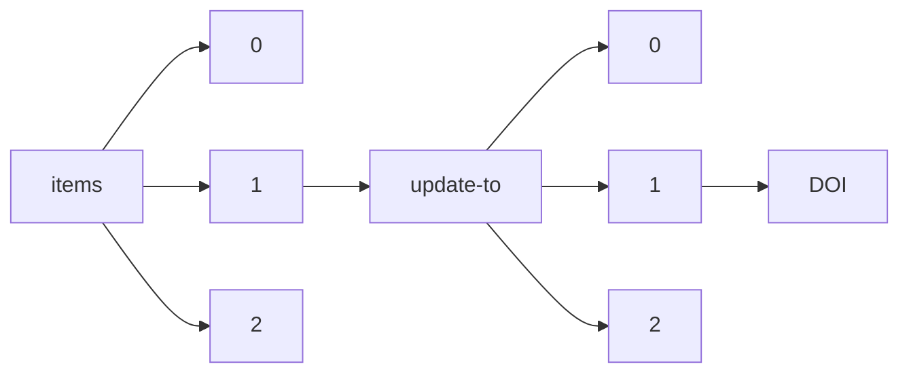

!!! warning "This document is not official Crossref documentation"
# DOI
PATH = items/array/update-to/array/DOI(1)  
Occurs 280 152 times  
Unique values: > 999  
{ .annotate }

1. A route to an element, for example:  
   The route "items/array/update-to/array/DOI" corresponds to navigating through the JSON indices as  
   ["items"][0]["update-to"][0]["DOI"]  

!!! note "Due to current limitations, only the first 1,000 unique values are counted."

| **Row** | **Value** `String`                    | **Count** `Int64` |
|--------:|-----------------------------------------:|---------------------:|
| **1**   | 10.1111/j.1365-294x.2006.03198.x         | 16                   |
| **2**   | 10.33552/ojdoh.2018.01.000503            | 13                   |
| **3**   | 10.1177/1477153518779637                 | 9                    |
| **4**   | 10.12688/wellcomeopenres.16259.1         | 8                    |
| **5**   | 10.1371/journal.pbio.1000359             | 6                    |
| **6**   | 10.1158/1078-0432.ccr-08-0869            | 6                    |
| **7**   | 10.1158/1541-7786.mcr-19-0889            | 6                    |
| **8**   | 10.12688/f1000research.18095.1           | 5                    |
| **9**   | 10.1177/0892705713520176                 | 5                    |
| **10**  | 10.1177/0267659113502835                 | 5                    |
| **11**  | 10.1016/j.purol.2019.02.011              | 5                    |
| **12**  | 10.1177/0267659114557720                 | 5                    |
| **13**  | 10.1177/0267659114536761                 | 4                    |
| **14**  | 10.1007/s00428-019-02631-8               | 4                    |
| **15**  | 10.12688/f1000research.20046.1           | 4                    |
| **16**  | 10.1177/0267659114522088                 | 4                    |
| **17**  | 10.1158/0008-5472.can-06-4197            | 4                    |
| **18**  | 10.1177/0954406214559998                 | 4                    |
| **19**  | 10.1038/519151a                          | 4                    |
| **20**  | 10.5555/12345679                         | 4                    |
| **21**  | 10.1158/1541-7786.mcr-16-0309            | 4                    |
| **22**  | 10.1007/s00428-017-2205-0                | 4                    |
| **23**  | 10.1177/0267659113498617                 | 4                    |
| **24**  | 10.1158/0008-5472.can-21-1825            | 4                    |
| **25**  | 10.1128/iai.00846-18                     | 4                    |
| **26**  | 10.1158/1541-7786.mcr-18-0284            | 4                    |
| **27**  | 10.1158/1940-6207.capr-17-0262           | 4                    |
| **28**  | 10.2337/diacare.25.6.1033                | 4                    |
| **29**  | 10.1177/0267659113513823                 | 4                    |
| **30**  | 10.1177/0267659114547942                 | 4                    |
| **31**  | 10.1083/jcb.201106057                    | 4                    |
| **32**  | 10.1016/j.rser.2014.08.063               | 3                    |
| **33**  | 10.1016/j.carbpol.2019.115799            | 3                    |
| **34**  | 10.1007/s00428-020-02938-x               | 3                    |
| **35**  | 10.1145/605397.605415                    | 3                    |
| **36**  | 10.12688/aasopenres.13118.1              | 3                    |
| **37**  | 10.1145/800227.806880                    | 3                    |
| **38**  | 10.1145/36206.36201                      | 3                    |
| **39**  | 10.12688/f1000research.5779.2            | 3                    |
| **40**  | 10.1145/1346281.1346294                  | 3                    |
| **41**  | 10.1371/journal.pone.0033552             | 3                    |
| **42**  | 10.2337/diabetes.51.8.2658               | 3                    |
| **43**  | 10.1145/800227.806890                    | 3                    |
| **44**  | 10.1145/1168857.1168875                  | 3                    |
| **45**  | 10.1177/0267659114547943                 | 3                    |
| **46**  | 10.1057/jit.2010.23                      | 3                    |
| **47**  | 10.1145/1346281.1346298                  | 3                    |
| **48**  | 10.1128/jb.31.1.2-32.1936                | 3                    |
| **49**  | 10.1145/800227.806902                    | 3                    |
| **50**  | 10.1145/800227.806869                    | 3                    |
| **51**  | 10.1145/1024393.1024420                  | 3                    |
| **52**  | 10.1084/jem.182.2.409                    | 3                    |
| **53**  | 10.1145/1024393.1024403                  | 3                    |
| **54**  | 10.1145/1168857.1168894                  | 3                    |
| **55**  | 10.1145/1346281.1346303                  | 3                    |
| **56**  | 10.1038/nnano.2012.90                    | 3                    |
| **57**  | 10.1145/800227.806922                    | 3                    |
| **58**  | 10.1145/800227.806914                    | 3                    |
| **59**  | 10.1016/j.earscirev.2017.05.015          | 2                    |
| **60**  | 10.1371/journal.pntd.0007714             | 2                    |
| **61**  | 10.1145/800188.805444                    | 2                    |
| **62**  | 10.1007/s12517-021-06794-0               | 2                    |
| **63**  | 10.1016/j.brainresbull.2020.12.006       | 2                    |
| **64**  | 10.1158/1535-7163.mct-16-0821            | 2                    |
| **65**  | 10.1002/jcp.28151                        | 2                    |
| **66**  | 10.12688/gatesopenres.12902.1            | 2                    |
| **67**  | 10.1145/29933.275647                     | 2                    |
| **68**  | 10.1016/j.pragma.2019.12.001             | 2                    |
| **69**  | 10.1098/rspb.2015.1535                   | 2                    |
| **70**  | 10.1371/journal.pgen.1006728             | 2                    |
| **71**  | 10.12688/wellcomeopenres.15401.1         | 2                    |
| **72**  | 10.1016/j.mssp.2020.105175               | 2                    |
| **73**  | 10.1016/j.omtn.2019.06.009               | 2                    |
| **74**  | 10.1084/jem.20120950                     | 2                    |
| **75**  | 10.1371/journal.pgen.1007968             | 2                    |
| **76**  | 10.1007/s12517-021-07963-x               | 2                    |
| **77**  | 10.1145/951762.951767                    | 2                    |
| **78**  | 10.1145/2150976.2150992                  | 2                    |
| **79**  | 10.1038/nm.3552                          | 2                    |
| **80**  | 10.1007/s12517-021-08039-6               | 2                    |
| **81**  | 10.1007/s00467-014-2754-2                | 2                    |
| **82**  | 10.1073/pnas.2111896119                  | 2                    |
| **83**  | 10.1371/journal.pone.0004924             | 2                    |
| **84**  | 10.1007/s12517-021-07406-7               | 2                    |
| **85**  | 10.1038/s41564-017-0059-5                | 2                    |
| **86**  | 10.1145/237466.237551                    | 2                    |
| **87**  | 10.1016/j.jbiotec.2010.03.015            | 2                    |
| **88**  | 10.1158/1078-0432.ccr-20-4504            | 2                    |
| **89**  | 10.1038/nrn4022                          | 2                    |
| **90**  | 10.1371/journal.ppat.1008359             | 2                    |
| **91**  | 10.1145/800107.803491                    | 2                    |
| **92**  | 10.1083/jcb.201310083                    | 2                    |
| **93**  | 10.1145/1346281.1346296                  | 2                    |
| **94**  | 10.1016/j.jcot.2019.06.007               | 2                    |
| **95**  | 10.1145/2150976.2151013                  | 2                    |
| **96**  | 10.1083/jcb.201412003                    | 2                    |
| **97**  | 10.1007/s00779-021-01641-1               | 2                    |
| **98**  | 10.1038/s41929-019-0334-3                | 2                    |
| **99**  | 10.1007/s00371-011-0635-2                | 2                    |
| **100** | 10.1016/j.molcel.2019.06.043             | 2                    |
| **101** | 10.2337/diacare.28.3.752                 | 2                    |
| **102** | 10.1177/0146645313497456                 | 2                    |
| **103** | 10.1097/ju.0000000000002293              | 2                    |
| **104** | 10.1016/j.omtn.2021.06.005               | 2                    |
| **105** | 10.1016/j.aquaculture.2016.10.024        | 2                    |
| **106** | 10.1158/0008-5472.can-16-1898            | 2                    |
| **107** | 10.1177/1755738014524561                 | 2                    |
| **108** | 10.1038/s41587-020-0712-z                | 2                    |
| **109** | 10.1371/journal.pmed.1004102             | 2                    |
| **110** | 10.1016/j.landusepol.2016.12.013         | 2                    |
| **111** | 10.1038/nm.3655                          | 2                    |
| **112** | 10.1016/j.future.2018.12.020             | 2                    |
| **113** | 10.1016/j.future.2018.09.030             | 2                    |
| **114** | 10.1016/j.eururo.2014.06.049             | 2                    |
| **115** | 10.1007/s12517-021-08180-2               | 2                    |
| **116** | 10.1103/physrevd.105.062001              | 2                    |
| **117** | 10.1007/s12517-021-07706-y               | 2                    |
| **118** | 10.1007/s10389-017-0886-0                | 2                    |
| **119** | 10.1016/j.advengsoft.2017.06.001         | 2                    |
| **120** | 10.1084/jem.20110658                     | 2                    |
| **121** | 10.1083/jcb.201008013                    | 2                    |
| **122** | 10.1002/ece3.6225                        | 2                    |
| **123** | 10.1007/s12517-021-08095-y               | 2                    |
| **124** | 10.1007/s12517-021-06692-5               | 2                    |
| **125** | 10.1158/1078-0432.ccr-19-3922            | 2                    |
| **126** | 10.1111/1440-1703.12155                  | 2                    |
| **127** | 10.1016/j.ebiom.2019.09.012              | 2                    |
| **128** | 10.1007/s12517-021-07715-x               | 2                    |
| **129** | 10.1007/s12517-021-07901-x               | 2                    |
| **130** | 10.1073/pnas.2200400119                  | 2                    |
| **131** | 10.1007/s11695-020-04539-8               | 2                    |
| **132** | 10.1145/1168857.1168869                  | 2                    |
| **133** | 10.2337/diabetes.49.11.1794              | 2                    |
| **134** | 10.1016/j.yexmp.2019.104321              | 2                    |
| **135** | 10.1371/journal.ppat.1005155             | 2                    |
| **136** | 10.1158/1078-0432.ccr-18-1589            | 2                    |
| **137** | 10.38211/joarps.2021.2.2.17              | 2                    |
| **138** | 10.1038/s42003-018-0227-z                | 2                    |
| **139** | 10.1007/s12517-021-07951-1               | 2                    |
| **140** | 10.1073/pnas.2219792120                  | 2                    |
| **141** | 10.1007/s12517-021-07144-w               | 2                    |
| **142** | 10.1158/2159-8290.cd-17-0228             | 2                    |
| **143** | 10.1042/bsr20192639                      | 2                    |
| **144** | 10.1016/j.future.2017.12.059             | 2                    |
| **145** | 10.1007/s12517-021-08029-8               | 2                    |
| **146** | 10.12688/f1000research.6002.1            | 2                    |
| **147** | 10.1145/3037697.3037743                  | 2                    |
| **148** | 10.1007/s12517-021-07389-5               | 2                    |
| **149** | 10.1177/1358863x12466709                 | 2                    |
| **150** | 10.1103/physrevx.11.041009               | 2                    |
| **151** | 10.1158/1078-0432.ccr-19-1769            | 2                    |
| **152** | 10.1016/j.gene.2019.144057               | 2                    |
| **153** | 10.1017/s0007114521003500                | 2                    |
| **154** | 10.1158/0008-5472.can-05-0784            | 2                    |
| **155** | 10.1016/j.neuron.2016.04.039             | 2                    |
| **156** | 10.12688/f1000research.13511.1           | 2                    |
| **157** | 10.1007/s12517-021-08084-1               | 2                    |
| **158** | 10.1074/jbc.m111.255042                  | 2                    |
| **159** | 10.1016/j.amc.2014.01.156                | 2                    |
| **160** | 10.1145/2872362.2872373                  | 2                    |
| **161** | 10.1016/j.jcot.2019.09.014               | 2                    |
| **162** | 10.1158/1078-0432.ccr-16-1326            | 2                    |
| **163** | 10.1016/j.tige.2020.06.004               | 2                    |
| **164** | 10.1145/1508244.1508246                  | 2                    |
| **165** | 10.1145/800180.810246                    | 2                    |
| **166** | 10.1007/s12517-021-07995-3               | 2                    |
| **167** | 10.1016/j.intimp.2017.06.021             | 2                    |
| **168** | 10.1016/j.ceca.2019.04.006               | 2                    |
| **169** | 10.1083/jcb.201409111                    | 2                    |
| **170** | 10.1145/800188.805456                    | 2                    |
| **171** | 10.1038/s41698-017-0008-z                | 2                    |
| **172** | 10.1007/s12517-021-07935-1               | 2                    |
| **173** | 10.1093/ohr/ohw110                       | 2                    |
| **174** | 10.1085/jgp.201411294                    | 2                    |
| **175** | 10.1016/j.tet.2007.04.088                | 2                    |
| **176** | 10.12688/f1000research.124002.1          | 2                    |
| **177** | 10.1200/jco.2016.67.2048                 | 2                    |
| **178** | 10.1007/s41347-017-0038-y                | 2                    |
| **179** | 10.1145/106972.106986                    | 2                    |
| **180** | 10.1016/j.vacuum.2015.06.031             | 2                    |
| **181** | 10.1177/1076217512474982                 | 2                    |
| **182** | 10.1016/j.lfs.2021.119225                | 2                    |
| **183** | 10.1158/0008-5472.can-18-3767            | 2                    |
| **184** | 10.1103/physrevx.12.021042               | 2                    |
| **185** | 10.1016/j.cimid.2019.101403              | 2                    |
| **186** | 10.1083/jcb.201812063                    | 2                    |
| **187** | 10.1145/3037697.3037750                  | 2                    |
| **188** | 10.1083/jcb.200908010                    | 2                    |
| **189** | 10.1083/jcb.201411001                    | 2                    |
| **190** | 10.1016/j.jksuci.2019.10.001             | 2                    |
| **191** | 10.1378/chest.107.3.787                  | 2                    |
| **192** | 10.1098/rsob.220325                      | 2                    |
| **193** | 10.1007/s12517-021-08037-8               | 2                    |
| **194** | 10.1016/j.oraloncology.2017.06.024       | 2                    |
| **195** | 10.1371/journal.pone.0108205             | 2                    |
| **196** | 10.1007/s12517-021-08002-5               | 2                    |
| **197** | 10.1002/btpr.3092                        | 2                    |
| **198** | 10.12688/f1000research.14900.3           | 2                    |
| **199** | 10.1136/amiajnl-2012-001350              | 2                    |
| **200** | 10.1007/s12517-021-07893-8               | 2                    |
| **201** | 10.1073/pnas.0706658105                  | 2                    |
| **202** | 10.1016/j.ijpharm.2018.02.028            | 2                    |
| **203** | 10.12688/gatesopenres.13012.1            | 2                    |
| **204** | 10.1016/j.jcot.2020.06.044               | 2                    |
| **205** | 10.1016/s2666-7568(22)00038-1            | 2                    |
| **206** | 10.1007/s12517-021-07956-w               | 2                    |
| **207** | 10.1038/s41419-020-2545-6                | 2                    |
| **208** | 10.1002/ejic.201900555                   | 2                    |
| **209** | 10.1073/pnas.0908655106                  | 2                    |
| **210** | 10.1016/j.jallcom.2013.06.029            | 2                    |
| **211** | 10.1016/j.molstruc.2019.127142           | 2                    |
| **212** | 10.1161/res.0000000000000578             | 2                    |
| **213** | 10.1073/pnas.2021843118                  | 2                    |
| **214** | 10.1136/bcr-2017-222280                  | 2                    |
| **215** | 10.1016/j.aquaculture.2019.734418        | 2                    |
| **216** | 10.2466/pms.108.3.971-980                | 2                    |
| **217** | 10.1073/pnas.2210632120                  | 2                    |
| **218** | 10.1016/j.jnutbio.2016.10.004            | 2                    |
| **219** | 10.1136/ijgc-2019-001012                 | 2                    |
| **220** | 10.1084/jem.20171773                     | 2                    |
| **221** | 10.1371/journal.pmed.1003842             | 2                    |
| **222** | 10.1038/s41594-020-0419-3                | 2                    |
| **223** | 10.1016/j.renene.2014.02.021             | 2                    |
| **224** | 10.1016/j.amc.2014.01.117                | 2                    |
| **225** | 10.1016/j.neucom.2022.07.008             | 2                    |
| **226** | 10.1007/s12517-021-07338-2               | 2                    |
| **227** | 10.1016/j.jmps.2011.05.011               | 2                    |
| **228** | 10.1145/1024393.1024404                  | 2                    |
| **229** | 10.1016/j.ridd.2013.07.026               | 2                    |
| **230** | 10.1007/s12517-021-08165-1               | 2                    |
| **231** | 10.1007/s12517-021-07976-6               | 2                    |
| **232** | 10.1016/j.opresp.2021.100122             | 2                    |
| **233** | 10.1145/605397.605420                    | 2                    |
| **234** | 10.1158/1078-0432.ccr-11-3127            | 2                    |
| **235** | 10.1007/s12517-021-07248-3               | 2                    |
| **236** | 10.1038/522115a                          | 2                    |
| **237** | 10.1007/s12517-021-06806-z               | 2                    |
| **238** | 10.1007/s12517-021-07891-w               | 2                    |
| **239** | 10.1177/1534735409359772                 | 2                    |
| **240** | 10.1145/1024393.1024412                  | 2                    |
| **241** | 10.1016/j.mset.2019.04.004               | 2                    |
| **242** | 10.1145/1736020.1736034                  | 2                    |
| **243** | 10.1083/jcb.201905097                    | 2                    |
| **244** | 10.1038/ncb3514                          | 2                    |
| **245** | 10.1145/1168857.1168901                  | 2                    |
| **246** | 10.1038/s41586-020-2093-3                | 2                    |
| **247** | 10.1158/0008-5472.can-17-2429            | 2                    |
| **248** | 10.1085/jgp.201411182                    | 2                    |
| **249** | 10.1145/800227.806873                    | 2                    |
| **250** | 10.1038/nbt1108-1227                     | 2                    |
| **251** | 10.1098/rspb.2021.2645                   | 2                    |
| **252** | 10.1158/1940-6207.capr-17-0198           | 2                    |
| **253** | 10.1111/jsap.13267                       | 2                    |
| **254** | 10.1038/nmeth.2836                       | 2                    |
| **255** | 10.1007/s12517-021-07829-2               | 2                    |
| **256** | 10.1007/s12517-021-06902-0               | 2                    |
| **257** | 10.1145/1168857.1168860                  | 2                    |
| **258** | 10.1145/3037697.3037737                  | 2                    |
| **259** | 10.1177/0743915618813582                 | 2                    |
| **260** | 10.1158/1078-0432.ccr-11-1707            | 2                    |
| **261** | 10.1158/0008-5472.can-17-0387            | 2                    |
| **262** | 10.3365/met.mat.2008.04.151              | 2                    |
| **263** | 10.1371/journal.pntd.0000321             | 2                    |
| **264** | 10.1038/tp.2016.263                      | 2                    |
| **265** | 10.1007/s12517-021-07253-6               | 2                    |
| **266** | 10.1158/0008-5472.can-15-1640-t          | 2                    |
| **267** | 10.1098/rspb.2021.2005                   | 2                    |
| **268** | 10.2337/db08-1515                        | 2                    |
| **269** | 10.1145/1950365.1950396                  | 2                    |
| **270** | 10.1371/journal.pntd.0006174             | 2                    |
| **271** | 10.1007/s12517-021-08031-0               | 2                    |
| **272** | 10.1007/s10552-015-0524-5                | 2                    |
| **273** | 10.1158/2326-6066.cir-14-0137            | 2                    |
| **274** | 10.1371/journal.pone.0130293             | 2                    |
| **275** | 10.1158/0008-5472.can-20-1818            | 2                    |
| **276** | 10.1084/jem.20110242                     | 2                    |
| **277** | 10.1103/physrevb.97.014420               | 2                    |
| **278** | 10.1083/jcb.200805063                    | 2                    |
| **279** | 10.1007/s12517-021-07944-0               | 2                    |
| **280** | 10.1007/s12517-021-08034-x               | 2                    |
| **281** | 10.1007/s00134-008-1118-4                | 2                    |
| **282** | 10.1083/jcb.201408111                    | 2                    |
| **283** | 10.1016/j.ncrna.2018.02.001              | 2                    |
| **284** | 10.1061/(asce)em.1943-7889.0002131       | 2                    |
| **285** | 10.1016/j.cej.2011.04.016                | 2                    |
| **286** | 10.1007/s12517-021-08018-x               | 2                    |
| **287** | 10.1158/0008-5472.can-04-0763            | 2                    |
| **288** | 10.1016/j.purol.2018.07.284              | 2                    |
| **289** | 10.1016/j.jallcom.2020.154705            | 2                    |
| **290** | 10.1200/jco.2017.77.4273                 | 2                    |
| **291** | 10.1038/520432a                          | 2                    |
| **292** | 10.1158/0008-5472.can-09-3155            | 2                    |
| **293** | 10.1177/8756479312474438                 | 2                    |
| **294** | 10.1038/nm0395-267                       | 2                    |
| **295** | 10.1158/0008-5472.can-09-2448            | 2                    |
| **296** | 10.1145/1168857.1168898                  | 2                    |
| **297** | 10.1073/pnas.0906426106                  | 2                    |
| **298** | 10.1002/sfr.31694                        | 2                    |
| **299** | 10.1158/1541-7786.mcr-17-0452            | 2                    |
| **300** | 10.1007/s00779-021-01623-3               | 2                    |
| **301** | 10.12688/f1000research.53682.1           | 2                    |
| **302** | 10.1038/ncomms14969                      | 2                    |
| **303** | 10.1145/2872362.2872374                  | 2                    |
| **304** | 10.1007/s12517-021-07640-z               | 2                    |
| **305** | 10.12688/f1000research.2-71.v1           | 2                    |
| **306** | 10.1016/j.jksuci.2020.04.015             | 2                    |
| **307** | 10.1002/ams2.486                         | 2                    |
| **308** | 10.1158/0008-5472.can-10-2868            | 2                    |
| **309** | 10.1007/s12517-021-07751-7               | 2                    |
| **310** | 10.1158/1535-7163.mct-13-0005            | 2                    |
| **311** | 10.1016/j.cub.2017.05.044                | 2                    |
| **312** | 10.1073/pnas.2105482118                  | 2                    |
| **313** | 10.2337/db09-0011                        | 2                    |
| **314** | 10.1073/pnas.2017392118                  | 2                    |
| **315** | 10.1145/2872362.2872370                  | 2                    |
| **316** | 10.1083/jcb.201508081                    | 2                    |
| **317** | 10.12688/hrbopenres.12887.1              | 2                    |
| **318** | 10.1038/eye.2015.164                     | 2                    |
| **319** | 10.1371/journal.pone.0007891             | 2                    |
| **320** | 10.12688/f1000research.24114.1           | 2                    |
| **321** | 10.1103/physreve.102.042401              | 2                    |
| **322** | 10.2337/diacare.25.5.937                 | 2                    |
| **323** | 10.1085/jgp.201812003                    | 2                    |
| **324** | 10.1016/j.appet.2014.06.101              | 2                    |
| **325** | 10.1007/s12517-021-07166-4               | 2                    |
| **326** | 10.1007/s12517-021-08019-w               | 2                    |
| **327** | 10.1007/s12517-021-07709-9               | 2                    |
| **328** | 10.1016/j.jksuci.2019.10.006             | 2                    |
| **329** | 10.1143/jpsj.31.882                      | 2                    |
| **330** | 10.1145/1024393.1024415                  | 2                    |
| **331** | 10.1145/3037697.3037752                  | 2                    |
| **332** | 10.1007/s12517-021-07940-4               | 2                    |
| **333** | 10.1073/pnas.2220468120                  | 2                    |
| **334** | 10.1158/0008-5472.can-13-2994            | 2                    |
| **335** | 10.1007/s12517-021-08185-x               | 2                    |
| **336** | 10.1007/s12517-021-07861-2               | 2                    |
| **337** | 10.12688/f1000research.4336.1            | 2                    |
| **338** | 10.1007/s12517-021-07924-4               | 2                    |
| **339** | 10.1007/s12517-021-07216-x               | 2                    |
| **340** | 10.1158/0008-5472.can-16-0530            | 2                    |
| **341** | 10.1158/1078-0432.ccr-19-3890            | 2                    |
| **342** | 10.1016/j.petlm.2019.11.002              | 2                    |
| **343** | 10.1158/0008-5472.can-15-1874            | 2                    |
| **344** | 10.1158/1078-0432.ccr-05-1085            | 2                    |
| **345** | 10.1145/1346281.1346314                  | 2                    |
| **346** | 10.1371/journal.pone.0002165             | 2                    |
| **347** | 10.1158/0008-5472.can-14-0303            | 2                    |
| **348** | 10.1007/s12517-021-06747-7               | 2                    |
| **349** | 10.1073/pnas.2200879119                  | 2                    |
| **350** | 10.1371/journal.pone.0009536             | 2                    |
| **351** | 10.1103/physrevd.103.036001              | 2                    |
| **352** | 10.1145/1346281.1346284                  | 2                    |
| **353** | 10.1007/s12517-021-07929-z               | 2                    |
| **354** | 10.1083/jcb.201710132                    | 2                    |
| **355** | 10.1016/j.opresp.2021.100102             | 2                    |
| **356** | 10.1007/s00779-021-01615-3               | 2                    |
| **357** | 10.1161/hypertensionaha.122.19248        | 2                    |
| **358** | 10.1177/1098612x12469368                 | 2                    |
| **359** | 10.1145/1346281.1346295                  | 2                    |
| **360** | 10.1007/s12517-021-07759-z               | 2                    |
| **361** | 10.1007/s12517-021-07343-5               | 2                    |
| **362** | 10.1177/2058738419872624                 | 2                    |
| **363** | 10.1161/jaha.122.025861                  | 2                    |
| **364** | 10.1084/jem.20141788                     | 2                    |
| **365** | 10.1007/s12517-021-07763-3               | 2                    |
| **366** | 10.1369/jhc.5a6688.2005                  | 2                    |
| **367** | 10.1007/s12517-021-07890-x               | 2                    |
| **368** | 10.1177/1747493016669275                 | 2                    |
| **369** | 10.1158/1078-0432.ccr-15-0198            | 2                    |
| **370** | 10.1007/s12517-021-07807-8               | 2                    |
| **371** | 10.1084/jem.20020666                     | 2                    |
| **372** | 10.1007/s12517-021-07716-w               | 2                    |
| **373** | 10.2337/diacare.26.7.2063                | 2                    |
| **374** | 10.1145/29933.275635                     | 2                    |
| **375** | 10.1158/1078-0432.ccr-14-2648            | 2                    |
| **376** | 10.1007/s12517-021-08117-9               | 2                    |
| **377** | 10.1158/1940-6207.capr-13-0140           | 2                    |
| **378** | 10.1007/s12517-021-07243-8               | 2                    |
| **379** | 10.1007/s12517-021-07210-3               | 2                    |
| **380** | 10.1016/j.arabjc.2021.103297             | 2                    |
| **381** | 10.1158/0008-5472.can-12-4028            | 2                    |
| **382** | 10.1145/2872362.2872380                  | 2                    |
| **383** | 10.12688/f1000research.12947.1           | 2                    |
| **384** | 10.1158/2326-6066.cir-17-0443            | 2                    |
| **385** | 10.1007/s12517-021-08183-z               | 2                    |
| **386** | 10.1145/1168857.1168900                  | 2                    |
| **387** | 10.1073/pnas.2213847119                  | 2                    |
| **388** | 10.2337/diacare.27.11.2761               | 2                    |
| **389** | 10.1039/c9lc01273g                       | 2                    |
| **390** | 10.1161/01.str.0000442009.06663.48       | 2                    |
| **391** | 10.1083/jcb.201811172                    | 2                    |
| **392** | 10.1007/s12517-021-07169-1               | 2                    |
| **393** | 10.1083/jcb.201411037                    | 2                    |
| **394** | 10.1073/pnas.0812801106                  | 2                    |
| **395** | 10.1007/s12517-021-07923-5               | 2                    |
| **396** | 10.1103/physrevb.97.165415               | 2                    |
| **397** | 10.12688/f1000research.10531.2           | 2                    |
| **398** | 10.1016/j.petlm.2017.12.007              | 2                    |
| **399** | 10.1158/0008-5472.can-16-1911            | 2                    |
| **400** | 10.1084/jem.20111117                     | 2                    |
| **401** | 10.12688/f1000research.26749.2           | 2                    |
| **402** | 10.1073/pnas.2102674118                  | 2                    |
| **403** | 10.1016/j.jksuci.2019.05.008             | 2                    |
| **404** | 10.1007/s12517-021-07244-7               | 2                    |
| **405** | 10.1083/jcb.200401150                    | 2                    |
| **406** | 10.1085/jgp.201110685                    | 2                    |
| **407** | 10.1007/s12517-021-06693-4               | 2                    |
| **408** | 10.1177/1098612x13477538                 | 2                    |
| **409** | 10.1145/1168857.1168906                  | 2                    |
| **410** | 10.2337/diabetes.52.2.463                | 2                    |
| **411** | 10.1158/2159-8290.cd-15-1166             | 2                    |
| **412** | 10.1007/s12517-021-07960-0               | 2                    |
| **413** | 10.1007/7631\_2018\_3                    | 2                    |
| **414** | 10.1007/s12517-021-07220-1               | 2                    |
| **415** | 10.1145/1346281.1346307                  | 2                    |
| **416** | 10.1007/s12517-021-07899-2               | 2                    |
| **417** | 10.1073/pnas.2023846118                  | 2                    |
| **418** | 10.1158/0008-5472.can-05-1614            | 2                    |
| **419** | 10.1158/2159-8290.cd-15-0330             | 2                    |
| **420** | 10.1007/s12517-021-07255-4               | 2                    |
| **421** | 10.12688/f1000research.11173.1           | 2                    |
| **422** | 10.1007/s12517-021-06788-y               | 2                    |
| **423** | 10.1145/3037697.3037714                  | 2                    |
| **424** | 10.1158/0008-5472.can-12-3963            | 2                    |
| **425** | 10.1158/1078-0432.ccr-20-0654            | 2                    |
| **426** | 10.1158/1078-0432.ccr-03-0670            | 2                    |
| **427** | 10.1083/jcb.200308155                    | 2                    |
| **428** | 10.1158/0008-5472.can-13-2459            | 2                    |
| **429** | 10.1136/bmjopen-2013-003533              | 2                    |
| **430** | 10.1177/1944451613477659                 | 2                    |
| **431** | 10.1016/j.jksuci.2019.12.002             | 2                    |
| **432** | 10.1158/2159-8290.cd-18-0387             | 2                    |
| **433** | 10.1177/1081286509105591                 | 2                    |
| **434** | 10.1007/s12517-021-08017-y               | 2                    |
| **435** | 10.1158/1078-0432.ccr-18-2311            | 2                    |
| **436** | 10.1145/1736020.1736023                  | 2                    |
| **437** | 10.1158/1078-0432.ccr-16-0414            | 2                    |
| **438** | 10.1145/800227.806899                    | 2                    |
| **439** | 10.12688/f1000research.52266.1           | 2                    |
| **440** | 10.1158/0008-5472.can-10-3516            | 2                    |
| **441** | 10.1103/physreva.104.053116              | 2                    |
| **442** | 10.1007/s12517-021-07335-5               | 2                    |
| **443** | 10.1161/hypertensionaha.120.15830        | 2                    |
| **444** | 10.1083/jcb.201703103                    | 2                    |
| **445** | 10.1007/s12517-021-08070-7               | 2                    |
| **446** | 10.1038/ncb2173                          | 2                    |
| **447** | 10.1177/0163443712452700                 | 2                    |
| **448** | 10.1007/s12517-021-07895-6               | 2                    |
| **449** | 10.1007/s12517-021-07252-7               | 2                    |
| **450** | 10.1007/s12517-021-07146-8               | 2                    |
| **451** | 10.1016/j.ijheatmasstransfer.2015.09.066 | 2                    |
| **452** | 10.1007/s00779-021-01619-z               | 2                    |
| **453** | 10.1007/s12517-021-08160-6               | 2                    |
| **454** | 10.1007/s12517-021-07206-z               | 2                    |
| **455** | 10.1038/nm830                            | 2                    |
| **456** | 10.1158/1078-0432.ccr-12-2795            | 2                    |
| **457** | 10.1007/s12517-021-07211-2               | 2                    |
| **458** | 10.1007/s12517-021-07464-x               | 2                    |
| **459** | 10.1158/1078-0432.ccr-17-1929            | 2                    |
| **460** | 10.5812/ircmj.65103                      | 2                    |
| **461** | 10.1007/s12517-021-07749-1               | 2                    |
| **462** | 10.1158/1535-7163.mct-13-1021            | 2                    |
| **463** | 10.1007/s12517-021-07942-2               | 2                    |
| **464** | 10.1073/pnas.2121353119                  | 2                    |
| **465** | 10.1145/1346281.1346315                  | 2                    |
| **466** | 10.1016/j.stem.2014.07.002               | 2                    |
| **467** | 10.1007/s12517-021-08013-2               | 2                    |
| **468** | 10.1084/jem.20092449                     | 2                    |
| **469** | 10.1158/0008-5472.can-19-0803            | 2                    |
| **470** | 10.1158/2159-8290.cd-nb2016-080          | 2                    |
| **471** | 10.1085/jgp.201311006                    | 2                    |
| **472** | 10.1145/1950365.1950406                  | 2                    |
| **473** | 10.1158/2159-8290.cd-19-1156             | 2                    |
| **474** | 10.1145/2872362.2872417                  | 2                    |
| **475** | 10.1158/1078-0432.ccr-10-1927            | 2                    |
| **476** | 10.1007/s12517-021-06821-0               | 2                    |
| **477** | 10.1158/1078-0432.ccr-18-1449            | 2                    |
| **478** | 10.1103/physrevc.104.044303              | 2                    |
| **479** | 10.1145/1736020.1736063                  | 2                    |
| **480** | 10.1145/1168857.1168873                  | 2                    |
| **481** | 10.2337/diabetes.50.3.675                | 2                    |
| **482** | 10.1073/pnas.2212942119                  | 2                    |
| **483** | 10.1007/s12517-021-07738-4               | 2                    |
| **484** | 10.1158/1078-0432.ccr-14-1564            | 2                    |
| **485** | 10.1084/jem.20161435                     | 2                    |
| **486** | 10.1007/s12517-021-08036-9               | 2                    |
| **487** | 10.1084/jem.20140625                     | 2                    |
| **488** | 10.1073/pnas.1421438111                  | 2                    |
| **489** | 10.1177/0954405416673100                 | 2                    |
| **490** | 10.1073/pnas.2200102119                  | 2                    |
| **491** | 10.1073/pnas.2204862119                  | 2                    |
| **492** | 10.1145/2541940.2541980                  | 2                    |
| **493** | 10.1084/jem.13.2.239                     | 2                    |
| **494** | 10.1007/s12517-021-08116-w               | 2                    |
| **495** | 10.1158/1078-0432.ccr-19-0976            | 2                    |
| **496** | 10.1038/s41597-020-0445-3                | 2                    |
| **497** | 10.1158/1541-7786.mcr-20-0086            | 2                    |
| **498** | 10.1073/pnas.0812096106                  | 2                    |
| **499** | 10.1158/2767-9764.crc-21-0060            | 2                    |
| **500** | 10.1145/800227.806923                    | 2                    |
| **501** | 10.1103/physreve.97.013205               | 2                    |
| **502** | 10.1039/d1nr02816b                       | 2                    |
| **503** | 10.1158/0008-5472.can-13-3058            | 2                    |
| **504** | 10.1007/s12517-021-08179-9               | 2                    |
| **505** | 10.1016/j.jksuci.2019.05.002             | 2                    |
| **506** | 10.1007/s12517-021-07711-1               | 2                    |
| **507** | 10.1158/1078-0432.ccr-18-2702            | 2                    |
| **508** | 10.1084/jem.20161900                     | 2                    |
| **509** | 10.1145/1168857.1168908                  | 2                    |
| **510** | 10.1177/0333102410391489                 | 2                    |
| **511** | 10.1007/s12517-021-07274-1               | 2                    |
| **512** | 10.1098/rsos.181113                      | 2                    |
| **513** | 10.1007/s12517-021-08030-1               | 2                    |
| **514** | 10.1007/s12517-021-06789-x               | 2                    |
| **515** | 10.1158/1940-6207.capr-12-0002           | 2                    |
| **516** | 10.1007/s12517-021-07245-6               | 2                    |
| **517** | 10.1007/s12517-021-07485-6               | 2                    |
| **518** | 10.1073/pnas.0903532106                  | 2                    |
| **519** | 10.1016/j.jksuci.2020.01.014             | 2                    |
| **520** | 10.1073/pnas.2213308119                  | 2                    |
| **521** | 10.1145/1736020.1736059                  | 2                    |
| **522** | 10.1016/j.gloenvcha.2019.101946          | 2                    |
| **523** | 10.1158/2159-8290.cd-17-1134             | 2                    |
| **524** | 10.1038/sj.mp.4001506                    | 2                    |
| **525** | 10.1007/s12517-021-07357-z               | 2                    |
| **526** | 10.1073/pnas.2206824119                  | 2                    |
| **527** | 10.1073/pnas.2201490119                  | 2                    |
| **528** | 10.12688/f1000research.6755.2            | 2                    |
| **529** | 10.1158/2159-8290.cd-18-1522             | 2                    |
| **530** | 10.1083/jcb.201210060                    | 2                    |
| **531** | 10.1177/0956797612450892                 | 2                    |
| **532** | 10.1016/j.jksuci.2019.08.003             | 2                    |
| **533** | 10.1038/526499a                          | 2                    |
| **534** | 10.12688/f1000research.22021.1           | 2                    |
| **535** | 10.1007/s00779-021-01639-9               | 2                    |
| **536** | 10.2337/diacare.25.12.2230               | 2                    |
| **537** | 10.1007/s12517-021-08011-4               | 2                    |
| **538** | 10.1073/pnas.2100151119                  | 2                    |
| **539** | 10.1103/physrevlett.128.231802           | 2                    |
| **540** | 10.12688/f1000research.5689.1            | 2                    |
| **541** | 10.1007/s00428-018-2422-1                | 2                    |
| **542** | 10.1007/s00415-021-10792-3               | 2                    |
| **543** | 10.1083/jcb.200801152                    | 2                    |
| **544** | 10.1158/0008-5472.can-13-1411            | 2                    |
| **545** | 10.1016/j.tgie.2019.150629               | 2                    |
| **546** | 10.1007/s12517-021-06804-1               | 2                    |
| **547** | 10.1007/s12517-021-06748-6               | 2                    |
| **548** | 10.1103/physrevx.11.021053               | 2                    |
| **549** | 10.1158/2159-8290.cd-20-0555             | 2                    |
| **550** | 10.1145/1346281.1346308                  | 2                    |
| **551** | 10.1016/j.ssi.2012.11.019                | 2                    |
| **552** | 10.1103/physrevx.11.031065               | 2                    |
| **553** | 10.1073/pnas.0903691106                  | 2                    |
| **554** | 10.12688/f1000research.18134.1           | 2                    |
| **555** | 10.1016/j.opresp.2021.100093             | 2                    |
| **556** | 10.12688/aasopenres.13118.2              | 2                    |
| **557** | 10.1007/s12517-021-07856-z               | 2                    |
| **558** | 10.2337/diacare.27.1.2                   | 2                    |
| **559** | 10.1083/jcb.201707143                    | 2                    |
| **560** | 10.1158/0008-5472.can-15-2910            | 2                    |
| **561** | 10.1016/j.saa.2014.05.076                | 2                    |
| **562** | 10.1016/j.jksuci.2019.06.008             | 2                    |
| **563** | 10.1158/0008-5472.can-19-3326            | 2                    |
| **564** | 10.1016/j.jsr.2018.12.009                | 2                    |
| **565** | 10.1083/jcb.201310117                    | 2                    |
| **566** | 10.1039/c8cp05721d                       | 2                    |
| **567** | 10.1083/jcb.201205125                    | 2                    |
| **568** | 10.1103/physrevlett.120.015501           | 2                    |
| **569** | 10.1007/s12517-021-07153-9               | 2                    |
| **570** | 10.1016/j.techfore.2008.07.002           | 2                    |
| **571** | 10.1158/0008-5472.can-06-3473            | 2                    |
| **572** | 10.1158/0008-5472.can-16-0268            | 2                    |
| **573** | 10.1007/s11033-014-3260-0                | 2                    |
| **574** | 10.1073/pnas.0904514106                  | 2                    |
| **575** | 10.1016/j.molstruc.2019.126937           | 2                    |
| **576** | 10.12688/f1000research.75805.1           | 2                    |
| **577** | 10.1158/1541-7786.mcr-08-0052            | 2                    |
| **578** | 10.1145/951762.951766                    | 2                    |
| **579** | 10.1007/s12517-021-06850-9               | 2                    |
| **580** | 10.1007/s12517-021-08210-z               | 2                    |
| **581** | 10.1145/2541940.2541981                  | 2                    |
| **582** | 10.1007/s12517-021-07933-3               | 2                    |
| **583** | 10.1145/29933.30866                      | 2                    |
| **584** | 10.2337/db08-0537                        | 2                    |
| **585** | 10.1145/1736020.1736051                  | 2                    |
| **586** | 10.1158/1055-9965.epi-21-0831            | 2                    |
| **587** | 10.1093/ohr/ohx020                       | 2                    |
| **588** | 10.1073/pnas.1208003109                  | 2                    |
| **589** | 10.1016/j.petlm.2017.12.006              | 2                    |
| **590** | 10.1007/s12517-021-07201-4               | 2                    |
| **591** | 10.1145/800227.806877                    | 2                    |
| **592** | 10.1016/j.jksuci.2019.02.010             | 2                    |
| **593** | 10.1007/s12517-021-08027-w               | 2                    |
| **594** | 10.3389/fmicb.2020.00333                 | 2                    |
| **595** | 10.1039/d2sc01401g                       | 2                    |
| **596** | 10.1016/j.jcot.2019.05.014               | 2                    |
| **597** | 10.1016/j.rser.2015.08.011               | 2                    |
| **598** | 10.1145/1346281.1346323                  | 2                    |
| **599** | 10.1016/j.marpol.2015.01.006             | 2                    |
| **600** | 10.1158/0008-5472.can-17-2332            | 2                    |
| **601** | 10.1007/s12517-021-07362-2               | 2                    |
| **602** | 10.1371/journal.pgen.1007463             | 2                    |
| **603** | 10.1007/s12517-021-07926-2               | 2                    |
| **604** | 10.1042/bsr20191221                      | 2                    |
| **605** | 10.12688/f1000research.23640.1           | 2                    |
| **606** | 10.1083/jcb.201112117                    | 2                    |
| **607** | 10.1158/0008-5472.can-15-0692            | 2                    |
| **608** | 10.1084/jem.20130624                     | 2                    |
| **609** | 10.1158/1078-0432.ccr-16-1490            | 2                    |
| **610** | 10.1083/jcb.200801001                    | 2                    |
| **611** | 10.1073/pnas.2201250119                  | 2                    |
| **612** | 10.1145/3037697.3037754                  | 2                    |
| **613** | 10.1158/1541-7786.mcr-06-0348            | 2                    |
| **614** | 10.1158/1535-7163.mct-16-0591            | 2                    |
| **615** | 10.1083/jcb.201512010                    | 2                    |
| **616** | 10.1016/j.jksuci.2020.05.006             | 2                    |
| **617** | 10.2337/diabetes.52.1.145                | 2                    |
| **618** | 10.1007/s12517-021-07204-1               | 2                    |
| **619** | 10.1158/0008-5472.can-14-2475            | 2                    |
| **620** | 10.1158/1078-0432.ccr-21-2160            | 2                    |
| **621** | 10.1007/s12517-021-07364-0               | 2                    |
| **622** | 10.1007/s12517-021-08076-1               | 2                    |
| **623** | 10.1039/d0fo03341c                       | 2                    |
| **624** | 10.1016/j.jksuci.2019.11.002             | 2                    |
| **625** | 10.1016/j.ece.2020.11.005                | 2                    |
| **626** | 10.1111/cns.13382                        | 2                    |
| **627** | 10.1145/1168857.1168888                  | 2                    |
| **628** | 10.1161/jaha.122.027540                  | 2                    |
| **629** | 10.1007/s12517-021-08023-0               | 2                    |
| **630** | 10.1007/s12517-021-07354-2               | 2                    |
| **631** | 10.1083/jcb.2011iti1                     | 2                    |
| **632** | 10.1158/2159-8290.cd-11-0039             | 2                    |
| **633** | 10.1007/s00779-021-01616-2               | 2                    |
| **634** | 10.1016/j.jksuci.2019.03.003             | 2                    |
| **635** | 10.1016/j.pragma.2014.05.009             | 2                    |
| **636** | 10.1007/s12517-021-07741-9               | 2                    |
| **637** | 10.1016/j.ymgmr.2020.100573              | 2                    |
| **638** | 10.1007/s12517-021-07404-9               | 2                    |
| **639** | 10.1038/s41591-020-1004-3                | 2                    |
| **640** | 10.1007/s12517-021-07836-3               | 2                    |
| **641** | 10.1016/j.tige.2021.02.001               | 2                    |
| **642** | 10.1007/s12517-021-08010-5               | 2                    |
| **643** | 10.1098/rspb.2015.1766                   | 2                    |
| **644** | 10.1016/j.bbrc.2015.02.116               | 2                    |
| **645** | 10.1083/jcb.201703206                    | 2                    |
| **646** | 10.1016/j.bbrc.2017.07.139               | 2                    |
| **647** | 10.1007/s12517-021-07251-8               | 2                    |
| **648** | 10.1016/s0140-6736(22)01540-9            | 2                    |
| **649** | 10.1007/s12517-021-08024-z               | 2                    |
| **650** | 10.2337/diabetes.53.1.14                 | 2                    |
| **651** | 10.1007/s12517-021-07356-0               | 2                    |
| **652** | 10.1084/jem.20091573                     | 2                    |
| **653** | 10.1007/s12517-021-07213-0               | 2                    |
| **654** | 10.1007/s11575-017-0324-0                | 2                    |
| **655** | 10.1038/nmeth.2084                       | 2                    |
| **656** | 10.1103/physrevfluids.5.124501           | 2                    |
| **657** | 10.1158/1541-7786.mcr-19-0718            | 2                    |
| **658** | 10.1007/s12517-021-07896-5               | 2                    |
| **659** | 10.1016/j.jimed.2019.05.006              | 2                    |
| **660** | 10.1007/s10741-019-09828-8               | 2                    |
| **661** | 10.1073/pnas.1305961110                  | 2                    |
| **662** | 10.1007/s12517-021-08094-z               | 2                    |
| **663** | 10.1007/s12517-021-07835-4               | 2                    |
| **664** | 10.1007/s12517-021-08012-3               | 2                    |
| **665** | 10.1177/0954406215572839                 | 2                    |
| **666** | 10.1007/s12517-021-06795-z               | 2                    |
| **667** | 10.1371/journal.pgen.1004792             | 2                    |
| **668** | 10.1145/36206.36183                      | 2                    |
| **669** | 10.1007/s11235-016-0183-1                | 2                    |
| **670** | 10.1016/j.apsusc.2020.146179             | 2                    |
| **671** | 10.1016/j.rser.2011.11.015               | 2                    |
| **672** | 10.1039/c8cp01519h                       | 2                    |
| **673** | 10.1074/jbc.m709854200                   | 2                    |
| **674** | 10.1016/j.aquaculture.2018.12.079        | 2                    |
| **675** | 10.1103/physrevd.102.064040              | 2                    |
| **676** | 10.1016/j.aquaculture.2018.06.082        | 2                    |
| **677** | 10.1085/jgp.201611663                    | 2                    |
| **678** | 10.1038/522403a                          | 2                    |
| **679** | 10.2337/diacare.27.8.1954                | 2                    |
| **680** | 10.1038/srep19799                        | 2                    |
| **681** | 10.1016/j.biortech.2014.02.109           | 2                    |
| **682** | 10.1158/0008-5472.can-18-3418            | 2                    |
| **683** | 10.1007/s12517-021-07257-2               | 2                    |
| **684** | 10.1039/d1ee00631b                       | 2                    |
| **685** | 10.1007/s12517-021-08026-x               | 2                    |
| **686** | 10.2337/diabetes.48.8.1515               | 2                    |
| **687** | 10.1158/1078-0432.ccr-21-0856            | 2                    |
| **688** | 10.1007/s12517-021-08086-z               | 2                    |
| **689** | 10.1016/j.eswa.2011.04.025               | 2                    |
| **690** | 10.1080/16522354.2020.1740392            | 2                    |
| **691** | 10.1007/s12517-021-07273-2               | 2                    |
| **692** | 10.1073/pnas.1717236115                  | 2                    |
| **693** | 10.1158/2159-8290.cd-20-0596             | 2                    |
| **694** | 10.1002/wat2.1602                        | 2                    |
| **695** | 10.1038/s41598-020-71790-5               | 2                    |
| **696** | 10.1007/s12517-021-07973-9               | 2                    |
| **697** | 10.1158/0008-5472.can-14-2397            | 2                    |
| **698** | 10.1016/j.bbadis.2017.04.002             | 2                    |
| **699** | 10.1016/j.jksuci.2019.09.010             | 2                    |
| **700** | 10.1039/d0sm01911a                       | 2                    |
| **701** | 10.12688/f1000research.43282.1           | 2                    |
| **702** | 10.1103/physrevapplied.16.034018         | 2                    |
| **703** | 10.1038/nphoton.2013.280                 | 2                    |
| **704** | 10.1038/s41598-017-14931-7               | 2                    |
| **705** | 10.1007/s12517-021-07938-y               | 2                    |
| **706** | 10.1177/0743915618811851                 | 2                    |
| **707** | 10.1073/pnas.2202107119                  | 2                    |
| **708** | 10.12688/f1000research.18095.2           | 2                    |
| **709** | 10.1103/physrevd.103.103519              | 2                    |
| **710** | 10.1073/pnas.0901793106                  | 2                    |
| **711** | 10.1007/s12517-021-07755-3               | 2                    |
| **712** | 10.1016/j.imu.2019.100246                | 2                    |
| **713** | 10.1158/0008-5472.can-14-0135            | 2                    |
| **714** | 10.1016/j.medcli.2017.02.019             | 2                    |
| **715** | 10.1039/c7fo01721a                       | 2                    |
| **716** | 10.1002/jmv.27173                        | 2                    |
| **717** | 10.1158/1535-7163.mct-12-1166            | 2                    |
| **718** | 10.1145/1346281.1346288                  | 2                    |
| **719** | 10.1016/j.ccr.2019.01.002                | 2                    |
| **720** | 10.1002/ece3.8979                        | 2                    |
| **721** | 10.1158/0008-5472.can-07-6696            | 2                    |
| **722** | 10.1085/jgp.201311034                    | 2                    |
| **723** | 10.1007/s12517-021-07954-y               | 2                    |
| **724** | 10.1098/rspa.2018.0205                   | 2                    |
| **725** | 10.1007/s12032-014-0175-5                | 2                    |
| **726** | 10.2337/diacare.26.1.193                 | 2                    |
| **727** | 10.1158/0008-5472.can-03-4063            | 2                    |
| **728** | 10.1007/s12517-020-06393-5               | 2                    |
| **729** | 10.1073/pnas.0904305106                  | 2                    |
| **730** | 10.1084/jem.20132203                     | 2                    |
| **731** | 10.12688/hrbopenres.13139.1              | 2                    |
| **732** | 10.1007/s11033-014-3509-7                | 2                    |
| **733** | 10.1038/nbt957                           | 2                    |
| **734** | 10.1038/s41563-020-0760-2                | 2                    |
| **735** | 10.1073/pnas.2103423118                  | 2                    |
| **736** | 10.1098/rsta.2019.0314                   | 2                    |
| **737** | 10.12688/f1000research.21953.1           | 2                    |
| **738** | 10.1007/s00779-021-01621-5               | 2                    |
| **739** | 10.1073/pnas.2023588118                  | 2                    |
| **740** | 10.1177/8756479308327063                 | 2                    |
| **741** | 10.1371/journal.pntd.0005559             | 2                    |
| **742** | 10.1007/s12517-021-06925-7               | 2                    |
| **743** | 10.1371/journal.pone.0144623             | 2                    |
| **744** | 10.2337/diacare.27.3.694                 | 2                    |
| **745** | 10.1158/0008-5472.can-16-2808            | 2                    |
| **746** | 10.1371/journal.pone.0002455             | 2                    |
| **747** | 10.1085/jgp.201411303                    | 2                    |
| **748** | 10.1016/j.ijcard.2014.07.183             | 2                    |
| **749** | 10.1143/jpsj.28.1255                     | 2                    |
| **750** | 10.1016/j.energy.2017.01.075             | 2                    |
| **751** | 10.1158/2326-6066.cir-20-0253            | 2                    |
| **752** | 10.1007/s12517-021-08075-2               | 2                    |
| **753** | 10.1158/0008-5472.can-14-1813            | 2                    |
| **754** | 10.1007/s12540-011-0405-8                | 2                    |
| **755** | 10.1177/0272989x10381282                 | 2                    |
| **756** | 10.12688/f1000research.22021.2           | 2                    |
| **757** | 10.1038/522266a                          | 2                    |
| **758** | 10.1158/1940-6207.capr-18-0159           | 2                    |
| **759** | 10.1042/bj20030485                       | 2                    |
| **760** | 10.1007/s12517-021-07249-2               | 2                    |
| **761** | 10.1007/s12517-021-06856-3               | 2                    |
| **762** | 10.1158/1940-6207.capr-11-0077           | 2                    |
| **763** | 10.1083/jcb.201005134                    | 2                    |
| **764** | 10.1007/s40265-021-01487-0               | 2                    |
| **765** | 10.1158/0008-5472.can-09-4148            | 2                    |
| **766** | 10.1093/ajcn/30.7.1026                   | 2                    |
| **767** | 10.1016/j.tsf.2016.05.002                | 2                    |
| **768** | 10.1084/jem.177.4.1227                   | 2                    |
| **769** | 10.1158/1535-7163.mct-16-0683            | 2                    |
| **770** | 10.1177/0533316412442974                 | 2                    |
| **771** | 10.1007/s12517-021-07953-z               | 2                    |
| **772** | 10.1007/s12517-020-06232-7               | 2                    |
| **773** | 10.1016/j.rser.2014.07.046               | 2                    |
| **774** | 10.1007/s12517-021-07750-8               | 2                    |
| **775** | 10.1007/s12517-021-07410-x               | 2                    |
| **776** | 10.1073/pnas.1914286117                  | 2                    |
| **777** | 10.1158/1078-0432.ccr-06-2575            | 2                    |
| **778** | 10.1007/s12517-021-07727-7               | 2                    |
| **779** | 10.1083/jcb.200903030                    | 2                    |
| **780** | 10.12688/aasopenres.13237.1              | 2                    |
| **781** | 10.1073/pnas.2120665119                  | 2                    |
| **782** | 10.12688/f1000research.19056.1           | 2                    |
| **783** | 10.12688/f1000research.14556.1           | 2                    |
| **784** | 10.1080/08838151.2015.1127247            | 2                    |
| **785** | 10.1158/1078-0432.ccr-19-1395            | 2                    |
| **786** | 10.1016/j.tvjl.2014.04.003               | 2                    |
| **787** | 10.1016/j.xocr.2021.100308               | 2                    |
| **788** | 10.1158/1541-7786.mcr-19-0115            | 2                    |
| **789** | 10.1016/j.exer.2021.108684               | 2                    |
| **790** | 10.1111/j.1600-6143.2007.02115.x         | 2                    |
| **791** | 10.1007/s12517-021-07200-5               | 2                    |
| **792** | 10.1177/0743915618813118                 | 2                    |
| **793** | 10.1073/pnas.0906776106                  | 2                    |
| **794** | 10.1158/0008-5472.can-13-1794            | 2                    |
| **795** | 10.1084/jem.20161638                     | 2                    |
| **796** | 10.1200/jco.2017.72.7107                 | 2                    |
| **797** | 10.1016/j.actbio.2011.10.022             | 2                    |
| **798** | 10.2337/diabetes.53.6.1621               | 2                    |
| **799** | 10.1158/0008-5472.can-20-1094            | 2                    |
| **800** | 10.1007/s12517-021-07227-8               | 2                    |
| **801** | 10.1158/1078-0432.ccr-05-1749            | 2                    |
| **802** | 10.12688/f1000research.23246.2           | 2                    |
| **803** | 10.1083/jcb.201201133                    | 2                    |
| **804** | 10.1158/1078-0432.ccr-04-0806            | 2                    |
| **805** | 10.1007/s00380-003-0756-2                | 2                    |
| **806** | 10.1016/j.jocrd.2017.10.005              | 2                    |
| **807** | 10.12688/f1000research.54738.1           | 2                    |
| **808** | 10.2337/db08-0759                        | 2                    |
| **809** | 10.1158/1078-0432.ccr-20-1695            | 2                    |
| **810** | 10.1158/1078-0432.ccr-05-1725            | 2                    |
| **811** | 10.1038/538127a                          | 2                    |
| **812** | 10.1016/j.yrtph.2021.104927              | 2                    |
| **813** | 10.1038/s41598-019-45003-7               | 2                    |
| **814** | 10.1038/526178a                          | 2                    |
| **815** | 10.1145/1024393.1024410                  | 2                    |
| **816** | 10.1084/jem.20122588                     | 2                    |
| **817** | 10.1007/s12517-021-07246-5               | 2                    |
| **818** | 10.1158/1078-0432.ccr-16-0100            | 2                    |
| **819** | 10.12688/f1000research.19541.1           | 2                    |
| **820** | 10.1007/s12517-021-08194-w               | 2                    |
| **821** | 10.1007/s12517-021-08028-9               | 2                    |
| **822** | 10.1145/800227.806901                    | 2                    |
| **823** | 10.1007/s12517-021-07179-z               | 2                    |
| **824** | 10.1084/jem.20160334                     | 2                    |
| **825** | 10.1145/3037697.3037726                  | 2                    |
| **826** | 10.1158/2159-8290.cd-16-1080             | 2                    |
| **827** | 10.1145/3037697.3037721                  | 2                    |
| **828** | 10.1038/532435a                          | 2                    |
| **829** | 10.1145/1346281.1346291                  | 2                    |
| **830** | 10.1093/jn/134.7.1836                    | 2                    |
| **831** | 10.1158/1078-0432.ccr-08-1901            | 2                    |
| **832** | 10.1084/jem.20112258                     | 2                    |
| **833** | 10.1158/1535-7163.mct-13-1029            | 2                    |
| **834** | 10.1007/s12517-021-07458-9               | 2                    |
| **835** | 10.1103/physrevb.99.014208               | 2                    |
| **836** | 10.1073/pnas.1421632111                  | 2                    |
| **837** | 10.1073/pnas.2004045117                  | 2                    |
| **838** | 10.1016/j.opresp.2021.100129             | 2                    |
| **839** | 10.1158/1078-0432.ccr-17-1232            | 2                    |
| **840** | 10.1007/s12517-021-07275-0               | 2                    |
| **841** | 10.1007/s12517-021-07641-y               | 2                    |
| **842** | 10.1158/0008-5472.can-15-3131            | 2                    |
| **843** | 10.1007/s12517-021-07925-3               | 2                    |
| **844** | 10.1085/jgp.201311159                    | 2                    |
| **845** | 10.1084/jem.20170457                     | 2                    |
| **846** | 10.1103/physrevb.103.l220404             | 2                    |
| **847** | 10.1158/2159-8290.cd-11-0241             | 2                    |
| **848** | 10.1016/j.envpol.2021.117821             | 2                    |
| **849** | 10.1158/1078-0432.ccr-10-0005            | 2                    |
| **850** | 10.1007/s00779-021-01614-4               | 2                    |
| **851** | 10.1085/jgp.201210770                    | 2                    |
| **852** | 10.12688/f1000research.27337.1           | 2                    |
| **853** | 10.1007/s12517-021-08124-w               | 2                    |
| **854** | 10.1145/800227.806891                    | 2                    |
| **855** | 10.1007/s12517-021-08205-w               | 2                    |
| **856** | 10.1177/1468795x12461701                 | 2                    |
| **857** | 10.1158/1078-0432.ccr-05-2672            | 2                    |
| **858** | 10.1073/pnas.262787199                   | 2                    |
| **859** | 10.1007/s12517-021-07122-2               | 2                    |
| **860** | 10.1158/1078-0432.ccr-17-0754            | 2                    |
| **861** | 10.1158/2326-6066.cir-18-0377            | 2                    |
| **862** | 10.1158/1078-0432.ccr-05-2338            | 2                    |
| **863** | 10.1007/s12517-021-07740-w               | 2                    |
| **864** | 10.1162/qss\_a\_00065                    | 2                    |
| **865** | 10.1158/2159-8290.cd-12-0292             | 2                    |
| **866** | 10.1158/0008-5472.can-14-3735            | 2                    |
| **867** | 10.1007/s12517-021-08162-4               | 2                    |
| **868** | 10.1083/jcb.201510012                    | 2                    |
| **869** | 10.1145/1168857.1168885                  | 2                    |
| **870** | 10.1007/s12517-021-07952-0               | 2                    |
| **871** | 10.1145/1346281.1346285                  | 2                    |
| **872** | 10.1111/jopr.13262                       | 2                    |
| **873** | 10.1007/s00428-021-03157-8               | 2                    |
| **874** | 10.1007/s12517-021-06716-0               | 2                    |
| **875** | 10.1016/j.ijbiomac.2013.04.033           | 2                    |
| **876** | 10.1084/jem.20170229                     | 2                    |
| **877** | 10.1158/0008-5472.can-14-1439            | 2                    |
| **878** | 10.1039/d0ee02999h                       | 2                    |
| **879** | 10.1158/1078-0432.ccr-16-2203            | 2                    |
| **880** | 10.12688/f1000research.18061.1           | 2                    |
| **881** | 10.12688/f1000research.11395.1           | 2                    |
| **882** | 10.1007/s12517-021-07931-5               | 2                    |
| **883** | 10.1016/j.petlm.2018.01.003              | 2                    |
| **884** | 10.1145/800188.805447                    | 2                    |
| **885** | 10.1158/0008-5472.can-17-2506            | 2                    |
| **886** | 10.1016/j.jbusres.2020.11.026            | 2                    |
| **887** | 10.1007/s12517-021-07225-w               | 2                    |
| **888** | 10.1073/pnas.0904984106                  | 2                    |
| **889** | 10.12688/f1000research.53320.1           | 2                    |
| **890** | 10.1158/0008-5472.can-06-3879            | 2                    |
| **891** | 10.1016/j.rmed.2012.09.013               | 2                    |
| **892** | 10.1016/j.jorep.2022.03.013              | 2                    |
| **893** | 10.1007/s12517-021-08021-2               | 2                    |
| **894** | 10.1016/j.opresp.2021.100101             | 2                    |
| **895** | 10.1158/1078-0432.ccr-18-1270            | 2                    |
| **896** | 10.1145/800188.805466                    | 2                    |
| **897** | 10.1007/jhep03(2016)159                  | 2                    |
| **898** | 10.1007/s12517-021-07966-8               | 2                    |
| **899** | 10.1073/pnas.1515568112                  | 2                    |
| **900** | 10.1084/jem.20122490                     | 2                    |
| **901** | 10.1177/0146167213478201                 | 2                    |
| **902** | 10.1007/s12517-021-06714-2               | 2                    |
| **903** | 10.1145/1024393.1024423                  | 2                    |
| **904** | 10.1158/0008-5472.can-17-3155            | 2                    |
| **905** | 10.1158/1078-0432.ccr-20-1764            | 2                    |
| **906** | 10.1145/29933.30876                      | 2                    |
| **907** | 10.1038/s41590-020-0661-1                | 2                    |
| **908** | 10.1084/jem.20071868                     | 2                    |
| **909** | 10.1158/1078-0432.ccr-10-0720            | 2                    |
| **910** | 10.1007/s00779-021-01640-2               | 2                    |
| **911** | 10.1016/j.jksuci.2019.06.011             | 2                    |
| **912** | 10.1016/j.jksuci.2019.10.004             | 2                    |
| **913** | 10.1007/s12517-021-08058-3               | 2                    |
| **914** | 10.1158/2326-6066.cir-18-0179            | 2                    |
| **915** | 10.1038/527123a                          | 2                    |
| **916** | 10.1158/2326-6066.cir-18-0648            | 2                    |
| **917** | 10.1145/1346281.1346312                  | 2                    |
| **918** | 10.1145/1168857.1168865                  | 2                    |
| **919** | 10.1145/1346281.1346286                  | 2                    |
| **920** | 10.1007/s10162-017-0646-4                | 2                    |
| **921** | 10.1371/journal.pone.0201459             | 2                    |
| **922** | 10.1145/2541940.2541956                  | 2                    |
| **923** | 10.1084/jem.20171052                     | 2                    |
| **924** | 10.1007/s00779-021-01624-2               | 2                    |
| **925** | 10.1007/s00779-021-01611-7               | 2                    |
| **926** | 10.1084/jem.20132585                     | 2                    |
| **927** | 10.1007/s12517-021-08175-z               | 2                    |
| **928** | 10.1063/1.4959797                        | 2                    |
| **929** | 10.1007/s12517-021-07412-9               | 2                    |
| **930** | 10.12688/f1000research.24114.2           | 2                    |
| **931** | 10.1007/s12517-021-07971-x               | 2                    |
| **932** | 10.1007/s12517-021-07344-4               | 2                    |
| **933** | 10.1161/hypertensionaha.121.18792        | 2                    |
| **934** | 10.1143/jpsj.14.1102                     | 2                    |
| **935** | 10.1016/j.ijcard.2014.12.014             | 2                    |
| **936** | 10.1038/sj.npp.1300002                   | 2                    |
| **937** | 10.1016/j.neurobiolaging.2013.12.022     | 2                    |
| **938** | 10.2337/diacare.25.10.1766               | 2                    |
| **939** | 10.1158/0008-5472.can-13-3598            | 2                    |
| **940** | 10.1007/s12517-021-07182-4               | 2                    |
| **941** | 10.1158/1078-0432.ccr-21-0715            | 2                    |
| **942** | 10.1158/2767-9764.crc-22-0256            | 2                    |
| **943** | 10.1098/rsob.200234                      | 2                    |
| **944** | 10.1158/0008-5472.can-17-1324            | 2                    |
| **945** | 10.1007/s12517-021-08118-8               | 2                    |
| **946** | 10.1016/j.tige.2020.06.003               | 2                    |
| **947** | 10.1098/rspb.2021.0839                   | 2                    |
| **948** | 10.1007/s00779-021-01620-6               | 2                    |
| **949** | 10.1007/s12517-021-07712-0               | 2                    |
| **950** | 10.1007/s12517-021-07214-z               | 2                    |
| **951** | 10.1098/rsbl.2018.0529                   | 2                    |
| **952** | 10.1145/1950365.1950383                  | 2                    |
| **953** | 10.1073/pnas.2111091119                  | 2                    |
| **954** | 10.1073/pnas.2117557118                  | 2                    |
| **955** | 10.1007/s00779-021-01630-4               | 2                    |
| **956** | 10.2337/diacare.28.1.78                  | 2                    |
| **957** | 10.1158/0008-5472.can-16-2653            | 2                    |
| **958** | 10.1073/pnas.2104378118                  | 2                    |
| **959** | 10.1002/jmv.27252                        | 2                    |
| **960** | 10.1158/0008-5472.can-12-0540            | 2                    |
| **961** | 10.1158/1078-0432.ccr-10-0993            | 2                    |
| **962** | 10.1145/1346281.1346319                  | 2                    |
| **963** | 10.1158/0008-5472.can-17-0449            | 2                    |
| **964** | 10.1016/j.fusengdes.2021.112303          | 2                    |
| **965** | 10.1145/1346281.1346293                  | 2                    |
| **966** | 10.1145/1024393.1024414                  | 2                    |
| **967** | 10.1158/1541-7786.mcr-17-0230            | 2                    |
| **968** | 10.1158/1541-7786.mcr-20-0693            | 2                    |
| **969** | 10.1007/s12517-021-08122-y               | 2                    |
| **970** | 10.1083/jcb.201804185                    | 2                    |
| **971** | 10.1007/s12517-021-08066-3               | 2                    |
| **972** | 10.1007/s12671-019-01142-6               | 2                    |
| **973** | 10.1007/s12517-021-07888-5               | 2                    |
| **974** | 10.1158/0008-5472.can-17-3551            | 2                    |
| **975** | 10.1158/0008-5472.can-16-0613            | 2                    |
| **976** | 10.1007/s12517-021-07950-2               | 2                    |
| **977** | 10.1039/c5ta06549f                       | 2                    |
| **978** | 10.1039/c9ee00867e                       | 2                    |
| **979** | 10.1002/ise3.2                           | 2                    |
| **980** | 10.1083/jcb.201203150                    | 2                    |
| **981** | 10.2337/diacare.26.3.770                 | 2                    |
| **982** | 10.1177/1077801212453867                 | 2                    |
| **983** | 10.1145/1736020.1736029                  | 2                    |
| **984** | 10.1007/s12517-021-06858-1               | 2                    |
| **985** | 10.1016/j.cccb.2021.100027               | 2                    |
| **986** | 10.1007/s12517-021-07708-w               | 2                    |
| **987** | 10.1083/jcb.201804183                    | 2                    |
| **988** | 10.1083/jcb.201207089                    | 2                    |
| **989** | 10.1083/jcb.201606086                    | 2                    |
| **990** | 10.1083/jcb.201607008                    | 2                    |
| **991** | 10.1007/s12517-021-08007-0               | 2                    |
| **992** | 10.1007/s12517-021-07946-y               | 2                    |
| **993** | 10.1007/s12517-021-07657-4               | 2                    |
| **994** | 10.1083/jcb.201404147                    | 2                    |
| **995** | 10.1145/800227.806888                    | 2                    |
| **996** | 10.12688/gatesopenres.12817.1            | 2                    |
| **997** | 10.1136/bmj.g4778                        | 2                    |
| **998** | 10.1073/pnas.2214562119                  | 2                    |
| **999** | 10.1371/journal.pone.0001845             | 2                    |
| ... | ... | ... |

