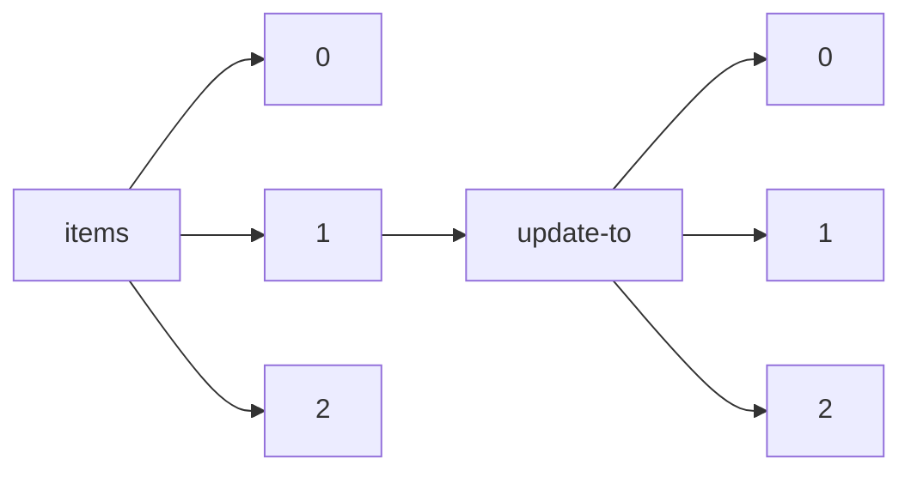

!!! warning "This document is not official Crossref documentation"
# Elements
PATH = items/array/update-to/array(1)  
Occurs 280 152 times  
{ .annotate }

1. A route to an element, for example:  
   The route "items/array/update-to/array" corresponds to navigating through the JSON indices as  
   ["items"][0]["update-to"][0]  

## DOI
See more information: [items/array/update-to/array/DOI](DOI/index.md)  
Occurs 280 152 timess  
Unique values: > 999  

!!! note "Due to current limitations, only the first 1,000 unique values are counted."

| **Row** | **Value** `String`            | **Count** `Int64` |
|--------:|---------------------------------:|---------------------:|
| **1**   | 10.1111/j.1365-294x.2006.03198.x | 16                   |
| **2**   | 10.33552/ojdoh.2018.01.000503    | 13                   |
| **3**   | 10.1177/1477153518779637         | 9                    |
| **4**   | 10.12688/wellcomeopenres.16259.1 | 8                    |
| **5**   | 10.1371/journal.pbio.1000359     | 6                    |
| **6**   | 10.1158/1078-0432.ccr-08-0869    | 6                    |
| **7**   | 10.1158/1541-7786.mcr-19-0889    | 6                    |
| **8**   | 10.12688/f1000research.18095.1   | 5                    |
| **9**   | 10.1177/0892705713520176         | 5                    |
| **10**  | 10.1177/0267659113502835         | 5                    |
| ... | ... | ... |

## Label
See more information: [items/array/update-to/array/label](label/index.md)  
Occurs 280 152 timess  
Unique values: 36  

| **Row** | **Value** `String` | **Count** `Int64` |
|--------:|----------------------:|---------------------:|
| **1**   | Correction            | 123 871              |
| **2**   | Erratum               | 70 321               |
| **3**   | New edition           | 31 653               |
| **4**   | New version           | 30 237               |
| **5**   | Retraction            | 13 124               |
| **6**   | Corrigendum           | 4 498                |
| **7**   | Expression of concern | 2 183                |
| **8**   | Withdrawal            | 2 138                |
| **9**   | Addendum              | 1 205                |
| **10**  | Clarification         | 459                  |
| ... | ... | ... |

## Type
See more information: [items/array/update-to/array/type](type/index.md)  
Occurs 280 152 timess  
Unique values: 41  

| **Row** | **Value** `String`   | **Count** `Int64` |
|--------:|------------------------:|---------------------:|
| **1**   | correction              | 123 870              |
| **2**   | erratum                 | 70 068               |
| **3**   | new\_edition            | 31 653               |
| **4**   | new\_version            | 30 237               |
| **5**   | retraction              | 13 120               |
| **6**   | corrigendum             | 4 492                |
| **7**   | expression\_of\_concern | 2 183                |
| **8**   | withdrawal              | 2 138                |
| **9**   | addendum                | 1 205                |
| **10**  | clarification           | 459                  |
| ... | ... | ... |

## Updated
See more information: [items/array/update-to/array/updated](updated/index.md)  
Occurs 280 152 timess  

