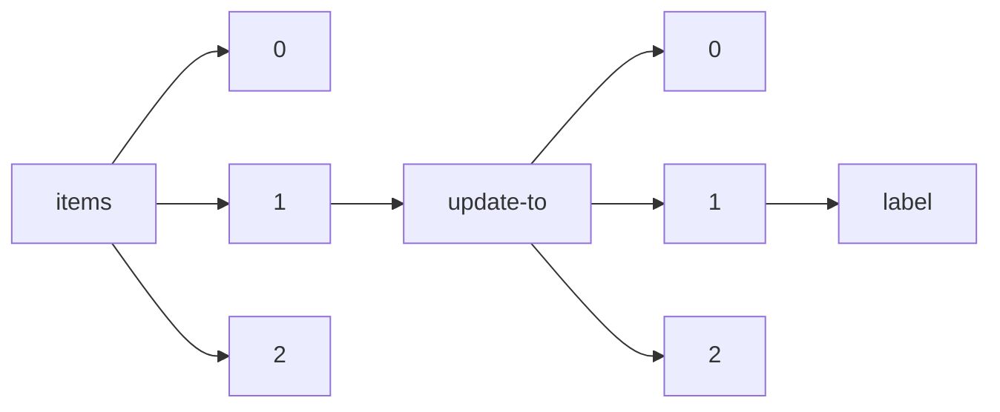

!!! warning "This document is not official Crossref documentation"
# Label
PATH = items/array/update-to/array/label(1)  
Occurs 280 152 times  
Unique values: 36  
{ .annotate }

1. A route to an element, for example:  
   The route "items/array/update-to/array/label" corresponds to navigating through the JSON indices as  
   ["items"][0]["update-to"][0]["label"]  

| **Row** | **Value** `String`  | **Count** `Int64` |
|--------:|-----------------------:|---------------------:|
| **1**   | Correction             | 123 871              |
| **2**   | Erratum                | 70 321               |
| **3**   | New edition            | 31 653               |
| **4**   | New version            | 30 237               |
| **5**   | Retraction             | 13 124               |
| **6**   | Corrigendum            | 4 498                |
| **7**   | Expression of concern  | 2 183                |
| **8**   | Withdrawal             | 2 138                |
| **9**   | Addendum               | 1 205                |
| **10**  | Clarification          | 459                  |
| **11**  | Removal                | 198                  |
| **12**  | publisher-note         | 56                   |
| **13**  | article                | 55                   |
| **14**  | Corrected              | 54                   |
| **15**  | Corrected Article      | 38                   |
| **16**  | Comment                | 15                   |
| **17**  | note-discuss           | 8                    |
| **18**  | contributed-paper      | 8                    |
| **19**  | Expression of Concern  | 6                    |
| **20**  | Unknown                | 4                    |
| **21**  | Sample update          | 3                    |
| **22**  | Partial retraction     | 2                    |
| **23**  | invited-article        | 2                    |
| **24**  | invited-paper          | 2                    |
| **25**  | tutorial               | 1                    |
| **26**  | peer-confarticles      | 1                    |
| **27**  | tg-report              | 1                    |
| **28**  | Interesting Update     | 1                    |
| **29**  | communications         | 1                    |
| **30**  | correspondence         | 1                    |
| **31**  | Retracted              | 1                    |
| **32**  | Retracion              | 1                    |
| **33**  | book-review            | 1                    |
| **34**  | Version of record      | 1                    |
| **35**  | point-counterpoint     | 1                    |
| **36**  | This is some update 23 | 1                    |

