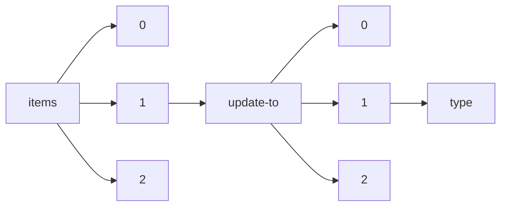

!!! warning "This document is not official Crossref documentation"
# Type
PATH = items/array/update-to/array/type(1)  
Occurs 280 152 times  
Unique values: 41  
{ .annotate }

1. A route to an element, for example:  
   The route "items/array/update-to/array/type" corresponds to navigating through the JSON indices as  
   ["items"][0]["update-to"][0]["type"]  

| **Row** | **Value** `String`      | **Count** `Int64` |
|--------:|---------------------------:|---------------------:|
| **1**   | correction                 | 123 870              |
| **2**   | erratum                    | 70 068               |
| **3**   | new\_edition               | 31 653               |
| **4**   | new\_version               | 30 237               |
| **5**   | retraction                 | 13 120               |
| **6**   | corrigendum                | 4 492                |
| **7**   | expression\_of\_concern    | 2 183                |
| **8**   | withdrawal                 | 2 138                |
| **9**   | addendum                   | 1 205                |
| **10**  | clarification              | 459                  |
| **11**  | err                        | 234                  |
| **12**  | removal                    | 198                  |
| **13**  | publisher-note             | 56                   |
| **14**  | article                    | 55                   |
| **15**  | corrected                  | 54                   |
| **16**  | corrected-article          | 38                   |
| **17**  | Erratum                    | 19                   |
| **18**  | comment                    | 15                   |
| **19**  | note-discuss               | 8                    |
| **20**  | contributed-paper          | 8                    |
| **21**  | expression-of-concern      | 6                    |
| **22**  | Corrigendum                | 6                    |
| **23**  | unknown                    | 4                    |
| **24**  | Retraction                 | 4                    |
| **25**  | sample\_update             | 3                    |
| **26**  | invited-article            | 2                    |
| **27**  | invited-paper              | 2                    |
| **28**  | partial\_retraction        | 2                    |
| **29**  | tutorial                   | 1                    |
| **30**  | retracion                  | 1                    |
| **31**  | peer-confarticles          | 1                    |
| **32**  | tg-report                  | 1                    |
| **33**  | Correction                 | 1                    |
| **34**  | communications             | 1                    |
| **35**  | correspondence             | 1                    |
| **36**  | book-review                | 1                    |
| **37**  | retration                  | 1                    |
| **38**  | point-counterpoint         | 1                    |
| **39**  | this\_is\_some\_update\_23 | 1                    |
| **40**  | interesting\_update        | 1                    |
| **41**  | print                      | 1                    |

