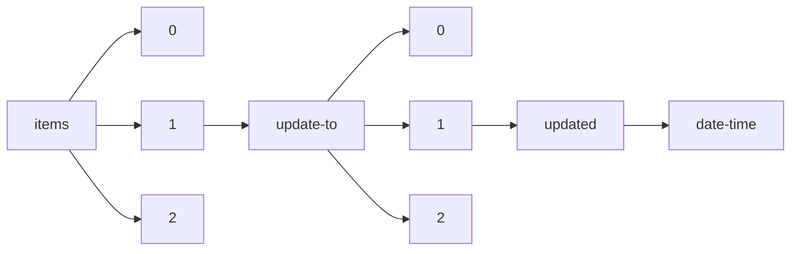

!!! warning "This document is not official Crossref documentation"
# Date-time
PATH = items/array/update-to/array/updated/date-time(1)  
Occurs 280 152 times  
Unique values: > 999  
{ .annotate }

1. A route to an element, for example:  
   The route "items/array/update-to/array/updated/date-time" corresponds to navigating through the JSON indices as  
   ["items"][0]["update-to"][0]["updated"]["date-time"]  

!!! note "Due to current limitations, only the first 1,000 unique values are counted."

| **Row** | **Value** `String` | **Count** `Int64` |
|--------:|----------------------:|---------------------:|
| **1**   | 2020-12-01T00:00:00Z  | 1 865                |
| **2**   | 2021-03-01T00:00:00Z  | 1 721                |
| **3**   | 2021-06-01T00:00:00Z  | 1 115                |
| **4**   | 2021-09-01T00:00:00Z  | 1 066                |
| **5**   | 2021-01-01T00:00:00Z  | 1 047                |
| **6**   | 2022-01-01T00:00:00Z  | 1 000                |
| **7**   | 2020-01-01T00:00:00Z  | 982                  |
| **8**   | 2021-07-01T00:00:00Z  | 978                  |
| **9**   | 2021-12-01T00:00:00Z  | 841                  |
| **10**  | 2023-03-01T00:00:00Z  | 826                  |
| **11**  | 2021-02-01T00:00:00Z  | 808                  |
| **12**  | 2021-04-01T00:00:00Z  | 792                  |
| **13**  | 2022-12-01T00:00:00Z  | 756                  |
| **14**  | 2021-10-01T00:00:00Z  | 641                  |
| **15**  | 2021-05-01T00:00:00Z  | 635                  |
| **16**  | 2020-10-01T00:00:00Z  | 622                  |
| **17**  | 2020-11-01T00:00:00Z  | 612                  |
| **18**  | 2022-03-01T00:00:00Z  | 597                  |
| **19**  | 2021-12-15T00:00:00Z  | 588                  |
| **20**  | 2020-09-01T00:00:00Z  | 586                  |
| **21**  | 2022-06-01T00:00:00Z  | 581                  |
| **22**  | 2022-08-01T00:00:00Z  | 580                  |
| **23**  | 2021-08-01T00:00:00Z  | 578                  |
| **24**  | 2022-04-01T00:00:00Z  | 559                  |
| **25**  | 2022-09-01T00:00:00Z  | 548                  |
| **26**  | 2021-09-28T00:00:00Z  | 526                  |
| **27**  | 2022-02-01T00:00:00Z  | 507                  |
| **28**  | 2022-07-01T00:00:00Z  | 490                  |
| **29**  | 2019-02-01T00:00:00Z  | 489                  |
| **30**  | 2022-05-01T00:00:00Z  | 489                  |
| **31**  | 2023-02-01T00:00:00Z  | 480                  |
| **32**  | 2022-10-01T00:00:00Z  | 464                  |
| **33**  | 2022-11-01T00:00:00Z  | 463                  |
| **34**  | 2021-11-01T00:00:00Z  | 462                  |
| **35**  | 2023-01-01T00:00:00Z  | 412                  |
| **36**  | 2020-07-01T00:00:00Z  | 406                  |
| **37**  | 2020-04-01T00:00:00Z  | 399                  |
| **38**  | 2013-12-12T00:00:00Z  | 398                  |
| **39**  | 2020-06-01T00:00:00Z  | 391                  |
| **40**  | 2018-03-01T00:00:00Z  | 372                  |
| **41**  | 2019-08-01T00:00:00Z  | 364                  |
| **42**  | 2019-10-01T00:00:00Z  | 363                  |
| **43**  | 2019-07-01T00:00:00Z  | 360                  |
| **44**  | 2015-12-01T00:00:00Z  | 357                  |
| **45**  | 2020-02-01T00:00:00Z  | 356                  |
| **46**  | 2018-02-01T00:00:00Z  | 353                  |
| **47**  | 2018-11-01T00:00:00Z  | 352                  |
| **48**  | 2023-03-16T00:00:00Z  | 347                  |
| **49**  | 2020-03-01T00:00:00Z  | 345                  |
| **50**  | 2019-03-01T00:00:00Z  | 344                  |
| **51**  | 2020-05-01T00:00:00Z  | 340                  |
| **52**  | 2019-05-01T00:00:00Z  | 336                  |
| **53**  | 2018-06-01T00:00:00Z  | 334                  |
| **54**  | 2019-04-01T00:00:00Z  | 333                  |
| **55**  | 2017-12-01T00:00:00Z  | 330                  |
| **56**  | 2016-12-01T00:00:00Z  | 327                  |
| **57**  | 2018-08-01T00:00:00Z  | 324                  |
| **58**  | 2017-06-01T00:00:00Z  | 323                  |
| **59**  | 2023-04-01T00:00:00Z  | 323                  |
| **60**  | 2018-12-01T00:00:00Z  | 314                  |
| **61**  | 2017-01-01T00:00:00Z  | 313                  |
| **62**  | 2017-03-01T00:00:00Z  | 307                  |
| **63**  | 2019-01-01T00:00:00Z  | 304                  |
| **64**  | 2018-10-01T00:00:00Z  | 303                  |
| **65**  | 2017-09-01T00:00:00Z  | 299                  |
| **66**  | 2017-08-01T00:00:00Z  | 299                  |
| **67**  | 2017-02-01T00:00:00Z  | 298                  |
| **68**  | 2019-11-01T00:00:00Z  | 298                  |
| **69**  | 2019-06-01T00:00:00Z  | 296                  |
| **70**  | 2017-05-01T00:00:00Z  | 293                  |
| **71**  | 2017-11-01T00:00:00Z  | 291                  |
| **72**  | 2020-08-01T00:00:00Z  | 290                  |
| **73**  | 2016-11-01T00:00:00Z  | 287                  |
| **74**  | 2019-09-01T00:00:00Z  | 283                  |
| **75**  | 2016-06-01T00:00:00Z  | 282                  |
| **76**  | 2016-09-01T00:00:00Z  | 282                  |
| **77**  | 2019-12-01T00:00:00Z  | 282                  |
| **78**  | 2016-03-01T00:00:00Z  | 280                  |
| **79**  | 2018-05-01T00:00:00Z  | 278                  |
| **80**  | 2018-01-01T00:00:00Z  | 275                  |
| **81**  | 2015-05-01T00:00:00Z  | 275                  |
| **82**  | 2014-12-01T00:00:00Z  | 266                  |
| **83**  | 2015-09-01T00:00:00Z  | 262                  |
| **84**  | 2016-07-01T00:00:00Z  | 262                  |
| **85**  | 2018-07-01T00:00:00Z  | 260                  |
| **86**  | 2014-07-01T00:00:00Z  | 250                  |
| **87**  | 2015-04-01T00:00:00Z  | 249                  |
| **88**  | 2016-10-01T00:00:00Z  | 248                  |
| **89**  | 2018-04-01T00:00:00Z  | 248                  |
| **90**  | 2016-05-01T00:00:00Z  | 245                  |
| **91**  | 2016-04-01T00:00:00Z  | 243                  |
| **92**  | 2015-01-01T00:00:00Z  | 242                  |
| **93**  | 2018-09-01T00:00:00Z  | 241                  |
| **94**  | 2016-08-01T00:00:00Z  | 240                  |
| **95**  | 2017-04-01T00:00:00Z  | 239                  |
| **96**  | 2015-06-01T00:00:00Z  | 239                  |
| **97**  | 2015-10-01T00:00:00Z  | 236                  |
| **98**  | 2014-10-01T00:00:00Z  | 236                  |
| **99**  | 2017-10-01T00:00:00Z  | 236                  |
| **100** | 2016-01-01T00:00:00Z  | 233                  |
| **101** | 2015-07-01T00:00:00Z  | 228                  |
| **102** | 1991-04-01T00:00:00Z  | 227                  |
| **103** | 2020-01-28T00:00:00Z  | 223                  |
| **104** | 2016-02-01T00:00:00Z  | 222                  |
| **105** | 2021-02-02T00:00:00Z  | 219                  |
| **106** | 2015-03-01T00:00:00Z  | 218                  |
| **107** | 2014-09-01T00:00:00Z  | 218                  |
| **108** | 2015-08-01T00:00:00Z  | 208                  |
| **109** | 2006-06-26T00:00:00Z  | 207                  |
| **110** | 2014-01-01T00:00:00Z  | 202                  |
| **111** | 2015-11-01T00:00:00Z  | 202                  |
| **112** | 2014-03-01T00:00:00Z  | 198                  |
| **113** | 2014-11-01T00:00:00Z  | 196                  |
| **114** | 1986-05-01T00:00:00Z  | 195                  |
| **115** | 2022-01-19T00:00:00Z  | 190                  |
| **116** | 2020-12-20T00:00:00Z  | 187                  |
| **117** | 2023-02-17T00:00:00Z  | 186                  |
| **118** | 2017-07-01T00:00:00Z  | 185                  |
| **119** | 2018-07-16T00:00:00Z  | 184                  |
| **120** | 2015-02-01T00:00:00Z  | 180                  |
| **121** | 2017-05-09T00:00:00Z  | 179                  |
| **122** | 2014-05-01T00:00:00Z  | 179                  |
| **123** | 2022-01-18T00:00:00Z  | 177                  |
| **124** | 2014-04-01T00:00:00Z  | 177                  |
| **125** | 2022-12-13T00:00:00Z  | 174                  |
| **126** | 2014-06-01T00:00:00Z  | 174                  |
| **127** | 2013-10-01T00:00:00Z  | 172                  |
| **128** | 1980-06-23T00:00:00Z  | 171                  |
| **129** | 2020-09-11T00:00:00Z  | 169                  |
| **130** | 2017-04-20T00:00:00Z  | 169                  |
| **131** | 2021-04-15T00:00:00Z  | 166                  |
| **132** | 1984-01-01T00:00:00Z  | 165                  |
| **133** | 2023-03-03T00:00:00Z  | 162                  |
| **134** | 2021-03-15T00:00:00Z  | 159                  |
| **135** | 2014-08-01T00:00:00Z  | 158                  |
| **136** | 2019-12-10T00:00:00Z  | 154                  |
| **137** | 2013-12-01T00:00:00Z  | 154                  |
| **138** | 1984-06-01T00:00:00Z  | 150                  |
| **139** | 2013-11-01T00:00:00Z  | 149                  |
| **140** | 2021-04-06T00:00:00Z  | 149                  |
| **141** | 2001-05-01T00:00:00Z  | 148                  |
| **142** | 2021-02-16T00:00:00Z  | 148                  |
| **143** | 2021-04-19T00:00:00Z  | 147                  |
| **144** | 1993-06-01T00:00:00Z  | 147                  |
| **145** | 2014-02-01T00:00:00Z  | 146                  |
| **146** | 2021-02-04T00:00:00Z  | 146                  |
| **147** | 2019-12-09T00:00:00Z  | 146                  |
| **148** | 2021-02-24T00:00:00Z  | 145                  |
| **149** | 2022-09-22T00:00:00Z  | 144                  |
| **150** | 2016-03-25T00:00:00Z  | 143                  |
| **151** | 2013-09-01T00:00:00Z  | 143                  |
| **152** | 2023-03-17T00:00:00Z  | 143                  |
| **153** | 2020-09-14T00:00:00Z  | 143                  |
| **154** | 2022-06-14T00:00:00Z  | 142                  |
| **155** | 2020-10-15T00:00:00Z  | 142                  |
| **156** | 1988-06-01T00:00:00Z  | 142                  |
| **157** | 2021-07-20T00:00:00Z  | 142                  |
| **158** | 2019-07-10T00:00:00Z  | 141                  |
| **159** | 2021-11-09T00:00:00Z  | 141                  |
| **160** | 2021-02-19T00:00:00Z  | 141                  |
| **161** | 2021-02-15T00:00:00Z  | 140                  |
| **162** | 2021-11-15T00:00:00Z  | 140                  |
| **163** | 2021-06-30T00:00:00Z  | 139                  |
| **164** | 1987-12-01T00:00:00Z  | 139                  |
| **165** | 1996-01-01T00:00:00Z  | 139                  |
| **166** | 2021-12-06T00:00:00Z  | 138                  |
| **167** | 1990-05-01T00:00:00Z  | 138                  |
| **168** | 1998-06-01T00:00:00Z  | 138                  |
| **169** | 2009-07-06T00:00:00Z  | 138                  |
| **170** | 2019-02-06T00:00:00Z  | 137                  |
| **171** | 2021-06-15T00:00:00Z  | 136                  |
| **172** | 2015-08-17T00:00:00Z  | 136                  |
| **173** | 2022-04-19T00:00:00Z  | 136                  |
| **174** | 2020-12-10T00:00:00Z  | 136                  |
| **175** | 2020-09-09T00:00:00Z  | 135                  |
| **176** | 2022-07-07T00:00:00Z  | 134                  |
| **177** | 2022-09-20T00:00:00Z  | 134                  |
| **178** | 2020-07-15T00:00:00Z  | 133                  |
| **179** | 2022-02-15T00:00:00Z  | 133                  |
| **180** | 2021-01-08T00:00:00Z  | 132                  |
| **181** | 2021-06-04T00:00:00Z  | 132                  |
| **182** | 2021-04-08T00:00:00Z  | 132                  |
| **183** | 2021-05-26T00:00:00Z  | 131                  |
| **184** | 2020-09-15T00:00:00Z  | 131                  |
| **185** | 2005-02-23T00:00:00Z  | 131                  |
| **186** | 2021-03-02T00:00:00Z  | 130                  |
| **187** | 2004-03-01T00:00:00Z  | 130                  |
| **188** | 2017-04-04T00:00:00Z  | 129                  |
| **189** | 2020-12-15T00:00:00Z  | 129                  |
| **190** | 1998-10-01T00:00:00Z  | 129                  |
| **191** | 2021-07-19T00:00:00Z  | 129                  |
| **192** | 2021-02-08T00:00:00Z  | 129                  |
| **193** | 2008-03-12T00:00:00Z  | 128                  |
| **194** | 2023-03-15T00:00:00Z  | 127                  |
| **195** | 1992-12-01T00:00:00Z  | 126                  |
| **196** | 1998-08-01T00:00:00Z  | 126                  |
| **197** | 2021-09-15T00:00:00Z  | 125                  |
| **198** | 2021-02-25T00:00:00Z  | 125                  |
| **199** | 2007-03-07T00:00:00Z  | 125                  |
| **200** | 2020-07-06T00:00:00Z  | 124                  |
| **201** | 2021-02-26T00:00:00Z  | 124                  |
| **202** | 1989-04-01T00:00:00Z  | 124                  |
| **203** | 2008-06-30T00:00:00Z  | 123                  |
| **204** | 2021-05-10T00:00:00Z  | 123                  |
| **205** | 2021-01-15T00:00:00Z  | 122                  |
| **206** | 2022-07-28T00:00:00Z  | 122                  |
| **207** | 2021-03-31T00:00:00Z  | 121                  |
| **208** | 1999-03-01T00:00:00Z  | 121                  |
| **209** | 2023-01-19T00:00:00Z  | 121                  |
| **210** | 2021-04-13T00:00:00Z  | 121                  |
| **211** | 2021-08-16T00:00:00Z  | 120                  |
| **212** | 2004-06-28T00:00:00Z  | 120                  |
| **213** | 2009-03-04T00:00:00Z  | 118                  |
| **214** | 2022-09-15T00:00:00Z  | 118                  |
| **215** | 2021-09-30T00:00:00Z  | 118                  |
| **216** | 1994-03-12T00:00:00Z  | 118                  |
| **217** | 2022-12-15T00:00:00Z  | 118                  |
| **218** | 1976-02-01T00:00:00Z  | 118                  |
| **219** | 2022-03-15T00:00:00Z  | 118                  |
| **220** | 2015-03-14T00:00:00Z  | 117                  |
| **221** | 2021-08-26T00:00:00Z  | 117                  |
| **222** | 2019-07-09T00:00:00Z  | 117                  |
| **223** | 2021-06-10T00:00:00Z  | 117                  |
| **224** | 2022-02-11T00:00:00Z  | 117                  |
| **225** | 2022-12-08T00:00:00Z  | 117                  |
| **226** | 2022-06-07T00:00:00Z  | 116                  |
| **227** | 2022-03-17T00:00:00Z  | 116                  |
| **228** | 2021-02-10T00:00:00Z  | 116                  |
| **229** | 2018-01-30T00:00:00Z  | 116                  |
| **230** | 2020-02-10T00:00:00Z  | 116                  |
| **231** | 2021-01-05T00:00:00Z  | 115                  |
| **232** | 2022-06-06T00:00:00Z  | 115                  |
| **233** | 2021-03-05T00:00:00Z  | 114                  |
| **234** | 2018-06-12T00:00:00Z  | 114                  |
| **235** | 2022-04-07T00:00:00Z  | 114                  |
| **236** | 2021-03-11T00:00:00Z  | 113                  |
| **237** | 2021-11-29T00:00:00Z  | 113                  |
| **238** | 2020-12-17T00:00:00Z  | 113                  |
| **239** | 2019-12-12T00:00:00Z  | 113                  |
| **240** | 1998-03-01T00:00:00Z  | 112                  |
| **241** | 2015-06-03T00:00:00Z  | 112                  |
| **242** | 2021-10-28T00:00:00Z  | 112                  |
| **243** | 2023-01-11T00:00:00Z  | 111                  |
| **244** | 2021-05-06T00:00:00Z  | 111                  |
| **245** | 2017-05-03T00:00:00Z  | 111                  |
| **246** | 2023-02-16T00:00:00Z  | 111                  |
| **247** | 2009-01-21T00:00:00Z  | 110                  |
| **248** | 2021-11-18T00:00:00Z  | 110                  |
| **249** | 2023-03-21T00:00:00Z  | 110                  |
| **250** | 2001-02-01T00:00:00Z  | 109                  |
| **251** | 2022-05-23T00:00:00Z  | 109                  |
| **252** | 2021-03-09T00:00:00Z  | 108                  |
| **253** | 2021-01-28T00:00:00Z  | 108                  |
| **254** | 2022-08-03T00:00:00Z  | 107                  |
| **255** | 2022-02-14T00:00:00Z  | 107                  |
| **256** | 2019-04-15T00:00:00Z  | 107                  |
| **257** | 2021-09-14T00:00:00Z  | 107                  |
| **258** | 2021-08-25T00:00:00Z  | 107                  |
| **259** | 2021-09-23T00:00:00Z  | 107                  |
| **260** | 2022-04-28T00:00:00Z  | 106                  |
| **261** | 2006-10-20T00:00:00Z  | 106                  |
| **262** | 2017-09-22T00:00:00Z  | 106                  |
| **263** | 2021-06-17T00:00:00Z  | 106                  |
| **264** | 2021-02-09T00:00:00Z  | 106                  |
| **265** | 2020-03-06T00:00:00Z  | 105                  |
| **266** | 2023-01-18T00:00:00Z  | 105                  |
| **267** | 2020-02-28T00:00:00Z  | 105                  |
| **268** | 2021-05-19T00:00:00Z  | 105                  |
| **269** | 2022-11-02T00:00:00Z  | 105                  |
| **270** | 2008-03-01T00:00:00Z  | 105                  |
| **271** | 2020-06-15T00:00:00Z  | 105                  |
| **272** | 2007-06-25T00:00:00Z  | 105                  |
| **273** | 2020-05-15T00:00:00Z  | 104                  |
| **274** | 2020-10-23T00:00:00Z  | 104                  |
| **275** | 2021-03-23T00:00:00Z  | 104                  |
| **276** | 2022-05-19T00:00:00Z  | 104                  |
| **277** | 2021-06-09T00:00:00Z  | 104                  |
| **278** | 2022-11-28T00:00:00Z  | 104                  |
| **279** | 2021-08-09T00:00:00Z  | 104                  |
| **280** | 2021-12-02T00:00:00Z  | 103                  |
| **281** | 2002-02-27T00:00:00Z  | 103                  |
| **282** | 2021-04-07T00:00:00Z  | 103                  |
| **283** | 2021-07-06T00:00:00Z  | 103                  |
| **284** | 2021-02-17T00:00:00Z  | 103                  |
| **285** | 2022-04-06T00:00:00Z  | 102                  |
| **286** | 1989-07-01T00:00:00Z  | 102                  |
| **287** | 1993-03-01T00:00:00Z  | 102                  |
| **288** | 2022-04-11T00:00:00Z  | 102                  |
| **289** | 2021-07-16T00:00:00Z  | 102                  |
| **290** | 2020-11-20T00:00:00Z  | 102                  |
| **291** | 2015-06-15T00:00:00Z  | 102                  |
| **292** | 1990-02-01T00:00:00Z  | 102                  |
| **293** | 2022-02-03T00:00:00Z  | 102                  |
| **294** | 2021-04-29T00:00:00Z  | 101                  |
| **295** | 2021-06-14T00:00:00Z  | 101                  |
| **296** | 2022-01-05T00:00:00Z  | 101                  |
| **297** | 2020-02-06T00:00:00Z  | 101                  |
| **298** | 2020-11-12T00:00:00Z  | 101                  |
| **299** | 2020-09-30T00:00:00Z  | 101                  |
| **300** | 2022-11-15T00:00:00Z  | 101                  |
| **301** | 1987-10-01T00:00:00Z  | 100                  |
| **302** | 2021-06-11T00:00:00Z  | 100                  |
| **303** | 2013-08-27T00:00:00Z  | 100                  |
| **304** | 1987-01-01T00:00:00Z  | 100                  |
| **305** | 2018-03-19T00:00:00Z  | 100                  |
| **306** | 2022-07-08T00:00:00Z  | 99                   |
| **307** | 2000-03-01T00:00:00Z  | 99                   |
| **308** | 2018-07-24T00:00:00Z  | 99                   |
| **309** | 2021-06-22T00:00:00Z  | 99                   |
| **310** | 2023-02-14T00:00:00Z  | 99                   |
| **311** | 2022-08-02T00:00:00Z  | 98                   |
| **312** | 2021-09-16T00:00:00Z  | 98                   |
| **313** | 2003-01-11T00:00:00Z  | 98                   |
| **314** | 2017-02-13T00:00:00Z  | 98                   |
| **315** | 2020-09-16T00:00:00Z  | 98                   |
| **316** | 2022-10-31T00:00:00Z  | 97                   |
| **317** | 2022-07-15T00:00:00Z  | 97                   |
| **318** | 2021-09-07T00:00:00Z  | 97                   |
| **319** | 2021-08-10T00:00:00Z  | 97                   |
| **320** | 2021-08-18T00:00:00Z  | 97                   |
| **321** | 2021-03-03T00:00:00Z  | 97                   |
| **322** | 1995-03-15T00:00:00Z  | 97                   |
| **323** | 2014-10-15T00:00:00Z  | 97                   |
| **324** | 2020-02-19T00:00:00Z  | 96                   |
| **325** | 2021-12-20T00:00:00Z  | 96                   |
| **326** | 1999-06-01T00:00:00Z  | 96                   |
| **327** | 2019-10-15T00:00:00Z  | 96                   |
| **328** | 2020-01-31T00:00:00Z  | 96                   |
| **329** | 2022-12-20T00:00:00Z  | 96                   |
| **330** | 2023-02-09T00:00:00Z  | 96                   |
| **331** | 2020-10-12T00:00:00Z  | 96                   |
| **332** | 2021-08-27T00:00:00Z  | 96                   |
| **333** | 2023-02-22T00:00:00Z  | 95                   |
| **334** | 2022-03-22T00:00:00Z  | 95                   |
| **335** | 2021-07-09T00:00:00Z  | 95                   |
| **336** | 2023-03-23T00:00:00Z  | 95                   |
| **337** | 2023-02-02T00:00:00Z  | 95                   |
| **338** | 2020-04-29T00:00:00Z  | 95                   |
| **339** | 2005-06-27T00:00:00Z  | 95                   |
| **340** | 2021-04-20T00:00:00Z  | 95                   |
| **341** | 2021-08-11T00:00:00Z  | 95                   |
| **342** | 2022-11-29T00:00:00Z  | 95                   |
| **343** | 2022-12-05T00:00:00Z  | 95                   |
| **344** | 2021-03-10T00:00:00Z  | 95                   |
| **345** | 2022-02-05T00:00:00Z  | 95                   |
| **346** | 2019-09-10T00:00:00Z  | 95                   |
| **347** | 2022-05-10T00:00:00Z  | 94                   |
| **348** | 2021-06-24T00:00:00Z  | 94                   |
| **349** | 2021-10-20T00:00:00Z  | 94                   |
| **350** | 2021-12-16T00:00:00Z  | 94                   |
| **351** | 2021-09-08T00:00:00Z  | 93                   |
| **352** | 2020-03-04T00:00:00Z  | 93                   |
| **353** | 2023-01-31T00:00:00Z  | 93                   |
| **354** | 2020-05-29T00:00:00Z  | 93                   |
| **355** | 2022-02-18T00:00:00Z  | 93                   |
| **356** | 1997-03-01T00:00:00Z  | 93                   |
| **357** | 2022-03-23T00:00:00Z  | 93                   |
| **358** | 2021-09-29T00:00:00Z  | 93                   |
| **359** | 2021-11-17T00:00:00Z  | 93                   |
| **360** | 2021-08-31T00:00:00Z  | 93                   |
| **361** | 2021-10-19T00:00:00Z  | 93                   |
| **362** | 2021-09-21T00:00:00Z  | 92                   |
| **363** | 2021-08-17T00:00:00Z  | 92                   |
| **364** | 2020-09-04T00:00:00Z  | 92                   |
| **365** | 2022-06-21T00:00:00Z  | 92                   |
| **366** | 1999-05-01T00:00:00Z  | 92                   |
| **367** | 2020-06-23T00:00:00Z  | 92                   |
| **368** | 1990-06-01T00:00:00Z  | 92                   |
| **369** | 2018-03-06T00:00:00Z  | 92                   |
| **370** | 2021-10-12T00:00:00Z  | 91                   |
| **371** | 2020-07-07T00:00:00Z  | 91                   |
| **372** | 2020-07-21T00:00:00Z  | 91                   |
| **373** | 2020-03-19T00:00:00Z  | 91                   |
| **374** | 2012-06-11T00:00:00Z  | 91                   |
| **375** | 2021-11-16T00:00:00Z  | 91                   |
| **376** | 2014-08-17T00:00:00Z  | 91                   |
| **377** | 2018-11-15T00:00:00Z  | 91                   |
| **378** | 2022-09-30T00:00:00Z  | 90                   |
| **379** | 2021-03-29T00:00:00Z  | 90                   |
| **380** | 2022-02-23T00:00:00Z  | 90                   |
| **381** | 2021-10-11T00:00:00Z  | 90                   |
| **382** | 2002-06-24T00:00:00Z  | 90                   |
| **383** | 2022-06-02T00:00:00Z  | 90                   |
| **384** | 2020-12-16T00:00:00Z  | 90                   |
| **385** | 2021-02-18T00:00:00Z  | 90                   |
| **386** | 2019-05-14T00:00:00Z  | 89                   |
| **387** | 2020-02-27T00:00:00Z  | 89                   |
| **388** | 2021-11-08T00:00:00Z  | 89                   |
| **389** | 2020-08-19T00:00:00Z  | 89                   |
| **390** | 1986-06-01T00:00:00Z  | 89                   |
| **391** | 2022-11-16T00:00:00Z  | 89                   |
| **392** | 2021-11-03T00:00:00Z  | 89                   |
| **393** | 2020-03-05T00:00:00Z  | 89                   |
| **394** | 2020-10-27T00:00:00Z  | 89                   |
| **395** | 2021-04-12T00:00:00Z  | 89                   |
| **396** | 2022-12-19T00:00:00Z  | 89                   |
| **397** | 2021-11-11T00:00:00Z  | 89                   |
| **398** | 2023-03-14T00:00:00Z  | 89                   |
| **399** | 2022-04-25T00:00:00Z  | 89                   |
| **400** | 2018-03-22T00:00:00Z  | 89                   |
| **401** | 2020-09-03T00:00:00Z  | 88                   |
| **402** | 2021-08-12T00:00:00Z  | 88                   |
| **403** | 2022-02-28T00:00:00Z  | 88                   |
| **404** | 2020-11-09T00:00:00Z  | 88                   |
| **405** | 2003-06-30T00:00:00Z  | 88                   |
| **406** | 2016-06-14T00:00:00Z  | 88                   |
| **407** | 2021-05-11T00:00:00Z  | 88                   |
| **408** | 2022-03-14T00:00:00Z  | 88                   |
| **409** | 2020-07-22T00:00:00Z  | 87                   |
| **410** | 2022-02-07T00:00:00Z  | 87                   |
| **411** | 2021-08-30T00:00:00Z  | 87                   |
| **412** | 2022-06-15T00:00:00Z  | 87                   |
| **413** | 2022-09-14T00:00:00Z  | 87                   |
| **414** | 2020-10-06T00:00:00Z  | 87                   |
| **415** | 2020-07-14T00:00:00Z  | 87                   |
| **416** | 2020-03-31T00:00:00Z  | 87                   |
| **417** | 2021-06-18T00:00:00Z  | 87                   |
| **418** | 2022-09-21T00:00:00Z  | 87                   |
| **419** | 2022-01-11T00:00:00Z  | 87                   |
| **420** | 2021-08-06T00:00:00Z  | 86                   |
| **421** | 2021-11-24T00:00:00Z  | 86                   |
| **422** | 2020-06-26T00:00:00Z  | 86                   |
| **423** | 2021-10-06T00:00:00Z  | 86                   |
| **424** | 2022-01-31T00:00:00Z  | 86                   |
| **425** | 2022-10-13T00:00:00Z  | 86                   |
| **426** | 2005-05-15T00:00:00Z  | 86                   |
| **427** | 2021-12-09T00:00:00Z  | 86                   |
| **428** | 2022-09-16T00:00:00Z  | 86                   |
| **429** | 2019-03-28T00:00:00Z  | 86                   |
| **430** | 2021-01-04T00:00:00Z  | 86                   |
| **431** | 2020-05-21T00:00:00Z  | 86                   |
| **432** | 2022-02-25T00:00:00Z  | 86                   |
| **433** | 2020-01-14T00:00:00Z  | 86                   |
| **434** | 2020-12-14T00:00:00Z  | 85                   |
| **435** | 2021-04-14T00:00:00Z  | 85                   |
| **436** | 2019-03-12T00:00:00Z  | 85                   |
| **437** | 2020-06-24T00:00:00Z  | 85                   |
| **438** | 2021-03-04T00:00:00Z  | 85                   |
| **439** | 2023-03-09T00:00:00Z  | 85                   |
| **440** | 2022-10-21T00:00:00Z  | 85                   |
| **441** | 2021-07-26T00:00:00Z  | 85                   |
| **442** | 2021-07-29T00:00:00Z  | 84                   |
| **443** | 2022-03-09T00:00:00Z  | 84                   |
| **444** | 2011-08-15T00:00:00Z  | 84                   |
| **445** | 2019-02-07T00:00:00Z  | 84                   |
| **446** | 2021-03-24T00:00:00Z  | 84                   |
| **447** | 2022-08-08T00:00:00Z  | 84                   |
| **448** | 2010-01-20T00:00:00Z  | 84                   |
| **449** | 2021-07-15T00:00:00Z  | 84                   |
| **450** | 1995-05-22T00:00:00Z  | 84                   |
| **451** | 2013-03-16T00:00:00Z  | 84                   |
| **452** | 2022-09-12T00:00:00Z  | 84                   |
| **453** | 2018-12-10T00:00:00Z  | 84                   |
| **454** | 2016-10-19T00:00:00Z  | 84                   |
| **455** | 1992-06-01T00:00:00Z  | 84                   |
| **456** | 2019-05-31T00:00:00Z  | 84                   |
| **457** | 2018-01-26T00:00:00Z  | 84                   |
| **458** | 2021-12-08T00:00:00Z  | 83                   |
| **459** | 2021-09-10T00:00:00Z  | 83                   |
| **460** | 2011-06-04T00:00:00Z  | 83                   |
| **461** | 2021-05-21T00:00:00Z  | 83                   |
| **462** | 2021-01-20T00:00:00Z  | 83                   |
| **463** | 2022-11-09T00:00:00Z  | 83                   |
| **464** | 2019-05-15T00:00:00Z  | 83                   |
| **465** | 2020-10-08T00:00:00Z  | 83                   |
| **466** | 2023-01-12T00:00:00Z  | 82                   |
| **467** | 2021-09-17T00:00:00Z  | 82                   |
| **468** | 2021-01-27T00:00:00Z  | 82                   |
| **469** | 2020-11-05T00:00:00Z  | 82                   |
| **470** | 2020-10-20T00:00:00Z  | 82                   |
| **471** | 2022-12-16T00:00:00Z  | 82                   |
| **472** | 2022-03-10T00:00:00Z  | 82                   |
| **473** | 2015-03-26T00:00:00Z  | 82                   |
| **474** | 2020-01-09T00:00:00Z  | 81                   |
| **475** | 2020-12-18T00:00:00Z  | 81                   |
| **476** | 2020-12-22T00:00:00Z  | 81                   |
| **477** | 2023-02-23T00:00:00Z  | 81                   |
| **478** | 2020-10-30T00:00:00Z  | 81                   |
| **479** | 1994-10-01T00:00:00Z  | 81                   |
| **480** | 2021-08-04T00:00:00Z  | 81                   |
| **481** | 2021-08-02T00:00:00Z  | 81                   |
| **482** | 2005-05-17T00:00:00Z  | 81                   |
| **483** | 2021-03-16T00:00:00Z  | 81                   |
| **484** | 2022-03-21T00:00:00Z  | 81                   |
| **485** | 2018-01-04T00:00:00Z  | 81                   |
| **486** | 2021-08-03T00:00:00Z  | 80                   |
| **487** | 2022-03-03T00:00:00Z  | 80                   |
| **488** | 2022-05-26T00:00:00Z  | 80                   |
| **489** | 2006-07-19T00:00:00Z  | 80                   |
| **490** | 2022-04-21T00:00:00Z  | 80                   |
| **491** | 2019-12-04T00:00:00Z  | 80                   |
| **492** | 2022-05-04T00:00:00Z  | 80                   |
| **493** | 2022-05-05T00:00:00Z  | 80                   |
| **494** | 1973-01-01T00:00:00Z  | 79                   |
| **495** | 2022-10-20T00:00:00Z  | 79                   |
| **496** | 1996-03-01T00:00:00Z  | 79                   |
| **497** | 2018-07-25T00:00:00Z  | 79                   |
| **498** | 2021-10-18T00:00:00Z  | 79                   |
| **499** | 2021-03-30T00:00:00Z  | 79                   |
| **500** | 2023-02-13T00:00:00Z  | 79                   |
| **501** | 2021-11-12T00:00:00Z  | 79                   |
| **502** | 2019-11-19T00:00:00Z  | 79                   |
| **503** | 2019-11-14T00:00:00Z  | 79                   |
| **504** | 2021-04-30T00:00:00Z  | 78                   |
| **505** | 2022-12-12T00:00:00Z  | 78                   |
| **506** | 2022-06-08T00:00:00Z  | 78                   |
| **507** | 2018-01-27T00:00:00Z  | 78                   |
| **508** | 2020-04-02T00:00:00Z  | 78                   |
| **509** | 2021-05-13T00:00:00Z  | 78                   |
| **510** | 2022-04-13T00:00:00Z  | 78                   |
| **511** | 1997-06-01T00:00:00Z  | 78                   |
| **512** | 2021-09-06T00:00:00Z  | 78                   |
| **513** | 2022-10-19T00:00:00Z  | 78                   |
| **514** | 2017-06-14T00:00:00Z  | 78                   |
| **515** | 2010-08-30T00:00:00Z  | 78                   |
| **516** | 2022-01-06T00:00:00Z  | 78                   |
| **517** | 2020-06-03T00:00:00Z  | 78                   |
| **518** | 2021-04-21T00:00:00Z  | 78                   |
| **519** | 2022-07-20T00:00:00Z  | 77                   |
| **520** | 2020-05-20T00:00:00Z  | 77                   |
| **521** | 2017-09-15T00:00:00Z  | 77                   |
| **522** | 2020-05-07T00:00:00Z  | 77                   |
| **523** | 2019-04-30T00:00:00Z  | 77                   |
| **524** | 2021-08-20T00:00:00Z  | 77                   |
| **525** | 2019-06-17T00:00:00Z  | 77                   |
| **526** | 2019-08-15T00:00:00Z  | 77                   |
| **527** | 2020-11-10T00:00:00Z  | 76                   |
| **528** | 2013-06-01T00:00:00Z  | 76                   |
| **529** | 2018-02-28T00:00:00Z  | 76                   |
| **530** | 2021-11-22T00:00:00Z  | 76                   |
| **531** | 2020-01-15T00:00:00Z  | 76                   |
| **532** | 1981-09-01T00:00:00Z  | 76                   |
| **533** | 1991-07-01T00:00:00Z  | 76                   |
| **534** | 2015-03-05T00:00:00Z  | 76                   |
| **535** | 2023-01-24T00:00:00Z  | 76                   |
| **536** | 2018-04-11T00:00:00Z  | 76                   |
| **537** | 2021-02-11T00:00:00Z  | 76                   |
| **538** | 2020-03-17T00:00:00Z  | 75                   |
| **539** | 2020-05-06T00:00:00Z  | 75                   |
| **540** | 2020-02-21T00:00:00Z  | 75                   |
| **541** | 2019-01-31T00:00:00Z  | 75                   |
| **542** | 1995-05-01T00:00:00Z  | 75                   |
| **543** | 2020-12-03T00:00:00Z  | 75                   |
| **544** | 2019-05-28T00:00:00Z  | 75                   |
| **545** | 2018-02-15T00:00:00Z  | 75                   |
| **546** | 2023-01-05T00:00:00Z  | 75                   |
| **547** | 2022-08-24T00:00:00Z  | 74                   |
| **548** | 2019-08-06T00:00:00Z  | 74                   |
| **549** | 2006-03-03T00:00:00Z  | 74                   |
| **550** | 2020-08-18T00:00:00Z  | 74                   |
| **551** | 2022-09-29T00:00:00Z  | 74                   |
| **552** | 2013-07-01T00:00:00Z  | 74                   |
| **553** | 2022-04-26T00:00:00Z  | 74                   |
| **554** | 2020-05-12T00:00:00Z  | 74                   |
| **555** | 2021-06-25T00:00:00Z  | 74                   |
| **556** | 2021-11-30T00:00:00Z  | 74                   |
| **557** | 2022-12-06T00:00:00Z  | 74                   |
| **558** | 2023-02-06T00:00:00Z  | 74                   |
| **559** | 2014-02-24T00:00:00Z  | 73                   |
| **560** | 2019-03-21T00:00:00Z  | 73                   |
| **561** | 2022-06-24T00:00:00Z  | 73                   |
| **562** | 2022-06-16T00:00:00Z  | 73                   |
| **563** | 2021-07-27T00:00:00Z  | 73                   |
| **564** | 2018-02-08T00:00:00Z  | 73                   |
| **565** | 2019-08-08T00:00:00Z  | 73                   |
| **566** | 2019-03-05T00:00:00Z  | 73                   |
| **567** | 2019-11-20T00:00:00Z  | 73                   |
| **568** | 2022-03-25T00:00:00Z  | 72                   |
| **569** | 2022-12-21T00:00:00Z  | 72                   |
| **570** | 2019-06-18T00:00:00Z  | 72                   |
| **571** | 2016-08-25T00:00:00Z  | 72                   |
| **572** | 2017-02-21T00:00:00Z  | 72                   |
| **573** | 2023-03-22T00:00:00Z  | 72                   |
| **574** | 2022-11-18T00:00:00Z  | 72                   |
| **575** | 2018-03-14T00:00:00Z  | 72                   |
| **576** | 2019-08-28T00:00:00Z  | 72                   |
| **577** | 2020-01-30T00:00:00Z  | 72                   |
| **578** | 2022-02-10T00:00:00Z  | 72                   |
| **579** | 2013-11-29T00:00:00Z  | 72                   |
| **580** | 2022-12-14T00:00:00Z  | 71                   |
| **581** | 2020-08-27T00:00:00Z  | 71                   |
| **582** | 2002-06-01T00:00:00Z  | 71                   |
| **583** | 2019-02-11T00:00:00Z  | 71                   |
| **584** | 2021-04-26T00:00:00Z  | 71                   |
| **585** | 2020-05-22T00:00:00Z  | 71                   |
| **586** | 1989-03-01T00:00:00Z  | 71                   |
| **587** | 2019-10-16T00:00:00Z  | 71                   |
| **588** | 2022-04-08T00:00:00Z  | 71                   |
| **589** | 2019-12-18T00:00:00Z  | 70                   |
| **590** | 2015-08-18T00:00:00Z  | 70                   |
| **591** | 1977-03-01T00:00:00Z  | 70                   |
| **592** | 2022-06-28T00:00:00Z  | 70                   |
| **593** | 2010-01-15T00:00:00Z  | 70                   |
| **594** | 2020-10-28T00:00:00Z  | 70                   |
| **595** | 2007-10-17T00:00:00Z  | 70                   |
| **596** | 2017-10-05T00:00:00Z  | 70                   |
| **597** | 2021-10-15T00:00:00Z  | 70                   |
| **598** | 2012-03-03T00:00:00Z  | 70                   |
| **599** | 2020-07-29T00:00:00Z  | 70                   |
| **600** | 2020-03-13T00:00:00Z  | 70                   |
| **601** | 2021-07-22T00:00:00Z  | 70                   |
| **602** | 2017-06-05T00:00:00Z  | 69                   |
| **603** | 2022-09-06T00:00:00Z  | 69                   |
| **604** | 2020-11-25T00:00:00Z  | 69                   |
| **605** | 2019-06-20T00:00:00Z  | 69                   |
| **606** | 2013-08-01T00:00:00Z  | 69                   |
| **607** | 2014-06-16T00:00:00Z  | 69                   |
| **608** | 2022-09-23T00:00:00Z  | 69                   |
| **609** | 2020-09-24T00:00:00Z  | 69                   |
| **610** | 2022-06-30T00:00:00Z  | 69                   |
| **611** | 2022-11-23T00:00:00Z  | 69                   |
| **612** | 2004-06-01T00:00:00Z  | 69                   |
| **613** | 1990-09-01T00:00:00Z  | 68                   |
| **614** | 1994-05-24T00:00:00Z  | 68                   |
| **615** | 2022-05-12T00:00:00Z  | 68                   |
| **616** | 2018-09-04T00:00:00Z  | 68                   |
| **617** | 1996-05-01T00:00:00Z  | 68                   |
| **618** | 2014-01-06T00:00:00Z  | 67                   |
| **619** | 2019-04-16T00:00:00Z  | 67                   |
| **620** | 2022-10-10T00:00:00Z  | 67                   |
| **621** | 2019-06-11T00:00:00Z  | 67                   |
| **622** | 2022-07-26T00:00:00Z  | 67                   |
| **623** | 2019-09-12T00:00:00Z  | 67                   |
| **624** | 2020-04-22T00:00:00Z  | 67                   |
| **625** | 2015-01-14T00:00:00Z  | 67                   |
| **626** | 2022-03-31T00:00:00Z  | 67                   |
| **627** | 2015-10-26T00:00:00Z  | 66                   |
| **628** | 2022-10-03T00:00:00Z  | 66                   |
| **629** | 2019-10-18T00:00:00Z  | 66                   |
| **630** | 2018-10-15T00:00:00Z  | 66                   |
| **631** | 2020-10-26T00:00:00Z  | 66                   |
| **632** | 2023-01-06T00:00:00Z  | 66                   |
| **633** | 2012-09-12T00:00:00Z  | 66                   |
| **634** | 2020-06-17T00:00:00Z  | 66                   |
| **635** | 2022-07-27T00:00:00Z  | 66                   |
| **636** | 2021-05-24T00:00:00Z  | 66                   |
| **637** | 2018-04-10T00:00:00Z  | 66                   |
| **638** | 2022-02-08T00:00:00Z  | 66                   |
| **639** | 2021-09-20T00:00:00Z  | 66                   |
| **640** | 2021-06-03T00:00:00Z  | 65                   |
| **641** | 2019-06-16T00:00:00Z  | 65                   |
| **642** | 2018-04-30T00:00:00Z  | 65                   |
| **643** | 2018-10-31T00:00:00Z  | 65                   |
| **644** | 2021-10-26T00:00:00Z  | 65                   |
| **645** | 2018-04-12T00:00:00Z  | 65                   |
| **646** | 2020-03-12T00:00:00Z  | 65                   |
| **647** | 2002-10-01T00:00:00Z  | 65                   |
| **648** | 2023-03-02T00:00:00Z  | 65                   |
| **649** | 2022-05-09T00:00:00Z  | 65                   |
| **650** | 1993-10-01T00:00:00Z  | 64                   |
| **651** | 2022-09-02T00:00:00Z  | 64                   |
| **652** | 2021-07-08T00:00:00Z  | 64                   |
| **653** | 1992-04-01T00:00:00Z  | 64                   |
| **654** | 1996-06-01T00:00:00Z  | 64                   |
| **655** | 2020-02-20T00:00:00Z  | 64                   |
| **656** | 2020-01-13T00:00:00Z  | 64                   |
| **657** | 2022-10-18T00:00:00Z  | 64                   |
| **658** | 2019-02-26T00:00:00Z  | 64                   |
| **659** | 2021-01-25T00:00:00Z  | 64                   |
| **660** | 2022-01-10T00:00:00Z  | 64                   |
| **661** | 2011-03-05T00:00:00Z  | 63                   |
| **662** | 2018-02-10T00:00:00Z  | 63                   |
| **663** | 2019-11-13T00:00:00Z  | 63                   |
| **664** | 2014-07-08T00:00:00Z  | 63                   |
| **665** | 2017-06-15T00:00:00Z  | 63                   |
| **666** | 2019-08-13T00:00:00Z  | 63                   |
| **667** | 2021-08-13T00:00:00Z  | 63                   |
| **668** | 2023-05-01T00:00:00Z  | 63                   |
| **669** | 2019-07-11T00:00:00Z  | 62                   |
| **670** | 2023-01-25T00:00:00Z  | 62                   |
| **671** | 2015-10-29T00:00:00Z  | 62                   |
| **672** | 2019-05-23T00:00:00Z  | 62                   |
| **673** | 2021-05-12T00:00:00Z  | 62                   |
| **674** | 2019-02-19T00:00:00Z  | 62                   |
| **675** | 2012-12-12T00:00:00Z  | 62                   |
| **676** | 2007-01-24T00:00:00Z  | 62                   |
| **677** | 2022-06-20T00:00:00Z  | 62                   |
| **678** | 2022-10-26T00:00:00Z  | 62                   |
| **679** | 2018-05-29T00:00:00Z  | 62                   |
| **680** | 2018-01-09T00:00:00Z  | 62                   |
| **681** | 2021-10-27T00:00:00Z  | 62                   |
| **682** | 2019-07-05T00:00:00Z  | 62                   |
| **683** | 2022-11-10T00:00:00Z  | 61                   |
| **684** | 2020-02-12T00:00:00Z  | 61                   |
| **685** | 1992-03-01T00:00:00Z  | 61                   |
| **686** | 2020-11-17T00:00:00Z  | 61                   |
| **687** | 2018-02-20T00:00:00Z  | 61                   |
| **688** | 2019-03-06T00:00:00Z  | 61                   |
| **689** | 2018-11-29T00:00:00Z  | 61                   |
| **690** | 2018-06-25T00:00:00Z  | 61                   |
| **691** | 2000-06-01T00:00:00Z  | 61                   |
| **692** | 2019-04-10T00:00:00Z  | 61                   |
| **693** | 1978-02-01T00:00:00Z  | 61                   |
| **694** | 2017-07-07T00:00:00Z  | 60                   |
| **695** | 2021-09-24T00:00:00Z  | 60                   |
| **696** | 2013-05-31T00:00:00Z  | 60                   |
| **697** | 2019-10-30T00:00:00Z  | 60                   |
| **698** | 2016-09-22T00:00:00Z  | 60                   |
| **699** | 2023-02-25T00:00:00Z  | 60                   |
| **700** | 2009-04-15T00:00:00Z  | 60                   |
| **701** | 2020-04-14T00:00:00Z  | 60                   |
| **702** | 1975-04-01T00:00:00Z  | 60                   |
| **703** | 2017-11-13T00:00:00Z  | 59                   |
| **704** | 2017-12-20T00:00:00Z  | 59                   |
| **705** | 2021-01-19T00:00:00Z  | 59                   |
| **706** | 2019-05-07T00:00:00Z  | 59                   |
| **707** | 2020-08-12T00:00:00Z  | 59                   |
| **708** | 2023-02-24T00:00:00Z  | 59                   |
| **709** | 2020-06-19T00:00:00Z  | 59                   |
| **710** | 2016-05-31T00:00:00Z  | 59                   |
| **711** | 2020-08-26T00:00:00Z  | 59                   |
| **712** | 2020-03-23T00:00:00Z  | 59                   |
| **713** | 2022-02-22T00:00:00Z  | 59                   |
| **714** | 2020-12-11T00:00:00Z  | 59                   |
| **715** | 2020-11-06T00:00:00Z  | 59                   |
| **716** | 2021-03-17T00:00:00Z  | 59                   |
| **717** | 2019-04-03T00:00:00Z  | 58                   |
| **718** | 2022-11-24T00:00:00Z  | 58                   |
| **719** | 2023-03-30T00:00:00Z  | 58                   |
| **720** | 2022-02-17T00:00:00Z  | 58                   |
| **721** | 1979-05-30T00:00:00Z  | 58                   |
| **722** | 2022-05-17T00:00:00Z  | 58                   |
| **723** | 2017-03-23T00:00:00Z  | 58                   |
| **724** | 2020-07-16T00:00:00Z  | 57                   |
| **725** | 2021-07-30T00:00:00Z  | 57                   |
| **726** | 2010-10-17T00:00:00Z  | 57                   |
| **727** | 2019-06-28T00:00:00Z  | 57                   |
| **728** | 2022-03-24T00:00:00Z  | 57                   |
| **729** | 2008-10-08T00:00:00Z  | 57                   |
| **730** | 2018-10-11T00:00:00Z  | 57                   |
| **731** | 2021-01-22T00:00:00Z  | 57                   |
| **732** | 2017-02-16T00:00:00Z  | 56                   |
| **733** | 2018-11-26T00:00:00Z  | 56                   |
| **734** | 2022-07-14T00:00:00Z  | 56                   |
| **735** | 2022-11-21T00:00:00Z  | 56                   |
| **736** | 2019-02-12T00:00:00Z  | 56                   |
| **737** | 1997-05-01T00:00:00Z  | 56                   |
| **738** | 2020-01-24T00:00:00Z  | 56                   |
| **739** | 2023-02-08T00:00:00Z  | 55                   |
| **740** | 2017-05-02T00:00:00Z  | 55                   |
| **741** | 2018-11-14T00:00:00Z  | 55                   |
| **742** | 2018-08-20T00:00:00Z  | 55                   |
| **743** | 2019-11-08T00:00:00Z  | 55                   |
| **744** | 2018-11-22T00:00:00Z  | 55                   |
| **745** | 2022-02-21T00:00:00Z  | 55                   |
| **746** | 2019-11-18T00:00:00Z  | 55                   |
| **747** | 2021-09-02T00:00:00Z  | 55                   |
| **748** | 2022-09-28T00:00:00Z  | 55                   |
| **749** | 2000-05-01T00:00:00Z  | 55                   |
| **750** | 2020-07-31T00:00:00Z  | 55                   |
| **751** | 2019-09-13T00:00:00Z  | 55                   |
| **752** | 2017-06-24T00:00:00Z  | 55                   |
| **753** | 2017-03-07T00:00:00Z  | 55                   |
| **754** | 2009-06-15T00:00:00Z  | 55                   |
| **755** | 2016-07-21T00:00:00Z  | 54                   |
| **756** | 2020-04-21T00:00:00Z  | 54                   |
| **757** | 2022-08-26T00:00:00Z  | 54                   |
| **758** | 2020-07-09T00:00:00Z  | 54                   |
| **759** | 2020-04-16T00:00:00Z  | 54                   |
| **760** | 2015-07-14T00:00:00Z  | 54                   |
| **761** | 2020-11-02T00:00:00Z  | 54                   |
| **762** | 2020-03-03T00:00:00Z  | 54                   |
| **763** | 2022-01-04T00:00:00Z  | 54                   |
| **764** | 2020-07-20T00:00:00Z  | 54                   |
| **765** | 2019-07-16T00:00:00Z  | 54                   |
| **766** | 2020-11-16T00:00:00Z  | 54                   |
| **767** | 2023-02-21T00:00:00Z  | 54                   |
| **768** | 2022-09-09T00:00:00Z  | 54                   |
| **769** | 2023-01-23T00:00:00Z  | 54                   |
| **770** | 2020-10-21T00:00:00Z  | 54                   |
| **771** | 2005-10-19T00:00:00Z  | 53                   |
| **772** | 2007-07-18T00:00:00Z  | 53                   |
| **773** | 2011-01-26T00:00:00Z  | 53                   |
| **774** | 2022-08-18T00:00:00Z  | 53                   |
| **775** | 2001-10-01T00:00:00Z  | 53                   |
| **776** | 2019-06-06T00:00:00Z  | 53                   |
| **777** | 2020-05-05T00:00:00Z  | 53                   |
| **778** | 2008-06-01T00:00:00Z  | 53                   |
| **779** | 2019-12-20T00:00:00Z  | 53                   |
| **780** | 2018-05-30T00:00:00Z  | 53                   |
| **781** | 2022-04-15T00:00:00Z  | 53                   |
| **782** | 2004-10-07T00:00:00Z  | 52                   |
| **783** | 2017-04-10T00:00:00Z  | 52                   |
| **784** | 1982-07-26T00:00:00Z  | 52                   |
| **785** | 2020-04-09T00:00:00Z  | 52                   |
| **786** | 2020-07-27T00:00:00Z  | 52                   |
| **787** | 2018-03-13T00:00:00Z  | 52                   |
| **788** | 1983-03-20T00:00:00Z  | 52                   |
| **789** | 2022-03-18T00:00:00Z  | 52                   |
| **790** | 2020-04-17T00:00:00Z  | 52                   |
| **791** | 2022-07-21T00:00:00Z  | 52                   |
| **792** | 2013-03-28T00:00:00Z  | 52                   |
| **793** | 2019-08-29T00:00:00Z  | 52                   |
| **794** | 2023-03-28T00:00:00Z  | 51                   |
| **795** | 2019-02-21T00:00:00Z  | 51                   |
| **796** | 2019-09-16T00:00:00Z  | 51                   |
| **797** | 2018-11-28T00:00:00Z  | 51                   |
| **798** | 2020-08-17T00:00:00Z  | 51                   |
| **799** | 2020-08-13T00:00:00Z  | 51                   |
| **800** | 2022-12-07T00:00:00Z  | 51                   |
| **801** | 2019-01-08T00:00:00Z  | 51                   |
| **802** | 2022-08-05T00:00:00Z  | 51                   |
| **803** | 2022-10-06T00:00:00Z  | 51                   |
| **804** | 2004-01-01T00:00:00Z  | 51                   |
| **805** | 2022-02-24T00:00:00Z  | 50                   |
| **806** | 2007-04-18T00:00:00Z  | 50                   |
| **807** | 2018-07-18T00:00:00Z  | 50                   |
| **808** | 1991-05-01T00:00:00Z  | 50                   |
| **809** | 2018-01-29T00:00:00Z  | 50                   |
| **810** | 2019-12-11T00:00:00Z  | 50                   |
| **811** | 2021-01-11T00:00:00Z  | 50                   |
| **812** | 2020-06-08T00:00:00Z  | 50                   |
| **813** | 2014-02-06T00:00:00Z  | 50                   |
| **814** | 2018-12-03T00:00:00Z  | 50                   |
| **815** | 2017-01-20T00:00:00Z  | 50                   |
| **816** | 2017-12-07T00:00:00Z  | 50                   |
| **817** | 2017-03-15T00:00:00Z  | 50                   |
| **818** | 2021-12-03T00:00:00Z  | 50                   |
| **819** | 2019-12-02T00:00:00Z  | 50                   |
| **820** | 1990-04-01T00:00:00Z  | 50                   |
| **821** | 2017-12-22T00:00:00Z  | 50                   |
| **822** | 2020-02-18T00:00:00Z  | 50                   |
| **823** | 2013-04-30T00:00:00Z  | 49                   |
| **824** | 1997-10-01T00:00:00Z  | 49                   |
| **825** | 2020-10-16T00:00:00Z  | 49                   |
| **826** | 2012-08-15T00:00:00Z  | 49                   |
| **827** | 2019-08-20T00:00:00Z  | 49                   |
| **828** | 2019-12-27T00:00:00Z  | 49                   |
| **829** | 1982-03-01T00:00:00Z  | 49                   |
| **830** | 2018-05-31T00:00:00Z  | 48                   |
| **831** | 2014-01-02T00:00:00Z  | 48                   |
| **832** | 2012-01-25T00:00:00Z  | 48                   |
| **833** | 2009-07-08T00:00:00Z  | 48                   |
| **834** | 2020-09-17T00:00:00Z  | 48                   |
| **835** | 2022-08-11T00:00:00Z  | 48                   |
| **836** | 2021-10-08T00:00:00Z  | 48                   |
| **837** | 2016-04-06T00:00:00Z  | 48                   |
| **838** | 2017-09-07T00:00:00Z  | 48                   |
| **839** | 1988-09-26T00:00:00Z  | 48                   |
| **840** | 2020-11-27T00:00:00Z  | 48                   |
| **841** | 2022-08-23T00:00:00Z  | 48                   |
| **842** | 2019-11-07T00:00:00Z  | 48                   |
| **843** | 2003-06-11T00:00:00Z  | 48                   |
| **844** | 2019-03-18T00:00:00Z  | 47                   |
| **845** | 2017-11-20T00:00:00Z  | 47                   |
| **846** | 2011-11-09T00:00:00Z  | 47                   |
| **847** | 2022-10-12T00:00:00Z  | 47                   |
| **848** | 2021-04-02T00:00:00Z  | 47                   |
| **849** | 2021-03-06T00:00:00Z  | 47                   |
| **850** | 2020-06-12T00:00:00Z  | 47                   |
| **851** | 1993-07-01T00:00:00Z  | 47                   |
| **852** | 2018-05-17T00:00:00Z  | 47                   |
| **853** | 2022-03-07T00:00:00Z  | 47                   |
| **854** | 1983-02-01T00:00:00Z  | 47                   |
| **855** | 2023-01-16T00:00:00Z  | 46                   |
| **856** | 1982-02-01T00:00:00Z  | 46                   |
| **857** | 2018-03-12T00:00:00Z  | 46                   |
| **858** | 2015-03-18T00:00:00Z  | 46                   |
| **859** | 1979-08-13T00:00:00Z  | 46                   |
| **860** | 2005-04-20T00:00:00Z  | 46                   |
| **861** | 2019-03-25T00:00:00Z  | 46                   |
| **862** | 2019-11-21T00:00:00Z  | 46                   |
| **863** | 2019-06-13T00:00:00Z  | 46                   |
| **864** | 2018-02-13T00:00:00Z  | 46                   |
| **865** | 2013-10-29T00:00:00Z  | 46                   |
| **866** | 2018-09-27T00:00:00Z  | 46                   |
| **867** | 2016-12-30T00:00:00Z  | 45                   |
| **868** | 2017-10-31T00:00:00Z  | 45                   |
| **869** | 2016-09-28T00:00:00Z  | 45                   |
| **870** | 2018-08-16T00:00:00Z  | 45                   |
| **871** | 2018-06-20T00:00:00Z  | 45                   |
| **872** | 2012-02-25T00:00:00Z  | 45                   |
| **873** | 2003-05-01T00:00:00Z  | 45                   |
| **874** | 2019-08-07T00:00:00Z  | 45                   |
| **875** | 2019-05-20T00:00:00Z  | 45                   |
| **876** | 2018-12-05T00:00:00Z  | 44                   |
| **877** | 1997-08-01T00:00:00Z  | 44                   |
| **878** | 2021-10-04T00:00:00Z  | 44                   |
| **879** | 2017-10-06T00:00:00Z  | 43                   |
| **880** | 2017-11-10T00:00:00Z  | 43                   |
| **881** | 2019-07-22T00:00:00Z  | 43                   |
| **882** | 2018-03-26T00:00:00Z  | 43                   |
| **883** | 2019-11-27T00:00:00Z  | 43                   |
| **884** | 2012-11-14T00:00:00Z  | 43                   |
| **885** | 2018-05-23T00:00:00Z  | 43                   |
| **886** | 1989-06-01T00:00:00Z  | 43                   |
| **887** | 2017-04-26T00:00:00Z  | 43                   |
| **888** | 2021-09-03T00:00:00Z  | 43                   |
| **889** | 2016-09-15T00:00:00Z  | 43                   |
| **890** | 2018-12-17T00:00:00Z  | 42                   |
| **891** | 2016-06-07T00:00:00Z  | 42                   |
| **892** | 2015-09-16T00:00:00Z  | 42                   |
| **893** | 2020-01-02T00:00:00Z  | 42                   |
| **894** | 2019-02-05T00:00:00Z  | 42                   |
| **895** | 2021-02-27T00:00:00Z  | 42                   |
| **896** | 2014-02-28T00:00:00Z  | 42                   |
| **897** | 2018-07-10T00:00:00Z  | 42                   |
| **898** | 2020-03-16T00:00:00Z  | 42                   |
| **899** | 2022-09-05T00:00:00Z  | 42                   |
| **900** | 2020-07-02T00:00:00Z  | 42                   |
| **901** | 2017-11-09T00:00:00Z  | 41                   |
| **902** | 2022-08-17T00:00:00Z  | 41                   |
| **903** | 1987-02-01T00:00:00Z  | 41                   |
| **904** | 1998-09-29T00:00:00Z  | 41                   |
| **905** | 2020-06-29T00:00:00Z  | 41                   |
| **906** | 2016-06-18T00:00:00Z  | 41                   |
| **907** | 1988-01-01T00:00:00Z  | 41                   |
| **908** | 2017-12-15T00:00:00Z  | 41                   |
| **909** | 2016-06-02T00:00:00Z  | 41                   |
| **910** | 1994-07-01T00:00:00Z  | 40                   |
| **911** | 1974-12-01T00:00:00Z  | 40                   |
| **912** | 2016-03-08T00:00:00Z  | 40                   |
| **913** | 2019-08-27T00:00:00Z  | 40                   |
| **914** | 2021-07-14T00:00:00Z  | 40                   |
| **915** | 2015-09-18T00:00:00Z  | 40                   |
| **916** | 2018-10-03T00:00:00Z  | 40                   |
| **917** | 2021-05-31T00:00:00Z  | 40                   |
| **918** | 1987-08-01T00:00:00Z  | 40                   |
| **919** | 2008-07-16T00:00:00Z  | 40                   |
| **920** | 2017-06-09T00:00:00Z  | 39                   |
| **921** | 2022-08-22T00:00:00Z  | 39                   |
| **922** | 2020-02-03T00:00:00Z  | 39                   |
| **923** | 2010-04-15T00:00:00Z  | 39                   |
| **924** | 2016-08-08T00:00:00Z  | 39                   |
| **925** | 1983-03-01T00:00:00Z  | 39                   |
| **926** | 2007-06-09T00:00:00Z  | 39                   |
| **927** | 2006-01-11T00:00:00Z  | 39                   |
| **928** | 2010-01-09T00:00:00Z  | 39                   |
| **929** | 1989-09-01T00:00:00Z  | 38                   |
| **930** | 2020-06-02T00:00:00Z  | 38                   |
| **931** | 2017-08-03T00:00:00Z  | 38                   |
| **932** | 2023-01-27T00:00:00Z  | 38                   |
| **933** | 2013-06-06T00:00:00Z  | 38                   |
| **934** | 2022-10-24T00:00:00Z  | 38                   |
| **935** | 2016-10-31T00:00:00Z  | 38                   |
| **936** | 2021-04-09T00:00:00Z  | 38                   |
| **937** | 2008-04-23T00:00:00Z  | 37                   |
| **938** | 1985-05-01T00:00:00Z  | 37                   |
| **939** | 1979-01-01T00:00:00Z  | 37                   |
| **940** | 2014-01-03T00:00:00Z  | 37                   |
| **941** | 2016-07-19T00:00:00Z  | 37                   |
| **942** | 2011-03-16T00:00:00Z  | 37                   |
| **943** | 1976-03-01T00:00:00Z  | 37                   |
| **944** | 1986-08-01T00:00:00Z  | 36                   |
| **945** | 2023-03-31T00:00:00Z  | 36                   |
| **946** | 2020-06-04T00:00:00Z  | 36                   |
| **947** | 1975-01-01T00:00:00Z  | 36                   |
| **948** | 2017-10-24T00:00:00Z  | 35                   |
| **949** | 2019-04-09T00:00:00Z  | 35                   |
| **950** | 2020-04-23T00:00:00Z  | 35                   |
| **951** | 2016-02-05T00:00:00Z  | 35                   |
| **952** | 2016-01-25T00:00:00Z  | 35                   |
| **953** | 2016-04-25T00:00:00Z  | 35                   |
| **954** | 2005-05-21T00:00:00Z  | 35                   |
| **955** | 2012-04-01T00:00:00Z  | 35                   |
| **956** | 2022-04-27T00:00:00Z  | 35                   |
| **957** | 2018-10-08T00:00:00Z  | 34                   |
| **958** | 1985-03-01T00:00:00Z  | 34                   |
| **959** | 2022-08-27T00:00:00Z  | 34                   |
| **960** | 2021-07-02T00:00:00Z  | 34                   |
| **961** | 2016-01-04T00:00:00Z  | 34                   |
| **962** | 2019-09-05T00:00:00Z  | 34                   |
| **963** | 2019-01-23T00:00:00Z  | 34                   |
| **964** | 2023-01-17T00:00:00Z  | 33                   |
| **965** | 1985-04-01T00:00:00Z  | 33                   |
| **966** | 2004-01-26T00:00:00Z  | 33                   |
| **967** | 2007-06-12T00:00:00Z  | 33                   |
| **968** | 2016-10-17T00:00:00Z  | 33                   |
| **969** | 2005-07-20T00:00:00Z  | 33                   |
| **970** | 2022-10-05T00:00:00Z  | 32                   |
| **971** | 2021-05-22T00:00:00Z  | 32                   |
| **972** | 2015-12-23T00:00:00Z  | 32                   |
| **973** | 2005-05-01T00:00:00Z  | 32                   |
| **974** | 2012-04-18T00:00:00Z  | 32                   |
| **975** | 2017-01-19T00:00:00Z  | 32                   |
| **976** | 2023-01-20T00:00:00Z  | 32                   |
| **977** | 2020-03-30T00:00:00Z  | 31                   |
| **978** | 2019-04-29T00:00:00Z  | 31                   |
| **979** | 2019-08-14T00:00:00Z  | 31                   |
| **980** | 2017-07-14T00:00:00Z  | 31                   |
| **981** | 2015-08-25T00:00:00Z  | 31                   |
| **982** | 2022-06-09T00:00:00Z  | 31                   |
| **983** | 2007-10-01T00:00:00Z  | 31                   |
| **984** | 2016-08-26T00:00:00Z  | 30                   |
| **985** | 2019-04-23T00:00:00Z  | 29                   |
| **986** | 2016-11-16T00:00:00Z  | 29                   |
| **987** | 1986-06-15T00:00:00Z  | 29                   |
| **988** | 2017-01-03T00:00:00Z  | 29                   |
| **989** | 2019-12-30T00:00:00Z  | 29                   |
| **990** | 2016-01-27T00:00:00Z  | 29                   |
| **991** | 2021-11-27T00:00:00Z  | 29                   |
| **992** | 1993-05-01T00:00:00Z  | 29                   |
| **993** | 2018-05-11T00:00:00Z  | 29                   |
| **994** | 2016-04-20T00:00:00Z  | 29                   |
| **995** | 2008-06-02T00:00:00Z  | 29                   |
| **996** | 1983-06-13T00:00:00Z  | 29                   |
| **997** | 2016-09-12T00:00:00Z  | 28                   |
| **998** | 2005-09-01T00:00:00Z  | 28                   |
| **999** | 2008-06-07T00:00:00Z  | 28                   |
| ... | ... | ... |

