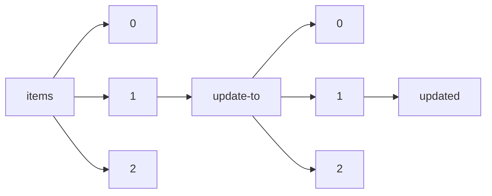

!!! warning "This document is not official Crossref documentation"
# Updated
PATH = items/array/update-to/array/updated(1)  
Occurs 280 152 times  
{ .annotate }

1. A route to an element, for example:  
   The route "items/array/update-to/array/updated" corresponds to navigating through the JSON indices as  
   ["items"][0]["update-to"][0]["updated"]  

## Date-parts
See more information: [items/array/update-to/array/updated/date-parts](date-parts/index.md)  
Occurs 280 152 timess  

| **Row** | **Length** `Any` | **Count** `Int64` |
|--------:|--------------------:|---------------------:|
| **1**   | 1                   | 280 152              |

## Date-time
See more information: [items/array/update-to/array/updated/date-time](date-time/index.md)  
Occurs 280 152 timess  
Unique values: > 999  

!!! note "Due to current limitations, only the first 1,000 unique values are counted."

| **Row** | **Value** `String` | **Count** `Int64` |
|--------:|----------------------:|---------------------:|
| **1**   | 2020-12-01T00:00:00Z  | 1 865                |
| **2**   | 2021-03-01T00:00:00Z  | 1 721                |
| **3**   | 2021-06-01T00:00:00Z  | 1 115                |
| **4**   | 2021-09-01T00:00:00Z  | 1 066                |
| **5**   | 2021-01-01T00:00:00Z  | 1 047                |
| **6**   | 2022-01-01T00:00:00Z  | 1 000                |
| **7**   | 2020-01-01T00:00:00Z  | 982                  |
| **8**   | 2021-07-01T00:00:00Z  | 978                  |
| **9**   | 2021-12-01T00:00:00Z  | 841                  |
| **10**  | 2023-03-01T00:00:00Z  | 826                  |
| ... | ... | ... |

## Timestamp
See more information: [items/array/update-to/array/updated/timestamp](timestamp/index.md)  
Occurs 280 152 timess  
Unique values: > 999  

!!! note "Due to current limitations, only the first 1,000 unique values are counted."

| **Row** | **Value** `Int64` | **Count** `Int64` |
|--------:|---------------------:|---------------------:|
| **1**   | 1 606 780 800 000    | 1 865                |
| **2**   | 1 614 556 800 000    | 1 721                |
| **3**   | 1 622 505 600 000    | 1 114                |
| **4**   | 1 630 454 400 000    | 1 066                |
| **5**   | 1 609 459 200 000    | 1 047                |
| **6**   | 1 640 995 200 000    | 997                  |
| **7**   | 1 577 836 800 000    | 982                  |
| **8**   | 1 625 097 600 000    | 978                  |
| **9**   | 1 638 316 800 000    | 841                  |
| **10**  | 1 677 628 800 000    | 829                  |
| ... | ... | ... |

