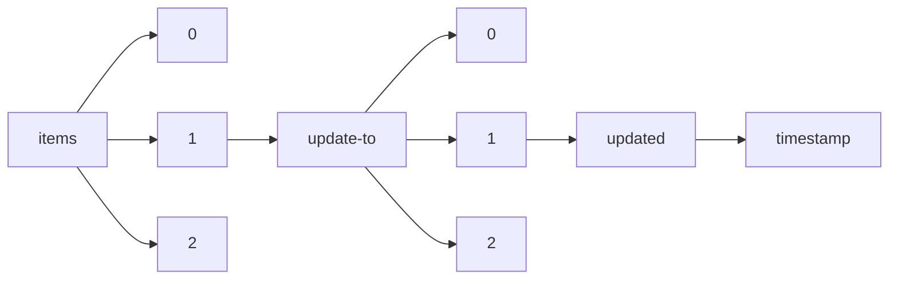

!!! warning "This document is not official Crossref documentation"
# Timestamp
PATH = items/array/update-to/array/updated/timestamp(1)  
Occurs 280 152 times  
Unique values: > 999  
{ .annotate }

1. A route to an element, for example:  
   The route "items/array/update-to/array/updated/timestamp" corresponds to navigating through the JSON indices as  
   ["items"][0]["update-to"][0]["updated"]["timestamp"]  

!!! note "Due to current limitations, only the first 1,000 unique values are counted."

| **Row** | **Value** `Int64` | **Count** `Int64` |
|--------:|---------------------:|---------------------:|
| **1**   | 1 606 780 800 000    | 1 865                |
| **2**   | 1 614 556 800 000    | 1 721                |
| **3**   | 1 622 505 600 000    | 1 114                |
| **4**   | 1 630 454 400 000    | 1 066                |
| **5**   | 1 609 459 200 000    | 1 047                |
| **6**   | 1 640 995 200 000    | 997                  |
| **7**   | 1 577 836 800 000    | 982                  |
| **8**   | 1 625 097 600 000    | 978                  |
| **9**   | 1 638 316 800 000    | 841                  |
| **10**  | 1 677 628 800 000    | 829                  |
| **11**  | 1 612 137 600 000    | 808                  |
| **12**  | 1 617 235 200 000    | 792                  |
| **13**  | 1 669 852 800 000    | 751                  |
| **14**  | 1 633 046 400 000    | 641                  |
| **15**  | 1 619 827 200 000    | 635                  |
| **16**  | 1 601 510 400 000    | 622                  |
| **17**  | 1 604 188 800 000    | 612                  |
| **18**  | 1 646 092 800 000    | 595                  |
| **19**  | 1 598 918 400 000    | 586                  |
| **20**  | 1 639 526 400 000    | 586                  |
| **21**  | 1 654 041 600 000    | 585                  |
| **22**  | 1 659 312 000 000    | 580                  |
| **23**  | 1 627 776 000 000    | 578                  |
| **24**  | 1 648 771 200 000    | 559                  |
| **25**  | 1 661 990 400 000    | 537                  |
| **26**  | 1 632 787 200 000    | 526                  |
| **27**  | 1 643 673 600 000    | 507                  |
| **28**  | 1 656 633 600 000    | 490                  |
| **29**  | 1 548 979 200 000    | 489                  |
| **30**  | 1 651 363 200 000    | 489                  |
| **31**  | 1 675 209 600 000    | 480                  |
| **32**  | 1 664 582 400 000    | 464                  |
| **33**  | 1 635 724 800 000    | 462                  |
| **34**  | 1 667 260 800 000    | 452                  |
| **35**  | 1 672 531 200 000    | 414                  |
| **36**  | 1 593 561 600 000    | 406                  |
| **37**  | 1 585 699 200 000    | 399                  |
| **38**  | 1 386 806 400 000    | 398                  |
| **39**  | 1 590 969 600 000    | 391                  |
| **40**  | 1 519 862 400 000    | 372                  |
| **41**  | 1 564 617 600 000    | 364                  |
| **42**  | 1 569 888 000 000    | 363                  |
| **43**  | 1 561 939 200 000    | 360                  |
| **44**  | 1 448 928 000 000    | 357                  |
| **45**  | 1 580 515 200 000    | 356                  |
| **46**  | 1 517 443 200 000    | 353                  |
| **47**  | 1 541 030 400 000    | 352                  |
| **48**  | 1 678 924 800 000    | 347                  |
| **49**  | 1 583 020 800 000    | 345                  |
| **50**  | 1 551 398 400 000    | 343                  |
| **51**  | 1 588 291 200 000    | 340                  |
| **52**  | 1 556 668 800 000    | 336                  |
| **53**  | 1 527 811 200 000    | 334                  |
| **54**  | 1 554 076 800 000    | 333                  |
| **55**  | 1 512 086 400 000    | 330                  |
| **56**  | 1 480 550 400 000    | 327                  |
| **57**  | 1 533 081 600 000    | 324                  |
| **58**  | 1 680 307 200 000    | 323                  |
| **59**  | 1 496 275 200 000    | 323                  |
| **60**  | 1 543 622 400 000    | 314                  |
| **61**  | 1 483 228 800 000    | 313                  |
| **62**  | 1 488 326 400 000    | 307                  |
| **63**  | 1 546 300 800 000    | 304                  |
| **64**  | 1 538 352 000 000    | 303                  |
| **65**  | 1 501 545 600 000    | 299                  |
| **66**  | 1 504 224 000 000    | 299                  |
| **67**  | 1 485 907 200 000    | 298                  |
| **68**  | 1 572 566 400 000    | 298                  |
| **69**  | 1 559 347 200 000    | 296                  |
| **70**  | 1 493 596 800 000    | 293                  |
| **71**  | 1 509 494 400 000    | 291                  |
| **72**  | 1 596 240 000 000    | 290                  |
| **73**  | 1 477 958 400 000    | 287                  |
| **74**  | 1 567 296 000 000    | 283                  |
| **75**  | 1 472 688 000 000    | 282                  |
| **76**  | 1 575 158 400 000    | 282                  |
| **77**  | 1 464 739 200 000    | 282                  |
| **78**  | 1 456 790 400 000    | 280                  |
| **79**  | 1 525 132 800 000    | 278                  |
| **80**  | 1 514 764 800 000    | 275                  |
| **81**  | 1 430 438 400 000    | 275                  |
| **82**  | 1 417 392 000 000    | 266                  |
| **83**  | 1 467 331 200 000    | 262                  |
| **84**  | 1 441 065 600 000    | 262                  |
| **85**  | 1 404 172 800 000    | 250                  |
| **86**  | 1 530 403 200 000    | 250                  |
| **87**  | 1 427 846 400 000    | 249                  |
| **88**  | 1 475 280 000 000    | 248                  |
| **89**  | 1 522 540 800 000    | 248                  |
| **90**  | 1 462 060 800 000    | 245                  |
| **91**  | 1 459 468 800 000    | 243                  |
| **92**  | 1 420 070 400 000    | 242                  |
| **93**  | 1 535 760 000 000    | 241                  |
| **94**  | 1 470 009 600 000    | 240                  |
| **95**  | 1 491 004 800 000    | 239                  |
| **96**  | 1 506 816 000 000    | 236                  |
| **97**  | 1 443 657 600 000    | 236                  |
| **98**  | 1 412 121 600 000    | 236                  |
| **99**  | 1 451 606 400 000    | 233                  |
| **100** | 1 433 116 800 000    | 230                  |
| **101** | 1 435 708 800 000    | 228                  |
| **102** | 670 464 000 000      | 227                  |
| **103** | 1 580 169 600 000    | 223                  |
| **104** | 1 454 284 800 000    | 222                  |
| **105** | 1 612 224 000 000    | 219                  |
| **106** | 1 425 168 000 000    | 218                  |
| **107** | 1 409 529 600 000    | 218                  |
| **108** | 1 438 387 200 000    | 208                  |
| **109** | 1 151 280 000 000    | 207                  |
| **110** | 1 388 534 400 000    | 202                  |
| **111** | 1 446 336 000 000    | 202                  |
| **112** | 1 393 632 000 000    | 198                  |
| **113** | 1 414 800 000 000    | 196                  |
| **114** | 515 289 600 000      | 195                  |
| **115** | 1 642 550 400 000    | 190                  |
| **116** | 1 608 422 400 000    | 187                  |
| **117** | 1 396 310 400 000    | 186                  |
| **118** | 1 676 592 000 000    | 186                  |
| **119** | 1 498 867 200 000    | 185                  |
| **120** | 1 531 699 200 000    | 184                  |
| **121** | 1 422 748 800 000    | 180                  |
| **122** | 1 398 902 400 000    | 179                  |
| **123** | 1 494 288 000 000    | 179                  |
| **124** | 1 642 464 000 000    | 177                  |
| **125** | 1 670 889 600 000    | 174                  |
| **126** | 1 380 585 600 000    | 174                  |
| **127** | 1 401 580 800 000    | 174                  |
| **128** | 330 566 400 000      | 171                  |
| **129** | 1 492 646 400 000    | 169                  |
| **130** | 1 615 766 400 000    | 168                  |
| **131** | 441 763 200 000      | 165                  |
| **132** | 1 599 782 400 000    | 160                  |
| **133** | 1 406 851 200 000    | 158                  |
| **134** | 1 618 444 800 000    | 157                  |
| **135** | 1 575 936 000 000    | 154                  |
| **136** | 1 385 856 000 000    | 154                  |
| **137** | 454 896 000 000      | 150                  |
| **138** | 1 383 264 000 000    | 149                  |
| **139** | 1 617 667 200 000    | 149                  |
| **140** | 1 613 433 600 000    | 148                  |
| **141** | 988 675 200 000      | 148                  |
| **142** | 738 892 800 000      | 147                  |
| **143** | 1 618 790 400 000    | 147                  |
| **144** | 1 391 212 800 000    | 146                  |
| **145** | 1 612 396 800 000    | 146                  |
| **146** | 1 677 801 600 000    | 146                  |
| **147** | 1 575 849 600 000    | 146                  |
| **148** | 1 614 124 800 000    | 145                  |
| **149** | 1 650 326 400 000    | 145                  |
| **150** | 1 663 804 800 000    | 144                  |
| **151** | 1 377 993 600 000    | 143                  |
| **152** | 1 600 041 600 000    | 143                  |
| **153** | 1 679 011 200 000    | 143                  |
| **154** | 1 655 164 800 000    | 142                  |
| **155** | 1 626 739 200 000    | 142                  |
| **156** | 581 126 400 000      | 142                  |
| **157** | 1 602 720 000 000    | 142                  |
| **158** | 1 613 692 800 000    | 141                  |
| **159** | 1 636 416 000 000    | 141                  |
| **160** | 1 562 716 800 000    | 141                  |
| **161** | 1 613 347 200 000    | 140                  |
| **162** | 1 636 934 400 000    | 140                  |
| **163** | 820 454 400 000      | 139                  |
| **164** | 1 246 838 400 000    | 138                  |
| **165** | 641 520 000 000      | 138                  |
| **166** | 896 659 200 000      | 138                  |
| **167** | 1 549 411 200 000    | 137                  |
| **168** | 565 315 200 000      | 137                  |
| **169** | 1 439 769 600 000    | 136                  |
| **170** | 1 607 558 400 000    | 136                  |
| **171** | 1 623 715 200 000    | 136                  |
| **172** | 1 599 609 600 000    | 135                  |
| **173** | 1 663 632 000 000    | 134                  |
| **174** | 1 458 864 000 000    | 134                  |
| **175** | 1 657 152 000 000    | 134                  |
| **176** | 1 594 771 200 000    | 133                  |
| **177** | 1 644 883 200 000    | 133                  |
| **178** | 1 610 064 000 000    | 132                  |
| **179** | 1 622 764 800 000    | 132                  |
| **180** | 1 617 840 000 000    | 132                  |
| **181** | 1 600 128 000 000    | 131                  |
| **182** | 1 109 116 800 000    | 131                  |
| **183** | 1 621 987 200 000    | 131                  |
| **184** | 1 614 643 200 000    | 130                  |
| **185** | 1 078 099 200 000    | 130                  |
| **186** | 1 625 011 200 000    | 130                  |
| **187** | 1 626 652 800 000    | 129                  |
| **188** | 1 612 742 400 000    | 129                  |
| **189** | 1 607 990 400 000    | 129                  |
| **190** | 1 491 264 000 000    | 129                  |
| **191** | 907 200 000 000      | 129                  |
| **192** | 1 638 748 800 000    | 129                  |
| **193** | 1 205 280 000 000    | 128                  |
| **194** | 1 678 838 400 000    | 127                  |
| **195** | 901 929 600 000      | 126                  |
| **196** | 1 670 457 600 000    | 126                  |
| **197** | 723 168 000 000      | 126                  |
| **198** | 1 581 292 800 000    | 125                  |
| **199** | 1 614 211 200 000    | 125                  |
| **200** | 1 631 664 000 000    | 125                  |
| **201** | 1 173 225 600 000    | 125                  |
| **202** | 1 614 297 600 000    | 124                  |
| **203** | 1 620 604 800 000    | 124                  |
| **204** | 1 593 993 600 000    | 124                  |
| **205** | 607 392 000 000      | 124                  |
| **206** | 1 214 784 000 000    | 123                  |
| **207** | 1 658 966 400 000    | 122                  |
| **208** | 920 246 400 000      | 121                  |
| **209** | 1 618 272 000 000    | 121                  |
| **210** | 1 617 148 800 000    | 121                  |
| **211** | 1 629 072 000 000    | 120                  |
| **212** | 1 088 380 800 000    | 120                  |
| **213** | 1 638 144 000 000    | 119                  |
| **214** | 1 674 086 400 000    | 119                  |
| **215** | 1 663 200 000 000    | 118                  |
| **216** | 1 236 124 800 000    | 118                  |
| **217** | 1 632 960 000 000    | 118                  |
| **218** | 763 430 400 000      | 118                  |
| **219** | 1 647 302 400 000    | 118                  |
| **220** | 191 980 800 000      | 118                  |
| **221** | 1 671 062 400 000    | 118                  |
| **222** | 1 644 537 600 000    | 117                  |
| **223** | 1 629 936 000 000    | 117                  |
| **224** | 1 562 630 400 000    | 117                  |
| **225** | 1 623 283 200 000    | 117                  |
| **226** | 1 654 473 600 000    | 117                  |
| **227** | 1 517 270 400 000    | 116                  |
| **228** | 1 612 915 200 000    | 116                  |
| **229** | 1 614 902 400 000    | 114                  |
| **230** | 1 649 289 600 000    | 114                  |
| **231** | 1 528 761 600 000    | 114                  |
| **232** | 1 676 505 600 000    | 113                  |
| **233** | 1 652 918 400 000    | 113                  |
| **234** | 1 576 108 800 000    | 113                  |
| **235** | 1 654 560 000 000    | 113                  |
| **236** | 1 615 420 800 000    | 113                  |
| **237** | 1 608 163 200 000    | 113                  |
| **238** | 888 710 400 000      | 112                  |
| **239** | 1 635 379 200 000    | 112                  |
| **240** | 1 493 769 600 000    | 111                  |
| **241** | 1 620 259 200 000    | 111                  |
| **242** | 1 232 496 000 000    | 110                  |
| **243** | 1 668 470 400 000    | 110                  |
| **244** | 1 679 356 800 000    | 110                  |
| **245** | 1 637 193 600 000    | 108                  |
| **246** | 1 611 792 000 000    | 108                  |
| **247** | 1 615 248 000 000    | 108                  |
| **248** | 1 629 849 600 000    | 107                  |
| **249** | 1 644 796 800 000    | 107                  |
| **250** | 980 985 600 000      | 107                  |
| **251** | 1 555 286 400 000    | 107                  |
| **252** | 1 161 302 400 000    | 106                  |
| **253** | 1 506 038 400 000    | 106                  |
| **254** | 1 612 828 800 000    | 106                  |
| **255** | 1 651 104 000 000    | 106                  |
| **256** | 1 621 382 400 000    | 106                  |
| **257** | 1 623 888 000 000    | 106                  |
| **258** | 1 631 577 600 000    | 106                  |
| **259** | 1 182 729 600 000    | 105                  |
| **260** | 1 204 329 600 000    | 105                  |
| **261** | 1 628 467 200 000    | 105                  |
| **262** | 1 582 848 000 000    | 105                  |
| **263** | 1 583 452 800 000    | 105                  |
| **264** | 1 592 179 200 000    | 105                  |
| **265** | 1 623 196 800 000    | 104                  |
| **266** | 1 626 393 600 000    | 104                  |
| **267** | 1 589 500 800 000    | 104                  |
| **268** | 1 644 019 200 000    | 104                  |
| **269** | 1 602 115 200 000    | 104                  |
| **270** | 1 669 593 600 000    | 104                  |
| **271** | 1 603 411 200 000    | 104                  |
| **272** | 1 647 475 200 000    | 104                  |
| **273** | 1 616 457 600 000    | 104                  |
| **274** | 1 659 484 800 000    | 103                  |
| **275** | 1 613 520 000 000    | 103                  |
| **276** | 1 014 768 000 000    | 103                  |
| **277** | 1 617 753 600 000    | 103                  |
| **278** | 1 625 529 600 000    | 103                  |
| **279** | 1 433 289 600 000    | 103                  |
| **280** | 1 605 830 400 000    | 102                  |
| **281** | 1 434 326 400 000    | 102                  |
| **282** | 1 643 846 400 000    | 102                  |
| **283** | 1 637 107 200 000    | 102                  |
| **284** | 1 673 395 200 000    | 102                  |
| **285** | 633 830 400 000      | 102                  |
| **286** | 615 254 400 000      | 102                  |
| **287** | 730 944 000 000      | 102                  |
| **288** | 1 619 654 400 000    | 101                  |
| **289** | 1 601 424 000 000    | 101                  |
| **290** | 1 592 870 400 000    | 101                  |
| **291** | 1 580 947 200 000    | 101                  |
| **292** | 1 605 139 200 000    | 101                  |
| **293** | 1 623 628 800 000    | 101                  |
| **294** | 536 457 600 000      | 100                  |
| **295** | 1 623 369 600 000    | 100                  |
| **296** | 1 339 372 800 000    | 100                  |
| **297** | 1 521 417 600 000    | 100                  |
| **298** | 560 044 800 000      | 100                  |
| **299** | 1 377 561 600 000    | 100                  |
| **300** | 1 613 606 400 000    | 99                   |
| **301** | 1 532 390 400 000    | 99                   |
| **302** | 951 868 800 000      | 99                   |
| **303** | 1 624 320 000 000    | 99                   |
| **304** | 1 631 750 400 000    | 98                   |
| **305** | 1 521 676 800 000    | 98                   |
| **306** | 1 042 243 200 000    | 98                   |
| **307** | 1 676 332 800 000    | 98                   |
| **308** | 1 486 944 000 000    | 98                   |
| **309** | 1 600 214 400 000    | 98                   |
| **310** | 1 675 900 800 000    | 98                   |
| **311** | 1 426 291 200 000    | 98                   |
| **312** | 1 649 635 200 000    | 98                   |
| **313** | 1 629 244 800 000    | 97                   |
| **314** | 1 667 174 400 000    | 97                   |
| **315** | 1 628 553 600 000    | 97                   |
| **316** | 1 614 729 600 000    | 97                   |
| **317** | 795 225 600 000      | 97                   |
| **318** | 1 630 972 800 000    | 97                   |
| **319** | 1 413 331 200 000    | 97                   |
| **320** | 1 641 859 200 000    | 96                   |
| **321** | 1 585 612 800 000    | 96                   |
| **322** | 1 580 428 800 000    | 96                   |
| **323** | 1 571 097 600 000    | 96                   |
| **324** | 1 630 022 400 000    | 96                   |
| **325** | 1 602 460 800 000    | 96                   |
| **326** | 1 653 264 000 000    | 96                   |
| **327** | 1 578 960 000 000    | 95                   |
| **328** | 1 625 788 800 000    | 95                   |
| **329** | 1 670 198 400 000    | 95                   |
| **330** | 1 618 876 800 000    | 95                   |
| **331** | 1 628 640 000 000    | 95                   |
| **332** | 1 588 118 400 000    | 95                   |
| **333** | 1 119 830 400 000    | 95                   |
| **334** | 1 568 073 600 000    | 95                   |
| **335** | 1 615 334 400 000    | 95                   |
| **336** | 1 632 355 200 000    | 95                   |
| **337** | 1 610 668 800 000    | 95                   |
| **338** | 1 669 680 000 000    | 95                   |
| **339** | 1 675 296 000 000    | 95                   |
| **340** | 1 667 347 200 000    | 95                   |
| **341** | 1 652 140 800 000    | 94                   |
| **342** | 1 624 492 800 000    | 94                   |
| **343** | 1 639 612 800 000    | 94                   |
| **344** | 928 195 200 000      | 94                   |
| **345** | 1 638 403 200 000    | 94                   |
| **346** | 1 647 993 600 000    | 93                   |
| **347** | 857 174 400 000      | 93                   |
| **348** | 1 616 371 200 000    | 93                   |
| **349** | 1 626 307 200 000    | 93                   |
| **350** | 1 631 059 200 000    | 93                   |
| **351** | 1 645 142 400 000    | 93                   |
| **352** | 1 590 710 400 000    | 93                   |
| **353** | 1 630 368 000 000    | 93                   |
| **354** | 1 634 601 600 000    | 93                   |
| **355** | 1 632 873 600 000    | 93                   |
| **356** | 1 634 688 000 000    | 93                   |
| **357** | 1 649 203 200 000    | 93                   |
| **358** | 1 632 182 400 000    | 92                   |
| **359** | 1 629 158 400 000    | 92                   |
| **360** | 1 655 769 600 000    | 92                   |
| **361** | 1 599 177 600 000    | 92                   |
| **362** | 644 198 400 000      | 92                   |
| **363** | 1 675 123 200 000    | 92                   |
| **364** | 1 641 340 800 000    | 92                   |
| **365** | 1 520 294 400 000    | 92                   |
| **366** | 925 516 800 000      | 92                   |
| **367** | 1 657 843 200 000    | 92                   |
| **368** | 1 633 996 800 000    | 91                   |
| **369** | 1 669 161 600 000    | 91                   |
| **370** | 1 584 576 000 000    | 91                   |
| **371** | 1 595 289 600 000    | 91                   |
| **372** | 1 637 020 800 000    | 91                   |
| **373** | 1 408 233 600 000    | 91                   |
| **374** | 1 542 240 000 000    | 91                   |
| **375** | 1 645 574 400 000    | 90                   |
| **376** | 1 633 910 400 000    | 90                   |
| **377** | 1 616 976 000 000    | 90                   |
| **378** | 1 654 128 000 000    | 90                   |
| **379** | 1 657 238 400 000    | 90                   |
| **380** | 1 024 876 800 000    | 90                   |
| **381** | 1 608 076 800 000    | 90                   |
| **382** | 1 583 366 400 000    | 89                   |
| **383** | 1 650 844 800 000    | 89                   |
| **384** | 1 597 795 200 000    | 89                   |
| **385** | 1 671 408 000 000    | 89                   |
| **386** | 1 557 792 000 000    | 89                   |
| **387** | 1 582 761 600 000    | 89                   |
| **388** | 1 668 556 800 000    | 89                   |
| **389** | 1 603 756 800 000    | 89                   |
| **390** | 1 635 897 600 000    | 89                   |
| **391** | 1 636 588 800 000    | 89                   |
| **392** | 1 678 752 000 000    | 89                   |
| **393** | 1 628 726 400 000    | 88                   |
| **394** | 1 637 712 000 000    | 88                   |
| **395** | 1 465 862 400 000    | 88                   |
| **396** | 1 647 216 000 000    | 88                   |
| **397** | 1 676 246 400 000    | 88                   |
| **398** | 1 659 398 400 000    | 88                   |
| **399** | 1 604 880 000 000    | 88                   |
| **400** | 1 599 091 200 000    | 88                   |
| **401** | 1 056 931 200 000    | 88                   |
| **402** | 1 620 691 200 000    | 88                   |
| **403** | 1 618 185 600 000    | 88                   |
| **404** | 1 594 684 800 000    | 87                   |
| **405** | 1 663 718 400 000    | 87                   |
| **406** | 1 595 376 000 000    | 87                   |
| **407** | 1 663 113 600 000    | 87                   |
| **408** | 1 655 251 200 000    | 87                   |
| **409** | 1 636 329 600 000    | 87                   |
| **410** | 1 671 494 400 000    | 87                   |
| **411** | 1 582 070 400 000    | 87                   |
| **412** | 1 623 974 400 000    | 87                   |
| **413** | 1 644 192 000 000    | 87                   |
| **414** | 1 553 731 200 000    | 86                   |
| **415** | 1 590 019 200 000    | 86                   |
| **416** | 1 593 129 600 000    | 86                   |
| **417** | 1 643 587 200 000    | 86                   |
| **418** | 1 647 907 200 000    | 86                   |
| **419** | 1 665 619 200 000    | 86                   |
| **420** | 1 679 529 600 000    | 86                   |
| **421** | 1 628 208 000 000    | 86                   |
| **422** | 1 639 008 000 000    | 86                   |
| **423** | 1 609 718 400 000    | 86                   |
| **424** | 1 663 286 400 000    | 86                   |
| **425** | 1 645 747 200 000    | 86                   |
| **426** | 1 116 115 200 000    | 86                   |
| **427** | 1 627 257 600 000    | 85                   |
| **428** | 1 674 518 400 000    | 85                   |
| **429** | 1 592 956 800 000    | 85                   |
| **430** | 1 678 320 000 000    | 85                   |
| **431** | 1 552 348 800 000    | 85                   |
| **432** | 1 614 816 000 000    | 85                   |
| **433** | 1 666 310 400 000    | 85                   |
| **434** | 1 607 904 000 000    | 85                   |
| **435** | 1 633 478 400 000    | 85                   |
| **436** | 1 518 652 800 000    | 84                   |
| **437** | 1 659 916 800 000    | 84                   |
| **438** | 1 263 945 600 000    | 84                   |
| **439** | 1 627 516 800 000    | 84                   |
| **440** | 801 100 800 000      | 84                   |
| **441** | 1 662 940 800 000    | 84                   |
| **442** | 1 313 366 400 000    | 84                   |
| **443** | 1 646 784 000 000    | 84                   |
| **444** | 1 618 358 400 000    | 84                   |
| **445** | 1 476 835 200 000    | 84                   |
| **446** | 1 544 400 000 000    | 84                   |
| **447** | 1 559 260 800 000    | 84                   |
| **448** | 1 363 392 000 000    | 84                   |
| **449** | 1 516 924 800 000    | 84                   |
| **450** | 707 356 800 000      | 84                   |
| **451** | 1 549 497 600 000    | 84                   |
| **452** | 1 557 878 400 000    | 83                   |
| **453** | 1 611 100 800 000    | 83                   |
| **454** | 1 638 921 600 000    | 83                   |
| **455** | 1 631 232 000 000    | 83                   |
| **456** | 1 621 555 200 000    | 83                   |
| **457** | 1 307 145 600 000    | 83                   |
| **458** | 1 667 952 000 000    | 83                   |
| **459** | 1 646 870 400 000    | 82                   |
| **460** | 1 673 481 600 000    | 82                   |
| **461** | 1 574 208 000 000    | 82                   |
| **462** | 1 631 836 800 000    | 82                   |
| **463** | 1 611 532 800 000    | 82                   |
| **464** | 1 603 152 000 000    | 82                   |
| **465** | 1 677 024 000 000    | 82                   |
| **466** | 1 604 534 400 000    | 82                   |
| **467** | 1 671 148 800 000    | 82                   |
| **468** | 1 594 080 000 000    | 82                   |
| **469** | 1 427 328 000 000    | 82                   |
| **470** | 1 604 016 000 000    | 81                   |
| **471** | 780 969 600 000      | 81                   |
| **472** | 1 515 024 000 000    | 81                   |
| **473** | 1 116 288 000 000    | 81                   |
| **474** | 1 578 528 000 000    | 81                   |
| **475** | 1 615 852 800 000    | 81                   |
| **476** | 1 647 820 800 000    | 81                   |
| **477** | 1 628 035 200 000    | 81                   |
| **478** | 1 627 862 400 000    | 81                   |
| **479** | 1 153 267 200 000    | 80                   |
| **480** | 1 571 184 000 000    | 80                   |
| **481** | 1 651 708 800 000    | 80                   |
| **482** | 1 653 523 200 000    | 80                   |
| **483** | 517 968 000 000      | 80                   |
| **484** | 1 575 417 600 000    | 80                   |
| **485** | 1 650 499 200 000    | 80                   |
| **486** | 1 627 948 800 000    | 80                   |
| **487** | 1 651 622 400 000    | 80                   |
| **488** | 1 532 476 800 000    | 79                   |
| **489** | 1 619 395 200 000    | 79                   |
| **490** | 94 694 400 000       | 79                   |
| **491** | 1 666 224 000 000    | 79                   |
| **492** | 1 573 689 600 000    | 79                   |
| **493** | 1 574 121 600 000    | 79                   |
| **494** | 1 664 496 000 000    | 79                   |
| **495** | 1 618 963 200 000    | 79                   |
| **496** | 1 636 675 200 000    | 79                   |
| **497** | 825 638 400 000      | 79                   |
| **498** | 1 609 804 800 000    | 79                   |
| **499** | 1 617 062 400 000    | 79                   |
| **500** | 1 634 515 200 000    | 79                   |
| **501** | 1 646 006 400 000    | 79                   |
| **502** | 1 641 427 200 000    | 78                   |
| **503** | 1 664 323 200 000    | 78                   |
| **504** | 1 619 740 800 000    | 78                   |
| **505** | 1 620 864 000 000    | 78                   |
| **506** | 1 375 315 200 000    | 78                   |
| **507** | 1 654 646 400 000    | 78                   |
| **508** | 1 517 011 200 000    | 78                   |
| **509** | 865 123 200 000      | 78                   |
| **510** | 1 283 126 400 000    | 78                   |
| **511** | 1 670 803 200 000    | 78                   |
| **512** | 1 488 844 800 000    | 78                   |
| **513** | 1 497 398 400 000    | 78                   |
| **514** | 1 585 785 600 000    | 78                   |
| **515** | 1 674 000 000 000    | 78                   |
| **516** | 1 649 808 000 000    | 78                   |
| **517** | 1 630 886 400 000    | 78                   |
| **518** | 1 630 281 600 000    | 78                   |
| **519** | 1 601 942 400 000    | 78                   |
| **520** | 1 591 142 400 000    | 78                   |
| **521** | 1 560 729 600 000    | 77                   |
| **522** | 1 556 582 400 000    | 77                   |
| **523** | 1 581 984 000 000    | 77                   |
| **524** | 1 565 827 200 000    | 77                   |
| **525** | 1 505 433 600 000    | 77                   |
| **526** | 1 672 876 800 000    | 77                   |
| **527** | 1 629 417 600 000    | 77                   |
| **528** | 1 677 110 400 000    | 77                   |
| **529** | 1 588 809 600 000    | 77                   |
| **530** | 1 589 932 800 000    | 77                   |
| **531** | 1 646 265 600 000    | 77                   |
| **532** | 1 638 230 400 000    | 76                   |
| **533** | 1 604 966 400 000    | 76                   |
| **534** | 1 425 513 600 000    | 76                   |
| **535** | 1 579 046 400 000    | 76                   |
| **536** | 678 326 400 000      | 76                   |
| **537** | 1 613 001 600 000    | 76                   |
| **538** | 368 150 400 000      | 76                   |
| **539** | 1 519 776 000 000    | 76                   |
| **540** | 1 523 404 800 000    | 76                   |
| **541** | 1 582 243 200 000    | 75                   |
| **542** | 1 523 318 400 000    | 75                   |
| **543** | 1 658 880 000 000    | 75                   |
| **544** | 1 606 953 600 000    | 75                   |
| **545** | 1 661 212 800 000    | 75                   |
| **546** | 1 635 206 400 000    | 75                   |
| **547** | 1 584 403 200 000    | 75                   |
| **548** | 1 559 001 600 000    | 75                   |
| **549** | 1 548 892 800 000    | 75                   |
| **550** | 1 588 723 200 000    | 75                   |
| **551** | 1 583 280 000 000    | 75                   |
| **552** | 1 664 409 600 000    | 74                   |
| **553** | 1 670 284 800 000    | 74                   |
| **554** | 1 597 708 800 000    | 74                   |
| **555** | 1 565 049 600 000    | 74                   |
| **556** | 1 661 299 200 000    | 74                   |
| **557** | 1 624 579 200 000    | 74                   |
| **558** | 1 639 958 400 000    | 74                   |
| **559** | 1 675 641 600 000    | 74                   |
| **560** | 1 589 241 600 000    | 74                   |
| **561** | 1 650 931 200 000    | 74                   |
| **562** | 1 141 344 000 000    | 74                   |
| **563** | 1 565 222 400 000    | 73                   |
| **564** | 1 611 705 600 000    | 73                   |
| **565** | 1 656 028 800 000    | 73                   |
| **566** | 1 627 344 000 000    | 73                   |
| **567** | 1 518 048 000 000    | 73                   |
| **568** | 1 641 772 800 000    | 73                   |
| **569** | 1 551 744 000 000    | 73                   |
| **570** | 1 655 337 600 000    | 73                   |
| **571** | 1 595 894 400 000    | 72                   |
| **572** | 1 566 950 400 000    | 72                   |
| **573** | 1 591 228 800 000    | 72                   |
| **574** | 1 560 816 000 000    | 72                   |
| **575** | 1 580 342 400 000    | 72                   |
| **576** | 1 644 451 200 000    | 72                   |
| **577** | 1 393 200 000 000    | 72                   |
| **578** | 1 520 985 600 000    | 72                   |
| **579** | 1 472 083 200 000    | 72                   |
| **580** | 1 668 729 600 000    | 72                   |
| **581** | 1 385 683 200 000    | 72                   |
| **582** | 1 682 899 200 000    | 72                   |
| **583** | 1 487 635 200 000    | 72                   |
| **584** | 604 713 600 000      | 71                   |
| **585** | 1 670 976 000 000    | 71                   |
| **586** | 1 590 105 600 000    | 71                   |
| **587** | 1 649 376 000 000    | 71                   |
| **588** | 1 542 585 600 000    | 70                   |
| **589** | 1 603 843 200 000    | 70                   |
| **590** | 1 584 057 600 000    | 70                   |
| **591** | 1 507 161 600 000    | 70                   |
| **592** | 1 439 856 000 000    | 70                   |
| **593** | 1 330 732 800 000    | 70                   |
| **594** | 1 192 579 200 000    | 70                   |
| **595** | 1 263 513 600 000    | 70                   |
| **596** | 1 595 980 800 000    | 70                   |
| **597** | 226 022 400 000      | 70                   |
| **598** | 1 634 256 000 000    | 70                   |
| **599** | 1 626 912 000 000    | 70                   |
| **600** | 1 581 465 600 000    | 69                   |
| **601** | 1 662 422 400 000    | 69                   |
| **602** | 1 656 547 200 000    | 69                   |
| **603** | 1 600 905 600 000    | 69                   |
| **604** | 1 496 620 800 000    | 69                   |
| **605** | 1 663 891 200 000    | 69                   |
| **606** | 1 606 262 400 000    | 69                   |
| **607** | 1 608 249 600 000    | 69                   |
| **608** | 1 086 048 000 000    | 69                   |
| **609** | 1 402 876 800 000    | 69                   |
| **610** | 1 560 988 800 000    | 69                   |
| **611** | 652 147 200 000      | 68                   |
| **612** | 1 612 310 400 000    | 68                   |
| **613** | 1 536 019 200 000    | 68                   |
| **614** | 769 737 600 000      | 68                   |
| **615** | 1 652 313 600 000    | 68                   |
| **616** | 830 908 800 000      | 68                   |
| **617** | 1 658 275 200 000    | 68                   |
| **618** | 1 568 246 400 000    | 67                   |
| **619** | 1 658 793 600 000    | 67                   |
| **620** | 1 490 227 200 000    | 67                   |
| **621** | 1 665 360 000 000    | 67                   |
| **622** | 1 644 364 800 000    | 67                   |
| **623** | 1 587 513 600 000    | 67                   |
| **624** | 1 637 539 200 000    | 67                   |
| **625** | 1 388 966 400 000    | 67                   |
| **626** | 1 648 684 800 000    | 67                   |
| **627** | 1 555 372 800 000    | 67                   |
| **628** | 1 632 096 000 000    | 67                   |
| **629** | 1 421 193 600 000    | 67                   |
| **630** | 1 560 211 200 000    | 67                   |
| **631** | 1 370 044 800 000    | 67                   |
| **632** | 1 655 683 200 000    | 66                   |
| **633** | 649 468 800 000      | 66                   |
| **634** | 1 603 670 400 000    | 66                   |
| **635** | 1 644 278 400 000    | 66                   |
| **636** | 1 647 388 800 000    | 66                   |
| **637** | 1 445 817 600 000    | 66                   |
| **638** | 1 571 356 800 000    | 66                   |
| **639** | 1 621 814 400 000    | 66                   |
| **640** | 1 672 963 200 000    | 66                   |
| **641** | 799 286 400 000      | 66                   |
| **642** | 1 616 544 000 000    | 66                   |
| **643** | 1 347 408 000 000    | 66                   |
| **644** | 1 539 561 600 000    | 66                   |
| **645** | 1 622 678 400 000    | 65                   |
| **646** | 1 560 643 200 000    | 65                   |
| **647** | 1 656 374 400 000    | 65                   |
| **648** | 1 523 491 200 000    | 65                   |
| **649** | 1 652 054 400 000    | 65                   |
| **650** | 1 583 971 200 000    | 65                   |
| **651** | 1 677 715 200 000    | 65                   |
| **652** | 1 592 352 000 000    | 65                   |
| **653** | 1 372 636 800 000    | 65                   |
| **654** | 1 625 702 400 000    | 64                   |
| **655** | 1 551 139 200 000    | 64                   |
| **656** | 1 628 812 800 000    | 64                   |
| **657** | 749 433 600 000      | 64                   |
| **658** | 1 582 156 800 000    | 64                   |
| **659** | 702 086 400 000      | 64                   |
| **660** | 1 578 873 600 000    | 64                   |
| **661** | 1 666 051 200 000    | 64                   |
| **662** | 1 553 126 400 000    | 64                   |
| **663** | 1 662 076 800 000    | 64                   |
| **664** | 833 587 200 000      | 64                   |
| **665** | 959 817 600 000      | 63                   |
| **666** | 1 573 603 200 000    | 63                   |
| **667** | 1 299 283 200 000    | 63                   |
| **668** | 1 565 654 400 000    | 63                   |
| **669** | 1 648 166 400 000    | 63                   |
| **670** | 1 679 443 200 000    | 63                   |
| **671** | 1 404 777 600 000    | 63                   |
| **672** | 1 497 484 800 000    | 63                   |
| **673** | 1 518 220 800 000    | 63                   |
| **674** | 1 169 596 800 000    | 62                   |
| **675** | 1 562 803 200 000    | 62                   |
| **676** | 1 527 552 000 000    | 62                   |
| **677** | 1 674 604 800 000    | 62                   |
| **678** | 1 562 284 800 000    | 62                   |
| **679** | 1 355 270 400 000    | 62                   |
| **680** | 1 620 777 600 000    | 62                   |
| **681** | 1 446 076 800 000    | 62                   |
| **682** | 1 598 486 400 000    | 62                   |
| **683** | 1 515 456 000 000    | 62                   |
| **684** | 1 549 843 200 000    | 62                   |
| **685** | 1 666 742 400 000    | 62                   |
| **686** | 1 550 534 400 000    | 62                   |
| **687** | 1 529 884 800 000    | 61                   |
| **688** | 1 519 084 800 000    | 61                   |
| **689** | 1 567 036 800 000    | 61                   |
| **690** | 1 668 038 400 000    | 61                   |
| **691** | 1 551 830 400 000    | 61                   |
| **692** | 699 408 000 000      | 61                   |
| **693** | 1 658 361 600 000    | 61                   |
| **694** | 255 139 200 000      | 61                   |
| **695** | 1 554 854 400 000    | 61                   |
| **696** | 1 632 441 600 000    | 61                   |
| **697** | 1 605 571 200 000    | 61                   |
| **698** | 1 576 627 200 000    | 61                   |
| **699** | 1 543 449 600 000    | 61                   |
| **700** | 1 639 699 200 000    | 60                   |
| **701** | 1 474 502 400 000    | 60                   |
| **702** | 1 239 753 600 000    | 60                   |
| **703** | 1 597 276 800 000    | 60                   |
| **704** | 1 369 958 400 000    | 60                   |
| **705** | 165 542 400 000      | 60                   |
| **706** | 1 586 822 400 000    | 60                   |
| **707** | 1 499 385 600 000    | 60                   |
| **708** | 1 677 283 200 000    | 60                   |
| **709** | 1 022 889 600 000    | 60                   |
| **710** | 1 572 393 600 000    | 60                   |
| **711** | 1 557 187 200 000    | 59                   |
| **712** | 1 584 921 600 000    | 59                   |
| **713** | 1 484 870 400 000    | 59                   |
| **714** | 1 638 489 600 000    | 59                   |
| **715** | 1 512 604 800 000    | 59                   |
| **716** | 1 645 488 000 000    | 59                   |
| **717** | 1 604 620 800 000    | 59                   |
| **718** | 1 607 644 800 000    | 59                   |
| **719** | 1 464 652 800 000    | 59                   |
| **720** | 1 597 190 400 000    | 59                   |
| **721** | 1 598 400 000 000    | 59                   |
| **722** | 1 677 196 800 000    | 59                   |
| **723** | 1 615 939 200 000    | 59                   |
| **724** | 1 510 531 200 000    | 59                   |
| **725** | 1 592 524 800 000    | 59                   |
| **726** | 1 652 745 600 000    | 58                   |
| **727** | 1 554 249 600 000    | 58                   |
| **728** | 1 645 056 000 000    | 58                   |
| **729** | 296 870 400 000      | 58                   |
| **730** | 1 611 273 600 000    | 57                   |
| **731** | 1 287 273 600 000    | 57                   |
| **732** | 1 648 080 000 000    | 57                   |
| **733** | 1 633 651 200 000    | 57                   |
| **734** | 1 561 680 000 000    | 57                   |
| **735** | 1 223 424 000 000    | 57                   |
| **736** | 1 627 603 200 000    | 57                   |
| **737** | 1 653 350 400 000    | 56                   |
| **738** | 1 212 364 800 000    | 56                   |
| **739** | 1 543 190 400 000    | 56                   |
| **740** | 1 657 756 800 000    | 56                   |
| **741** | 1 487 203 200 000    | 56                   |
| **742** | 1 549 929 600 000    | 56                   |
| **743** | 1 668 988 800 000    | 56                   |
| **744** | 862 444 800 000      | 56                   |
| **745** | 1 579 824 000 000    | 56                   |
| **746** | 1 033 430 400 000    | 56                   |
| **747** | 1 540 944 000 000    | 56                   |
| **748** | 1 568 332 800 000    | 55                   |
| **749** | 1 245 024 000 000    | 55                   |
| **750** | 1 542 844 800 000    | 55                   |
| **751** | 1 645 401 600 000    | 55                   |
| **752** | 1 574 035 200 000    | 55                   |
| **753** | 1 630 540 800 000    | 55                   |
| **754** | 1 538 006 400 000    | 55                   |
| **755** | 1 596 153 600 000    | 55                   |
| **756** | 1 534 723 200 000    | 55                   |
| **757** | 957 139 200 000      | 55                   |
| **758** | 1 542 153 600 000    | 55                   |
| **759** | 1 498 262 400 000    | 55                   |
| **760** | 1 493 683 200 000    | 55                   |
| **761** | 1 586 995 200 000    | 54                   |
| **762** | 1 604 275 200 000    | 54                   |
| **763** | 1 605 484 800 000    | 54                   |
| **764** | 1 563 235 200 000    | 54                   |
| **765** | 1 469 059 200 000    | 54                   |
| **766** | 1 676 937 600 000    | 54                   |
| **767** | 1 583 193 600 000    | 54                   |
| **768** | 1 603 238 400 000    | 54                   |
| **769** | 1 662 681 600 000    | 54                   |
| **770** | 1 595 203 200 000    | 54                   |
| **771** | 1 674 432 000 000    | 54                   |
| **772** | 1 576 800 000 000    | 53                   |
| **773** | 1 184 716 800 000    | 53                   |
| **774** | 1 649 980 800 000    | 53                   |
| **775** | 1 129 680 000 000    | 53                   |
| **776** | 1 559 779 200 000    | 53                   |
| **777** | 1 212 278 400 000    | 53                   |
| **778** | 1 527 638 400 000    | 53                   |
| **779** | 1 296 000 000 000    | 53                   |
| **780** | 1 595 808 000 000    | 52                   |
| **781** | 1 491 782 400 000    | 52                   |
| **782** | 1 601 251 200 000    | 52                   |
| **783** | 1 527 033 600 000    | 52                   |
| **784** | 1 520 899 200 000    | 52                   |
| **785** | 1 586 390 400 000    | 52                   |
| **786** | 1 587 081 600 000    | 52                   |
| **787** | 1 493 164 800 000    | 52                   |
| **788** | 1 364 428 800 000    | 52                   |
| **789** | 396 489 600 000      | 52                   |
| **790** | 1 647 561 600 000    | 52                   |
| **791** | 1 097 107 200 000    | 52                   |
| **792** | 1 679 961 600 000    | 51                   |
| **793** | 1 665 014 400 000    | 51                   |
| **794** | 1 543 363 200 000    | 51                   |
| **795** | 1 072 915 200 000    | 51                   |
| **796** | 1 670 371 200 000    | 51                   |
| **797** | 1 568 592 000 000    | 51                   |
| **798** | 1 001 894 400 000    | 51                   |
| **799** | 1 550 707 200 000    | 51                   |
| **800** | 1 555 459 200 000    | 51                   |
| **801** | 1 597 622 400 000    | 51                   |
| **802** | 1 546 905 600 000    | 51                   |
| **803** | 1 659 657 600 000    | 51                   |
| **804** | 1 591 574 400 000    | 50                   |
| **805** | 1 176 854 400 000    | 50                   |
| **806** | 1 513 296 000 000    | 50                   |
| **807** | 1 489 536 000 000    | 50                   |
| **808** | 1 576 022 400 000    | 50                   |
| **809** | 638 928 000 000      | 50                   |
| **810** | 1 645 660 800 000    | 50                   |
| **811** | 1 517 184 000 000    | 50                   |
| **812** | 1 513 900 800 000    | 50                   |
| **813** | 1 543 795 200 000    | 50                   |
| **814** | 1 575 244 800 000    | 50                   |
| **815** | 1 391 644 800 000    | 50                   |
| **816** | 673 056 000 000      | 50                   |
| **817** | 1 666 137 600 000    | 50                   |
| **818** | 1 602 806 400 000    | 49                   |
| **819** | 1 367 280 000 000    | 49                   |
| **820** | 875 664 000 000      | 49                   |
| **821** | 1 577 404 800 000    | 49                   |
| **822** | 1 566 259 200 000    | 49                   |
| **823** | 1 344 988 800 000    | 49                   |
| **824** | 383 788 800 000      | 49                   |
| **825** | 1 669 248 000 000    | 49                   |
| **826** | 1 527 724 800 000    | 48                   |
| **827** | 1 600 300 800 000    | 48                   |
| **828** | 1 055 289 600 000    | 48                   |
| **829** | 1 617 321 600 000    | 48                   |
| **830** | 1 247 011 200 000    | 48                   |
| **831** | 1 327 449 600 000    | 48                   |
| **832** | 1 459 900 800 000    | 48                   |
| **833** | 1 504 742 400 000    | 48                   |
| **834** | 1 573 084 800 000    | 48                   |
| **835** | 1 539 216 000 000    | 48                   |
| **836** | 591 235 200 000      | 48                   |
| **837** | 1 591 920 000 000    | 47                   |
| **838** | 1 614 988 800 000    | 47                   |
| **839** | 1 552 867 200 000    | 47                   |
| **840** | 741 484 800 000      | 47                   |
| **841** | 1 511 136 000 000    | 47                   |
| **842** | 1 665 532 800 000    | 47                   |
| **843** | 1 525 046 400 000    | 47                   |
| **844** | 1 320 796 800 000    | 47                   |
| **845** | 1 526 515 200 000    | 47                   |
| **846** | 1 646 611 200 000    | 47                   |
| **847** | 412 905 600 000      | 47                   |
| **848** | 381 369 600 000      | 46                   |
| **849** | 1 520 812 800 000    | 46                   |
| **850** | 303 350 400 000      | 46                   |
| **851** | 1 113 955 200 000    | 46                   |
| **852** | 1 574 294 400 000    | 46                   |
| **853** | 1 661 472 000 000    | 46                   |
| **854** | 1 553 472 000 000    | 46                   |
| **855** | 1 573 171 200 000    | 46                   |
| **856** | 1 560 384 000 000    | 46                   |
| **857** | 1 426 636 800 000    | 46                   |
| **858** | 1 675 814 400 000    | 46                   |
| **859** | 1 383 004 800 000    | 46                   |
| **860** | 1 518 480 000 000    | 46                   |
| **861** | 1 051 747 200 000    | 45                   |
| **862** | 1 509 408 000 000    | 45                   |
| **863** | 1 330 128 000 000    | 45                   |
| **864** | 1 475 020 800 000    | 45                   |
| **865** | 1 534 377 600 000    | 45                   |
| **866** | 1 483 056 000 000    | 45                   |
| **867** | 1 558 310 400 000    | 45                   |
| **868** | 1 436 832 000 000    | 45                   |
| **869** | 1 529 452 800 000    | 45                   |
| **870** | 1 461 542 400 000    | 44                   |
| **871** | 1 543 968 000 000    | 44                   |
| **872** | 870 393 600 000      | 44                   |
| **873** | 1 558 569 600 000    | 44                   |
| **874** | 1 660 780 800 000    | 44                   |
| **875** | 1 633 305 600 000    | 44                   |
| **876** | 1 588 636 800 000    | 44                   |
| **877** | 1 630 627 200 000    | 43                   |
| **878** | 1 522 022 400 000    | 43                   |
| **879** | 1 574 812 800 000    | 43                   |
| **880** | 1 507 248 000 000    | 43                   |
| **881** | 1 563 753 600 000    | 43                   |
| **882** | 1 510 272 000 000    | 43                   |
| **883** | 612 662 400 000      | 43                   |
| **884** | 1 473 897 600 000    | 43                   |
| **885** | 416 966 400 000      | 43                   |
| **886** | 1 352 851 200 000    | 43                   |
| **887** | 1 549 324 800 000    | 42                   |
| **888** | 1 465 257 600 000    | 42                   |
| **889** | 1 584 316 800 000    | 42                   |
| **890** | 1 588 032 000 000    | 42                   |
| **891** | 1 662 336 000 000    | 42                   |
| **892** | 1 442 361 600 000    | 42                   |
| **893** | 1 393 545 600 000    | 42                   |
| **894** | 1 493 337 600 000    | 42                   |
| **895** | 1 577 923 200 000    | 42                   |
| **896** | 1 531 180 800 000    | 42                   |
| **897** | 1 614 384 000 000    | 42                   |
| **898** | 1 593 648 000 000    | 42                   |
| **899** | 1 564 704 000 000    | 41                   |
| **900** | 1 464 825 600 000    | 41                   |
| **901** | 539 136 000 000      | 41                   |
| **902** | 1 484 784 000 000    | 41                   |
| **903** | 1 510 185 600 000    | 41                   |
| **904** | 1 660 694 400 000    | 41                   |
| **905** | 1 593 388 800 000    | 41                   |
| **906** | 567 993 600 000      | 41                   |
| **907** | 1 466 208 000 000    | 41                   |
| **908** | 907 027 200 000      | 41                   |
| **909** | 1 566 864 000 000    | 40                   |
| **910** | 155 088 000 000      | 40                   |
| **911** | 773 020 800 000      | 40                   |
| **912** | 1 216 166 400 000    | 40                   |
| **913** | 1 442 534 400 000    | 40                   |
| **914** | 1 457 395 200 000    | 40                   |
| **915** | 1 622 419 200 000    | 40                   |
| **916** | 1 538 524 800 000    | 40                   |
| **917** | 554 774 400 000      | 40                   |
| **918** | 1 626 220 800 000    | 40                   |
| **919** | 1 580 688 000 000    | 39                   |
| **920** | 1 136 937 600 000    | 39                   |
| **921** | 1 496 966 400 000    | 39                   |
| **922** | 1 181 347 200 000    | 39                   |
| **923** | 415 324 800 000      | 39                   |
| **924** | 1 606 435 200 000    | 39                   |
| **925** | 1 271 289 600 000    | 39                   |
| **926** | 1 262 995 200 000    | 39                   |
| **927** | 1 666 569 600 000    | 38                   |
| **928** | 1 370 476 800 000    | 38                   |
| **929** | 1 591 056 000 000    | 38                   |
| **930** | 1 501 718 400 000    | 38                   |
| **931** | 1 461 110 400 000    | 38                   |
| **932** | 1 542 672 000 000    | 38                   |
| **933** | 1 477 872 000 000    | 38                   |
| **934** | 1 674 777 600 000    | 38                   |
| **935** | 1 617 926 400 000    | 38                   |
| **936** | 483 753 600 000      | 37                   |
| **937** | 1 468 886 400 000    | 37                   |
| **938** | 283 996 800 000      | 37                   |
| **939** | 194 486 400 000      | 37                   |
| **940** | 1 388 707 200 000    | 37                   |
| **941** | 1 300 233 600 000    | 37                   |
| **942** | 1 596 758 400 000    | 36                   |
| **943** | 1 275 696 000 000    | 36                   |
| **944** | 1 680 220 800 000    | 36                   |
| **945** | 157 766 400 000      | 36                   |
| **946** | 1 116 633 600 000    | 35                   |
| **947** | 1 587 600 000 000    | 35                   |
| **948** | 1 651 017 600 000    | 35                   |
| **949** | 1 453 680 000 000    | 35                   |
| **950** | 1 333 238 400 000    | 35                   |
| **951** | 1 508 803 200 000    | 35                   |
| **952** | 1 554 768 000 000    | 35                   |
| **953** | 1 454 630 400 000    | 35                   |
| **954** | 1 567 641 600 000    | 34                   |
| **955** | 1 548 201 600 000    | 34                   |
| **956** | 1 625 184 000 000    | 34                   |
| **957** | 1 451 865 600 000    | 34                   |
| **958** | 1 661 558 400 000    | 34                   |
| **959** | 1 545 004 800 000    | 34                   |
| **960** | 478 483 200 000      | 34                   |
| **961** | 1 121 817 600 000    | 33                   |
| **962** | 1 502 236 800 000    | 33                   |
| **963** | 1 476 662 400 000    | 33                   |
| **964** | 1 673 913 600 000    | 33                   |
| **965** | 1 075 075 200 000    | 33                   |
| **966** | 1 181 606 400 000    | 33                   |
| **967** | 1 450 828 800 000    | 32                   |
| **968** | 1 334 707 200 000    | 32                   |
| **969** | 1 664 928 000 000    | 32                   |
| **970** | 1 621 641 600 000    | 32                   |
| **971** | 1 114 905 600 000    | 32                   |
| **972** | 1 674 172 800 000    | 32                   |
| **973** | 1 531 872 000 000    | 32                   |
| **974** | 1 467 244 800 000    | 31                   |
| **975** | 1 499 990 400 000    | 31                   |
| **976** | 1 585 526 400 000    | 31                   |
| **977** | 893 980 800 000      | 31                   |
| **978** | 1 191 196 800 000    | 31                   |
| **979** | 1 565 740 800 000    | 31                   |
| **980** | 1 654 732 800 000    | 31                   |
| **981** | 1 440 460 800 000    | 31                   |
| **982** | 1 490 572 800 000    | 30                   |
| **983** | 1 472 169 600 000    | 30                   |
| **984** | 1 453 852 800 000    | 29                   |
| **985** | 1 637 971 200 000    | 29                   |
| **986** | 1 483 401 600 000    | 29                   |
| **987** | 1 479 254 400 000    | 29                   |
| **988** | 519 177 600 000      | 29                   |
| **989** | 736 214 400 000      | 29                   |
| **990** | 424 310 400 000      | 29                   |
| **991** | 1 525 996 800 000    | 29                   |
| **992** | 1 588 896 000 000    | 28                   |
| **993** | 1 473 638 400 000    | 28                   |
| **994** | 1 125 532 800 000    | 28                   |
| **995** | 1 454 889 600 000    | 28                   |
| **996** | 1 575 590 400 000    | 28                   |
| **997** | 963 446 400 000      | 28                   |
| **998** | 1 234 569 600 000    | 28                   |
| **999** | 1 273 622 400 000    | 28                   |
| ... | ... | ... |

