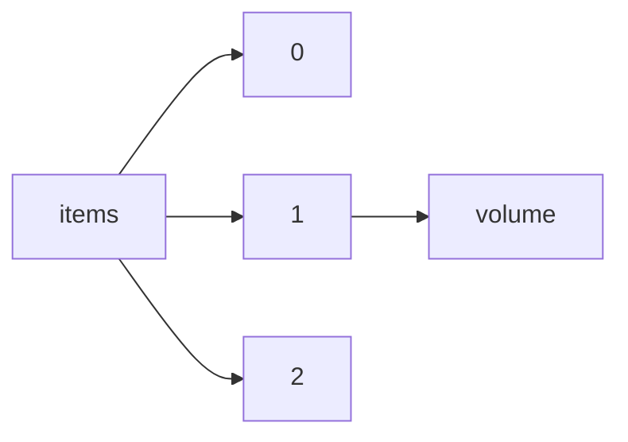

!!! warning "This document is not official Crossref documentation"
# Volume
PATH = items/array/volume(1)  
Occurs 95 566 113 times  
Unique values: > 999  
{ .annotate }

1. A route to an element, for example:  
   The route "items/array/volume" corresponds to navigating through the JSON indices as  
   ["items"][0]["volume"]  

!!! note "Due to current limitations, only the first 1,000 unique values are counted."

| **Row** | **Value** `String`  | **Count** `Int64` |
|--------:|-----------------------:|---------------------:|
| **1**   | 2                      | 1 810 902            |
| **2**   | 10                     | 1 797 143            |
| **3**   | 9                      | 1 788 005            |
| **4**   | 8                      | 1 768 367            |
| **5**   | 1                      | 1 765 322            |
| **6**   | 7                      | 1 740 896            |
| **7**   | 11                     | 1 731 640            |
| **8**   | 6                      | 1 716 131            |
| **9**   | 12                     | 1 684 981            |
| **10**  | 5                      | 1 680 501            |
| **11**  | 4                      | 1 664 566            |
| **12**  | 3                      | 1 643 698            |
| **13**  | 13                     | 1 589 594            |
| **14**  | 14                     | 1 471 807            |
| **15**  | 15                     | 1 384 388            |
| **16**  | 16                     | 1 346 090            |
| **17**  | 17                     | 1 308 644            |
| **18**  | 18                     | 1 279 367            |
| **19**  | 19                     | 1 267 664            |
| **20**  | 21                     | 1 243 284            |
| **21**  | 22                     | 1 242 980            |
| **22**  | 20                     | 1 241 239            |
| **23**  | 23                     | 1 185 517            |
| **24**  | 24                     | 1 142 786            |
| **25**  | 25                     | 1 109 817            |
| **26**  | 26                     | 1 101 842            |
| **27**  | 27                     | 1 084 103            |
| **28**  | 28                     | 1 061 488            |
| **29**  | 29                     | 1 051 646            |
| **30**  | 30                     | 1 009 719            |
| **31**  | 31                     | 979 459              |
| **32**  | 32                     | 964 717              |
| **33**  | 33                     | 937 925              |
| **34**  | 34                     | 914 763              |
| **35**  | 35                     | 884 083              |
| **36**  | 36                     | 870 382              |
| **37**  | 37                     | 836 839              |
| **38**  | 38                     | 813 458              |
| **39**  | 39                     | 801 326              |
| **40**  | 40                     | 787 194              |
| **41**  | 41                     | 774 760              |
| **42**  | 42                     | 744 001              |
| **43**  | 43                     | 730 310              |
| **44**  | 44                     | 708 463              |
| **45**  | 45                     | 687 197              |
| **46**  | 46                     | 683 622              |
| **47**  | 47                     | 662 330              |
| **48**  | 48                     | 629 345              |
| **49**  | 49                     | 612 676              |
| **50**  | 50                     | 604 283              |
| **51**  | 51                     | 587 570              |
| **52**  | 52                     | 572 142              |
| **53**  | 53                     | 543 668              |
| **54**  | 54                     | 529 038              |
| **55**  | 55                     | 518 306              |
| **56**  | 56                     | 503 966              |
| **57**  | 57                     | 479 140              |
| **58**  | 58                     | 470 784              |
| **59**  | 60                     | 452 921              |
| **60**  | 59                     | 450 441              |
| **61**  | 61                     | 442 541              |
| **62**  | 62                     | 417 282              |
| **63**  | 63                     | 409 053              |
| **64**  | 64                     | 409 052              |
| **65**  | 65                     | 402 717              |
| **66**  | 66                     | 385 625              |
| **67**  | 67                     | 382 863              |
| **68**  | 68                     | 377 689              |
| **69**  | 70                     | 370 843              |
| **70**  | 69                     | 370 734              |
| **71**  | 71                     | 355 127              |
| **72**  | 73                     | 341 498              |
| **73**  | 72                     | 335 419              |
| **74**  | 74                     | 330 865              |
| **75**  | 75                     | 330 249              |
| **76**  | 76                     | 307 145              |
| **77**  | 77                     | 301 828              |
| **78**  | 78                     | 291 924              |
| **79**  | 79                     | 291 135              |
| **80**  | 81                     | 288 624              |
| **81**  | 80                     | 271 507              |
| **82**  | 82                     | 267 135              |
| **83**  | 83                     | 258 057              |
| **84**  | 85                     | 251 143              |
| **85**  | 84                     | 250 903              |
| **86**  | 86                     | 247 007              |
| **87**  | 87                     | 246 728              |
| **88**  | 89                     | 237 340              |
| **89**  | 88                     | 236 285              |
| **90**  | 90                     | 235 665              |
| **91**  | 93                     | 231 329              |
| **92**  | 91                     | 228 826              |
| **93**  | 96                     | 228 736              |
| **94**  | 92                     | 228 535              |
| **95**  | 94                     | 228 358              |
| **96**  | 95                     | 225 485              |
| **97**  | 97                     | 219 728              |
| **98**  | 98                     | 218 283              |
| **99**  | 99                     | 215 077              |
| **100** | 100                    | 212 079              |
| **101** | 101                    | 202 997              |
| **102** | 102                    | 199 772              |
| **103** | 103                    | 188 573              |
| **104** | 104                    | 187 420              |
| **105** | 106                    | 181 716              |
| **106** | 105                    | 179 079              |
| **107** | 108                    | 178 451              |
| **108** | 114                    | 170 034              |
| **109** | 107                    | 168 257              |
| **110** | 112                    | 163 871              |
| **111** | 110                    | 163 464              |
| **112** | 0                      | 160 595              |
| **113** | 111                    | 160 534              |
| **114** | 109                    | 160 430              |
| **115** | 118                    | 156 870              |
| **116** | 116                    | 156 476              |
| **117** | 113                    | 154 921              |
| **118** | 115                    | 154 855              |
| **119** | 120                    | 154 380              |
| **120** | 117                    | 150 832              |
| **121** | 119                    | 146 876              |
| **122** | 122                    | 138 212              |
| **123** | 121                    | 138 023              |
| **124** | 124                    | 137 024              |
| **125** | 123                    | 134 090              |
| **126** | 126                    | 131 963              |
| **127** | 125                    | 129 781              |
| **128** | &NA;                   | 129 674              |
| **129** | 127                    | 127 585              |
| **130** | 128                    | 123 749              |
| **131** | 132                    | 119 976              |
| **132** | 129                    | 119 551              |
| **133** | 130                    | 119 433              |
| **134** | 134                    | 118 405              |
| **135** | 131                    | 116 277              |
| **136** | 133                    | 110 926              |
| **137** | 136                    | 109 651              |
| **138** | 138                    | 105 747              |
| **139** | 140                    | 105 022              |
| **140** | 135                    | 102 627              |
| **141** | 137                    | 98 986               |
| **142** | 142                    | 98 864               |
| **143** | 144                    | 96 123               |
| **144** | 139                    | 95 534               |
| **145** | 141                    | 95 290               |
| **146** | 143                    | 87 544               |
| **147** | 146                    | 85 297               |
| **148** | 145                    | 83 911               |
| **149** | 150                    | 82 053               |
| **150** | 148                    | 81 790               |
| **151** | 147                    | 80 153               |
| **152** | 2022                   | 80 044               |
| **153** | CABI Compendium        | 79 135               |
| **154** | 152                    | 75 800               |
| **155** | 158                    | 75 285               |
| **156** | 149                    | 74 833               |
| **157** | 156                    | 73 445               |
| **158** | 151                    | 71 516               |
| **159** | 2021                   | 70 757               |
| **160** | 154                    | 70 271               |
| **161** | 162                    | 67 531               |
| **162** | 157                    | 67 273               |
| **163** | 161                    | 66 939               |
| **164** | 160                    | 66 642               |
| **165** | 153                    | 66 226               |
| **166** | 2014                   | 65 867               |
| **167** | 159                    | 65 509               |
| **168** | 2020                   | 65 124               |
| **169** | 155                    | 65 100               |
| **170** | 2013                   | 63 711               |
| **171** | 2018                   | 62 612               |
| **172** | 163                    | 62 035               |
| **173** | 164                    | 61 909               |
| **174** | 2012                   | 60 005               |
| **175** | 2019                   | 59 804               |
| **176** | 2015                   | 59 352               |
| **177** | 165                    | 57 106               |
| **178** | 172                    | 56 748               |
| **179** | 168                    | 56 626               |
| **180** | 173                    | 55 891               |
| **181** | 177                    | 55 634               |
| **182** | 171                    | 55 490               |
| **183** | 2016                   | 55 461               |
| **184** | 179                    | 55 412               |
| **185** | 166                    | 55 352               |
| **186** | 170                    | 55 147               |
| **187** | 183                    | 55 099               |
| **188** | 167                    | 55 080               |
| **189** | 175                    | 54 725               |
| **190** | 174                    | 54 618               |
| **191** | 176                    | 54 213               |
| **192** | 178                    | 53 832               |
| **193** | 2017                   | 53 607               |
| **194** | 03                     | 53 395               |
| **195** | 169                    | 53 382               |
| **196** | 184                    | 53 253               |
| **197** | 04                     | 53 195               |
| **198** | 180                    | 52 780               |
| **199** | 181                    | 52 359               |
| **200** | 05                     | 52 159               |
| **201** | 182                    | 51 810               |
| **202** | 186                    | 51 290               |
| **203** | null                   | 50 774               |
| **204** | 185                    | 50 750               |
| **205** | 187                    | 48 850               |
| **206** | 06                     | 48 010               |
| **207** | 188                    | 47 937               |
| **208** | 191                    | 47 136               |
| **209** | 02                     | 47 026               |
| **210** | 2011                   | 47 004               |
| **211** | 189                    | 46 748               |
| **212** | 190                    | 46 178               |
| **213** | 195                    | 45 396               |
| **214** | 194                    | 45 306               |
| **215** | 193                    | 45 274               |
| **216** | 192                    | 45 224               |
| **217** | 197                    | 44 322               |
| **218** | 196                    | 44 301               |
| **219** | 199                    | 43 682               |
| **220** | 201                    | 42 340               |
| **221** | 206                    | 41 866               |
| **222** | 07                     | 41 628               |
| **223** | 204                    | 41 560               |
| **224** | 203                    | 41 373               |
| **225** | 200                    | 41 355               |
| **226** | 198                    | 40 489               |
| **227** | 202                    | 40 103               |
| **228** | 08                     | 39 335               |
| **229** | 2010                   | 39 233               |
| **230** | 207                    | 38 503               |
| **231** | 205                    | 38 238               |
| **232** | 209                    | 38 217               |
| **233** | 208                    | 38 030               |
| **234** | 2009                   | 37 298               |
| **235** | 214                    | 36 129               |
| **236** | 213                    | 35 851               |
| **237** | 210                    | 35 696               |
| **238** | 216                    | 35 638               |
| **239** | 218                    | 35 538               |
| **240** | 217                    | 35 416               |
| **241** | 212                    | 35 311               |
| **242** | 219                    | 35 007               |
| **243** | 221                    | 34 831               |
| **244** | 222                    | 34 681               |
| **245** | 211                    | 34 658               |
| **246** | 09                     | 34 656               |
| **247** | 224                    | 34 312               |
| **248** | 2007                   | 34 310               |
| **249** | 2006                   | 34 182               |
| **250** | 215                    | 34 121               |
| **251** | 220                    | 33 775               |
| **252** | 225                    | 33 043               |
| **253** | 223                    | 33 014               |
| **254** | 226                    | 32 839               |
| **255** | 2008                   | 32 807               |
| **256** | 235                    | 32 803               |
| **257** | 227                    | 32 453               |
| **258** | 233                    | 32 001               |
| **259** | 01                     | 31 946               |
| **260** | 228                    | 31 661               |
| **261** | 229                    | 31 515               |
| **262** | 231                    | 31 294               |
| **263** | 234                    | 31 076               |
| **264** | 236                    | 30 157               |
| **265** | 280                    | 30 014               |
| **266** | 232                    | 29 863               |
| **267** | 238                    | 29 415               |
| **268** | 267                    | 29 173               |
| **269** | 279                    | 29 134               |
| **270** | 276                    | 29 026               |
| **271** | 275                    | 29 011               |
| **272** | 278                    | 29 010               |
| **273** | 258                    | 29 007               |
| **274** | 255                    | 28 777               |
| **275** | 254                    | 28 624               |
| **276** | 285                    | 28 617               |
| **277** | 269                    | 28 527               |
| **278** | 252                    | 28 489               |
| **279** | 230                    | 28 459               |
| **280** | 263                    | 28 448               |
| **281** | 266                    | 28 412               |
| **282** | 257                    | 28 383               |
| **283** | 281                    | 28 376               |
| **284** | 277                    | 28 307               |
| **285** | 256                    | 28 288               |
| **286** | 272                    | 28 202               |
| **287** | 273                    | 28 130               |
| **288** | 274                    | 28 114               |
| **289** | 271                    | 28 101               |
| **290** | 237                    | 28 095               |
| **291** | 268                    | 28 037               |
| **292** | 270                    | 27 807               |
| **293** | 283                    | 27 682               |
| **294** | 284                    | 27 473               |
| **295** | 253                    | 27 467               |
| **296** | 282                    | 27 351               |
| **297** | 287                    | 27 138               |
| **298** | 265                    | 27 014               |
| **299** | 259                    | 26 471               |
| **300** | 286                    | 26 336               |
| **301** | 262                    | 26 263               |
| **302** | 241                    | 26 230               |
| **303** | 264                    | 25 906               |
| **304** | 245                    | 25 811               |
| **305** | 247                    | 25 750               |
| **306** | 260                    | 25 656               |
| **307** | 288                    | 25 655               |
| **308** | 250                    | 25 642               |
| **309** | 251                    | 25 609               |
| **310** | 261                    | 25 329               |
| **311** | 248                    | 25 315               |
| **312** | 249                    | 25 293               |
| **313** | 240                    | 25 244               |
| **314** | 242                    | 25 171               |
| **315** | 289                    | 25 097               |
| **316** | 239                    | 24 765               |
| **317** | 246                    | 24 644               |
| **318** | 244                    | 24 602               |
| **319** | 243                    | 24 152               |
| **320** | 290                    | 23 923               |
| **321** | 2005                   | 23 849               |
| **322** | 295                    | 23 786               |
| **323** | 292                    | 23 748               |
| **324** | 291                    | 23 292               |
| **325** | 293                    | 22 903               |
| **326** | 294                    | 22 238               |
| **327** | 2003                   | 22 180               |
| **328** | 2004                   | 21 686               |
| **329** | 310                    | 21 496               |
| **330** | 298                    | 21 136               |
| **331** | 296                    | 20 980               |
| **332** | 304                    | 20 410               |
| **333** | 306                    | 20 370               |
| **334** | 297                    | 20 345               |
| **335** | 307                    | 20 334               |
| **336** | 300                    | 20 260               |
| **337** | 311                    | 20 228               |
| **338** | 305                    | 20 196               |
| **339** | 299                    | 20 177               |
| **340** | 302                    | 20 165               |
| **341** | 2002                   | 19 991               |
| **342** | 301                    | 19 770               |
| **343** | 312                    | 19 768               |
| **344** | 303                    | 19 716               |
| **345** | 308                    | 19 550               |
| **346** | 331                    | 19 275               |
| **347** | 315                    | 18 945               |
| **348** | 309                    | 18 929               |
| **349** | 333                    | 18 847               |
| **350** | 313                    | 18 692               |
| **351** | 324                    | 18 647               |
| **352** | 319                    | 18 443               |
| **353** | 316                    | 18 242               |
| **354** | 320                    | 18 135               |
| **355** | 318                    | 18 030               |
| **356** | 317                    | 17 879               |
| **357** | 330                    | 17 790               |
| **358** | 323                    | 17 680               |
| **359** | 314                    | 17 649               |
| **360** | 329                    | 17 514               |
| **361** | 328                    | 17 433               |
| **362** | 321                    | 17 393               |
| **363** | 325                    | 17 354               |
| **364** | 327                    | 17 333               |
| **365** | 322                    | 17 275               |
| **366** | 326                    | 16 973               |
| **367** | 332                    | 16 970               |
| **368** | 344                    | 16 024               |
| **369** | 337                    | 15 835               |
| **370** | 357                    | 15 814               |
| **371** | 349                    | 15 723               |
| **372** | 350                    | 15 677               |
| **373** | 338                    | 15 510               |
| **374** | 341                    | 15 500               |
| **375** | 355                    | 15 420               |
| **376** | 340                    | 15 391               |
| **377** | 339                    | 15 363               |
| **378** | 342                    | 15 295               |
| **379** | 343                    | 15 289               |
| **380** | 334                    | 15 277               |
| **381** | 335                    | 15 258               |
| **382** | 346                    | 15 220               |
| **383** | 336                    | 15 208               |
| **384** | 345                    | 15 100               |
| **385** | 348                    | 14 897               |
| **386** | 358                    | 14 817               |
| **387** | 354                    | 14 792               |
| **388** | 347                    | 14 735               |
| **389** | 352                    | 14 682               |
| **390** | 2001                   | 14 629               |
| **391** | 356                    | 14 621               |
| **392** | 353                    | 14 177               |
| **393** | 2000                   | 13 934               |
| **394** | 351                    | 13 917               |
| **395** | 359                    | 13 484               |
| **396** | Publish Ahead of Print | 13 475               |
| **397** | 360                    | 13 167               |
| **398** | 361                    | 13 112               |
| **399** | 363                    | 13 086               |
| **400** | 362                    | 12 973               |
| **401** | 381                    | 12 899               |
| **402** | 365                    | 12 835               |
| **403** | 364                    | 12 814               |
| **404** | 372                    | 12 749               |
| **405** | 368                    | 12 288               |
| **406** | 371                    | 12 021               |
| **407** | 369                    | 11 900               |
| **408** | 367                    | 11 627               |
| **409** | 374                    | 11 582               |
| **410** | 366                    | 11 528               |
| **411** | 375                    | 11 456               |
| **412** | 373                    | 11 399               |
| **413** | 377                    | 11 272               |
| **414** | 376                    | 11 181               |
| **415** | 379                    | 11 080               |
| **416** | 370                    | 11 030               |
| **417** | 378                    | 10 849               |
| **418** | 1999                   | 10 326               |
| **419** | 405                    | 10 290               |
| **420** | 382                    | 10 148               |
| **421** | 380                    | 9 753                |
| **422** | 383                    | 9 690                |
| **423** | 387                    | 9 574                |
| **424** | 384                    | 9 516                |
| **425** | 407                    | 9 337                |
| **426** | 388                    | 9 327                |
| **427** | 1997                   | 9 248                |
| **428** | 385                    | 8 973                |
| **429** | 389                    | 8 900                |
| **430** | Volume 13              | 8 859                |
| **431** | 1998                   | 8 854                |
| **432** | Volume 14              | 8 652                |
| **433** | 392                    | 8 651                |
| **434** | 391                    | 8 563                |
| **435** | 429                    | 8 523                |
| **436** | 404                    | 8 470                |
| **437** | 2023                   | 8 388                |
| **438** | 394                    | 8 357                |
| **439** | Volume 12              | 8 262                |
| **440** | 390                    | 8 165                |
| **441** | 393                    | 8 133                |
| **442** | 386                    | 8 034                |
| **443** | 403                    | 7 726                |
| **444** | 396                    | 7 673                |
| **445** | 409                    | 7 671                |
| **446** | 400                    | 7 637                |
| **447** | 406                    | 7 585                |
| **448** | 1995                   | 7 584                |
| **449** | 1996                   | 7 540                |
| **450** | Volume 15              | 7 451                |
| **451** | 395                    | 7 352                |
| **452** | 408                    | 7 272                |
| **453** | 410                    | 7 205                |
| **454** | 412                    | 7 158                |
| **455** | 411                    | 7 128                |
| **456** | 402                    | 7 106                |
| **457** | 399                    | 7 063                |
| **458** | 401                    | 6 966                |
| **459** | 397                    | 6 955                |
| **460** | 398                    | 6 680                |
| **461** | 413                    | 6 561                |
| **462** | 430                    | 6 524                |
| **463** | 493                    | 6 467                |
| **464** | 441                    | 6 434                |
| **465** | 415                    | 6 305                |
| **466** | 426                    | 6 300                |
| **467** | 421                    | 6 270                |
| **468** | 431                    | 6 247                |
| **469** | 459                    | 6 179                |
| **470** | 450                    | 6 165                |
| **471** | 452                    | 6 139                |
| **472** | 471                    | 6 139                |
| **473** | 435                    | 6 118                |
| **474** | 455                    | 6 100                |
| **475** | 427                    | 6 070                |
| **476** | 518                    | 6 068                |
| **477** | 425                    | 6 064                |
| **478** | 414                    | 6 057                |
| **479** | 433                    | 6 055                |
| **480** | 509                    | 6 053                |
| **481** | 428                    | 6 046                |
| **482** | 434                    | 5 980                |
| **483** | 423                    | 5 973                |
| **484** | 468                    | 5 958                |
| **485** | 436                    | 5 905                |
| **486** | 417                    | 5 865                |
| **487** | 440                    | 5 865                |
| **488** | 451                    | 5 861                |
| **489** | 461                    | 5 856                |
| **490** | 473                    | 5 853                |
| **491** | 442                    | 5 831                |
| **492** | 470                    | 5 826                |
| **493** | 438                    | 5 815                |
| **494** | 443                    | 5 768                |
| **495** | 424                    | 5 761                |
| **496** | 476                    | 5 760                |
| **497** | V                      | 5 758                |
| **498** | 454                    | 5 751                |
| **499** | 474                    | 5 735                |
| **500** | 448                    | 5 705                |
| **501** | 1994                   | 5 700                |
| **502** | 475                    | 5 688                |
| **503** | 477                    | 5 676                |
| **504** | 416                    | 5 637                |
| **505** | 420                    | 5 634                |
| **506** | 432                    | 5 613                |
| **507** | 437                    | 5 609                |
| **508** | Volume 11              | 5 599                |
| **509** | 439                    | 5 587                |
| **510** | 469                    | 5 584                |
| **511** | 418                    | 5 567                |
| **512** | 419                    | 5 562                |
| **513** | 422                    | 5 554                |
| **514** | 519                    | 5 533                |
| **515** | 463                    | 5 455                |
| **516** | 446                    | 5 432                |
| **517** | 520                    | 5 423                |
| **518** | 472                    | 5 343                |
| **519** | 465                    | 5 343                |
| **520** | 456                    | 5 318                |
| **521** | 478                    | 5 311                |
| **522** | 449                    | 5 307                |
| **523** | 453                    | 5 261                |
| **524** | 444                    | 5 253                |
| **525** | 516                    | 5 239                |
| **526** | 458                    | 5 216                |
| **527** | 466                    | 5 209                |
| **528** | 457                    | 5 208                |
| **529** | 460                    | 5 167                |
| **530** | 462                    | 5 155                |
| **531** | 515                    | 5 105                |
| **532** | 1993                   | 5 105                |
| **533** | 467                    | 5 080                |
| **534** | 1992                   | 5 042                |
| **535** | 464                    | 5 012                |
| **536** | 505                    | 5 005                |
| **537** | 500                    | 4 972                |
| **538** | 445                    | 4 884                |
| **539** | 1991                   | 4 829                |
| **540** | 517                    | 4 812                |
| **541** | 479                    | 4 792                |
| **542** | 447                    | 4 781                |
| **543** | 495                    | 4 711                |
| **544** | 528                    | 4 685                |
| **545** | 486                    | 4 683                |
| **546** | 508                    | 4 667                |
| **547** | 483                    | 4 659                |
| **548** | 490                    | 4 622                |
| **549** | 496                    | 4 616                |
| **550** | 487                    | 4 600                |
| **551** | 485                    | 4 557                |
| **552** | 482                    | 4 546                |
| **553** | 527                    | 4 485                |
| **554** | 506                    | 4 456                |
| **555** | 499                    | 4 425                |
| **556** | 507                    | 4 422                |
| **557** | 488                    | 4 393                |
| **558** | 1990                   | 4 376                |
| **559** | 529                    | 4 320                |
| **560** | 498                    | 4 253                |
| **561** | 480                    | 4 225                |
| **562** | 492                    | 4 206                |
| **563** | MA2016-02              | 4 195                |
| **564** | 491                    | 4 184                |
| **565** | 510                    | 4 140                |
| **566** | 494                    | 4 119                |
| **567** | 481                    | 4 084                |
| **568** | 497                    | 4 078                |
| **569** | 484                    | 4 077                |
| **570** | 502                    | 4 068                |
| **571** | Species Pages          | 4 057                |
| **572** | MA2012-02              | 4 011                |
| **573** | 503                    | 3 957                |
| **574** | 513                    | 3 927                |
| **575** | 530                    | 3 889                |
| **576** | 489                    | 3 781                |
| **577** | 501                    | 3 773                |
| **578** | 526                    | 3 730                |
| **579** | Volume 10              | 3 707                |
| **580** | 511                    | 3 664                |
| **581** | 586                    | 3 648                |
| **582** | 525                    | 3 588                |
| **583** | 514                    | 3 574                |
| **584** | 1988                   | 3 568                |
| **585** | 1989                   | 3 547                |
| **586** | 588                    | 3 537                |
| **587** | XXIV                   | 3 525                |
| **588** | 504                    | 3 504                |
| **589** | 590                    | 3 476                |
| **590** | MA2020-02              | 3 337                |
| **591** | 580                    | 3 333                |
| **592** | 579                    | 3 330                |
| **593** | 512                    | 3 303                |
| **594** | 1986                   | 3 299                |
| **595** | 521                    | 3 289                |
| **596** | 591                    | 3 245                |
| **597** | MA2008-02              | 3 235                |
| **598** | 589                    | 3 220                |
| **599** | MA2009-02              | 3 196                |
| **600** | 522                    | 3 195                |
| **601** | 587                    | 3 151                |
| **602** | 1985                   | 3 122                |
| **603** | 524                    | 3 116                |
| **604** | 1987                   | 3 110                |
| **605** | XXXI                   | 3 093                |
| **606** | XXXIII                 | 3 082                |
| **607** | 531                    | 3 061                |
| **608** | 584                    | 3 001                |
| **609** | 548                    | 2 958                |
| **610** | XXVI                   | 2 957                |
| **611** | XXX                    | 2 943                |
| **612** | 583                    | 2 916                |
| **613** | 585                    | 2 912                |
| **614** | 539                    | 2 866                |
| **615** | MA2013-02              | 2 843                |
| **616** | s4-1                   | 2 841                |
| **617** | 581                    | 2 835                |
| **618** | 538                    | 2 812                |
| **619** | XXV                    | 2 798                |
| **620** | 536                    | 2 796                |
| **621** | 592                    | 2 794                |
| **622** | 545                    | 2 787                |
| **623** | MA2020-01              | 2 776                |
| **624** | XLVI                   | 2 773                |
| **625** | XXXV                   | 2 769                |
| **626** | 550                    | 2 761                |
| **627** | 523                    | 2 732                |
| **628** | XXIII                  | 2 722                |
| **629** | 598                    | 2 710                |
| **630** | WCP2018                | 2 703                |
| **631** | Volume 16              | 2 700                |
| **632** | 543                    | 2 698                |
| **633** | MA2011-02              | 2 697                |
| **634** | 551                    | 2 692                |
| **635** | 1984                   | 2 692                |
| **636** | 612                    | 2 686                |
| **637** | 582                    | 2 684                |
| **638** | XXVII                  | 2 681                |
| **639** | XXIX                   | 2 677                |
| **640** | XLVIII                 | 2 618                |
| **641** | 600                    | 2 616                |
| **642** | XXI                    | 2 609                |
| **643** | VI                     | 2 599                |
| **644** | 544                    | 2 598                |
| **645** | 596                    | 2 592                |
| **646** | 532                    | 2 583                |
| **647** | 556                    | 2 579                |
| **648** | XXII                   | 2 570                |
| **649** | XXXII                  | 2 564                |
| **650** | 549                    | 2 555                |
| **651** | XXVIII                 | 2 525                |
| **652** | XLVII                  | 2 523                |
| **653** | 572                    | 2 523                |
| **654** | 577                    | 2 514                |
| **655** | MA2018-01              | 2 503                |
| **656** | XLV                    | 2 493                |
| **657** | 537                    | 2 493                |
| **658** | 595                    | 2 489                |
| **659** | 1982                   | 2 484                |
| **660** | 553                    | 2 475                |
| **661** | 279-280                | 2 468                |
| **662** | MA2019-02              | 2 465                |
| **663** | XLIX                   | 2 452                |
| **664** | In Press               | 2 442                |
| **665** | 533                    | 2 432                |
| **666** | 557                    | 2 428                |
| **667** | XLIV                   | 2 421                |
| **668** | s7-VI                  | 2 415                |
| **669** | XLIII                  | 2 403                |
| **670** | s6-II                  | 2 396                |
| **671** | 541                    | 2 390                |
| **672** | s5-VI                  | 2 388                |
| **673** | XXXVI                  | 2 377                |
| **674** | XXXIV                  | 2 376                |
| **675** | MA2010-02              | 2 374                |
| **676** | MA2017-02              | 2 367                |
| **677** | 546                    | 2 358                |
| **678** | 535                    | 2 358                |
| **679** | s5-XII                 | 2 341                |
| **680** | MA2022-02              | 2 339                |
| **681** | MA2014-02              | 2 319                |
| **682** | MA2015-01              | 2 309                |
| **683** | s8-XII                 | 2 306                |
| **684** | 601                    | 2 295                |
| **685** | s6-I                   | 2 292                |
| **686** | 575                    | 2 281                |
| **687** | XLII                   | 2 278                |
| **688** | s6-XII                 | 2 271                |
| **689** | s8-VI                  | 2 268                |
| **690** | s6-VI                  | 2 262                |
| **691** | MA2019-01              | 2 256                |
| **692** | 570                    | 2 242                |
| **693** | s7-VIII                | 2 237                |
| **694** | MA2016-01              | 2 233                |
| **695** | 534                    | 2 223                |
| **696** | XVIII                  | 2 222                |
| **697** | s8-IV                  | 2 220                |
| **698** | s7-VII                 | 2 216                |
| **699** | s7-X                   | 2 215                |
| **700** | s9-II                  | 2 212                |
| **701** | LIV                    | 2 205                |
| **702** | s8-V                   | 2 205                |
| **703** | s5-XI                  | 2 203                |
| **704** | XIX                    | 2 198                |
| **705** | 569                    | 2 193                |
| **706** | s7-III                 | 2 188                |
| **707** | MA2006-02              | 2 185                |
| **708** | 555                    | 2 183                |
| **709** | s8-III                 | 2 181                |
| **710** | LI                     | 2 181                |
| **711** | 540                    | 2 155                |
| **712** | 1983                   | 2 153                |
| **713** | LIII                   | 2 150                |
| **714** | 1979                   | 2 137                |
| **715** | L                      | 2 136                |
| **716** | s6-V                   | 2 118                |
| **717** | 547                    | 2 117                |
| **718** | MA2011-01              | 2 108                |
| **719** | XXXVII                 | 2 101                |
| **720** | s8-IX                  | 2 100                |
| **721** | 562                    | 2 100                |
| **722** | s5-IV                  | 2 099                |
| **723** | s8-VII                 | 2 097                |
| **724** | s9-IX                  | 2 096                |
| **725** | s6-IX                  | 2 093                |
| **726** | 603                    | 2 082                |
| **727** | s7-I                   | 2 079                |
| **728** | s7-XII                 | 2 076                |
| **729** | 1981                   | 2 074                |
| **730** | s4-IV                  | 2 057                |
| **731** | s7-V                   | 2 048                |
| **732** | MA2018-02              | 2 046                |
| **733** | s8-X                   | 2 040                |
| **734** | s7-XI                  | 2 038                |
| **735** | 578                    | 2 028                |
| **736** | s8-I                   | 2 025                |
| **737** | 594                    | 2 024                |
| **738** | 1980                   | 2 022                |
| **739** | 609                    | 2 022                |
| **740** | 559                    | 2 007                |
| **741** | s6-IV                  | 2 007                |
| **742** | s4-XI                  | 2 007                |
| **743** | s3-XI                  | 2 005                |
| **744** | 573                    | 2 000                |
| **745** | XII                    | 1 997                |
| **746** | s5-IX                  | 1 991                |
| **747** | 552                    | 1 986                |
| **748** | XLI                    | 1 982                |
| **749** | s11-II                 | 1 979                |
| **750** | IV                     | 1 978                |
| **751** | MA2015-02              | 1 978                |
| **752** | s5-I                   | 1 977                |
| **753** | s7-IX                  | 1 976                |
| **754** | s3-X                   | 1 967                |
| **755** | MA2017-01              | 1 964                |
| **756** | s3-VII                 | 1 961                |
| **757** | s7-II                  | 1 959                |
| **758** | s6-III                 | 1 959                |
| **759** | s4-V                   | 1 955                |
| **760** | XIV                    | 1 951                |
| **761** | s5-II                  | 1 949                |
| **762** | XX                     | 1 938                |
| **763** | s1-VI                  | 1 937                |
| **764** | s3-XII                 | 1 935                |
| **765** | s4-VII                 | 1 929                |
| **766** | s5-X                   | 1 917                |
| **767** | s5-VII                 | 1 916                |
| **768** | MA2022-01              | 1 914                |
| **769** | 560                    | 1 914                |
| **770** | XVI                    | 1 912                |
| **771** | XXXVIII                | 1 909                |
| **772** | XXXIX                  | 1 907                |
| **773** | Pest Management        | 1 897                |
| **774** | s6-VIII                | 1 894                |
| **775** | s8-XI                  | 1 886                |
| **776** | s4-X                   | 1 886                |
| **777** | s10-V                  | 1 885                |
| **778** | 558                    | 1 882                |
| **779** | 561                    | 1 881                |
| **780** | 593                    | 1 874                |
| **781** | s9-VII                 | 1 873                |
| **782** | s9-VI                  | 1 870                |
| **783** | s4-IX                  | 1 866                |
| **784** | Volume-2               | 1 862                |
| **785** | 563                    | 1 859                |
| **786** | s4-VI                  | 1 857                |
| **787** | s4-I                   | 1 856                |
| **788** | s9-I                   | 1 855                |
| **789** | XV                     | 1 852                |
| **790** | s5-III                 | 1 848                |
| **791** | s1-VII                 | 1 842                |
| **792** | s6-XI                  | 1 841                |
| **793** | MA2021-01              | 1 832                |
| **794** | s11-IV                 | 1 823                |
| **795** | s10-XII                | 1 820                |
| **796** | VII                    | 1 820                |
| **797** | s4-II                  | 1 808                |
| **798** | s3-IV                  | 1 806                |
| **799** | MA2021-02              | 1 801                |
| **800** | 599                    | 1 796                |
| **801** | s10-XI                 | 1 796                |
| **802** | 566                    | 1 784                |
| **803** | s3-VIII                | 1 775                |
| **804** | 554                    | 1 774                |
| **805** | 565                    | 1 774                |
| **806** | s10-I                  | 1 771                |
| **807** | s7-IV                  | 1 763                |
| **808** | s6-X                   | 1 761                |
| **809** | s2-VIII                | 1 760                |
| **810** | s11-III                | 1 752                |
| **811** | s2-V                   | 1 748                |
| **812** | s5-VIII                | 1 741                |
| **813** | s9-IV                  | 1 740                |
| **814** | s4-XII                 | 1 736                |
| **815** | MA2010-01              | 1 734                |
| **816** | s9-V                   | 1 733                |
| **817** | XL                     | 1 725                |
| **818** | 564                    | 1 724                |
| **819** | s5-V                   | 1 722                |
| **820** | V4                     | 1 721                |
| **821** | s10-II                 | 1 717                |
| **822** | 602                    | 1 715                |
| **823** | 571                    | 1 714                |
| **824** | s9-XII                 | 1 710                |
| **825** | 567                    | 1 709                |
| **826** | s10-IX                 | 1 704                |
| **827** | 632                    | 1 702                |
| **828** | Volume 9               | 1 696                |
| **829** | s11-V                  | 1 695                |
| **830** | s2-IX                  | 1 671                |
| **831** | s2-III                 | 1 670                |
| **832** | 194-196                | 1 661                |
| **833** | LII                    | 1 646                |
| **834** | s10-VIII               | 1 637                |
| **835** | 606                    | 1 623                |
| **836** | s10-III                | 1 622                |
| **837** | MA2014-01              | 1 617                |
| **838** | 597                    | 1 611                |
| **839** | s1-VIII                | 1 604                |
| **840** | s12-IX                 | 1 588                |
| **841** | XVII                   | 1 584                |
| **842** | 608                    | 1 583                |
| **843** | MA2005-01              | 1 573                |
| **844** | s3-I                   | 1 569                |
| **845** | s8-VIII                | 1 567                |
| **846** | s2-I                   | 1 565                |
| **847** | 542                    | 1 563                |
| **848** | s9-VIII                | 1 561                |
| **849** | s10-IV                 | 1 545                |
| **850** | s3-VI                  | 1 528                |
| **851** | s10-VII                | 1 516                |
| **852** | 574                    | 1 516                |
| **853** | s1-V                   | 1 512                |
| **854** | 576                    | 1 507                |
| **855** | s10-X                  | 1 501                |
| **856** | 272-276                | 1 499                |
| **857** | Factsheets for         | 1 495                |
| **858** | 1973                   | 1 493                |
| **859** | s2-II                  | 1 480                |
| **860** | MA2007-02              | 1 474                |
| **861** | s3-V                   | 1 469                |
| **862** | XI                     | 1 469                |
| **863** | s9-X                   | 1 464                |
| **864** | s3-III                 | 1 448                |
| **865** | s2-VII                 | 1 446                |
| **866** | s12-VIII               | 1 445                |
| **867** | 644-650                | 1 439                |
| **868** | s12-XI                 | 1 431                |
| **869** | MA2012-01              | 1 429                |
| **870** | 235-240                | 1 427                |
| **871** | s6-VII                 | 1 415                |
| **872** | 00                     | 1 411                |
| **873** | s2-XII                 | 1 407                |
| **874** | 607                    | 1 381                |
| **875** | VIII                   | 1 373                |
| **876** | -                      | 1 368                |
| **877** | MA2009-01              | 1 365                |
| **878** | XIII                   | 1 359                |
| **879** | s1-IX                  | 1 353                |
| **880** | 624                    | 1 349                |
| **881** | CLXXI                  | 1 347                |
| **882** | 556-562                | 1 339                |
| **883** | 1977                   | 1 332                |
| **884** | s2-IV                  | 1 319                |
| **885** | 633                    | 1 297                |
| **886** | s9-XI                  | 1 294                |
| **887** | s1-XI                  | 1 294                |
| **888** | CLXIII                 | 1 289                |
| **889** | 989-994                | 1 276                |
| **890** | s3-II                  | 1 247                |
| **891** | CLXVII                 | 1 244                |
| **892** | s11-VII                | 1 241                |
| **893** | s10-VI                 | 1 237                |
| **894** | s1-X                   | 1 234                |
| **895** | 695                    | 1 228                |
| **896** | CLXVIII                | 1 225                |
| **897** | s1-III                 | 1 224                |
| **898** | MA2013-01              | 1 221                |
| **899** | 1978                   | 1 220                |
| **900** | s3-IX                  | 1 211                |
| **901** | CLX                    | 1 209                |
| **902** | IX                     | 1 208                |
| **903** | 635                    | 1 199                |
| **904** | s12-III                | 1 198                |
| **905** | 610                    | 1 198                |
| **906** | CLXVI                  | 1 196                |
| **907** | s9-III                 | 1 196                |
| **908** | 687-691                | 1 179                |
| **909** | 383-390                | 1 177                |
| **910** | 643                    | 1 176                |
| **911** | s1-XII                 | 1 166                |
| **912** | s13-I                  | 1 143                |
| **913** | 81 (1997)              | 1 138                |
| **914** | V9                     | 1 133                |
| **915** | 291-294                | 1 129                |
| **916** | os-2                   | 1 119                |
| **917** | s12-I                  | 1 086                |
| **918** | 1975                   | 1 086                |
| **919** | s2-VI                  | 1 081                |
| **920** | 243-249                | 1 079                |
| **921** | s1-II                  | 1 069                |
| **922** | 1938                   | 1 035                |
| **923** | s2-XI                  | 1 035                |
| **924** | s1-IV                  | 1 032                |
| **925** | 664                    | 1 026                |
| **926** | 631                    | 1 023                |
| **927** | 543-547                | 1 009                |
| **928** | CXLVII                 | 1 000                |
| **929** | CLXII                  | 991                  |
| **930** | 677                    | 991                  |
| **931** | 1976                   | 979                  |
| **932** | 1583                   | 956                  |
| **933** | s11-I                  | 936                  |
| **934** | 518-523                | 924                  |
| **935** | s11-VI                 | 915                  |
| **936** | 97-101                 | 894                  |
| **937** | 615                    | 884                  |
| **938** | 756-759                | 874                  |
| **939** | 626                    | 862                  |
| **940** | 71-78                  | 860                  |
| **941** | 446-449                | 853                  |
| **942** | CLXIX                  | 837                  |
| **943** | 448-453                | 818                  |
| **944** | 602-605                | 798                  |
| **945** | 1748                   | 792                  |
| **946** | II                     | 778                  |
| **947** | 347-353                | 769                  |
| **948** | 694                    | 765                  |
| **949** | 1925                   | 753                  |
| **950** | 1926                   | 742                  |
| **951** | 353-356                | 725                  |
| **952** | 2019.27                | 723                  |
| **953** | 268-270                | 711                  |
| **954** | 955-959                | 710                  |
| **955** | 647                    | 683                  |
| **956** | 263-266                | 679                  |
| **957** | 610-613                | 667                  |
| **958** | 62A                    | 657                  |
| **959** | 347-350                | 652                  |
| **960** | 726-731                | 652                  |
| **961** | 1837                   | 637                  |
| **962** | 336-338                | 621                  |
| **963** | 165-166                | 610                  |
| **964** | 139-141                | 598                  |
| **965** | 694-697                | 598                  |
| **966** | 690-693                | 592                  |
| **967** | 496-500                | 591                  |
| **968** | PAS-100                | 572                  |
| **969** | 765-767                | 571                  |
| **970** | 1683                   | 569                  |
| **971** | CXLVIII                | 566                  |
| **972** | 1943                   | 563                  |
| **973** | 1974                   | 560                  |
| **974** | 638-642                | 552                  |
| **975** | 82 (1998)              | 549                  |
| **976** | PAS-101                | 532                  |
| **977** | 90-93                  | 521                  |
| **978** | 329-333                | 520                  |
| **979** | 217-219                | 503                  |
| **980** | 1864                   | 502                  |
| **981** | os-1                   | 501                  |
| **982** | 630                    | 501                  |
| **983** | 1945                   | 494                  |
| **984** | 1785                   | 493                  |
| **985** | 660                    | 491                  |
| **986** | 1712                   | 478                  |
| **987** | 971-973                | 459                  |
| **988** | 1533                   | 449                  |
| **989** | 753                    | 449                  |
| **990** | 706-709                | 420                  |
| **991** | 611                    | 409                  |
| **992** | 108-109                | 405                  |
| **993** | 34-35                  | 390                  |
| **994** | 457-458                | 386                  |
| **995** | 380-384                | 381                  |
| **996** | 1866                   | 376                  |
| **997** | 1869                   | 334                  |
| **998** | 1948                   | 321                  |
| **999** | 162-164                | 316                  |
| ... | ... | ... |

