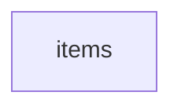

!!! warning "This document is not official Crossref documentation"
# Items
PATH = items(1)  
Occurs 28 701 times  
{ .annotate }

1. A route to an element, for example:  
   The route "items" corresponds to navigating through the JSON indices as  
   ["items"]  



## Description
The dataset is organized into 28,701 distinct files, each structured to contain an items array. This setup is reflected across the dataset with the items key acting as a primary entry point for accessing the contained data. The notation "Occurs 28 701 times" indicates the total count of such PATH within the dataset.
```json
{
   "items": [ ... ]
}
```
The items array serves as a collection holder within each file. 
As you can see below, there are 28,700 files each containing 5,000 items and one file containing 239 items.

## Properties of Array
See information about elements: [items/array](array/index.md)  
Distribution of lengths:  

| **Row** | **Length**<br>`Any` | **Count**<br>`Int64` |
|--------:|--------------------:|---------------------:|
| **1**   | 239                 | 1                    |
| **2**   | 5 000               | 28 700               |

